BCM2711 ARM Peripherals

## Colophon

BCM2711 ARM Peripherals, based in large part on the earlier BCM2835 ARM Peripherals documentation.

© 2012 Broadcom Europe Ltd., 2020-2022 Raspberry Pi Ltd (formerly Raspberry Pi (Trading) Ltd.) All rights reserved.

build-date: 2022-01-18

build-version: githash: cfcff44-clean

<table><tr><td>Release</td><td>Date</td><td>Description</td></tr><tr><td>1</td><td>05 Feb 2020</td><td>First release.</td></tr><tr><td>2</td><td>24 Sep 2020</td><td>Corrected GPIO base address. Updated styling.</td></tr><tr><td>3</td><td>16 Oct 2020</td><td>First public release.</td></tr><tr><td>4</td><td>18 Jan 2022</td><td>Added information about switching DMA DREQ channels.Updated GPIO_PUP_PDN_CNTRL register reset values.Updated UART GPIO mapping table.</td></tr></table>


The latest release can be found at https://datasheets.raspberrypi.com/bcm2711/bcm2711-peripherals.pdf


## Legal Disclaimer Notice

TECHNICAL AND RELIABILITY DATA FOR RASPBERRY PI PRODUCTS (INCLUDING DATASHEETS) AS MODIFIED FROM TIME TO TIME (“RESOURCES”) ARE PROVIDED BY RASPBERRY PI LTD (“RPL”) "AS IS" AND ANY EXPRESS OR IMPLIED WARRANTIES, INCLUDING, BUT NOT LIMITED TO, THE IMPLIED WARRANTIES OF MERCHANTABILITY AND FITNESS FOR A PARTICULAR PURPOSE ARE DISCLAIMED. TO THE MAXIMUM EXTENT PERMITTED BY APPLICABLE LAW IN NO EVENT SHALL RPL BE LIABLE FOR ANY DIRECT, INDIRECT, INCIDENTAL, SPECIAL, EXEMPLARY, OR CONSEQUENTIA DAMAGES (INCLUDING, BUT NOT LIMITED TO, PROCUREMENT OF SUBSTITUTE GOODS OR SERVICES; LOSS OF USE, DATA, OR PROFITS; OR BUSINESS INTERRUPTION) HOWEVER CAUSED AND ON ANY THEORY OF LIABILITY, WHETHER IN CONTRACT, STRICT LIABILITY, OR TORT (INCLUDING NEGLIGENCE OR OTHERWISE) ARISING IN ANY WAY OUT OF THE USE OF THE RESOURCES, EVEN IF ADVISED OF THE POSSIBILITY OF SUCH DAMAGE

RPL reserves the right to make any enhancements, improvements, corrections or any other modifications to the RESOURCES or any products described in them at any time and without further notice.

The RESOURCES are intended for skilled users with suitable levels of design knowledge. Users are solely responsible for their selection and use of the RESOURCES and any application of the products described in them. User agrees to indemnify and hold RPL harmless against all liabilities, costs, damages or other losses arising out of their use of the RESOURCES.

RPL grants users permission to use the RESOURCES solely in conjunction with the Raspberry Pi products. All other use of the RESOURCES is prohibited. No licence is granted to any other RPL or other third party intellectual property right.

HIGH RISK ACTIVITIES Raspberry Pi products are not designed, manufactured or intended for use in hazardous environments requiring fail safe performance, such as in the operation pf nuclear facilities, aircraft navigation or communication systems, air traffic control, weapons systems or safety-critical applications (including life support systems and other medical devices), in which the failure of the products could lead directly to death, personal injury or severe physical or environmental damage (“High Risk Activities”). RPL specifically disclaims any express or implied warranty of fitness for High Risk Activities and accepts no liability for use or inclusions of Raspberry Pi products in High Risk Activities.

Raspberry Pi products are provided subject to RPL’s Standard Terms. RPL’s provision of the RESOURCES does not expand or otherwise modify RPL’s Standard Terms including but not limited to the disclaimers and warranties expressed in them.

## Table of Contents

Colophon 1
Legal Disclaimer Notice 1
1. Introduction 4
1.1. Overview 4
1.2. Address map 4
1.2.1. Diagrammatic overview 4
1.2.2. Full 35-bit address map 5
1.2.3. ARM physical addresses 5
1.2.4. Legacy master addresses 6
1.3. Peripheral access precautions for correct memory ordering 6
2. Auxiliaries: UART1, SPI1 & SPI2 8
2.1. Overview 8
2.1.1. AUX registers 9
2.2. Mini UART 10
2.2.1. Mini UART implementation details 11
2.2.2. Mini UART register details 11
2.3. Universal SPI Master (2x) 16
2.3.1. SPI implementation details 17
2.3.2. Interrupts 18
2.3.3. Long bit streams 18
2.3.4. SPI register details 18
3. BSC 24
3.1. Overview 24
3.2. Register View 24
3.3. 10-Bit Addressing 29
3.3.1. Writing 29
3.3.2. Reading 30
4. DMA Controller 31
4.1. Overview 31
4.2. DMA Controller Registers 31
4.2.1. DMA Channel Register Address Map 32
4.2.1.1. Control Block Data Structure 32
4.2.1.2. Register Map 33
4.2.1.3. Peripheral DREQ Signals 61
4.3. AXI Bursts 63
4.4. Error Handling 63
4.5. DMA LITE Engines 63
4.6. DMA4 Engines 64
5. General Purpose I/O (GPIO) 65
5.1. Overview 65
5.2. Register View 66
5.3. Alternative Function Assignments 77
5.4. General Purpose GPIO Clocks 81
5.4.1. Operating Frequency 82
5.4.2. Register Definitions 82
6. Interrupts 85
6.1. Overview 85
6.2. Interrupt sources 86
6.2.1. ARM Core n interrupts 86
6.2.2. ARM_LOCAL interrupts 86
6.2.3. ARMC interrupts 86
6.2.4. VideoCore interrupts 86
6.2.5. ETH_PCIE interrupts 88
6.3. GIC-400 interrupt controller 89
6.4. Legacy interrupt controller 90

6.5. Registers 91
6.5.1. GIC-400 92
6.5.2. ARM_LOCAL 92
6.5.3. ARMC 99
7. PCM / I2S Audio 112
7.1. Overview 112
7.2. Block Diagram 112
7.3. Typical Timing 113
7.4. Operation 114
7.5. Software Operation 115
7.5.1. Operating in Polled mode 115
7.5.2. Operating in Interrupt mode 115
7.5.3. DMA 115
7.6. Error Handling 115
7.7. PDM Input Mode Operation 116
7.8. GRAY Code Input Mode Operation 116
7.9. PCM Register Map 117
8. Pulse Width Modulator 127
8.1. Overview 127
8.2. Block Diagram 127
8.3. PWM Implementation 127
8.4. Modes of Operation 128
8.5. Quick Reference 128
8.6. Control and Status Registers 129
9. SPI 133
9.1. Overview 133
9.2. SPI Master Mode 133
9.2.1. Standard mode 133
9.2.2. Bidirectional mode 134
9.3. LoSSI mode 134
9.3.1. Command write 135
9.3.2. Parameter write 135
9.3.3. Byte read commands 135
9.3.4. 24-bit read command 135
9.3.5. 32-bit read command 135
9.4. Block Diagram 135
9.5. SPI Register Map 136
9.6. Software Operation 140
9.6.1. Polled 140
9.6.2. Interrupt 140
9.6.3. DMA 140
9.6.4. Notes 141
10. System Timer 142
10.1. Overview 142
10.2. System Timer Registers 142
11. UART 144
11.1. Overview 144
11.2. Variations from the 16C650 UART 144
11.3. Primary UART Inputs and Outputs 145
11.4. UART Interrupts 146
11.5. Register View 146
12. Timer (ARM side) 159
12.1. Overview 159
12.2. Timer Registers 159
13. ARM Mailboxes 163
13.1. Overview 163
13.2. Registers 163

# Chapter 1. Introduction

## 1.1. Overview

BCM2711 contains the following peripherals which may safely be accessed by the ARM:

• Timers

• Interrupt controlle

• GPIO

USB

• PCM / I2S

DMA controller

I2C masters

• SPI masters

PWM

UARTs

The purpose of this datasheet is to provide documentation for these peripherals in sufficient detail to allow a developer to port an operating system to BCM2711. Not all of these peripherals have been fully documented yet

There are a number of peripherals which are intended to be controlled by the GPU. These are omitted from this datasheet. Accessing these peripherals from the ARM is not recommended.

## 1.2. Address map

## 1.2.1. Diagrammatic overview

The BCM2711 has two main addressing schemes: a "Full" 35-bit address bus and a 32-bit "Legacy Master" view as seen by the peripherals (except for "large address" masters). There’s also a "Low Peripherals" mode which modifies the ARM’s view of the peripheral addresses. Figure 1 shows how these address maps inter-relate. Note that the relative sizes of the address blocks in the diagram are definitely not to scale! (The PCIe address range covers 8GB, but the Main peripherals address range only covers 64MB.)

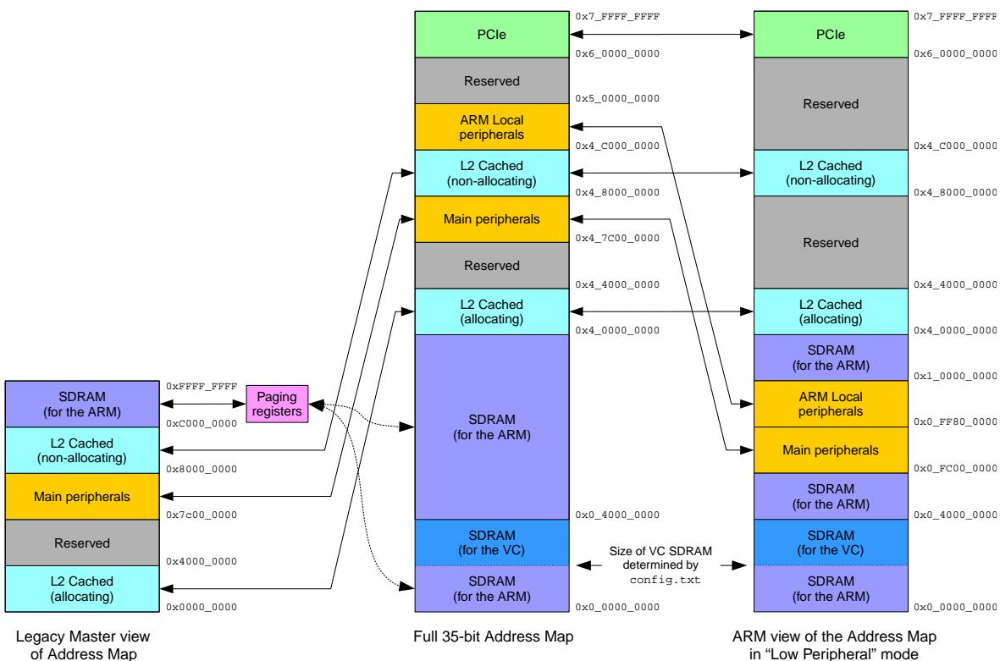


Addresses in ARM Linux are:


1. Issued as virtual addresses by the ARM core, then

2. Mapped into a physical address by the ARM MMU, then

3. Used to select the appropriate peripheral or location in RAM

## 1.2.2. Full 35-bit address map

The full 35-bit address map is shown in Figure 1. This is seen by both "large address" masters (e.g. the DMA4 engines) and the ARM CPU.

It has two L2 cache aliases (one allocating, one non-allocating) which cache (only) the first 1GB of SDRAM.

## 1.2.3. ARM physical addresses

Physical addresses start at 0x0_0000_0000 for RAM.

The ARM section of the RAM starts at 0x0_0000_0000 and extends up to the size of installed SDRAM.

The VideoCore section of the RAM is mapped in from 0x0_4000_0000 downwards. The size of the VideoCore RAM is determined by a setting in config.txt - refer to raspberrypi.com documentation for further details.

The VideoCore maps the ARM physical address space directly to the bus address space seen by VideoCore. The bus addresses for RAM are set up to map onto the uncached bus address range on the VideoCore starting at 0x0_0000_0000.

## <sup></sup> NOTE

BCM2711 provides a 1MB system L2 cache, which is used primarily by the GPU. Accesses to memory are routed either via or around the L2 cache depending on the address range being used.

When running in 32-bit mode, the ARM uses LPAE mode to enable it to access the full 32GB address space.

Physical addresses range from 0x4_7C00_0000 to 0x4_7FFF_FFFF for Main peripherals, and from 0x4_C000_0000 to 0x4_FFFF_FFFF for ARM Local peripherals.

If the VPU enables "Low Peripheral" mode then the ARM (only) has Main peripherals available from 0x0_FC00_0000 to 0x0_FF7F_FFFF and ARM Local peripherals available from 0x0_FF80_0000 to 0x0_FFFF_FFFF.

## 1.2.4. Legacy master addresses

The peripheral addresses specified in this document are legacy master addresses. Software accessing peripherals using the DMA engines must use 32-bit legacy master addresses. The Main peripherals are available from 0x7C00_0000 to 0x7FFF_FFFF. Behind the scenes, the VideoCore transparently translates these addresses to the 35-bit 0x4_7nnn_nnnn addresses.

So a peripheral described in this document as being at legacy address 0x7Enn_nnnn is available in the 35-bit address space at 0x4_7Enn_nnnn, and visible to the ARM at 0x0_FEnn_nnnn if Low Peripheral mode is enabled.

Software accessing RAM using the DMA engines must use legacy addresses (between 0xC000_0000 and 0xFFFF_FFFF) This accesses a 1GB window within the full 16GB SDRAM address space. If the DMA engine needs to access RAM abov the first 1GB, this window can be moved using the PAGE or PAGELITE bits - see Chapter 4 for more details. Behind the scenes, the VideoCore transparently translates these addresses to the 35-bit 0x0_nnnn_nnnn addresses.

Software accessing the VPU L2 cache using the DMA engines must use legacy addresses starting at 0x0000_0000 (for allocating cache) or 0x8000 0000 (for non-allocating cache) Behind the scenes, the VideoCore transparently translates these addresses to the corresponding 35-bit 0x4_nnnn_nnnn addresses. These 1GB windows can’t be moved, and are limited to the first 1GB of SDRAM.

## 1.3. Peripheral access precautions for correct memory ordering

The BCM2711 system uses an AMBA AXI-compatible interface structure. In order to keep the system complexity low and data throughput high, the BCM2711 AXI system does not always return read data in-order. The GPU has special logic to cope with data arriving out-of-order; however the ARM core does not contain such logic. Therefore some precautions must be taken when using the ARM to access peripherals

Accesses to the same peripheral will always arrive and return in-order. It is only when switching from one peripheral to another that data can arrive out-of-order. The simplest way to make sure that data is processed in-order is to place a memory barrier instruction at critical positions in the code. You should place:

A memory write barrier before the first write to a peripheral

A memory read barrier after the last read of a peripheral

It is not required to put a memory barrier instruction after each read or write access. Only at those places in the code where it is possible that a peripheral read or write may be followed by a read or write of a different peripheral. This is normally at the entry and exit points of the peripheral service code

As interrupts can appear anywhere in the code, you should also safeguard those. If an interrupt routine reads from a peripheral the routine should start with a memory read barrier. If an interrupt routine writes to a peripheral the routine should end with a memory write barrier.

## <sup></sup> NOTE

Normally a processor assumes that if it executes two read operations the data will arrive in order. So a read from location X followed by a read from location Y should return the data of location X first, followed by the data of location Y. Data arriving out of order can have disastrous consequences. For example:

a_status = *pointer_to_peripheral_a;

$$
b _ {\text { status }} = * \text { pointer\_to\_peripheral\_b };
$$

Without precautions the values ending up in the variables a_status and b_status can be swapped around

It is theoretically possible for writes to go ‘wrong’ but that is far more difficult to achieve. The AXI system makes sure the data always arrives in-order at its intended destination. So:

*pointer_to_peripheral_a = value_a;

*pointer_to_peripheral_b = value_b;

will always give the expected result. The only time write data can arrive out-of-order is if two different peripherals are connected to the same externalequipment

# Chapter 2. Auxiliaries: UART1, SPI1 & SPI2

## 2.1. Overview

The BCM2711 device has three Auxiliary peripherals: One mini UART (UART1) and two SPI masters (SPI1 & SPI2). These three peripherals are grouped together as they share the same area in the peripheral register map and they share a common interrupt. Also all three are controlled by the Auxiliary enable register. The Auxiliary register base address is 0x7e215000

<table><tr><td>Offset</td><td>Name</td><td>Description</td></tr><tr><td>0x00</td><td>AUX_IRQ</td><td>Auxiliary Interrupt status</td></tr><tr><td>0x04</td><td>AUX_ENABLES</td><td>Auxiliary enables</td></tr><tr><td>0x40</td><td>AUX_MU_IO_REG</td><td>Mini UART I/O Data</td></tr><tr><td>0x44</td><td>AUX_MU_IER_REG</td><td>Mini UART Interrupt Enable</td></tr><tr><td>0x48</td><td>AUX_MU_IIR_REG</td><td>Mini UART Interrupt Identify</td></tr><tr><td>0x4c</td><td>AUX_MU_LCR_REG</td><td>Mini UART Line Control</td></tr><tr><td>0x50</td><td>AUX_MU_MCR_REG</td><td>Mini UART Modem Control</td></tr><tr><td>0x54</td><td>AUX_MU_LSR_REG</td><td>Mini UART Line Status</td></tr><tr><td>0x58</td><td>AUX_MU_MSR_REG</td><td>Mini UART Modem Status</td></tr><tr><td>0x5c</td><td>AUX_MU_SCRATCH</td><td>Mini UART Scratch</td></tr><tr><td>0x60</td><td>AUX_MU_CNTL_REG</td><td>Mini UART Extra Control</td></tr><tr><td>0x64</td><td>AUX_MU_STAT_REG</td><td>Mini UART Extra Status</td></tr><tr><td>0x68</td><td>AUX_MU_BAUD_REG</td><td>Mini UART Baudrate</td></tr><tr><td>0x80</td><td>AUX_SPI1_CNTL0_REG</td><td>SPI 1 Control register 0</td></tr><tr><td>0x84</td><td>AUX_SPI1_CNTL1_REG</td><td>SPI 1 Control register 1</td></tr><tr><td>0x88</td><td>AUX_SPI1_STAT_REG</td><td>SPI 1 Status</td></tr><tr><td>0x8c</td><td>AUX_SPI1_PEEK_REG</td><td>SPI 1 Peek</td></tr><tr><td>0xa0</td><td>AUX_SPI1_IO_REGa</td><td>SPI 1 Data</td></tr><tr><td>0xa4</td><td>AUX_SPI1_IO_REGb</td><td>SPI 1 Data</td></tr><tr><td>0xa8</td><td>AUX_SPI1_IO_REGc</td><td>SPI 1 Data</td></tr><tr><td>0xac</td><td>AUX_SPI1_IO_REGd</td><td>SPI 1 Data</td></tr><tr><td>0xb0</td><td>AUX_SPI1_TXHOLD_REGa</td><td>SPI 1 Extended Data</td></tr><tr><td>0xb4</td><td>AUX_SPI1_TXHOLD_REGb</td><td>SPI 1 Extended Data</td></tr><tr><td>0xb8</td><td>AUX_SPI1_TXHOLD_REGc</td><td>SPI 1 Extended Data</td></tr><tr><td>0xbc</td><td>AUX_SPI1_TXHOLD_REGd</td><td>SPI 1 Extended Data</td></tr><tr><td>0xc0</td><td>AUX_SPI2_CNTL0_REG</td><td>SPI 2 Control register 0</td></tr><tr><td>0xc4</td><td>AUX_SPI2_CNTL1_REG</td><td>SPI 2 Control register 1</td></tr><tr><td>0xc8</td><td>AUX_SPI2_STAT_REG</td><td>SPI 2 Status</td></tr><tr><td>0xcc</td><td>AUX_SPI2_PEEK_REG</td><td>SPI 2 Peek</td></tr><tr><td>0xe0</td><td>AUX_SPI2_IO_REGa</td><td>SPI 2 Data</td></tr><tr><td>0xe4</td><td>AUX_SPI2_IO_REGb</td><td>SPI 2 Data</td></tr><tr><td>0xe8</td><td>AUX_SPI2_IO_REGc</td><td>SPI 2 Data</td></tr><tr><td>0xec</td><td>AUX_SPI2_IO_REGd</td><td>SPI 2 Data</td></tr><tr><td>0xf0</td><td>AUX_SPI2_TXHOLD_REGa</td><td>SPI 2 Extended Data</td></tr><tr><td>0xf4</td><td>AUX_SPI2_TXHOLD_REGb</td><td>SPI 2 Extended Data</td></tr><tr><td>0xf8</td><td>AUX_SPI2_TXHOLD_REGc</td><td>SPI 2 Extended Data</td></tr><tr><td>0xfc</td><td>AUX_SPI2_TXHOLD_REGd</td><td>SPI 2 Extended Data</td></tr></table>

## 2.1.1. AUX registers

There are two Auxiliary registers which control all three devices. One is the interrupt status register, the second is the Auxiliary enable register. The Auxiliary IRQ status register can help to hierarchically determine the source of an interrupt

## AUX_IRQ Register

## Description

The AUX_IRQ register is used to check any pending interrupts which may be asserted by the three Auxiliary sub blocks.

<table><tr><td>Bits</td><td>Name</td><td>Description</td><td>Type</td><td>Reset</td></tr><tr><td>31:3</td><td>Reserved.</td><td>-</td><td>-</td><td>-</td></tr><tr><td>2</td><td>SPI 2 IRQ</td><td>If set the SPI 2 module has an interrupt pending.</td><td>RO</td><td>0x0</td></tr><tr><td>1</td><td>SPI 1 IRQ</td><td>If set the SPI1 module has an interrupt pending.</td><td>RO</td><td>0x0</td></tr><tr><td>0</td><td>Mini UART IRQ</td><td>If set the mini UART has an interrupt pending.</td><td>RO</td><td>0x0</td></tr></table>

## AUX_ENABLES Register

## Description

The AUX_ENABLES register is used to enable the three modules: UART1, SPI1, SPI2.

<table><tr><td>Bits</td><td>Name</td><td>Description</td><td>Type</td><td>Reset</td></tr><tr><td>31:3</td><td>Reserved.</td><td>-</td><td>-</td><td>-</td></tr><tr><td>2</td><td>SPI2 enable</td><td>If set the SPI 2 module is enabled.If clear the SPI 2 module is disabled. That also disables any SPI 2 module register access</td><td>RW</td><td>0x0</td></tr><tr><td>1</td><td>SPI 1 enable</td><td>If set the SPI 1 module is enabled.If clear the SPI 1 module is disabled. That also disables any SPI 1 module register access</td><td>RW</td><td>0x0</td></tr><tr><td>0</td><td>Mini UART enable</td><td>If set the mini UART is enabled. The UART will immediately start receiving data, especially if the UART1_RX line is low. If clear the mini UART is disabled. That also disables any mini UART register access</td><td>RW</td><td>0x0</td></tr></table>

If the enable bits are clear you will have no access to a peripheral. You can not even read or write the registers!

GPIO pins should be set up first before enabling the UART. The UART core is built to emulate 16550 behaviour. So when it is enabled any data at the inputs will immediately be received. If the UART1_RX line is low (because the GPIO pins have not been set-up yet) that will be seen as a start bit and the UART will start receiving 0x00-characters.

Valid stops bits are not required for the UART. (See also Implementation details). Hence any bit status is acceptable as a stop bit, and is only used so there is a clean timing start for the next bit.

Immediately after a reset, the baudrate register will be zero and the system clock will be 250 MHz. So only 2.5 μsecond suffice to fill the receive FIFO. The result will be that if the UART is enabled without changing the default configuration, the FIFO will be full and overflowing in no time flat.

## 2.2. Mini UART

The mini UART is a secondary low throughput UART intended to be used as a console. It needs to be enabled before it can be used. It is also recommended that the correct GPIO function mode is selected before enabling the mini UART (se Chapter 5).

## <sup></sup> NOTE

The UART itself has no throughput limitations, in fact it can run up to 32 Mega baud. But doing so requires significant CPU involvement as it has shallow FIFOs and no DMA support

The mini UART has the following features:

7-bit or 8-bit operation

• 1 start and 1 stop bit

• No parities

• Break generation

• 8 symbols deep FIFOs for receive and transmit

SW controlled RTS, SW readable CTS

• Auto flow control with programmable FIFO level

• 16550 like registers

Baudrate derived from system clock

This is a mini UART and it does NOT have the following capabilities:

• Break detection

Framing errors detection

• Parity bit

Receive Time-out interrupt

• DCD, DSR, DTR or RI signals

The implemented UART is not a 16650 compatible UART. However as far as possible the first 8 control and status registers are laid out like a 16550 UART. All 16550 register bits which are not supported can be written but will be ignored and read back as 0. All control bits for simple UART receive/transmit operations are available.

## 2.2.1. Mini UART implementation details

The UART1_CTS and UART1_RX inputs are synchronised and will take 2 system clock cycles before they are processed.

The module does not check for any framing errors. After receiving a start bit and 8 (or 7) data bits the receiver waits for one half-bit time and then starts scanning for the next start bit. The mini UART does not check if the stop bit is high or wait for the stop bit to appear. As a result of this, a UART1_RX input line which is continuously low (a break condition or an error in connection or GPIO setup) causes the receiver to continuously receive 0x00 symbols.

The mini UART uses 8-times oversampling. The Baudrate can be calculated from:

$$
b a u d r a t e = \frac {s y s t e m \_ c l o c k \_ f r e q}{8 * (b a u d r a t e \_ r e g + 1)}
$$

If the system clock is 250 MHz and the baud register is zero the baudrate is 31.25 Mega baud. (25 Mbits/sec or 3.125 Mbytes/sec). The lowest baudrate with a 250 MHz system clock is 476 Baud.

When writing to the data register only the LS 8 bits are taken. All other bits are ignored. When reading from the data register only the LS 8 bits are valid. All other bits are zero.

## 2.2.2. Mini UART register details

## AUX_MU_IO_REG Register

## Description

The AUX_MU_IO_REG register is primarily used to write data to and read data from the UART FIFOs

If the DLAB bit in the line control register is set this register gives access to the LS 8 bits of the baud rate. (Note: there is easier access to the baud rate register in AUX_MU_BAUD_REG)

<table><tr><td>Bits</td><td>Name</td><td>Description</td><td>Type</td><td>Reset</td></tr><tr><td>31:8</td><td>Reserved.</td><td>-</td><td>-</td><td>-</td></tr><tr><td>7:0</td><td>LS 8 bits Baudrate read/write, DLAB=1</td><td>Access to the LS 8 bits of the 16-bit baudrate register. (Only if bit 7 of the line control register (DLAB bit) is set)</td><td>RW</td><td>0x00</td></tr><tr><td>7:0</td><td>Transmit data write, DLAB=0</td><td>Data written is put in the transmit FIFO (Provided it is not full)(Only if bit 7 of the line control register (DLAB bit) is clear)</td><td>WO</td><td>0x00</td></tr><tr><td>7:0</td><td>Receive data read, DLAB=0</td><td>Data read is taken from the receive FIFO (Provided it is not empty)(Only if bit 7 of the line control register (DLAB bit) is clear)</td><td>RO</td><td>0x00</td></tr></table>

## AUX_MU_IER_REG Register

## Description

The AUX_MU_IER_REG register is primarily used to enable interrupts

If the DLAB bit in the line control register is set this register gives access to the MS 8 bits of the baud rate. (Note: there is easier access to the baud rate register in AUX_MU_BAUD_REG)

<table><tr><td>Bits</td><td>Name</td><td>Description</td><td>Type</td><td>Reset</td></tr><tr><td>31:8</td><td>Reserved.</td><td>-</td><td>-</td><td>-</td></tr><tr><td>7:0</td><td>MS 8 bitsBaudrate read/write, DLAB=1</td><td>Access to the MS 8 bits of the 16-bit baudrate register. (Only if bit 7 of the line control register (DLAB bit) is set)</td><td>RW</td><td>0x00</td></tr><tr><td>1</td><td>Enable receive interrupt (DLAB=0)</td><td>If this bit is set the interrupt line is asserted whenever the receive FIFO holds at least 1 byte.If this bit is clear no receive interrupts are generated.</td><td>RW</td><td>0x0</td></tr><tr><td>0</td><td>Enable transmit interrupt (DLAB=0)</td><td>If this bit is set the interrupt line is asserted whenever the transmit FIFO is empty.If this bit is clear no transmit interrupts are generated.</td><td>RW</td><td>0x0</td></tr></table>

## AUX_MU_IIR_REG Register

## Description

The AUX_MU_IIR_REG register shows the interrupt status.

It also has two FIFO enable status bits and (when writing) FIFO clear bits.

<table><tr><td>Bits</td><td>Name</td><td>Description</td><td>Type</td><td>Reset</td></tr><tr><td>31:8</td><td>Reserved.</td><td>-</td><td>-</td><td>-</td></tr><tr><td>7:6</td><td>FIFO enables</td><td>Both bits always read as 1 as the FIFOs are always enabled</td><td>RO</td><td>0x3</td></tr><tr><td>5:4</td><td>-</td><td>Always read as zero</td><td>RO</td><td>0x0</td></tr><tr><td>3</td><td>-</td><td>Always read as zero as the mini UART has no timeout function</td><td>RO</td><td>0x0</td></tr><tr><td>2:1</td><td>READ:Interrupt ID bitsWRITE:FIFO clear bits</td><td>On read this register shows the interrupt ID bit00 : No interrupts01 : Transmit holding register empty10 : Receiver holds valid byte11 :On write:Writing with bit 1 set will clear the receive FIFOWriting with bit 2 set will clear the transmit FIFO</td><td>RW</td><td>0x0</td></tr><tr><td>0</td><td>Interrupt pending</td><td>This bit is clear whenever an interrupt is pending</td><td>RO</td><td>0x1</td></tr></table>

## AUX_MU_LCR_REG Register

## Description

The AUX_MU_LCR_REG register controls the line data format and gives access to the baudrate register

<table><tr><td>Bits</td><td>Name</td><td>Description</td><td>Type</td><td>Reset</td></tr><tr><td>31:8</td><td>Reserved.</td><td>-</td><td>-</td><td>-</td></tr><tr><td>7</td><td>DLAB access</td><td>If set the first two Mini UART registers give access to the Baudrate register. During operation this bit must be cleared.</td><td>RW</td><td>0x0</td></tr><tr><td>6</td><td>Break</td><td>If set high the UART1_TX line is pulled low continuously. If held for at least 12 bits times that will indicate a break condition.</td><td>RW</td><td>0x0</td></tr><tr><td>5:1</td><td>Reserved.</td><td>-</td><td>-</td><td>-</td></tr><tr><td>0</td><td>Data size</td><td>If clear the UART works in 7-bit modeIf set the UART works in 8-bit mode</td><td>RW</td><td>0x0</td></tr></table>

## AUX_MU_MCR_REG Register

## Description

The AUX_MU_MCR_REG register controls the 'modem' signals.

<table><tr><td>Bits</td><td>Name</td><td>Description</td><td>Type</td><td>Reset</td></tr><tr><td>31:2</td><td>Reserved.</td><td>-</td><td>-</td><td>-</td></tr><tr><td>1</td><td>RTS</td><td>If clear the UART1_RTS line is highIf set the UART1_RTS line is lowThis bit is ignored if the RTS is used for auto-flow control.See the Mini UART Extra Control register description)</td><td>RW</td><td>0x0</td></tr><tr><td>0</td><td>Reserved.</td><td>-</td><td>-</td><td>-</td></tr></table>

## AUX_MU_LSR_REG Register

## Description

The AUX_MU_LSR_REG register shows the data status.

<table><tr><td>Bits</td><td>Name</td><td>Description</td><td>Type</td><td>Reset</td></tr><tr><td>31:7</td><td>Reserved.</td><td>-</td><td>-</td><td>-</td></tr><tr><td>6</td><td>Transmitter idle</td><td>This bit is set if the transmit FIFO is empty and the transmitter is idle. (Finished shifting out the last bit).</td><td>RO</td><td>0x1</td></tr><tr><td>5</td><td>Transmitter empty</td><td>This bit is set if the transmit FIFO can accept at least one byte.</td><td>RO</td><td>0x0</td></tr><tr><td>4:2</td><td>Reserved.</td><td>-</td><td>-</td><td>-</td></tr><tr><td>1</td><td>Receiver Overrun</td><td>This bit is set if there was a receiver overrun. That is: one or more characters arrived whilst the receive FIFO was full. The newly arrived characters have been discarded. This bit is cleared each time this register is read. To do a non-destructive read of this overrun bit use the Mini UART Extra Status register.</td><td>RC</td><td>0x0</td></tr><tr><td>0</td><td>Data ready</td><td>This bit is set if the receive FIFO holds at least 1 symbol.</td><td>RO</td><td>0x0</td></tr></table>

## AUX_MU_MSR_REG Register

Description

The AUX_MU_MSR_REG register shows the 'modem' status.

<table><tr><td>Bits</td><td>Name</td><td>Description</td><td>Type</td><td>Reset</td></tr><tr><td>31:5</td><td>Reserved.</td><td>-</td><td>-</td><td>-</td></tr><tr><td>4</td><td>CTS status</td><td>This bit is the inverse of the UART1_CTS input. Thus:If set the UART1_CTS pin is lowIf clear the UART1_CTS pin is high</td><td>RO</td><td>0x1</td></tr><tr><td>3:0</td><td>Reserved.</td><td>-</td><td>-</td><td>-</td></tr></table>

## AUX_MU_SCRATCH Register

## Description

The AUX_MU_SCRATCH is a single byte of temporary storage.

<table><tr><td>Bits</td><td>Name</td><td>Description</td><td>Type</td><td>Reset</td></tr><tr><td>31:8</td><td>Reserved.</td><td>-</td><td>-</td><td>-</td></tr><tr><td>7:0</td><td>Scratch</td><td>A byte of temporary storage</td><td>RW</td><td>0x00</td></tr></table>

## AUX_MU_CNTL_REG Register

## Description

The AUX_MU_CNTL_REG provides access to some extra useful and nice features not found on a normal 16550 UART.

<table><tr><td>Bits</td><td>Name</td><td>Description</td><td>Type</td><td>Reset</td></tr><tr><td>31:8</td><td>Reserved.</td><td>-</td><td>-</td><td>-</td></tr><tr><td>7</td><td>CTS assert level</td><td>This bit allows one to invert the CTS auto flow operation polarity.If set the CTS auto flow assert level is low*If clear the CTS auto flow assert level is high*</td><td>RW</td><td>0x0</td></tr><tr><td>6</td><td>RTS assert level</td><td>This bit allows one to invert the RTS auto flow operation polarity.If set the RTS auto flow assert level is low*If clear the RTS auto flow assert level is high*</td><td>RW</td><td>0x0</td></tr><tr><td>5:4</td><td>RTS AUTO flow level</td><td>These two bits specify at what receiver FIFO level the RTS line is de-asserted in auto-flow mode.00 : De-assert RTS when the receive FIFO has 3 empty spaces left.01 : De-assert RTS when the receive FIFO has 2 empty spaces left.10 : De-assert RTS when the receive FIFO has 1 empty space left.11 : De-assert RTS when the receive FIFO has 4 empty spaces left.</td><td>RW</td><td>0x0</td></tr><tr><td>3</td><td>Enable transmit Auto flow-control using CTS</td><td>If this bit is set the transmitter will stop if the CTS line is de-asserted.If this bit is clear the transmitter will ignore the status of the CTS line</td><td>RW</td><td>0x0</td></tr><tr><td>2</td><td>Enable receive Auto flow-control using RTS</td><td>If this bit is set the RTS line will de-assert if the receive FIFO reaches its &#x27;auto flow&#x27; level. In fact the RTS line will behave as an RTR (Ready To Receive) line.If this bit is clear the RTS line is controlled by the AUX_MU_MCR_REG register bit 1.</td><td>RW</td><td>0x0</td></tr><tr><td>1</td><td>Transmitter enable</td><td>If this bit is set the mini UART transmitter is enabled.If this bit is clear the mini UART transmitter is disabled</td><td>RW</td><td>0x1</td></tr><tr><td>0</td><td>Receiver enable</td><td>If this bit is set the mini UART receiver is enabled.If this bit is clear the mini UART receiver is disabled</td><td>RW</td><td>0x1</td></tr></table>

Table 14 AUX_MU_STAT_REG Register

## Receiver enable

If this bit is clear no new symbols will be accepted by the receiver. Any symbols in progress of reception will be finished.

## Transmitter enable

If this bit is clear no new symbols will be sent by the transmitter. Any symbols in progress of transmission will be finished.

## Auto flow control

Automatic flow control can be enabled independent for the receiver and the transmitter.

CTS auto flow control impacts the transmitter only. The transmitter will not send out new symbols when the CTS line is de-asserted. Any symbols in progress of transmission when the CTS line becomes de-asserted will be finished.

RTS auto flow control impacts the receiver only. In fact the name RTS for the control line is incorrect and should be RTR (Ready to Receive). The receiver will de-assert the RTS (RTR) line when its receive FIFO has a number of empty spaces left. Normally 3 empty spaces should be enough

If looping back a mini UART using full auto flow control the logic is fast enough to allow the RTS auto flow level of '10' (Deassert RTS when the receive FIFO has 1 empty space left).

## Auto flow polarity

To offer full flexibility the polarity of the CTS and RTS (RTR) lines can be programmed. This should allow the mini UART to interface with any existing hardware flow control available.

## AUX_MU_STAT_REG Register

## Description

The AUX_MU_STAT_REG provides a lot of useful information about the internal status of the mini UART not found o a normal 16550 UART.

<table><tr><td>Bits</td><td>Name</td><td>Description</td><td>Type</td><td>Reset</td></tr><tr><td>31:28</td><td>Reserved.</td><td>-</td><td>-</td><td>-</td></tr><tr><td>27:24</td><td>Transmit FIFO fill level</td><td>These bits shows how many symbols are stored in the transmit FIFOThe value is in the range 0-8</td><td>RO</td><td>0x0</td></tr><tr><td>23:20</td><td>Reserved.</td><td>-</td><td>-</td><td>-</td></tr><tr><td>19:16</td><td>Receive FIFO fill level</td><td>These bits shows how many symbols are stored in the receive FIFOThe value is in the range 0-8</td><td>RO</td><td>0x0</td></tr><tr><td>15:10</td><td>Reserved.</td><td>-</td><td>-</td><td>-</td></tr><tr><td>9</td><td>Transmitter done</td><td>This bit is set if the transmitter is idle and the transmit FIFO is empty.It is a logic AND of bits 3 and 8</td><td>RO</td><td>0x1</td></tr><tr><td>8</td><td>Transmit FIFO is empty</td><td>If this bit is set the transmitter FIFO is empty. Thus it can accept 8 symbols.</td><td>RO</td><td>0x1</td></tr><tr><td>7</td><td>CTS line</td><td>This bit shows the status of the UART1_CTS line.</td><td>RO</td><td>0x0</td></tr><tr><td>6</td><td>RTS status</td><td>This bit shows the status of the UART1_RTS line.</td><td>RO</td><td>0x0</td></tr><tr><td>5</td><td>Transmit FIFO is full</td><td>This is the inverse of bit 1</td><td>RO</td><td>0x0</td></tr><tr><td>4</td><td>Receiver overrun</td><td>This bit is set if there was a receiver overrun. That is: one or more characters arrived whilst the receive FIFO was full.The newly arrived characters have been discarded. This bit is cleared each time the AUX_MU_LSR_REG register is read.</td><td>RO</td><td>0x0</td></tr><tr><td>3</td><td>Transmitter is idle</td><td>If this bit is set the transmitter is idle.If this bit is clear the transmitter is busy.</td><td>RO</td><td>0x1</td></tr><tr><td>2</td><td>Receiver is idle</td><td>If this bit is set the receiver is idle.If this bit is clear the receiver is busy.This bit can change unless the receiver is disabled</td><td>RO</td><td>0x1</td></tr><tr><td>1</td><td>Space available</td><td>If this bit is set the mini UART transmitter FIFO can accept at least one more symbol.If this bit is clear the mini UART transmitter FIFO is full</td><td>RO</td><td>0x0</td></tr><tr><td>0</td><td>Symbol available</td><td>If this bit is set the mini UART receive FIFO contains at least 1 symbolIf this bit is clear the mini UART receiver FIFO is empty</td><td>RO</td><td>0x0</td></tr></table>

## Receiver is idle

This bit is only useful if the receiver is disabled. The normal use is to disable the receiver, then check (or wait) until the bit is set. Now you can be sure that no new symbols will arrive (e.g. now you can change the baudrate…).

## Transmitter is idle

This bit tells if the transmitter is idle. Note that the bit will set only for a short time if the transmit FIFO contains data. Normally you want to use bit 9: Transmitter done.

## RTS status

This bit is useful only in receive Auto flow-control mode as it shows the status of the RTS line.

## AUX_MU_BAUD_REG Register

## Description

The AUX_MU_BAUD_REG register allows direct access to the 16-bit wide baudrate counter.

<table><tr><td>Bits</td><td>Name</td><td>Description</td><td>Type</td><td>Reset</td></tr><tr><td>31:16</td><td>Reserved.</td><td>-</td><td>-</td><td>-</td></tr><tr><td>15:0</td><td>Baudrate</td><td>mini UART baudrate counter</td><td>RW</td><td>0x0000</td></tr></table>


This is the same register as is accessed using the DLAB bit and the first two registers, but much easier to access.


## 2.3. Universal SPI Master (2x)

The two universal SPI masters are secondary low throughput SPI interfaces. Like the mini UART the devices need to be enabled before they can be used

## <sup></sup> NOTE

Again the SPIs themselves have no throughput limitations, in fact they can run with an SPI clock of 125 MHz. But doing so requires significant CPU involvement as they have shallow FIFOs and no DMA support

Each SPI master has the following features:

• Single-beat bit length between 1 and 32 bits

• Single-beat variable bit length between 1 and 24 bits

• Multi-beat infinite bit length

• 3 independent chip selects per master

• 4 entries 32-bit wide transmit and receive FIFOs

• Data out on rising or falling clock edge

• Data in on rising or falling clock edge

Clock inversion (idle high or idle low)

• Wide clocking range

Programmable data out hold time

Shift in/out MS or LS bit first

A major issue with an SPI interface is that there is no SPI standard in any form. Because the SPI interface has been around for a long time some pseudo-standard rules have appeared mostly when interfacing with memory devices. Th universal SPI master has been developed to work even with the most 'non-standard' SPI devices.

## 2.3.1. SPI implementation details

The following diagrams shows a typical SPI access cycle. In this case we have 8 SPI clocks

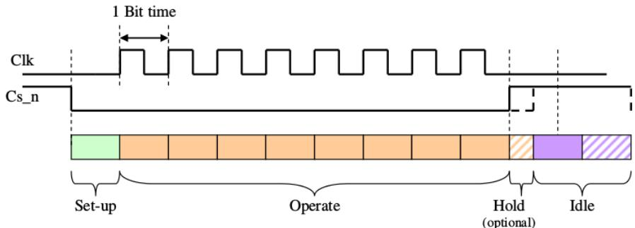


One bit-time before any clock edge changes the CS_n will go low. This makes sure that the MOSI signal has a full bit-time of set-up against any changing clock edges

The operation normally ends after the last clock cycle. Note that at the end there is one half-bit time where the clock does not change but which still is part of the operation cycle.

There is an option to add a half-bit cycle hold time. This makes sure that any MISO data has at least a full SPI bit-time to arrive. (Without this hold time, data clocked out of the SPI device on the last clock edge would have only half a bit-time to arrive).

Lastly there is a guarantee of at least a full bit-time where the SPI chip select is high. A longer CS_n high period can be programmed for another 1-7 cycles

The SPI clock frequency is:

$$
S P I x \_ C L K = \frac {s y s t e m \_ c l o c k \_ f r e q}{2 * (s p e e d \_ f i e l d + 1)}
$$

If the system clock is 250 MHz and the speed field is zero the SPI clock frequency is 125 MHz. The practical SPI clock will be lower as the I/O pads can not transmit or receive signals at such high speed. The lowest SPI clock frequency with 250 MHz system clock is 30.5 KHz

The hardware has an option to add hold time to the MOSI signal against the SPI clk. This is again done using the system clock. So a 250 MHz system clock will add hold times in units of 4 ns. Hold times of 0, 1, 4 and 7 system clock cycles can be used. (So at 250MHz an additional hold time of 0, 4, 16 and 28 ns can be achieved). The hold time is additional to the normal output timing as specified in the data sheet.

## 2.3.2. Interrupts

The SPI block has two interrupts: TX FIFO is empty, SPI is Idle.

## TX FIFO is empty

This interrupt will be asserted as soon as the last entry has been read from the transmit FIFO. At that time the interface will still be busy shifting out that data. This also implies that the receive FIFO will not yet contain the last received data. It is possible at that time to fill the TX FIFO again and read the receive FIFO entries which have been received. There is a RX FIFO level field which tells you exactly how many words are in the receive FIFO. In general at that time the receive FIFO should contain the number of TX items minus one (the last one still being received). Note that there is no "receive FIFO full" interrupt as the number of entries received can never be more than the number of entries transmitted.

## SPI is Idle

This interrupt will be asserted when the transmit FIFO is empty and the SPI block has finished all actions (including the CS-high time). By this time the receive FIFO will have received all data as well.

## 2.3.3. Long bit streams

The SPI module works in bursts of up to 32 bits. Some SPI devices require data which is longer than 32 bits. To do this the user must make use of the two different data TX addresses: TX data written to one address causes the CS to remair asserted. TX data written to the other address causes the CS to be de-asserted at the end of the transmit cycle. So in order to exchange 96 bits you do the following:

Write the first two data words to one address, then write the third word to the other address.

## 2.3.4. SPI register details

## AUX_SPI1_CNTL0_REG, AUX_SPI2_CNTL0_REG Registers

## Description


The AUX_SPIx_CNTL0_REG registers control many features of the SPI interfaces.


<table><tr><td>Bits</td><td>Name</td><td>Description</td><td>Type</td><td>Reset</td></tr><tr><td>31:20</td><td>Speed</td><td>Sets the SPI clock speed. spi_clk_freq = system_clock_freq/2*(speed+1)</td><td>RW</td><td>0x000</td></tr><tr><td>19:17</td><td>Chip Selects</td><td>The pattern output on the CS pins when active.</td><td>RW</td><td>0x7</td></tr><tr><td>16</td><td>Post-input mode</td><td>If set the SPI input works in post-input mode.For details see text further down</td><td>RW</td><td>0x0</td></tr><tr><td>15</td><td>Variable CS</td><td>If 1 the SPI takes the CS pattern and the data from the TX FIFOIf 0 the SPI takes the CS pattern from bits 17-19 of this registerSet this bit only if bit 14 (variable width) is also set</td><td>RW</td><td>0x0</td></tr><tr><td>14</td><td>Variable width</td><td>If 1 the SPI takes the shift length and the data from the TX FIFOIf 0 the SPI takes the shift length from bits 0-5 of this register</td><td>RW</td><td>0x0</td></tr><tr><td>13:12</td><td>DOUT Hold time</td><td>Controls the extra DOUT hold time in system clock cycles.00 : No extra hold time01 : 1 system clock extra hold time10 : 4 system clocks extra hold time11 : 7 system clocks extra hold time</td><td>RW</td><td>0x0</td></tr><tr><td>11</td><td>Enable</td><td>Enables the SPI interface. Whilst disabled the FIFOs can still be written to or read fromThis bit should be 1 during normal operation.</td><td>RW</td><td>0x0</td></tr><tr><td>10</td><td>In rising</td><td>If 1 data is clocked in on the rising edge of the SPI clockIf 0 data is clocked in on the falling edge of the SPI clock</td><td>RW</td><td>0x0</td></tr><tr><td>9</td><td>Clear FIFOs</td><td>If 1 the receive and transmit FIFOs are held in reset (and thus flushed.)This bit should be 0 during normal operation.</td><td>RW</td><td>0x0</td></tr><tr><td>8</td><td>Out rising</td><td>If 1 data is clocked out on the rising edge of the SPI clockIf 0 data is clocked out on the falling edge of the SPI clock</td><td>RW</td><td>0x0</td></tr><tr><td>7</td><td>Invert SPI CLK</td><td>If 1 the 'idle' clock line state is high.If 0 the 'idle' clock line state is low.</td><td>RW</td><td>0x0</td></tr><tr><td>6</td><td>Shift out MS bit first</td><td>If 1 the data is shifted out starting with the MS bit. (bit 31 or bit 23)If 0 the data is shifted out starting with the LS bit. (bit 0)</td><td>RW</td><td>0x0</td></tr><tr><td>5:0</td><td>Shift length</td><td>Specifies the number of bits to shiftThis field is ignored when using 'variable width' mode</td><td>RW</td><td>0x00</td></tr></table>

## Invert SPI CLK

Changing this bit will immediately change the polarity of the SPI clock output. It is recommended to not do this when the CS is active, as the connected devices will see this as a clock change

## DOUT hold time

Because the interface runs off fast silicon the MOSI hold time against the clock will be very short. This can cause considerable problems on SPI slaves. To make it easier for the slave to see the data the hold time of the MOSI out against the SPI clock out is programmable.

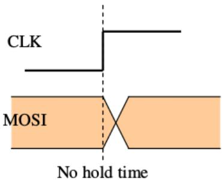


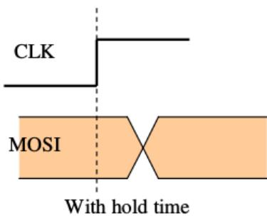


## Variable width

In this mode the shift length is taken from the transmit FIFO. The transmit data bits 28:24 are used as shift length and the data bits 23:0 are the actual transmit data, If the option 'shift MS out first' is selected the first bit shifted out will be bit 23. The receive data will arrive as normal.

## Variable CS

This mode is used together with the variable width mode. In this mode the CS pattern is taken from the transmit FIFO The transmit data bits 31:29 are used as CS and the data bits 23:0 are the actual transmit data. This allows the CPU to write to different SPI devices without having to change the CS bits. However the data length is limited to 24 bits

## Post-input mode

Some rare SPI devices output data on the falling clock edge which then has to be picked up on the next falling clock edge. There are two problems with this:

1. On the very first falling clock edge there is no valid data arriving

2. After the last clock edge there is one more 'dangling' bit to pick up

The post-input mode is specifically to deal with this sort of data. If the post-input mode bit is set, the data arriving at the first falling clock edge is ignored. Then after the last falling clock edge the CS remains asserted and after a full bit-time the last data bit is picked up. The following figure shows this behaviour:

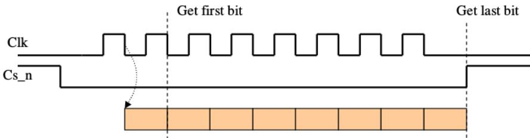


In this mode the CS will go high 1 full SPI clock cycle after the last clock edge. This guarantees a full SPI clock cycle time for the data to settle and arrive at the MISO input.

## AUX_SPI1_CNTL1_REG, AUX_SPI2_CNTL1_REG Registers

## Description

The AUX_SPIx_CNTL1_REG registers control more features of the SPI interfaces.

<table><tr><td>Bits</td><td>Name</td><td>Description</td><td>Type</td><td>Reset</td></tr><tr><td>31:11</td><td>Reserved.</td><td>-</td><td>-</td><td>-</td></tr><tr><td>10:8</td><td>CS high time</td><td>Additional SPI clock cycles where the CS is high.</td><td>RW</td><td>0x0</td></tr><tr><td>7</td><td>TX empty IRQ</td><td>If 1 the interrupt line is high when the transmit FIFO is empty</td><td>RW</td><td>0x0</td></tr><tr><td>6</td><td>Done IRQ</td><td>If 1 the interrupt line is high when the interface is idle</td><td>RW</td><td>0x0</td></tr><tr><td>5:2</td><td>Reserved.</td><td>-</td><td>-</td><td>-</td></tr><tr><td>1</td><td>Shift in MS bit first</td><td>If 1 the data is shifted in starting with the MS bit. (bit 15)If 0 the data is shifted in starting with the LS bit. (bit 0)</td><td>RW</td><td>0x0</td></tr><tr><td>0</td><td>Keep input</td><td>If 1 the receiver shift register is NOT cleared. Thus new data is concatenated to old data.If 0 the receiver shift register is cleared before each transaction.</td><td>RW</td><td>0x0</td></tr></table>

## Keep input

Setting the 'Keep input' bit will prevent the input shift register being cleared between transactions. However the contents of the shift register is still written to the receive FIFO at the end of each transaction. E.g. if you receive two 8- bit values 0x81 followed by 0x46 the receive FIFO will contain: 0x0081 in the first entry and 0x8146 in the second entry. This mode may save CPU time concatenating bits (4 bits followed by 12 bits).

## CS high time

The SPI CS will always be high for at least 1 SPI clock cycle. Some SPI devices need more time to process the data This field will set a longer CS-high time. So the actual CS high time is (CS_high_time + 1) (in SPI clock cycles).

## AUX_SPI1_STAT_REG, AUX_SPI2_STAT_REG Registers

## Description

The AUX_SPIx_STAT_REG registers show the status of the SPI interfaces.

<table><tr><td>Bits</td><td>Name</td><td>Description</td><td>Type</td><td>Reset</td></tr><tr><td>31:28</td><td>Reserved.</td><td>-</td><td>-</td><td>-</td></tr><tr><td>27:24</td><td>TX FIFO level</td><td>The number of data units in the transmit data FIFO</td><td>RO</td><td>0x0</td></tr><tr><td>23:20</td><td>Reserved.</td><td>-</td><td>-</td><td>-</td></tr><tr><td>19:16</td><td>RX FIFO level</td><td>The number of data units in the receive data FIFO.</td><td>RO</td><td>0x0</td></tr><tr><td>15:11</td><td>Reserved.</td><td>-</td><td>-</td><td>-</td></tr><tr><td>10</td><td>TX Full</td><td>If 1 the transmit FIFO is fullIf 0 the transmit FIFO can accept at least 1 data unit.</td><td>RO</td><td>0x0</td></tr><tr><td>9</td><td>TX Empty</td><td>If 1 the transmit FIFO is emptyIf 0 the transmit FIFO holds at least 1 data unit.</td><td>RO</td><td>0x0</td></tr><tr><td>8</td><td>RX Full</td><td>If 1 the receiver FIFO is fullIf 0 the receiver FIFO can accept at least 1 data unit.</td><td>RO</td><td>0x0</td></tr><tr><td>7</td><td>RX Empty</td><td>If 1 the receiver FIFO is emptyIf 0 the receiver FIFO holds at least 1 data unit.</td><td>RO</td><td>0x0</td></tr><tr><td>6</td><td>Busy</td><td>Indicates the module is busy transferring data.</td><td>RO</td><td>0x0</td></tr><tr><td>5:0</td><td>Bit count</td><td>The number of bits still to be processed. Starts with &#x27;shift-length&#x27; and counts down.</td><td>RO</td><td>0x00</td></tr></table>

## Busy

This status bit indicates if the module is busy. It will be clear when the TX FIFO is empty and the module has finished all activities, including waiting the minimum CS high time.

## AUX_SPI1_PEEK_REG, AUX_SPI2_PEEK_REG Registers

## Description

The AUX_SPIx_PEEK_REG registers show received data of the SPI interfaces.

<table><tr><td>Bits</td><td>Name</td><td>Description</td><td>Type</td><td>Reset</td></tr><tr><td>31:16</td><td>Reserved.</td><td>-</td><td>-</td><td>-</td></tr><tr><td>15:0</td><td>Data</td><td>Reads from this address will show the top entry from the receive FIFO, but the data is not taken from the FIFO. This provides a means of inspecting the data but not removing it from the FIFO.</td><td>RO</td><td>0x0000</td></tr></table>

## Description

The AUX_SPI1_IO_REG registers are the primary data port of the SPI 1 interface.

These four addresses all write to the same FIFO.

Writing to any of these addresses causes the SPI CS_n pins to be de-asserted at the end of the access.

AUX_SPI1_IO_REGa AUX_SPI1_IO_REGb, AUX_SPI1_IO_REGc, AUX_SPI1_IO_REGd Registers

Table 22 AUX_SPI2_IO_REGa, AUX_SPI2_IO_REGb AUX_SPI2_IO_REGc, AUX_SPI2_IO_REGd Registers

<table><tr><td>Bits</td><td>Name</td><td>Description</td><td>Type</td><td>Reset</td></tr><tr><td>31:16</td><td>Reserved.</td><td>-</td><td>-</td><td>-</td></tr><tr><td>15:0</td><td>Data</td><td>Writes to this address range end up in the transmit FIFO. Data is lost when writing whilst the transmit FIFO is full. Reads from this address will take the top entry from the receive FIFO. Reading whilst the receive FIFO is empty will return the last data received.</td><td>RW</td><td>0x0000</td></tr></table>

## AUX_SPI1_TXHOLD_REGa, AUX_SPI1_TXHOLD_REGb, AUX_SPI1_TXHOLD_REGc, AUX_SPI1_TXHOLD_REGd Registers

## Description

The AUX_SPI1_TXHOLD_REG registers are the extended CS port of the SPI 1 interface.

Writing to these addresses causes the SPI CS_n pins to remain asserted at the end of the access.

<table><tr><td>Bits</td><td>Name</td><td>Description</td><td>Type</td><td>Reset</td></tr><tr><td>31:16</td><td>Reserved.</td><td>-</td><td>-</td><td>-</td></tr><tr><td>15:0</td><td>Data</td><td>Writes to this address range end up in the transmit FIFO. Data is lost when writing whilst the transmit FIFO is full. Reads from this address will take the top entry from the receive FIFO. Reading whilst the receive FIFO is empty will return the last data received.</td><td>RW</td><td>0x0000</td></tr></table>

## AUX_SPI2_IO_REGa, AUX_SPI2_IO_REGb, AUX_SPI2_IO_REGc, AUX_SPI2_IO_REGd Registers

Description

The AUX_SPI2_IO_REG registers are the primary data port of the SPI 2 interface.

These four addresses all write to the same FIFO.

Writing to any of these addresses causes the SPI CS_n pins to be de-asserted at the end of the access.

<table><tr><td>Bits</td><td>Name</td><td>Description</td><td>Type</td><td>Reset</td></tr><tr><td>31:16</td><td>Reserved.</td><td>-</td><td>-</td><td>-</td></tr><tr><td>15:0</td><td>Data</td><td>Writes to this address range end up in the transmit FIFO. Data is lost when writing whilst the transmit FIFO is full. Reads from this address will take the top entry from the receive FIFO. Reading whilst the receive FIFO is empty will return the last data received.</td><td>RW</td><td>0x0000</td></tr></table>

## AUX_SPI2_TXHOLD_REGa, AUX_SPI2_TXHOLD_REGb, AUX_SPI2_TXHOLD_REGc, AUX_SPI2_TXHOLD_REGd Registers

## Description

The AUX_SPI2_TXHOLD_REG registers are the extended CS port of the SPI 2 interface.

These four addresses all write to the same FIFO.

Writing to these addresses causes the SPI CS_n pins to remain asserted at the end of the access.

<table><tr><td>Bits</td><td>Name</td><td>Description</td><td>Type</td><td>Reset</td></tr><tr><td>31:16</td><td>Reserved.</td><td>-</td><td>-</td><td>-</td></tr><tr><td>15:0</td><td>Data</td><td>Writes to this address range end up in the transmit FIFO. Data is lost when writing whilst the transmit FIFO is full. Reads from this address will take the top entry from the receive FIFO. Reading whilst the receive FIFO is empty will return the last data received.</td><td>RW</td><td>0x0000</td></tr></table>

## Chapter 3. BSC

## 3.1. Overview

The Broadcom Serial Control (BSC) controller is a master, fast-mode (400Kb/s) BSC controller. The Broadcom Serial Control bus is a proprietary bus compliant with the Philips® I<sup>2</sup>C bus/interface version 2.1 January 2000.

• I<sup>2</sup>C single master only operation (supports clock stretching wait states)

• Both 7-bit and 10-bit addressing is supported

• Timing completely software controllable via registers

• The BSC controller in the BCM2711 fixes the clock-strectching bug that was present in BCM283x devices

## 3.2. Register View

The BSC controller has eight memory-mapped registers. All accesses are assumed to be 32-bit. Note that the BSC2 and BSC7 masters are dedicated for use by the HDMI interfaces and should not be accessed by user programs.

There are eight BSC masters inside BCM2711. The user-accessible register addresses start from

BSC0: 0x7e205000

• BSC1: 0x7e804000

• BSC3: 0x7e205600

• BSC4: 0x7e205800

• BSC5: 0x7e205a80

• BSC6: 0x7e205c00

The table below shows the addresses of the I<sup>2</sup>C registers, where the address is an offset from one of the base addresses listed above.

<table><tr><td>Offset</td><td>Name</td><td>Description</td></tr><tr><td>0x00</td><td>C</td><td>Control</td></tr><tr><td>0x04</td><td>S</td><td>Status</td></tr><tr><td>0x08</td><td>DLEN</td><td>Data Length</td></tr><tr><td>0x0c</td><td>A</td><td>Slave Address</td></tr><tr><td>0x10</td><td>FIFO</td><td>Data FIFO</td></tr><tr><td>0x14</td><td>DIV</td><td>Clock Divider</td></tr><tr><td>0x18</td><td>DEL</td><td>Data Delay</td></tr><tr><td>0x1c</td><td>CLKT</td><td>Clock Stretch Timeout</td></tr></table>

## C Register

## Description

The control register is used to enable interrupts, clear the FIFO, define a read or write operation and start a transfer. The READ field specifies the type of transfer.

The CLEAR field is used to clear the FIFO. Writing to this field is a one-shot operation which will always read back as

Table 25. C Register

zero. The CLEAR bit can set at the same time as the start transfer bit, and will result in the FIFO being cleared just prior to the start of transfer. Note that clearing the FIFO during a transfer will result in the transfer being aborted.

The ST field starts a new BSC transfer. This is a one-shot action, and so the bit will always read back as 0.

The INTD field enables interrupts at the end of a transfer - the DONE condition. The interrupt remains active until the DONE condition is cleared by writing a 1 to the I2CS.DONE field. Writing a 0 to the INTD field disables interrupts on DONE.

The INTT field enables interrupts whenever the FIFO is ¼ or more empty and needs writing (i.e. during a write transfer) - the TXW condition. The interrupt remains active until the TXW condition is cleared by writing sufficient dat to the FIFO to complete the transfer. Writing a 0 to the INTT field disables interrupts on TXW.

The INTR field enables interrupts whenever the FIFO is ¾ or more full and needs reading (i.e. during a read transfer) - the RXR condition. The interrupt remains active until the RXW condition is cleared by reading sufficient data from the FIFO. Writing a 0 to the INTR field disables interrupts on RXR.

The I2CEN field enables BSC operations. If this bit is 0 then transfers will not be performed. All register accesses are still permitted however

<table><tr><td>Bits</td><td>Name</td><td>Description</td><td>Type</td><td>Reset</td></tr><tr><td>31:16</td><td>Reserved.</td><td>-</td><td>-</td><td>-</td></tr><tr><td>15</td><td>I2CEN</td><td>I2C Enable0 = BSC controller is disabled1 = BSC controller is enabled</td><td>RW</td><td>0x0</td></tr><tr><td>14:11</td><td>Reserved.</td><td>-</td><td>-</td><td>-</td></tr><tr><td>10</td><td>INTR</td><td>Interrupt on RX0 = Don&#x27;t generate interrupts on RXR condition.1 = Generate interrupt while RXR = 1.</td><td>RW</td><td>0x0</td></tr><tr><td>9</td><td>INTT</td><td>Interrupt on TX0 = Don&#x27;t generate interrupts on TXW condition.1 = Generate interrupt while TXW = 1.</td><td>RW</td><td>0x0</td></tr><tr><td>8</td><td>INTD</td><td>Interrupt on DONE0 = Don&#x27;t generate interrupts on DONE condition.1 = Generate interrupt while DONE = 1.</td><td>RW</td><td>0x0</td></tr><tr><td>7</td><td>ST</td><td>Start Transfer0 = No action.1 = Start a new transfer. One-shot operation. Read back as 0.</td><td>W1SC</td><td>0x0</td></tr><tr><td>6</td><td>Reserved.</td><td>-</td><td>-</td><td>-</td></tr><tr><td>5:4</td><td>CLEAR</td><td>FIFO Clear00 = No action.x1 = Clear FIFO. One-shot operation.1x = Clear FIFO. One-shot operation.If CLEAR and ST are both set in the same operation, the FIFO is cleared before the new frame is started. Read back as 0.Note: 2 bits are used to maintain compatibility with the previous version.</td><td>W1SC</td><td>0x0</td></tr><tr><td>3:1</td><td>Reserved.</td><td>-</td><td>-</td><td>-</td></tr><tr><td>0</td><td>READ</td><td>Read Transfer0 = Write Packet Transfer.1 = Read Packet Transfer.</td><td>RW</td><td>0x0</td></tr></table>

## S Register

## Description

The status register is used to record activity status, errors and interrupt requests.

The TA field indicates the activity status of the BSC controller. This read-only field returns a 1 when the controller is in the middle of a transfer and a 0 when idle

The DONE field is set when the transfer completes. The DONE condition can be used with I2CC.INTD to generate an interrupt on transfer completion. The DONE field is reset by writing a 1, writing a 0 to the field has no effect.

The read-only TXW bit is set during a write transfer and the FIFO is less than ¼ full and needs writing. Writing sufficient data (i.e. enough data to either fill the FIFO more than ¼ full or complete the transfer) to the FIFO will clear the field. When the I2CC.INTT control bit is set, the TXW condition can be used to generate an interrupt to write more data to the FIFO to complete the current transfer. If the I2C controller runs out of data to send, it will wait for mor data to be written into the FIFO.

The read-only RXR field is set during a read transfer and the FIFO is ¾ or more full and needs reading. Reading sufficient data to bring the depth below ¾ will clear the field.

When I2CC.INTR control bit is set, the RXR condition can be used to generate an interrupt to read data from the FIFO before it becomes full. In the event that the FIFO does become full, all I2C operations will stall until data is removed from the FIFO.

The read-only TXD field is set when the FIFO has space for at least one byte of data.

TXD is clear when the FIFO is full. The TXD field can be used to check that the FIFO can accept data before any is written. Any writes to a full TX FIFO will be ignored.

The read-only RXD field is set when the FIFO contains at least one byte of data. RXD is cleared when the FIFO becomes empty. The RXD field can be used to check that the FIFO contains data before reading. Reading from a empty FIFO will return invalid data.

The read-only TXE field is set when the FIFO is empty. No further data will be transmitted until more data is written to the FIFO.

The read-only RXF field is set when the FIFO is full. No more clocks will be generated until space is available in the FIFO to receive more data

The ERR field is set when the slave fails to acknowledge either its address or a data byte written to it. The ERR field is reset by writing a 1, writing a 0 to the field has no effect.

The CLKT field is set when the slave holds the SCL signal high for too long (clock stretching). The CLKT field is reset by writing a 1, writing a 0 to the field has no effect.

Table 26. S Register

<table><tr><td>Bits</td><td>Name</td><td>Description</td><td>Type</td><td>Reset</td></tr><tr><td>31:10</td><td>Reserved.</td><td>-</td><td>-</td><td>-</td></tr><tr><td>9</td><td>CLKT</td><td>Clock Stretch Timeout0 = No errors detected.1 = Slave has held the SCL signal low (clock stretching) for longer and that specified in the I2CCLKT register. Cleared by writing 1 to the field.</td><td>W1C</td><td>0x0</td></tr><tr><td>8</td><td>ERR</td><td>ACK Error0 = No errors detected.1 = Slave has not acknowledged its address. Cleared by writing 1 to the field.</td><td>W1C</td><td>0x0</td></tr><tr><td>7</td><td>RXF</td><td>FIFO Full0 = FIFO is not full.1 = FIFO is full. If a read is underway, no further serial data will be received until data is read from FIFO.</td><td>RO</td><td>0x0</td></tr><tr><td>6</td><td>TXE</td><td>FIFO Empty0 = FIFO is not empty.1 = FIFO is empty. If a write is underway, no further serial data can be transmitted until data is written to the FIFO.</td><td>RO</td><td>0x1</td></tr><tr><td>5</td><td>RXD</td><td>FIFO contains Data0 = FIFO is empty.1 = FIFO contains at least 1 byte. Cleared by reading sufficient data from FIFO.</td><td>RO</td><td>0x0</td></tr><tr><td>4</td><td>TXD</td><td>FIFO can accept Data0 = FIFO is full. The FIFO cannot accept more data.1 = FIFO has space for at least 1 byte.</td><td>RO</td><td>0x1</td></tr><tr><td>3</td><td>RXR</td><td>FIFO needs Reading (3⁄4 full)0 = FIFO is less than 3⁄4 full and a read is underway.1 = FIFO is 3⁄4 or more full and a read is underway. Cleared by reading sufficient data from the FIFO.</td><td>RO</td><td>0x0</td></tr><tr><td>2</td><td>TXW</td><td>FIFO needs Writing (1⁄4 full)0 = FIFO is at least 1⁄4 full and a write is underway (or sufficient data to send).1 = FIFO is less than 1⁄4 full and a write is underway. Cleared by writing sufficient data to the FIFO.</td><td>RO</td><td>0x0</td></tr><tr><td>1</td><td>DONE</td><td>Transfer Done0 = Transfer not completed.1 = Transfer complete. Cleared by writing 1 to the field.</td><td>W1C</td><td>0x0</td></tr><tr><td>0</td><td>TA</td><td>Transfer Active0 = Transfer not active.1 = Transfer active.</td><td>RO</td><td>0x0</td></tr></table>

## DLEN Register

## Description

The data length register defines the number of bytes of data to transmit or receive in the I2C transfer. Reading the register gives the number of bytes remaining in the current transfer

The DLEN field specifies the number of bytes to be transmitted/received. Reading the DLEN field when a transfer is in progress (TA = 1) returns the number of bytes still to be transmitted or received. Reading the DLEN field when the transfer has just completed (DONE = 1) returns zero as there are no more bytes to transmit or receive

Finally, reading the DLEN field when TA = 0 and DONE = 0 returns the last value written. The DLEN field can be left over multiple transfers

<table><tr><td>Bits</td><td>Name</td><td>Description</td><td>Type</td><td>Reset</td></tr><tr><td>31:16</td><td>Reserved.</td><td>-</td><td>-</td><td>-</td></tr><tr><td>15:0</td><td>DLEN</td><td>Data Length.Writing to DLEN specifies the number of bytes to be transmitted/received. Reading from DLEN when TA = 1 or DONE = 1, returns the number of bytes still to be transmitted or received.Reading from DLEN when TA = 0 and DONE = 0, returns the last DLEN value written. DLEN can be left over multiple packets.</td><td>RW</td><td>0x0000</td></tr></table>

## A Register

## Description

The slave address register specifies the slave address and cycle type. The address register can be left across multiple transfers.

The ADDR field specifies the slave address of the I2C device.

<table><tr><td>Bits</td><td>Name</td><td>Description</td><td>Type</td><td>Reset</td></tr><tr><td>31:7</td><td>Reserved.</td><td>-</td><td>-</td><td>-</td></tr><tr><td>6:0</td><td>ADDR</td><td>Slave Address.</td><td>RW</td><td>0x00</td></tr></table>

## FIFO Register

## Description

The Data FIFO register is used to access the FIFO. Write cycles to this address place data in the 16-byte FIFO, ready to transmit on the BSC bus. Read cycles access data received from the bus

Data writes to a full FIFO will be ignored and data reads from an empty FIFO will result in invalid data. The FIFO can be cleared using the I2CC.CLEAR field.

The DATA field specifies the data to be transmitted or received.

<table><tr><td>Bits</td><td>Name</td><td>Description</td><td>Type</td><td>Reset</td></tr><tr><td>31:8</td><td>Reserved.</td><td>-</td><td>-</td><td>-</td></tr><tr><td>7:0</td><td>DATA</td><td>Writes to the register write transmit data to the FIFO. Reads from register read received data from the FIFO.</td><td>RW</td><td>0x00</td></tr></table>

## DIV Register

## Description

The clock divider register is used to define the clock speed of the BSC peripheral.

The CDIV field specifies the core clock divider used by the BSC.

<table><tr><td>Bits</td><td>Name</td><td>Description</td><td>Type</td><td>Reset</td></tr><tr><td>31:16</td><td>Reserved.</td><td>-</td><td>-</td><td>-</td></tr><tr><td>15:0</td><td>CDIV</td><td>Clock DividerSCL = core_clock / CDIVWhere core_clk is nominally 150 MHz. If CDIV is set to 0, the divisor is 32768. CDIV is always rounded down to an even number. The default value should result in a 100 kHz I2C clock frequency.</td><td>RW</td><td>0x05dc</td></tr></table>

## DEL Register

## Description

The data delay register provides fine control over the sampling/launch point of the data.

The REDL field specifies the number core clocks to wait after the rising edge before sampling the incoming data. The FEDL field specifies the number core clocks to wait after the falling edge before outputting the next data bit. Note: Care must be taken in choosing values for FEDL and REDL as it is possible to cause the BSC master to malfunction by setting values of CDIV/2 or greater. Therefore the delay values should always be set to less than CDIV/2.

<table><tr><td>Bits</td><td>Name</td><td>Description</td><td>Type</td><td>Reset</td></tr><tr><td>31:16</td><td>FEDL</td><td>Falling Edge DelayNumber of core clock cycles to wait after the falling edge of SCL before outputting next bit of data.</td><td>RW</td><td>0x0030</td></tr><tr><td>15:0</td><td>REDL</td><td>Rising Edge DelayNumber of core clock cycles to wait after the rising edge of SCL before reading the next bit of data.</td><td>RW</td><td>0x0030</td></tr></table>

## CLKT Register

## Description

The clock stretch timeout register provides a timeout on how long the master waits for the slave to stretch the clock before deciding that the slave has hung.

The TOUT field specifies the number I2C SCL clocks to wait after releasing SCL high and finding that the SCL is stil low before deciding that the slave is not responding and moving the I2C machine forward. When a timeout occurs, the I2CS.CLKT bit is set.

Writing 0x0 to TOUT will result in the Clock Stretch Timeout being disabled.

<table><tr><td>Bits</td><td>Name</td><td>Description</td><td>Type</td><td>Reset</td></tr><tr><td>31:16</td><td>Reserved.</td><td>-</td><td>-</td><td>-</td></tr><tr><td>15:0</td><td>TOUT</td><td>Clock Stretch Timeout ValueNumber of SCL clock cycles to wait after the rising edge of SCL before deciding that the slave is not responding.</td><td>RW</td><td>0x0040</td></tr></table>

## 3.3. 10-Bit Addressing

10-bit addressing is an extension to the standard 7-bit addressing mode. This section describes in detail how to read/write using 10-bit addressing with this I<sup>2</sup>C controller.

10-bit addressing is compatible with, and can be combined with, 7-bit addressing. Using 10 bits for addressing exploits the reserved combination 1111 0xx for the first byte following a START (S) or REPEATED START (Sr) condition

The 10-bit slave address is formed from the first two bytes following a S or Sr condition.

The first seven bits of the first byte are the combination 11110XX of which the last two bits (XX) are the two most significant bits of the 10-bit address. The eighth bit of the first byte is the R/W bit. If the R/W bit is ‘0’ (write) then the following byte contains the remaining 8 bits of the 10-bit address. If the R/W bit is ‘1’ then the next byte contains data transmitted from the slave to the master.

## 3.3.1. Writing

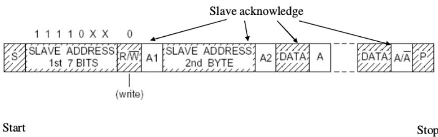


Figure 2 shows a write to a slave with a 10-bit address, to perform this using the controller one must do the following: Assuming we are in the ‘stop’ state: (and the FIFO is empty)

1. Write the number of data bytes to written (plus one) to the I2CDLEN register

2. Write ‘XXXXXXXX’ to the FIFO where ‘XXXXXXXX’ are the least 8 significant bits of the 10-bit slave address

3. Write other data to be transmitted to the FIFO

4. Write ‘11110XX’ to Slave Address Register where ‘XX’ are the two most significant bits of the 10-bit address

5. Set I2CC.READ = 0 and I2CC.ST = 1, this will start a write transfer

## 3.3.2. Reading

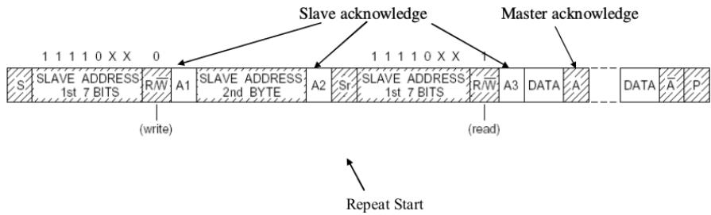


Figure 3 shows how a read from a slave with a 10-bit address is performed. The following procedure shows how to perform a read using the controller:

1. Write 1 to the I2CDLEN register

2. Write ‘XXXXXXXX’ to the FIFO where ‘XXXXXXXX’ are the least 8 significant bits of the 10-bit slave address

3. Write ‘11110XX’ to the Slave Address Register where ‘XX’ are the two most significant bits of the 10-bit address

4. Set I2CC.READ = 0 and I2CC.ST = 1, this will start a write transfer

5. Poll the I2CS.TA bit, waiting for the transfer to start

6. Write the number of data bytes to read to the I2CDLEN register

7. Set I2CC.READ = 1 and I2CC.ST = 1, this will send the repeat start bit, the slave address and the R/W bit (which is ‘1’), initiating the read

# Chapter 4. DMA Controller

## 4.1. Overview

The majority of hardware pipelines and peripherals within the BCM2711 are bus masters, enabling them to efficiently satisfy their own data requirements. This reduces the requirements of the DMA controller to block-to-block memory transfers and supporting some of the simpler peripherals. In addition, the DMA controller provides a read-only prefetc mode to allow data to be brought into the L2 cache in anticipation of its later use.

Note that the DMA controller is directly connected to the peripherals. Therefore the DMA controller must be set-up to use the Legacy Master addresses of the peripherals.

The BCM2711 DMA Controller provides a total of 16 DMA channels. Four of these are DMA Lite channels (with reduced performance and features), and four of them are DMA4 channels (with increased performance and a wider address range). Each channel operates independently from the others and is internally arbitrated onto one of the three system busses. This means that the amount of bandwidth that a DMA channel may consume can be controlled by the arbiter settings (although these are not publicly exposed).

Each DMA channel operates by loading a Control Block (CB) data structure from memory into internal registers. The Control Block defines the required DMA operation. Each Control Block can point to a further Control Block to be loaded and executed once the operation described in the current Control Block has completed. In this way a linked list of Contro Blocks can be constructed in order to execute a sequence of DMA operations without software intervention.

The DMA supports AXI read bursts to ensure efficient external SDRAM use. The DMA Control Block contains a burst parameter which indicates the required burst size of certain memory transfers. In general the DMA doesn’t do write bursts, although wide writes will be done in 2 beat bursts if possible.

Memory-to-Peripheral transfers can be paced by a Data Request (DREQ) signal which is generated by the peripheral. The DREQ signal is level sensitive and controls the DMA by gating its AXI bus requests.

A peripheral can also provide a Panic signal alongside the DREQ to indicate that there is an imminent danger of FIFO underflow or overflow or similar critical situation. The Panic is used to select the AXI apriority level which is then passed out onto the AXI bus so that it can be used to influence arbitration in the rest of the system.

The allocation of peripherals to DMA channels is programmable.

The DMA can deal with byte aligned transfers and will minimise bus traffic by buffering and packing misaligned accesses.

Each DMA channel can be fully disabled via a top level power register to save power.

## 4.2. DMA Controller Registers

The DMA Controller is comprised of several identical DMA Channels depending upon the required configuration. Each individual DMA channel has an identical register map (although LITE channels have fewer registers and DMA4 channels have more registers).

DMA Channel 0 is located at the address of 0x7e007000, Channel 1 at 0x7e007100, Channel 2 at 0x7e007200 and so on. Thus adjacent DMA Channels are offset by 0x100.

DMA Channel 15 however, is physically removed from the other DMA Channels and so has a different address base of 0x7ee05000. DMA Channel 15 is exclusively used by the VPU.

<table><tr><td>Base Address</td><td>DMA Channel</td></tr><tr><td>DMA0_BASE + 0x000</td><td>DMA Channel 0 Register Set</td></tr><tr><td>DMA0_BASE + 0x100</td><td>DMA Channel 1 Register Set</td></tr><tr><td>DMA0_BASE + 0x200</td><td>DMA Channel 2 Register Set</td></tr><tr><td>DMA0_BASE + 0x300</td><td>DMA Channel 3 Register Set</td></tr><tr><td>DMA0_BASE + 0x400</td><td>DMA Channel 4 Register Set</td></tr><tr><td>DMA0_BASE + 0x500</td><td>DMA Channel 5 Register Set</td></tr><tr><td>DMA0_BASE + 0x600</td><td>DMA Channel 6 Register Set</td></tr><tr><td>DMA0_BASE + 0x700</td><td>DMA Channel 7 Register Set</td></tr><tr><td>DMA0_BASE + 0x800</td><td>DMA Channel 8 Register Set</td></tr><tr><td>DMA0_BASE + 0x900</td><td>DMA Channel 9 Register Set</td></tr><tr><td>DMA0_BASE + 0xa00</td><td>DMA Channel 10 Register Set</td></tr><tr><td>DMA0_BASE + 0xb00</td><td>DMA Channel 11 Register Set</td></tr><tr><td>DMA0_BASE + 0xc00</td><td>DMA Channel 12 Register Set</td></tr><tr><td>DMA0_BASE + 0xd00</td><td>DMA Channel 13 Register Set</td></tr><tr><td>DMA0_BASE + 0xe00</td><td>DMA Channel 14 Register Set</td></tr><tr><td>DMA15_BASE + 0x000</td><td>DMA Channel 15 Register Set</td></tr></table>

## 4.2.1. DMA Channel Register Address Map

Each DMA channel of a particular type has an identical register map, only the base address of each channel is different

There is a global enable register at the top of the Address map that can disable each DMA for powersaving.

Only three registers in each channel’s register set are directly writeable (CS, CONBLK_AD and DEBUG). The other registers (TI, SOURCE_AD, DEST_AD, TXFR_LEN, STRIDE & NEXTCONBK) are automatically loaded from a Control Block data structure held in external memory.

## 4.2.1.1. Control Block Data Structure

Control Blocks (CB) are 8 words (256 bits) in length and must start at a 256-bit aligned address. The format of the different CB data structures in memory, are shown below.

Each 32-bit word of the Control Block is automatically loaded into the corresponding 32-bit DMA Control Block register at the start of a DMA transfer. The descriptions of these registers also define the corresponding bit locations in the CB data structure in memory.

<table><tr><td>32-bit Word Offset</td><td>Description</td><td>Associated Read-Only Register</td></tr><tr><td>0</td><td>Transfer Information</td><td>TI</td></tr><tr><td>1</td><td>Source Address</td><td>SOURCE_AD</td></tr><tr><td>2</td><td>Destination Address</td><td>DEST_AD</td></tr><tr><td>3</td><td>Transfer Length</td><td>TXFR_LEN</td></tr><tr><td>4</td><td>2D Mode Stride</td><td>STRIDE</td></tr><tr><td>5</td><td>Next Control Block Address</td><td>NEXTCONBK</td></tr><tr><td>6-7</td><td>Reserved – set to zero.</td><td>N/A</td></tr><tr><td>4</td><td>Reserved – set to zero.</td><td>N/A</td></tr><tr><td>5</td><td>Next Control Block Address</td><td>NEXTCONBK</td></tr><tr><td>6-7</td><td>Reserved – set to zero.</td><td>N/A</td></tr></table>

<table><tr><td>32-bit Word Offset</td><td>Description</td><td>Associated Read-Only Register</td></tr><tr><td>0</td><td>Transfer Information</td><td>TI</td></tr><tr><td>1</td><td>Source Address</td><td>SRC</td></tr><tr><td>2</td><td>Source Information</td><td>SRCI</td></tr><tr><td>3</td><td>Destination Address</td><td>DEST</td></tr><tr><td>4</td><td>Destination Information</td><td>DESTI</td></tr><tr><td>5</td><td>Transfer Length</td><td>LEN</td></tr><tr><td>6</td><td>Next Control Block Address</td><td>NEXT_CB</td></tr><tr><td>7</td><td>Reserved – set to zero.</td><td>N/A</td></tr></table>

The DMA is started by writing the address of a CB structure into the CONBLK_AD register (or the CB register in the DMA4 channels) and then setting the ACTIVE bit. The DMA will fetch the CB from the address set in the SCB_ADDR field of the CONBLK_AD register (or the ADDR field of the CB register in the DMA4 channels) and it will load it into the read-only registers described below. It will then begin a DMA transfer according to the information in the CB.

When it has completed the current DMA transfer (length => 0) the DMA will update the CONBLK_AD register with the contents of the NEXTCONBK register (or the NEXT_CB register in the DMA4 channels), fetch a new CB from that address, and start the whole procedure once again.

The DMA will stop (and clear the ACTIVE bit) when it has completed a DMA transfer and the NEXTCONBK register is set to 0x0000_0000. It will load this value into the CONBLK_AD register and then stop.

Most of the Control Block registers cannot be written to directly as they are loaded automatically from memory. They can be read to provide status information, and to indicate the progress of the current DMA transfer. The value loaded into the NEXTCONBK / NEXT_CB register can be overwritten so that the linked list of Control Block data structures can be dynamically altered. However it is only safe to do this when the DMA is paused.


4.2.1.2. Register Map


<table><tr><td>Offset</td><td>Name</td><td>Description</td></tr><tr><td>0x000</td><td>0_CS</td><td>DMA Channel 0 Control and Status</td></tr><tr><td>0x004</td><td>0_CONBLK_AD</td><td>DMA Channel 0 Control Block Address</td></tr><tr><td>0x008</td><td>0_TI</td><td>DMA Channel 0 CB Word 0(Transfer Information)</td></tr><tr><td>0x00c</td><td>0_SOURCE_AD</td><td>DMA Channel 0 CB Word 1 (Source Address)</td></tr><tr><td>0x010</td><td>0_DEST_AD</td><td>DMA Channel 0 CB Word 2 (Destination Address)</td></tr><tr><td>0x014</td><td>0_TXFR_LEN</td><td>DMA Channel 0 CB Word 3 (Transfer Length)</td></tr><tr><td>0x018</td><td>0_STRIDE</td><td>DMA Channel 0 CB Word 4 (2D Stride)</td></tr><tr><td>0x01c</td><td>0_NEXTCONBK</td><td>DMA Channel 0 CB Word 5 (Next CB Address)</td></tr><tr><td>0x020</td><td>0_DEBUG</td><td>DMA Channel 0 Debug</td></tr><tr><td>0x100</td><td>1_CS</td><td>DMA Channel 1 Control and Status</td></tr><tr><td>0x104</td><td>1_CONBLK_AD</td><td>DMA Channel 1 Control Block Address</td></tr><tr><td>0x108</td><td>1_TI</td><td>DMA Channel 1 CB Word 0 (Transfer Information)</td></tr><tr><td>0x10c</td><td>1_SOURCE_AD</td><td>DMA Channel 1 CB Word 1 (Source Address)</td></tr><tr><td>0x110</td><td>1_DEST_AD</td><td>DMA Channel 1 CB Word 2 (Destination Address)</td></tr><tr><td>0x114</td><td>1_TXFR_LEN</td><td>DMA Channel 1 CB Word 3 (Transfer Length)</td></tr><tr><td>0x118</td><td>1_STRIDE</td><td>DMA Channel 1 CB Word 4 (2D Stride)</td></tr><tr><td>0x11c</td><td>1_NEXTCONBK</td><td>DMA Channel 1 CB Word 5 (Next CB Address)</td></tr><tr><td>0x120</td><td>1_DEBUG</td><td>DMA Channel 1 Debug</td></tr><tr><td>0x200</td><td>2_CS</td><td>DMA Channel 2 Control and Status</td></tr><tr><td>0x204</td><td>2_CONBLK_AD</td><td>DMA Channel 2 Control Block Address</td></tr><tr><td>0x208</td><td>2_TI</td><td>DMA Channel 2 CB Word 0 (Transfer Information)</td></tr><tr><td>0x20c</td><td>2_SOURCE_AD</td><td>DMA Channel 2 CB Word 1 (Source Address)</td></tr><tr><td>0x210</td><td>2_DEST_AD</td><td>DMA Channel 2 CB Word 2 (Destination Address)</td></tr><tr><td>0x214</td><td>2_TXFR_LEN</td><td>DMA Channel 2 CB Word 3 (Transfer Length)</td></tr><tr><td>0x218</td><td>2_STRIDE</td><td>DMA Channel 2 CB Word 4 (2D Stride)</td></tr><tr><td>0x21c</td><td>2_NEXTCONBK</td><td>DMA Channel 2 CB Word 5 (Next CB Address)</td></tr><tr><td>0x220</td><td>2_DEBUG</td><td>DMA Channel 2 Debug</td></tr><tr><td>0x300</td><td>3_CS</td><td>DMA Channel 3 Control and Status</td></tr><tr><td>0x304</td><td>3_CONBLK_AD</td><td>DMA Channel 3 Control Block Address</td></tr><tr><td>0x308</td><td>3_TI</td><td>DMA Channel 3 CB Word 0 (Transfer Information)</td></tr><tr><td>0x30c</td><td>3_SOURCE_AD</td><td>DMA Channel 3 CB Word 1 (Source Address)</td></tr><tr><td>0x310</td><td>3_DEST_AD</td><td>DMA Channel 3 CB Word 2 (Destination Address)</td></tr><tr><td>0x314</td><td>3_TXFR_LEN</td><td>DMA Channel 3 CB Word 3 (Transfer Length)</td></tr><tr><td>0x318</td><td>3_STRIDE</td><td>DMA Channel 3 CB Word 4 (2D Stride)</td></tr><tr><td>0x31c</td><td>3_NEXTCONBK</td><td>DMA Channel 3 CB Word 5 (Next CB Address)</td></tr><tr><td>0x320</td><td>3_DEBUG</td><td>DMA Channel 0 Debug</td></tr><tr><td>0x400</td><td>4_CS</td><td>DMA Channel 4 Control and Status</td></tr><tr><td>0x404</td><td>4_CONBLK_AD</td><td>DMA Channel 4 Control Block Address</td></tr><tr><td>0x408</td><td>4_TI</td><td>DMA Channel 4 CB Word 0 (Transfer Information)</td></tr><tr><td>0x40c</td><td>4_SOURCE_AD</td><td>DMA Channel 4 CB Word 1 (Source Address)</td></tr><tr><td>0x410</td><td>4_DEST_AD</td><td>DMA Channel 4 CB Word 2 (Destination Address)</td></tr><tr><td>0x414</td><td>4_TXFR_LEN</td><td>DMA Channel 4 CB Word 3 (Transfer Length)</td></tr><tr><td>0x418</td><td>4_STRIDE</td><td>DMA Channel 4 CB Word 4 (2D Stride)</td></tr><tr><td>0x41c</td><td>4_NEXTCONBK</td><td>DMA Channel 4 CB Word 5 (Next CB Address)</td></tr><tr><td>0x420</td><td>4_DEBUG</td><td>DMA Channel 0 Debug</td></tr><tr><td>0x500</td><td>5_CS</td><td>DMA Channel 5 Control and Status</td></tr><tr><td>0x504</td><td>5_CONBLK_AD</td><td>DMA Channel 5 Control Block Address</td></tr><tr><td>0x508</td><td>5_TI</td><td>DMA Channel 5 CB Word 0 (Transfer Information)</td></tr><tr><td>0x50c</td><td>5_SOURCE_AD</td><td>DMA Channel 5 CB Word 1 (Source Address)</td></tr><tr><td>0x510</td><td>5_DEST_AD</td><td>DMA Channel 5 CB Word 2 (Destination Address)</td></tr><tr><td>0x514</td><td>5_TXFR_LEN</td><td>DMA Channel 5 CB Word 3 (Transfer Length)</td></tr><tr><td>0x518</td><td>5_STRIDE</td><td>DMA Channel 5 CB Word 4 (2D Stride)</td></tr><tr><td>0x51c</td><td>5_NEXTCONBK</td><td>DMA Channel 5 CB Word 5 (Next CB Address)</td></tr><tr><td>0x520</td><td>5_DEBUG</td><td>DMA Channel 5 Debug</td></tr><tr><td>0x600</td><td>6_CS</td><td>DMA Channel 6 Control and Status</td></tr><tr><td>0x604</td><td>6_CONBLK_AD</td><td>DMA Channel 6 Control Block Address</td></tr><tr><td>0x608</td><td>6_TI</td><td>DMA Channel 6 CB Word 0 (Transfer Information)</td></tr><tr><td>0x60c</td><td>6_SOURCE_AD</td><td>DMA Channel 6 CB Word 1 (Source Address)</td></tr><tr><td>0x610</td><td>6_DEST_AD</td><td>DMA Channel 6 CB Word 2 (Destination Address)</td></tr><tr><td>0x614</td><td>6_TXFR_LEN</td><td>DMA Channel 6 CB Word 3 (Transfer Length)</td></tr><tr><td>0x618</td><td>6_STRIDE</td><td>DMA Channel 6 CB Word 4 (2D Stride)</td></tr><tr><td>0x61c</td><td>6_NEXTCONBK</td><td>DMA Channel 6 CB Word 5 (Next CB Address)</td></tr><tr><td>0x620</td><td>6_DEBUG</td><td>DMA Channel 6 Debug</td></tr><tr><td>0x700</td><td>7_CS</td><td>DMA Lite Channel 7 Control and Status</td></tr><tr><td>0x704</td><td>7_CONBLK_AD</td><td>DMA Lite Channel 7 Control Block Address</td></tr><tr><td>0x708</td><td>7_TI</td><td>DMA Lite Channel 7 CB Word 0 (Transfer Information)</td></tr><tr><td>0x70c</td><td>7_SOURCE_AD</td><td>DMA Lite Channel 7 CB Word 1 (Source Address)</td></tr><tr><td>0x710</td><td>7_DEST_AD</td><td>DMA Lite Channel 7 CB Word 2 (Destination Address)</td></tr><tr><td>0x714</td><td>7_TXFR_LEN</td><td>DMA Lite Channel 7 CB Word 3 (Transfer Length)</td></tr><tr><td>0x71c</td><td>7_NEXTCONBK</td><td>DMA Lite Channel 7 CB Word 5 (Next CB Address)</td></tr><tr><td>0x720</td><td>7_DEBUG</td><td>DMA Lite Channel 7 Debug</td></tr><tr><td>0x800</td><td>8_CS</td><td>DMA Lite Channel 8 Control and Status</td></tr><tr><td>0x804</td><td>8_CONBLK_AD</td><td>DMA Lite Channel 8 Control Block Address</td></tr><tr><td>0x808</td><td>8_TI</td><td>DMA Lite Channel 8 CB Word 0 (Transfer Information)</td></tr><tr><td>0x80c</td><td>8_SOURCE_AD</td><td>DMA Lite Channel 8 CB Word 1 (Source Address)</td></tr><tr><td>0x810</td><td>8_DEST_AD</td><td>DMA Lite Channel 8 CB Word 2 (Destination Address)</td></tr><tr><td>0x814</td><td>8_TXFR_LEN</td><td>DMA Lite Channel 8 CB Word 3 (Transfer Length)</td></tr><tr><td>0x81c</td><td>8_NEXTCONBK</td><td>DMA Lite Channel 8 CB Word 5 (Next CB Address)</td></tr><tr><td>0x820</td><td>8_DEBUG</td><td>DMA Lite Channel 8 Debug</td></tr><tr><td>0x900</td><td>9_CS</td><td>DMA Lite Channel 9 Control and Status</td></tr><tr><td>0x904</td><td>9_CONBLK_AD</td><td>DMA Lite Channel 9 Control Block Address</td></tr><tr><td>0x908</td><td>9_TI</td><td>DMA Lite Channel 9 CB Word 0 (Transfer Information)</td></tr><tr><td>0x90c</td><td>9_SOURCE_AD</td><td>DMA Lite Channel 9 CB Word 1 (Source Address)</td></tr><tr><td>0x910</td><td>9_DEST_AD</td><td>DMA Lite Channel 9 CB Word 2 (Destination Address)</td></tr><tr><td>0x914</td><td>9_TXFR_LEN</td><td>DMA Lite Channel 9 CB Word 3 (Transfer Length)</td></tr><tr><td>0x91c</td><td>9_NEXTCONBK</td><td>DMA Lite Channel 9 CB Word 5 (Next CB Address)</td></tr><tr><td>0x920</td><td>9_DEBUG</td><td>DMA Lite Channel 9 Debug</td></tr><tr><td>0xa00</td><td>10_CS</td><td>DMA Lite Channel 10 Control and Status</td></tr><tr><td>0xa04</td><td>10_CONBLK_AD</td><td>DMA Lite Channel 10 Control Block Address</td></tr><tr><td>0xa08</td><td>10_TI</td><td>DMA Lite Channel 10 CB Word 0 (Transfer Information)</td></tr><tr><td>0xa0c</td><td>10_SOURCE_AD</td><td>DMA Lite Channel 10 CB Word 1 (Source Address)</td></tr><tr><td>0xa10</td><td>10_DEST_AD</td><td>DMA Lite Channel 10 CB Word 2 (Destination Address)</td></tr><tr><td>0xa14</td><td>10_TXFR_LEN</td><td>DMA Lite Channel 10 CB Word 3 (Transfer Length)</td></tr><tr><td>0xa1c</td><td>10_NEXTCONBK</td><td>DMA Lite Channel 10 CB Word 5 (Next CB Address)</td></tr><tr><td>0xa20</td><td>10_DEBUG</td><td>DMA Lite Channel 10 Debug</td></tr><tr><td>0xb00</td><td>11_CS</td><td>DMA4 Channel 11 Control and Status</td></tr><tr><td>0xb04</td><td>11_CB</td><td>DMA4 Channel 11 Control Block Address</td></tr><tr><td>0xb0c</td><td>11_DEBUG</td><td>DMA4 Channel 11 Debug</td></tr><tr><td>0xb10</td><td>11_TI</td><td>DMA4 Channel 11 CB Word 0 (Transfer Information)</td></tr><tr><td>0xb14</td><td>11_SRC</td><td>DMA4 Channel 11 CB Word 1 (Source Address [31:0])</td></tr><tr><td>0xb18</td><td>11_SRCI</td><td>DMA4 Channel 11 CB Word 2 (Source Address [40:32] and Info)</td></tr><tr><td>0xb1c</td><td>11_DEST</td><td>DMA4 Channel 11 CB Word 3 (Destination Address[31:0])</td></tr><tr><td>0xb20</td><td>11_DESTI</td><td>DMA4 Channel 11 CB Word 4(Destination Address[40:32] and Info)</td></tr><tr><td>0xb24</td><td>11_LEN</td><td>DMA4 Channel 11 CB Word 5(Transfer Length)</td></tr><tr><td>0xb28</td><td>11_NEXT_CB</td><td>DMA4 Channel 11 CB Word 6(Next CB Address)</td></tr><tr><td>0xb2c</td><td>11_DEBUG2</td><td>DMA4 Channel 11 More Debug</td></tr><tr><td>0xc00</td><td>12_CS</td><td>DMA4 Channel 12 Control and Status</td></tr><tr><td>0xc04</td><td>12_CB</td><td>DMA4 Channel 12 Control Block Address</td></tr><tr><td>0xc0c</td><td>12_DEBUG</td><td>DMA4 Channel 12 Debug</td></tr><tr><td>0xc10</td><td>12_TI</td><td>DMA4 Channel 12 CB Word 0(Transfer Information)</td></tr><tr><td>0xc14</td><td>12_SRC</td><td>DMA4 Channel 12 CB Word 1(Source Address [31:0])</td></tr><tr><td>0xc18</td><td>12_SRCI</td><td>DMA4 Channel 12 CB Word 2(Source Address [40:32] and Info)</td></tr><tr><td>0xc1c</td><td>12_DEST</td><td>DMA4 Channel 12 CB Word 3(Destination Address[31:0])</td></tr><tr><td>0xc20</td><td>12_DESTI</td><td>DMA4 Channel 12 CB Word 4(Destination Address[40:32] and Info)</td></tr><tr><td>0xc24</td><td>12_LEN</td><td>DMA4 Channel 12 CB Word 5(Transfer Length)</td></tr><tr><td>0xc28</td><td>12_NEXT_CB</td><td>DMA4 Channel 12 CB Word 6(Next CB Address)</td></tr><tr><td>0xc2c</td><td>12_DEBUG2</td><td>DMA4 Channel 12 More Debug</td></tr><tr><td>0xd00</td><td>13_CS</td><td>DMA4 Channel 13 Control and Status</td></tr><tr><td>0xd04</td><td>13_CB</td><td>DMA4 Channel 13 Control Block Address</td></tr><tr><td>0xd0c</td><td>13_DEBUG</td><td>DMA4 Channel 13 Debug</td></tr><tr><td>0xd10</td><td>13_TI</td><td>DMA4 Channel 13 CB Word 0(Transfer Information)</td></tr><tr><td>0xd14</td><td>13_SRC</td><td>DMA4 Channel 13 CB Word 1(Source Address [31:0])</td></tr><tr><td>0xd18</td><td>13_SRCI</td><td>DMA4 Channel 13 CB Word 2(Source Address [40:32] and Info)</td></tr><tr><td>0xd1c</td><td>13_DEST</td><td>DMA4 Channel 13 CB Word 3(Destination Address[31:0])</td></tr><tr><td>0xd20</td><td>13_DESTI</td><td>DMA4 Channel 13 CB Word 4(Destination Address[40:32] and Info)</td></tr><tr><td>0xd24</td><td>13_LEN</td><td>DMA4 Channel 13 CB Word 5(Transfer Length)</td></tr><tr><td>0xd28</td><td>13_NEXT_CB</td><td>DMA4 Channel 13 CB Word 6(Next CB Address)</td></tr><tr><td>0xd2c</td><td>13_DEBUG2</td><td>DMA4 Channel 13 More Debug</td></tr><tr><td>0xe00</td><td>14_CS</td><td>DMA4 Channel 14 Control and Status</td></tr><tr><td>0xe04</td><td>14_CB</td><td>DMA4 Channel 14 Control Block Address</td></tr><tr><td>0xe0c</td><td>14_DEBUG</td><td>DMA4 Channel 14 Debug</td></tr><tr><td>0xe10</td><td>14_TI</td><td>DMA4 Channel 14 CB Word 0(Transfer Information)</td></tr><tr><td>0xe14</td><td>14_SRC</td><td>DMA4 Channel 14 CB Word 1(Source Address [31:0])</td></tr><tr><td>0xe18</td><td>14_SRCI</td><td>DMA4 Channel 14 CB Word 2(Source Address [40:32] and Info)</td></tr><tr><td>0xe1c</td><td>14_DEST</td><td>DMA4 Channel 14 CB Word 3(Destination Address[31:0])</td></tr><tr><td>0xe20</td><td>14_DESTI</td><td>DMA4 Channel 14 CB Word 4(Destination Address[40:32] and Info)</td></tr><tr><td>0xe24</td><td>14_LEN</td><td>DMA4 Channel 14 CB Word 5(Transfer Length)</td></tr><tr><td>0xe28</td><td>14_NEXT_CB</td><td>DMA4 Channel 14 CB Word 6(Next CB Address)</td></tr><tr><td>0xe2c</td><td>14_DEBUG2</td><td>DMA4 Channel 14 More Debug</td></tr><tr><td>0xfe0</td><td>INT_STATUS</td><td>Interrupt status of each DMA channel</td></tr><tr><td>0xff0</td><td>ENABLE</td><td>Global enable bits for each DMA channel</td></tr></table>

## 0_CS, 1_CS, …, 9_CS, 10_CS Registers

## Description

DMA Control and Status register contains the main control and status bits for this DMA channel.

<table><tr><td>Bits</td><td>Name</td><td>Description</td><td>Type</td><td>Reset</td></tr><tr><td>31</td><td>RESET</td><td>DMA Channel ResetWriting a 1 to this bit will reset the DMA. The bit cannot be read, and will self clear.</td><td>W1SC</td><td>0x0</td></tr><tr><td>30</td><td>ABORT</td><td>Abort DMAWriting a 1 to this bit will abort the current DMA CB. The DMA will load the next CB and attempt to continue. The bit cannot be read, and will self clear.</td><td>W1SC</td><td>0x0</td></tr><tr><td>29</td><td>DISDEBUG</td><td>Disable debug pause signalWhen set to 1, the DMA will not stop when the debug pause signal is asserted.</td><td>RW</td><td>0x0</td></tr><tr><td>28</td><td>WAIT_FOR_OUTSTANDING_WRITE S</td><td>Wait for outstanding writesWhen set to 1, the DMA will keep a tally of the AXI writes going out and the write responses coming in. At the very end of the current DMA transfer it will wait until the last outstanding write response has been received before indicating the transfer is complete. Whilst waiting it will load the next CB address (but will not fetch the CB), clear the active flag (if the next CB address = zero), and it will defer setting the END flag or the INT flag until the last outstanding write response has been received.In this mode, the DMA will pause if it has more than 13 outstanding writes at any one time.</td><td>RW</td><td>0x0</td></tr><tr><td>27:24</td><td>Reserved.</td><td>-</td><td>-</td><td>-</td></tr><tr><td>23:20</td><td>PANIC_PRIORITY</td><td>AXI Panic Priority LevelSets the priority of panicking AXI bus transactions. This value is used when the panic bit of the selected peripheral channel is 1.Zero is the lowest priority.</td><td>RW</td><td>0x0</td></tr><tr><td>19:16</td><td>PRIORITY</td><td>AXI Priority LevelSets the priority of normal AXI bus transactions. This value is used when the panic bit of the selected peripheral channel is zero.Zero is the lowest priority.</td><td>RW</td><td>0x0</td></tr><tr><td>15:9</td><td>Reserved.</td><td>-</td><td>-</td><td>-</td></tr><tr><td>8</td><td>ERROR</td><td>DMA ErrorIndicates if the DMA has detected an error. The error flags are available in the debug register, and have to be cleared by writing to that register.1 = DMA channel has an error flag set.0 = DMA channel is OK.</td><td>RO</td><td>0x0</td></tr><tr><td>7</td><td>Reserved.</td><td>-</td><td>-</td><td>-</td></tr><tr><td>6</td><td>WAITING_FOR_OUTSTANDING_WRITES</td><td>DMA is Waiting for the Last Write to be ReceivedIndicates if the DMA is currently waiting for any outstanding writes to be received, and is not transferring data.1 = DMA channel is waiting.</td><td>RO</td><td>0x0</td></tr><tr><td>5</td><td>DREQ_STOPS_DMA</td><td>DMA Paused by DREQ StateIndicates if the DMA is currently paused and not transferring data due to the DREQ being inactive.1 = DMA channel is paused.0 = DMA channel is running.</td><td>RO</td><td>0x0</td></tr><tr><td>4</td><td>PAUSED</td><td>DMA Paused StateIndicates if the DMA is currently paused and not transferring data. This will occur if: the active bit has been cleared, the DMA is currently executing wait cycles, the debug_pause signal has been set by the debug block, or the number of outstanding writes has exceeded the max count.1 = DMA channel is paused.0 = DMA channel is running.</td><td>RO</td><td>0x0</td></tr></table>

Table 39 0_CONBLK_AD, 1_CONBLK_AD, …, 9_CONBLK_AD, 10_CONBLK_AD Registers

<table><tr><td>Bits</td><td>Name</td><td>Description</td><td>Type</td><td>Reset</td></tr><tr><td>3</td><td>DREQ</td><td>DREQ StateIndicates the state of the selected DREQ (Data Request) signal, i.e. the DREQ selected by the PERMAP field of the transfer info.1 = Requesting data. This will only be valid once the DMA has started and the PERMAP field has been loaded from the CB. It will remain valid, indicating the selected DREQ signal, until a new CB is loaded. If PERMAP is set to zero (un-paced transfer) then this bit will read back as 1.0 = No data request.</td><td>RO</td><td>0x0</td></tr><tr><td>2</td><td>INT</td><td>Interrupt StatusThis is set when the transfer for the CB ends and INTEN is set to 1. Once set it must be manually cleared down, even if the next CB has INTEN = 0.Write 1 to clear.</td><td>W1C</td><td>0x0</td></tr><tr><td>1</td><td>END</td><td>DMA End FlagSet when the transfer described by the current Control Block is complete. Write 1 to clear.</td><td>W1C</td><td>0x0</td></tr><tr><td>0</td><td>ACTIVE</td><td>Activate the DMAThis bit enables the DMA. The DMA will start if this bit is set and the CB_ADDR is non zero. The DMA transfer can be paused and resumed by clearing, then setting it again.This bit is automatically cleared at the end of the complete DMA transfer, i.e. after a NEXTCONBK = 0x0000_0000 has been loaded.</td><td>RW</td><td>0x0</td></tr></table>

## 0_CONBLK_AD, 1_CONBLK_AD, …, 9_CONBLK_AD, 10_CONBLK_AD Registers

Description

DMA Control Block Address register.

<table><tr><td>Bits</td><td>Name</td><td>Description</td><td>Type</td><td>Reset</td></tr><tr><td>31:0</td><td>SCB_ADDR</td><td>Control Block AddressThis tells the DMA where to find a Control Block stored in memory. When the ACTIVE bit is set and this address is non zero, the DMA will begin its transfer by loading the contents of the addressed CB into the relevant DMA channel registers.At the end of the transfer this register will be updated with the ADDR field of the NEXTCONBK Control Block register. If this field is zero, the DMA will stop. Reading this register will return the address of the currently active CB (in the linked list of CBs). The address must be 256-bit aligned, so the bottom 5 bits of the address must be zero.</td><td>RW</td><td>0x00000000</td></tr></table>

## 0_TI, 1_TI, …, 5_TI, 6_TI Registers

Description

Table 40. 0_TI, 1_TI, …, 5_TI, 6_TI Registers

DMA Transfer Information.

<table><tr><td>Bits</td><td>Name</td><td>Description</td><td>Type</td><td>Reset</td></tr><tr><td>31:27</td><td>Reserved.</td><td>-</td><td>-</td><td>-</td></tr><tr><td>26</td><td>NO_WIDE_BURSTS</td><td>Don't do wide writes as a 2 beat burstThis prevents the DMA from issuing wide writes as 2 beat AXI bursts. This is an inefficient access mode, so the default is to use the bursts.</td><td>RW</td><td>0x0</td></tr><tr><td>25:21</td><td>WAITS</td><td>Add Wait CyclesThis slows down the DMA throughput by setting the number of dummy cycles burnt after each DMA read or write operation is completed.A value of 0 means that no wait cycles are to be added.</td><td>RW</td><td>0x00</td></tr><tr><td>20:16</td><td>PERMAP</td><td>Peripheral MappingIndicates the peripheral number (1-31) whose ready signal shall be used to control the rate of the transfers, and whose panic signals will be output on the DMA AXI bus. Set to 0 for a continuous un-paced transfer.</td><td>RW</td><td>0x00</td></tr><tr><td>15:12</td><td>BURST_LENGTH</td><td>Burst Transfer LengthIndicates the burst length of the DMA transfers. The DMA will attempt to transfer data as bursts of this number of words. A value of zero will produce a single transfer. Bursts are only produced for specific conditions, see main text.</td><td>RW</td><td>0x0</td></tr><tr><td>11</td><td>SRC_IGNORE</td><td>Ignore Reads1 = Do not perform source reads. In addition, destination writes will zero all the write strobes. This is used for fast cache fill operations.0 = Perform source reads.</td><td>RW</td><td>0x0</td></tr><tr><td>10</td><td>SRC_DREQ</td><td>Control Source Reads with DREQ1 = The DREQ selected by PERMAP will gate the source reads.0 = DREQ has no effect.</td><td>RW</td><td>0x0</td></tr><tr><td>9</td><td>SRC_WIDTH</td><td>Source Transfer Width1 = Use 128-bit source read width.0 = Use 32-bit source read width.</td><td>RW</td><td>0x0</td></tr><tr><td>8</td><td>SRC_INC</td><td>Source Address Increment1 = Source address increments after each read. The address will increment by 4, if SRC_WIDTH=0 else by 32.0 = Source address does not change.</td><td>RW</td><td>0x0</td></tr><tr><td>7</td><td>DEST_IGNORE</td><td>Ignore Writes1 = Do not perform destination writes.0 = Write data to destination.</td><td>RW</td><td>0x0</td></tr><tr><td>6</td><td>DEST_DREQ</td><td>Control Destination Writes with DREQ1 = The DREQ selected by PERMAP will gate the destination writes.0 = DREQ has no effect.</td><td>RW</td><td>0x0</td></tr><tr><td>5</td><td>DEST_WIDTH</td><td>Destination Transfer Width1 = Use 128-bit destination write width.0 = Use 32-bit destination write width.</td><td>RW</td><td>0x0</td></tr></table>

Table 42. 0_DEST_AD, 1_DEST_AD, …, 9_DEST_AD, 10_DEST_AD Registers

<table><tr><td>Bits</td><td>Name</td><td>Description</td><td>Type</td><td>Reset</td></tr><tr><td>4</td><td>DEST_INC</td><td>Destination Address Increment1 = Destination address increments after each write. The address will increment by 4, if DEST_WIDTH=0 else by 32.0 = Destination address does not change.</td><td>RW</td><td>0x0</td></tr><tr><td>3</td><td>WAIT_RESP</td><td>Wait for a Write ResponseWhen set this makes the DMA wait until it receives the AXI write response for each write. This ensures that multiple writes cannot get stacked in the AXI bus pipeline.1= Wait for the write response to be received before proceeding.0 = Don&#x27;t wait; continue as soon as the write data is sent.</td><td>RW</td><td>0x0</td></tr><tr><td>2</td><td>Reserved.</td><td>-</td><td>-</td><td>-</td></tr><tr><td>1</td><td>TDMODE</td><td>2D Mode1 = 2D mode interpret the TXFR_LEN register as YLENGTH number of transfers each of XLENGTH, and add the strides to the address after each transfer.0 = Linear mode interpret the TXFR_LEN register as a single transfer of total length {YLENGTH, XLENGTH}.</td><td>RW</td><td>0x0</td></tr><tr><td>0</td><td>INTEN</td><td>Interrupt Enable1 = Generate an interrupt when the transfer described by the current Control Block completes.0 = Do not generate an interrupt.</td><td>RW</td><td>0x0</td></tr></table>

## 0_SOURCE_AD, 1_SOURCE_AD, …, 9_SOURCE_AD, 10_SOURCE_AD Registers

## Description

DMA Source Address

<table><tr><td>Bits</td><td>Name</td><td>Description</td><td>Type</td><td>Reset</td></tr><tr><td>31:0</td><td>S_ADDR</td><td>DMA Source AddressSource address for the DMA operation. Updated by the DMA engine as the transfer progresses.</td><td>RW</td><td>0x00000000</td></tr></table>

## 0_DEST_AD, 1_DEST_AD, …, 9_DEST_AD, 10_DEST_AD Registers

## Description


DMA Destination Address


<table><tr><td>Bits</td><td>Name</td><td>Description</td><td>Type</td><td>Reset</td></tr><tr><td>31:0</td><td>D_ADDR</td><td>DMA Destination AddressDestination address for the DMA operation. Updated by the DMA engine as the transfer progresses.</td><td>RW</td><td>0x00000000</td></tr></table>

## 0_TXFR_LEN, 1_TXFR_LEN, …, 5_TXFR_LEN, 6_TXFR_LEN Registers

## Description

DMA Transfer Length. This specifies the amount of data to be transferred in bytes.

In normal (non 2D) mode this specifies the amount of bytes to be transferred.

In 2D mode it is interpreted as an X and a Y length, and the DMA will perform Y transfers, each of length X bytes and add the strides onto the addresses after each X leg of the transfer.

The length register is updated by the DMA engine as the transfer progresses, so it will indicate the data left to

transfer.

<table><tr><td>Bits</td><td>Name</td><td>Description</td><td>Type</td><td>Reset</td></tr><tr><td>31:30</td><td>Reserved.</td><td>-</td><td>-</td><td>-</td></tr><tr><td>29:16</td><td>YLENGTH</td><td>When in 2D mode, This is the Y transfer length, indicating how many xlength transfers are performed. When in normal linear mode this becomes the top bits of the XLENGTH</td><td>RW</td><td>0x0000</td></tr><tr><td>15:0</td><td>XLENGTH</td><td>Transfer Length in bytes.</td><td>RW</td><td>0x0000</td></tr></table>

## 0_STRIDE, 1_STRIDE, …, 5_STRIDE, 6_STRIDE Registers

Description

DMA 2D Stride

<table><tr><td>Bits</td><td>Name</td><td>Description</td><td>Type</td><td>Reset</td></tr><tr><td>31:16</td><td>D_STRIDE</td><td>Destination Stride (2D Mode)Signed (2 s complement) byte increment to apply to the destination address at the end of each row in 2D mode.</td><td>RW</td><td>0x0000</td></tr><tr><td>15:0</td><td>S_STRIDE</td><td>Source Stride (2D Mode)Signed (2 s complement) byte increment to apply to the source address at the end of each row in 2D mode.</td><td>RW</td><td>0x0000</td></tr></table>

## 0_NEXTCONBK, 1_NEXTCONBK, …, 9_NEXTCONBK, 10_NEXTCONBK Registers

## Description

DMA Next Control Block Address

The value loaded into this register can be overwritten so that the linked list of Control Block data structures can be altered. However it is only safe to do this when the DMA is paused. The address must be 256-bit aligned and so the bottom 5 bits cannot be set and will read back as zero

<table><tr><td>Bits</td><td>Name</td><td>Description</td><td>Type</td><td>Reset</td></tr><tr><td>31:0</td><td>ADDR</td><td>Address of next CB for chained DMA operations.</td><td>RW</td><td>0x00000000</td></tr></table>

## 0_DEBUG, 1_DEBUG, …, 5_DEBUG, 6_DEBUG Registers

## Description

DMA Debug register.

<table><tr><td>Bits</td><td>Name</td><td>Description</td><td>Type</td><td>Reset</td></tr><tr><td>31:29</td><td>Reserved.</td><td>-</td><td>-</td><td>-</td></tr><tr><td>28</td><td>LITE</td><td>DMA LiteSet if the DMA is a reduced performance LITE engine.</td><td>RO</td><td>0x0</td></tr><tr><td>27:25</td><td>VERSION</td><td>DMA VersionDMA version number, indicating control bit field changes.</td><td>RO</td><td>0x2</td></tr><tr><td>24:16</td><td>DMA_STATE</td><td>DMA State Machine StateReturns the value of the DMA engine's state machine for this channel.</td><td>RO</td><td>0x000</td></tr><tr><td>15:8</td><td>DMA_ID</td><td>DMA IDReturns the DMA AXI ID of this DMA channel.</td><td>RO</td><td>0x00</td></tr><tr><td>7:4</td><td>OUTSTANDING_WRITES</td><td>DMA Outstanding Writes CounterReturns the number of write responses that have not yet been received.This count is reset at the start of each new DMA transfer or with a DMA reset.</td><td>RO</td><td>0x0</td></tr><tr><td>3</td><td>Reserved.</td><td>-</td><td>-</td><td>-</td></tr><tr><td>2</td><td>READ_ERROR</td><td>Slave Read Response ErrorSet if the read operation returned an error value on the read response bus. It can be cleared by writing a 1.</td><td>W1C</td><td>0x0</td></tr><tr><td>1</td><td>FIFO_ERROR</td><td>FIFO ErrorSet if the optional read FIFO records an error condition. It can be cleared by writing a 1.</td><td>W1C</td><td>0x0</td></tr><tr><td>0</td><td>READ_LAST_NOT_SET_ERROR</td><td>Read Last Not Set ErrorIf the AXI read last signal was not set when expected, then this error bit will be set. It can be cleared by writing a 1.</td><td>W1C</td><td>0x0</td></tr></table>

## 7_TI, 8_TI, 9_TI, 10_TI Registers

## Description

DMA Lite Transfer Information.

Table 47. 7_TI, 8_TI, 9_TI, 10_TI Registers

<table><tr><td>Bits</td><td>Name</td><td>Description</td><td>Type</td><td>Reset</td></tr><tr><td>31:26</td><td>Reserved.</td><td>-</td><td>-</td><td>-</td></tr><tr><td>25:21</td><td>WAITS</td><td>Add Wait CyclesThis slows down the DMA throughput by setting the number of dummy cycles burnt after each DMA read or write operation is completed.A value of 0 means that no wait cycles are to be added.</td><td>RW</td><td>0x00</td></tr><tr><td>20:16</td><td>PERMAP</td><td>Peripheral MappingIndicates the peripheral number (1-31) whose ready signal shall be used to control the rate of the transfers, and whose panic signals will be output on the DMA AXI bus. Set to 0 for a continuous un-paced transfer.</td><td>RW</td><td>0x00</td></tr><tr><td>15:12</td><td>BURST_LENGTH</td><td>Burst Transfer LengthIndicates the burst length of the DMA transfers. The DMA will attempt to transfer data as bursts of this number of words. A value of zero will produce a single transfer. Bursts are only produced for specific conditions, see main text.</td><td>RW</td><td>0x0</td></tr><tr><td>11</td><td>Reserved.</td><td>-</td><td>-</td><td>-</td></tr><tr><td>10</td><td>SRC_DREQ</td><td>Control Source Reads with DREQ1 = The DREQ selected by PERMAP will gate the source reads.0 = DREQ has no effect.</td><td>RW</td><td>0x0</td></tr><tr><td>9</td><td>SRC_WIDTH</td><td>Source Transfer Width1 = Use 128-bit source read width.0 = Use 32-bit source read width.</td><td>RW</td><td>0x0</td></tr><tr><td>8</td><td>SRC_INC</td><td>Source Address Increment1 = Source address increments after each read. The address will increment by 4, if SRC_WIDTH=0 else by 32.0 = Source address does not change.</td><td>RW</td><td>0x0</td></tr><tr><td>7</td><td>Reserved.</td><td>-</td><td>-</td><td>-</td></tr><tr><td>6</td><td>DEST_DREQ</td><td>Control Destination Writes with DREQ1 = The DREQ selected by PERMAP will gate the destination writes.0 = DREQ has no effect.</td><td>RW</td><td>0x0</td></tr><tr><td>5</td><td>DEST_WIDTH</td><td>Destination Transfer Width1 = Use 128-bit destination write width.0 = Use 32-bit destination write width.</td><td>RW</td><td>0x0</td></tr><tr><td>4</td><td>DEST_INC</td><td>Destination Address Increment1 = Destination address increments after each write. The address will increment by 4, if DEST_WIDTH=0 else by 32.0 = Destination address does not change.</td><td>RW</td><td>0x0</td></tr><tr><td>3</td><td>WAIT_RESP</td><td>Wait for a Write ResponseWhen set this makes the DMA wait until it receives the AXI write response for each write. This ensures that multiple writes cannot get stacked in the AXI bus pipeline.1= Wait for the write response to be received before proceeding.0 = Don't wait; continue as soon as the write data is sent.</td><td>RW</td><td>0x0</td></tr><tr><td>2:1</td><td>Reserved.</td><td>-</td><td>-</td><td>-</td></tr><tr><td>0</td><td>INTEN</td><td>Interrupt Enable1 = Generate an interrupt when the transfer described by the current Control Block completes.0 = Do not generate an interrupt.</td><td>RW</td><td>0x0</td></tr></table>

## 7_TXFR_LEN, 8_TXFR_LEN, 9_TXFR_LEN, 10_TXFR_LEN Registers

## Description

DMA Lite Transfer Length

<table><tr><td>Bits</td><td>Name</td><td>Description</td><td>Type</td><td>Reset</td></tr><tr><td>31:16</td><td>Reserved.</td><td>-</td><td>-</td><td>-</td></tr><tr><td>15:0</td><td>XLENGTH</td><td>Transfer LengthLength of transfer, in bytes. Updated by the DMA engine as the transfer progresses.</td><td>RW</td><td>0x0000</td></tr></table>

## 7_DEBUG, 8_DEBUG, 9_DEBUG, 10_DEBUG Registers

## Description

DMA Lite Debug register.

<table><tr><td>Bits</td><td>Name</td><td>Description</td><td>Type</td><td>Reset</td></tr><tr><td>31:29</td><td>Reserved.</td><td>-</td><td>-</td><td>-</td></tr></table>

Table 50. 11_CS, 12_CS, 13_CS, 14_CS Registers

<table><tr><td>Bits</td><td>Name</td><td>Description</td><td>Type</td><td>Reset</td></tr><tr><td>28</td><td>LITE</td><td>DMA LiteSet if the DMA is a reduced performance LITE engine.</td><td>RO</td><td>0x1</td></tr><tr><td>27:25</td><td>VERSION</td><td>DMA VersionDMA version number, indicating control bit field changes.</td><td>RO</td><td>0x2</td></tr><tr><td>24:16</td><td>DMA_STATE</td><td>DMA State Machine StateReturns the value of the DMA engine&#x27;s state machine for this channel.</td><td>RO</td><td>0x000</td></tr><tr><td>15:8</td><td>DMA_ID</td><td>DMA IDReturns the DMA AXI ID of this DMA channel.</td><td>RO</td><td>0x00</td></tr><tr><td>7:4</td><td>OUTSTANDING_WRITES</td><td>DMA Outstanding Writes CounterReturns the number of write responses that have not yet been received.This count is reset at the start of each new DMA transfer or with a DMA reset.</td><td>RO</td><td>0x0</td></tr><tr><td>3</td><td>Reserved.</td><td>-</td><td>-</td><td>-</td></tr><tr><td>2</td><td>READ_ERROR</td><td>Slave Read Response ErrorSet if the read operation returned an error value on the read response bus. It can be cleared by writing a 1.</td><td>W1C</td><td>0x0</td></tr><tr><td>1</td><td>FIFO_ERROR</td><td>FIFO ErrorSet if the optional read FIFO records an error condition. It can be cleared by writing a 1.</td><td>W1C</td><td>0x0</td></tr><tr><td>0</td><td>READ_LAST_NOT_SET_ERROR</td><td>Read Last Not Set ErrorIf the AXI read last signal was not set when expected, then this error bit will be set. It can be cleared by writing a 1.</td><td>W1C</td><td>0x0</td></tr></table>

## 11_CS, 12_CS, 13_CS, 14_CS Registers

## Description

DMA4 Control and Status register contains the main control and status bits for this DMA4 channel.

<table><tr><td>Bits</td><td>Name</td><td>Description</td><td>Type</td><td>Reset</td></tr><tr><td>31</td><td>HALT</td><td>Writing a 1 to this bit will cleanly halt the current DMA transfer. The halt will cause the DMA4 to zero its length counters and thus it will complete the current transfer and wait until all outstanding bus activity has finished. The DMA4 will then zero the active flag and return to idle, leaving the address of the aborted CB in the CB reg. The halt bit will self clear when the DMA4 has fully stopped. The Halt bit can be automatically set if the DMA4 detects an error and the debug HALT_ON_ERROR bit is set.</td><td>W1SC</td><td>0x0</td></tr><tr><td>30</td><td>ABORT</td><td>Abort DMAWriting a 1 to this bit will cleanly abort the current DMA transfer. The abort will cause the DMA4 to zero its length counters and thus it will complete the current transfer and wait until all outstanding bus activity has finished.The DMA4 will then check the NEXT_CB address and if it is non zero it will load it into the CB and attempt to continue.The abort bit will self clear when the abort has completed.The abort bit can be automatically set if the DMA4 detects an error and the debug ABORT_ON_ERROR bit is set.</td><td>W1SC</td><td>0x0</td></tr><tr><td>29</td><td>DISDEBUG</td><td>Disable Debug Pause SignalWhen set to 1, the DMA4 will not pause when the debug pause signal is asserted.Normally the DMA4 will pause when the debugger asserts the debug_pause DMA control signal. This prevents the DMA4 from running on ahead when the processor is stopped by the debugger. Debug_pause will cleanly pause the DMA4 by preventing it from issuing new commands.Releasing the debug_pause will allow the DMA4 to carry on where it left off.</td><td>RW</td><td>0x0</td></tr><tr><td>28</td><td>WAIT_FOR_OUTSTANDING_WRITE S</td><td>Wait for outstanding writes.The DMA4 keeps a tally of the AXI writes requests going out and the write responses coming in.When set to 1, the DMA4 will complete the current transfer and then wait until the last outstanding write response has been received and the tally has returned to zero. Only then will it indicate that the transfer is complete and set the END flag or if required the INT and move on to the next CB.The number of outstanding writes will be limited by the FIFO size as set by the instantiation parameters.</td><td>RW</td><td>0x0</td></tr><tr><td>27:26</td><td>Reserved.</td><td>-</td><td>-</td><td>-</td></tr><tr><td>25</td><td>OUTSTANDING_TRANSACTIONS</td><td>Indicates that there are outstanding AXI transfers, either outstanding read data or outstanding write responsesThis just indicates that the outstanding counters in DEBUG2 are &gt;0</td><td>RO</td><td>0x0</td></tr><tr><td>24</td><td>DMA_BUSY</td><td>Indicates the DMA4 is BUSY.This indicates that the DMA4 is operating or waiting for outstanding data or otherwise in use.It can be used as an indicator of when it is safe to powersave the DMA4 and turn off all the clocks by using the global DMA_EN bits</td><td>RO</td><td>0x0</td></tr><tr><td>23:20</td><td>PANIC_QOS</td><td>AXI Panic QOS LevelSets the QOS level of AXI bus transactions when the DMA4 is panicking.This value is used when the panic bit of the selected peripheral channel is 1 indicating that the peripheral is in panic mode.Zero is the lowest QOS.</td><td>RW</td><td>0x0</td></tr><tr><td>19:16</td><td>QOS</td><td>AXI QOS LevelSets the QOS level of normal AXI bus transactions. This value is used when the panic bit of the selected peripheral channel is zero or when no peripheral is selected as in a memory to memory transfer.Zero is the lowest QOS.</td><td>RW</td><td>0x0</td></tr><tr><td>15:11</td><td>Reserved.</td><td>-</td><td>-</td><td>-</td></tr><tr><td>10</td><td>ERROR</td><td>DMA ErrorIndicates if the DMA4 has detected an error.The error flags are available in the debug register, and are cleared by reading that register.1 = there is error flag set.0 = no errors.</td><td>RO</td><td>0x0</td></tr><tr><td>9:8</td><td>Reserved.</td><td>-</td><td>-</td><td>-</td></tr><tr><td>7</td><td>WAITING_FOR_OUTSTANDING_WRITES</td><td>The DMA4 is Waiting for all the Write Response to be returned.If WAIT_FOR_OUTSTANDING_WRITES is enabled, the DMA4 will complete its transfer and then enter a waiting state where it waits for all the outstanding write responses to be returned. When they are all accounted for, the DMA4 will indicate that the transfer is complete and set the END or INT flags and move on to the next CB.1 = The DMA4 is waiting for outstanding bresponses.</td><td>RO</td><td>0x0</td></tr><tr><td>6</td><td>DREQ_STOPS_DMA</td><td>DMA Paused by DREQ StateThis indicates that the DMA4 is currently paused and not transferring data due to the selected DREQ being inactive. The DMA4 has either src_dreq or dest_dreq set in its CB and the permap value will be indicating which of the DREQ line it should select.If this DREQ line is low then the DMA4 will be paused waiting for the peripheral to request more data.1 = DMA is paused.0 = DMA is running.</td><td>RO</td><td>0x0</td></tr><tr><td>5</td><td>WR_PAUSED</td><td>DMA Write Paused StateIndicates that the DMA4 is currently paused and not writing data.This will occur if: the active bit has been cleared, if the debug_pause signal has been set by the debug block, or the selected peripheral dreq input isn't set and writes are gated by dreq.1 = paused for writes.0 = running.</td><td>RO</td><td>0x0</td></tr><tr><td>4</td><td>RD_PAUSED</td><td>DMA read Paused StateIndicates that the DMA4 is currently paused and not reading data.This will occur if: the active bit has been cleared or if the debug_pause signal has been set by the debug block or the selected peripheral dreq isn't set and reads are gated by dreq.1 = paused for reads.0 = running.</td><td>RO</td><td>0x0</td></tr><tr><td>3</td><td>DREQ</td><td>DREQ StateIndicates the state of the selected DREQ (Data Request) signal, i.e. the DREQ selected by the PERMAP field of the transfer info.1 = Requesting data. This will only be valid once the DMA has started and the PERMAP field has been loaded from the CB. It will remain valid, indicating the selected DREQ signal, until a new CB is loaded. If PERMAP is set to zero (un-paced transfer) then this bit will read back as 1.0 = No data request.</td><td>RO</td><td>0x1</td></tr><tr><td>2</td><td>INT</td><td>Interrupt StatusIf interrupts are enabled (INTEN is set to 1) the interrupt is set when the transfer for the current CB is completed.If WAIT_FOR_OUTSTANDING_WRITES is enabled, the DMA4 will wait for all the outstanding bresponses before setting the INT bit.Once set it must be manually cleared by writing a 1 to this bit, even if the next CB has INTEN = 0.The interrupt can also be set if the INT_ON_ERROR debug bit is set and an error is detected. An error interrupt won't be set until the current CB has completed.Write 1 to clear.</td><td>W1C</td><td>0x0</td></tr><tr><td>1</td><td>END</td><td>End FlagSet when the transfer described by the current Control Block is complete.If WAIT_FOR_OUTSTANDING_WRITES is enabled, the DMA4 will wait for all the outstanding bresponses before setting the end bit.Once set it must be manually cleared by writing a 1 to this bit.Write 1 to clear.</td><td>W1C</td><td>0x0</td></tr><tr><td>0</td><td>ACTIVE</td><td>Activate the DMA4This bit enables the DMA4 to start transferring data.The DMA4 will start operating if this bit is set and the CB is non zero.The DMA transfer can be cleanly paused and re-started in mid transfer by clearing and setting this active bit.The DMA4 will pause at a safe AXI transaction point.This bit is automatically cleared at the end of the CB linked List, i.e. after a CB with a NEXTCONBK = 0x0000_0000 has been executed.</td><td>RW</td><td>0x0</td></tr></table>

## 11_CB, 12_CB, 13_CB, 14_CB Registers

Table 52. 11_DEBUG, 12_DEBUG, 13_DEBUG, 14_DEBUG Registers

## Description


DMA4 Control Block Address register.


<table><tr><td>Bits</td><td>Name</td><td>Description</td><td>Type</td><td>Reset</td></tr><tr><td>31:0</td><td>ADDR</td><td>Control Block Address [36:5]This tells the DMA4 where to find a Control Block (CB) stored in memory. The address must be 256-bit aligned, i.e. the bottom 5 address bits are 0.To support a larger address range, the bottom 5 bits of the CB address are not written here i.e. you should write CB_byte_addr&gt;&gt;5The DMA4 will not start unless this address is non zero and the ACTIVE bit has been set.Once the CB and Active are set, the DMA4 will start by reading the CB from the given address and loading the data into the relevant CB registersIt will then execute the DMA described by the CB regardless of what it is, so if garbage is read then it will execute it.At the end of the DMA transfer described by the CB, the NEXTCONBK field of the CB will be loaded into to this CB_ADDR register and if it is non zero another DMA sequence will begin anew.Reading this register will return the address of the currently active CB.</td><td>RW</td><td>0x00000000</td></tr></table>

## 11_DEBUG, 12_DEBUG, 13_DEBUG, 14_DEBUG Registers

## Description

DMA4 Debug register.

<table><tr><td>Bits</td><td>Name</td><td>Description</td><td>Type</td><td>Reset</td></tr><tr><td>31:28</td><td>VERSION</td><td>DMA VersionDMA version number, indicating control bit field changes.</td><td>RO</td><td>0x1</td></tr><tr><td>27:24</td><td>ID</td><td>IDReturns the ID of this DMA4. This is also used as the AXI subid</td><td>RO</td><td>0x0</td></tr><tr><td>23</td><td>RESET</td><td>DMA ResetThis is a hard reset of the DMA4 state machine and certain internal registers.Writing a 1 to this bit will reset the DMA4. The bit cannot be read, and will self clear.Using this in the middle of a DMA transfer or when the AXI bus is active or has outstanding transactions will probably be fatal.</td><td>W1SC</td><td>0x0</td></tr><tr><td>22</td><td>Reserved.</td><td>-</td><td>-</td><td>-</td></tr><tr><td>21:18</td><td>W_STATE</td><td>Write State Machine StateReturns the value of the DMA4 engine's write state machine.W_IDLE = 0W_PRELOAD = 1W_CALC = 2W_WRITE4K = 3W_READFIFO_EMPTY = 4W_WAIT_OUTSTANDING = 5</td><td>RO</td><td>0x0</td></tr><tr><td>17:14</td><td>R_STATE</td><td>Read State Machine StateReturns the value of the DMA4 engine's read state machine.R_IDLE = 0R_WAIT_CB_DATA = 1R_CALC = 2R_READ4K = 3R_READING = 4R_READFIFO_FULL = 5R_WAIT_WRITE_COMPLETE = 6</td><td>RO</td><td>0x0</td></tr><tr><td>13:12</td><td>Reserved.</td><td>-</td><td>-</td><td>-</td></tr><tr><td>11</td><td>DISABLE_CLK_GATE</td><td>Disable the clock gating logic.</td><td>RW</td><td>0x0</td></tr><tr><td>10</td><td>ABORT_ON_ERROR</td><td>Instruct the DMA4 to ABORT if it detects an error. If any of the error conditions are met then the CS_ABORT bit will be set causing the DMA4 to terminate the current CB and attempt to start the next one.Clearing this bit will allow it to plough on regardless and probably trample over the entire memory.</td><td>RW</td><td>0x1</td></tr><tr><td>9</td><td>HALT_ON_ERROR</td><td>Instruct the DMA4 to HALT if it detects an error. If any of the error conditions are met then the CS_HALT bit will be set causing the DMA4 to stop.This will override the abort on error behaviour.</td><td>RW</td><td>0x0</td></tr><tr><td>8</td><td>INT_ON_ERROR</td><td>Generate an interrupt if an error is detectedThis forces the DMA4 to generate an error even if the inten bit in the TI isn't setThe int will be generated when the DMA4 finishes the current CB</td><td>RW</td><td>0x0</td></tr><tr><td>7:4</td><td>Reserved.</td><td>-</td><td>-</td><td>-</td></tr><tr><td>3</td><td>READ_CB_ERROR</td><td>Slave Read Response Error During Control Block Read Set if the read operation returned an error value on the read response bus whilst reading the CB.It is cleared by reading.</td><td>RC</td><td>0x0</td></tr><tr><td>2</td><td>READ_ERROR</td><td>Slave Read Response ErrorSet if the read operation returned an error value on the read response bus during a data read.It is cleared by reading.</td><td>RC</td><td>0x0</td></tr><tr><td>1</td><td>FIFO_ERROR</td><td>FIFO ErrorSet if the optional read FIFO records an error condition (read when empty or write when full).It is cleared by reading.</td><td>RC</td><td>0x0</td></tr><tr><td>0</td><td>WRITE_ERROR</td><td>Slave Write Response ErrorSet if a write operation returned an error value on the write response bus.It is cleared by reading.</td><td>RC</td><td>0x0</td></tr></table>

## 11_TI, 12_TI, 13_TI, 14_TI Registers

## Description

DMA4 Transfer Information.

Table 53. 11_TI, 12_TI, 13_TI, 14_TI Registers

<table><tr><td>Bits</td><td>Name</td><td>Description</td><td>Type</td><td>Reset</td></tr><tr><td>31:24</td><td>D_WAITS</td><td>Write Wait CyclesThis slows down the DMA throughput by setting the number of dummy cycles before each AXI Write operation is started.A value of 0 means that no wait cycles are to be added.Waits are counted down when the DMA4 wants to do a wait and the bus is available and the writes aren't paused because of DREQS or some other reason.</td><td>RW</td><td>0x00</td></tr><tr><td>23:16</td><td>S_WAITS</td><td>Read Wait CyclesThis slows down the DMA throughput by setting the number of dummy cycles burnt before each DMA AXI read operation is started.A value of 0 means that no wait cycles are to be added.Waits are counted down when the DMA4 wants to do a read and the bus is available and the reads aren't paused because of DREQS or some other reason.</td><td>RW</td><td>0x00</td></tr><tr><td>15</td><td>D_DREQ</td><td>Control Destination Writes with DREQ.This is used when writing to a peripheral that has a DREQ flow control available to control the data flow.The DMA4 will observe the DREQ input selected by the PERMAP value and pause writes when it is low.Care must be taken when using this as the DMA4 will only stop writing peripheral data a clock cycle or two after it sees a low DREQ at its input.However there may still be outstanding write data in the pipeline formed by the infrastructure between the DMA and the peripheral.The peripheral must take this into account when deciding when to drop its DREQ signal, and must have spare FIFO room to accommodate the data that's still in flight.The WAIT_RESP feature can be used to ensure there is only ever 1 outstanding write at any time for use with peripherals that can't provide any spare storage for any in-flight data.The D_WAITS feature can be used to add a delay before each write to allow the DREQ more time to make it back to the DMA.1 = The DREQ selected by PERMAP will gate the Destination writes.0 = DREQ has no effect.</td><td>RW</td><td>0x0</td></tr><tr><td>14</td><td>S_DREQ</td><td>Control Source Reads with DREQThis is used when reading from a peripheral that has a DREQ flow control available.The DMA will observe the DREQ input selected by the permap value and pause reads when it is low.Care must be taken when using this as the DMA4 will only stop issuing peripheral read requests a clock cycle or two after it sees a low DREQ at its input.The AXI infrastructure will allow several read requests to become queued outside of the DMA4 engine so it's possible to request far more data may than a peripheral can immediately supply.If this happens then the infrastructure may become locked until the data is available and this will adversely affect system performance.The WAIT_RD_RESP option prevents the DMA4 from issuing more than 1 read request at a time, so the amount of data requested can be governed by the burst size, and this allows more time for the peripheral to retract its DREQ when it runs out of data.The S_WAITS feature can be used to add a delay before each read to allow the DREQ more time to make it back to the DMA.1 = The DREQ selected by PERMAP will gate the source reads.0 = DREQ has no effect.</td><td>RW</td><td>0x0</td></tr><tr><td>13:09</td><td>PERMAP</td><td>Peripheral MappingIndicates the DREQ of selected peripheral (1-31).The DMA4 will select the DREQ from this peripheral and use that to control the rate of read or write transfers.The DMA4 will also select the panic signals from this peripheral and use that to set the QOS level on the AXI bus.Setting a PERMAP of 0 selects a dummy peripheral that is always active for a continuous un-paced transfer.</td><td>RW</td><td>0x00</td></tr><tr><td>8:4</td><td>Reserved.</td><td>-</td><td>-</td><td>-</td></tr><tr><td>3</td><td>WAIT_RD_RESP</td><td>Wait for a Read ResponseWhen set this makes the DMA4 wait until it receives all the data from each read. This ensures that multiple reads cannot get stacked in the AXI bus pipeline.This allows the amount of data to be controlled by the burst size, e.g. when reading for a peripheral FIFO1 = Wait for the read data to be received before proceeding.0 = Don't wait; allow multiple reads to be queued.</td><td>RW</td><td>0x0</td></tr><tr><td>2</td><td>WAIT_RESP</td><td>Wait for a Write ResponseWhen set this makes the DMA4 wait until it receives the AXI write response for each write. This ensures that multiple writes cannot get stacked in the AXI bus pipeline.1 = Wait for the write response to be received before proceeding.0 = Don't wait; continue as soon as the write data is sent.</td><td>RW</td><td>0x0</td></tr><tr><td>1</td><td>TDMODE</td><td>2D Mode - perform a 2D transfer instead of a normal linear transfer.In 2D mode the DMA4 will interpret the length field as an X and a Y length. It will execute Y+1 transfers each of length X.After each X transfer, the DMA4 will add the value in the STRIDE registers to the source and destination address.If 2D mode isn't selected then the DMA4 interprets the X&amp;Y lengths as a single 30bit length and performs one transfer of that number of bytes.1 = 2D mode - perform Y+1 transfers of X bytes0 = Linear mode interpret the LEN register as a single transfer of total length {YLENGTH, XLENGTH} bytes.</td><td>RW</td><td>0x0</td></tr><tr><td>0</td><td>INTEN</td><td>Interrupt Enable1 = Generate an interrupt when the transfer described by the current Control Block completes.0 = Do not generate an interrupt.</td><td>RW</td><td>0x0</td></tr></table>

## 11_SRC, 12_SRC, 13_SRC, 14_SRC Registers

## Description

Lower 32 bits of the DMA4 Source Address

The DMA4 can handle up to 40bit addresses so the full source address is split over 2 registers.

<table><tr><td>Bits</td><td>Name</td><td>Description</td><td>Type</td><td>Reset</td></tr><tr><td>31:0</td><td>ADDR</td><td>Lower bits of the Source Address [31:0]This specifies the BYTE address that the DMA4 should read source data from.The address is BYTE aligned allowing transfers from any byte address to any other byte address.This reg value is automatically updated by the DMA4 engine as the transfer progresses, so it indicates the current address being read.</td><td>RW</td><td>0x00000000</td></tr></table>

## 11_SRCI, 12_SRCI, 13_SRCI, 14_SRCI Registers

## Description

DMA4 Source Information

This contains the high bits of the source address[40:32] as well as other source control bits

<table><tr><td>Bits</td><td>Name</td><td>Description</td><td>Type</td><td>Reset</td></tr><tr><td>31:16</td><td>STRIDE</td><td>Source StrideThis is only used in 2D transfer mode (TDMODE).In a 2D transfer the DMA4 will perform Y transfers each of X bytes. At the end of each X row, the source stride is added to the source address and this is used as the start address of the source data for the next X row.The source stride is a signed (2 s complement) byte increment so negative values are allowed.</td><td>RW</td><td>0x0000</td></tr><tr><td>15</td><td>IGNORE</td><td>Ignore Reads.The DMA4 will perform a normal transfer except that it will not produce any reads. The DMA4 will write zero data.1 = Do not perform source reads.0 = Perform source reads.</td><td>RW</td><td>0x0</td></tr><tr><td>14:13</td><td>SIZE</td><td>Source Transfer WidthThe DMA4 will perform all AXI source reads with this AXI transfer width. Data will be fetched in bursts of this width and assembled into the correct data size inside the DMA4.On the BCM2711 the width cannot be set larger than 128 bits.3 = 2562 = 1281 = 640 = 32</td><td>RW</td><td>0x0</td></tr><tr><td>12</td><td>INC</td><td>Increment the Source Address1 = Source address increments after each read. The address will increment by by the number of bytes in the transfer width.0 = Source address does not change. Data will always be read from the same source address with an AXI "Fixed" transfer. This is intended to be used to read from a peripheral FIFO type of source.</td><td>RW</td><td>0x0</td></tr><tr><td>11:08</td><td>BURST_LENGTH</td><td>Burst Transfer LengthIndicates the maximum burst length of the source reads.The DMA4 will attempt to transfer data as bursts of this number of words unless it will cause a 4k crossing or there isn't enough data required.A value of zero will produce a single-beat transfer.</td><td>RW</td><td>0x0</td></tr><tr><td>7:0</td><td>ADDR</td><td>High Bits of the Source Address [40:32]The source address is split over 2 registers, and together they give a 40-bit address</td><td>RW</td><td>0x00</td></tr></table>

## 11_DEST, 12_DEST, 13_DEST, 14_DEST Registers

## Description

Lower 32 bits of the DMA4 Destination Address

The DMA4 can handle up to 40bit addresses so the full address is split over 2 registers.

<table><tr><td>Bits</td><td>Name</td><td>Description</td><td>Type</td><td>Reset</td></tr><tr><td>31:0</td><td>ADDR</td><td>Destination AddressThis specifies the BYTE address that the DMA4 should write data to.The address is BYTE aligned allowing transfers from any byte address to any other byte address.This register value is automatically updated by the DMA4 engine as the transfer progresses, so it indicates the current address being written.</td><td>RW</td><td>0x00000000</td></tr></table>

## 11_DESTI, 12_DESTI, 13_DESTI, 14_DESTI Registers

## Description

## DMA4 Destination Information

This contains the high bits of the destination address [40:32] and other information bits for the destination

<table><tr><td>Bits</td><td>Name</td><td>Description</td><td>Type</td><td>Reset</td></tr><tr><td>31:16</td><td>STRIDE</td><td>Destination StrideThis is only used in 2D transfer mode.In a 2D transfer the DMA4 will perform Y transfers each of X bytes. At the end of each X row, the destination stride is added to the destination address and this is used as the start address of the destination for the next X row.The destination stride is a signed (2 s complement) byte increment so negative values are allowed.</td><td>RW</td><td>0x0000</td></tr><tr><td>15</td><td>IGNORE</td><td>Ignore Destination Writes1 = Do not perform destination Writes. The DMA4 will read the source data but not write it.0 = Perform destination Writes.</td><td>RW</td><td>0x0</td></tr><tr><td>14:13</td><td>SIZE</td><td>Destination Transfer WidthThe DMA4 will perform all AXI destination writes with this AXI transfer width. Data will be written in bursts of this width. On the BCM2711 the width cannot be set larger than 128 bits.3 = 2562 = 1281 = 640 = 32</td><td>RW</td><td>0x0</td></tr><tr><td>12</td><td>INC</td><td>Destination Address Increment1 = Destination address increments after each write. The address will increment by by the number bytes in the transfer width.0 = Destination address does not change.</td><td>RW</td><td>0x0</td></tr><tr><td>11:08</td><td>BURST_LENGTH</td><td>Burst Transfer LengthIndicates the maximum burst length of the destination writes. The DMA4 will attempt to transfer data as bursts of this number of words unless it will cause a 4k crossing or there isn't enough data required.A value of zero will produce a single transfer.</td><td>RW</td><td>0x0</td></tr><tr><td>7:0</td><td>ADDR</td><td>High Bits of the Destination Address [40:32]The destination address is split over 2 registers, and together they give a 40-bit address</td><td>RW</td><td>0x00</td></tr></table>

## 11_LEN, 12_LEN, 13_LEN, 14_LEN Registers

## Description

DMA4 Transfer Length.

This specifies the amount of data to be transferred in bytes

In normal (non 2D) mode the X&Y are combined to specifies the number of bytes to be transferred up to a max of 2^30-1.

In 2D mode it is interpreted as an X and a Y length, and the DMA4 will perform Y+1 transfers, each of length X bytes. In 2D mode the source and destination strides are added onto the source and destination addresses after each X leo of the transfer.

The length register is updated by the DMA4 engine as the transfer progresses, so it will indicate the data left to transfer.

<table><tr><td>Bits</td><td>Name</td><td>Description</td><td>Type</td><td>Reset</td></tr><tr><td>31:30</td><td>Reserved.</td><td>-</td><td>-</td><td>-</td></tr><tr><td>29:16</td><td>YLENGTH</td><td>When in 2D mode, This is the Y transfer length, indicating how many xlength transfers are performed. When in normal linear mode this becomes the top bits of the XLENGTHIn 2D mode a value of 0 will result in a single XLENGTH transfer and a value of 1 will result in 2 XLENGTH transfers.</td><td>RW</td><td>0x0000</td></tr><tr><td>15:0</td><td>XLENGTH</td><td>Transfer Length in bytes.A value of 1 will transfer 1 byteA value of 0 is illegal</td><td>RW</td><td>0x0000</td></tr></table>

## 11_NEXT_CB, 12_NEXT_CB, 13_NEXT_CB, 14_NEXT_CB Registers

## Description

## DMA4 Next Control Block Address

When the current DMA transfer has completed, the Next Control Block address is transferred to the CB address register and if the active bit is still set the next DMA in the linked list of CBs is begun

A CB with a Next Control Block Address of 0 indicates the end of the list. Once that CB is executed the zero next CB will be loaded and the DMA will stop (as the start condition for the DMA4 is (ACTIVE & CB!=0)

The value loaded into this register can be overwritten so that the linked list of Control Block data structures can be dynamically altered. However it is only safe to do this when the DMA4 is paused.

The address must be 256-bit aligned and so the bottom 5 bits of the byte address are discarded, i.e. write cb_byte_address[39:0]>>5 into the CB

<table><tr><td>Bits</td><td>Name</td><td>Description</td><td>Type</td><td>Reset</td></tr><tr><td>31:0</td><td>ADDR</td><td>Address of next CB for chained DMA operations.</td><td>RW</td><td>0x00000000</td></tr></table>

## 11_DEBUG2, 12_DEBUG2, 13_DEBUG2, 14_DEBUG2 Registers

## Description

DMA4 Debug2 register.

<table><tr><td>Bits</td><td>Name</td><td>Description</td><td>Type</td><td>Reset</td></tr><tr><td>31:25</td><td>Reserved.</td><td>-</td><td>-</td><td>-</td></tr><tr><td>24:16</td><td>OUTSTANDING_READS</td><td>Outstanding read Words CountThis indicates the number of outstanding read words.This keeps count of the number of read words that have been requested and the number that have actually been returned.This should be zero at the end of every transfer</td><td>RO</td><td>0x000</td></tr><tr><td>15:9</td><td>Reserved.</td><td>-</td><td>-</td><td>-</td></tr><tr><td>8:0</td><td>OUTSTANDING_WRITES</td><td>Outstanding Write Response CountThis indicates the number of outstanding write responses.This keeps count of the number of write requests that have been generated and the number of bresponses that have been returned.This should be zero at the end of every transfer</td><td>RO</td><td>0x000</td></tr></table>

## INT_STATUS Register

## Description

Interrupt status of each DMA engine

<table><tr><td>Bits</td><td>Name</td><td>Description</td><td>Type</td><td>Reset</td></tr><tr><td>31:16</td><td>Reserved.</td><td>-</td><td>-</td><td>-</td></tr><tr><td>15</td><td>INT15</td><td>Interrupt status of DMA engine 15</td><td>RO</td><td>0x0</td></tr><tr><td>14</td><td>INT14</td><td>Interrupt status of DMA engine 14</td><td>RO</td><td>0x0</td></tr><tr><td>13</td><td>INT13</td><td>Interrupt status of DMA engine 13</td><td>RO</td><td>0x0</td></tr><tr><td>12</td><td>INT12</td><td>Interrupt status of DMA engine 12</td><td>RO</td><td>0x0</td></tr><tr><td>11</td><td>INT11</td><td>Interrupt status of DMA engine 11</td><td>RO</td><td>0x0</td></tr><tr><td>10</td><td>INT10</td><td>Interrupt status of DMA engine 10</td><td>RO</td><td>0x0</td></tr><tr><td>9</td><td>INT9</td><td>Interrupt status of DMA engine 9</td><td>RO</td><td>0x0</td></tr><tr><td>8</td><td>INT8</td><td>Interrupt status of DMA engine 8</td><td>RO</td><td>0x0</td></tr><tr><td>7</td><td>INT7</td><td>Interrupt status of DMA engine 7</td><td>RO</td><td>0x0</td></tr><tr><td>6</td><td>INT6</td><td>Interrupt status of DMA engine 6</td><td>RO</td><td>0x0</td></tr><tr><td>5</td><td>INT5</td><td>Interrupt status of DMA engine 5</td><td>RO</td><td>0x0</td></tr><tr><td>4</td><td>INT4</td><td>Interrupt status of DMA engine 4</td><td>RO</td><td>0x0</td></tr><tr><td>3</td><td>INT3</td><td>Interrupt status of DMA engine 3</td><td>RO</td><td>0x0</td></tr><tr><td>2</td><td>INT2</td><td>Interrupt status of DMA engine 2</td><td>RO</td><td>0x0</td></tr><tr><td>1</td><td>INT1</td><td>Interrupt status of DMA engine 1</td><td>RO</td><td>0x0</td></tr><tr><td>0</td><td>INT0</td><td>Interrupt status of DMA engine 0</td><td>RO</td><td>0x0</td></tr></table>

## ENABLE Register

## Description

Global enable bits for each channel.

Setting these to 0 will disable the DMA for power saving reasons. Disabling whilst the DMA is operating will be fatal.

<table><tr><td>Bits</td><td>Name</td><td>Description</td><td>Type</td><td>Reset</td></tr><tr><td>31:28</td><td>PAGELITE</td><td>Set the 1G SDRAM ram page that the DMA Lite engines (DMA7-10) will access when addressing the 1G uncached range C000_0000-&gt;ffff_ffffE.g. setting this to 1 will mean that when the DMA writes to C000_0000 (uncached) the final address in SDRAM will be 4000_0000 ( pagelite&lt;&lt;30 | addr[29:0])This allows the 1G uncached page to be moved around the 16G SDRAM space</td><td>RW</td><td>0x0</td></tr><tr><td>27:24</td><td>PAGE</td><td>Set the 1G SDRAM ram page that the 30-bit DMA engines (DMA0-6) will access when addressing the 1G uncached range C000_0000-&gt;ffff_ffffE.g. setting this to 1 will mean that when the DMA writes to C000_0000 (uncached) the final address in SDRAM will be 4000_0000 ( page&lt;&lt;30 | addr[29:0])This allows the 1G uncached page to be moved around the 16G SDRAM space</td><td>RW</td><td>0x0</td></tr><tr><td>23:15</td><td>Reserved.</td><td>-</td><td>-</td><td>-</td></tr><tr><td>14</td><td>EN14</td><td>Enable DMA engine 14</td><td>RW</td><td>0x1</td></tr><tr><td>13</td><td>EN13</td><td>Enable DMA engine 13</td><td>RW</td><td>0x1</td></tr><tr><td>12</td><td>EN12</td><td>Enable DMA engine 12</td><td>RW</td><td>0x1</td></tr><tr><td>11</td><td>EN11</td><td>Enable DMA engine 11</td><td>RW</td><td>0x1</td></tr><tr><td>10</td><td>EN10</td><td>Enable DMA engine 10</td><td>RW</td><td>0x1</td></tr><tr><td>9</td><td>EN9</td><td>Enable DMA engine 9</td><td>RW</td><td>0x1</td></tr><tr><td>8</td><td>EN8</td><td>Enable DMA engine 8</td><td>RW</td><td>0x1</td></tr><tr><td>7</td><td>EN7</td><td>Enable DMA engine 7</td><td>RW</td><td>0x1</td></tr><tr><td>6</td><td>EN6</td><td>Enable DMA engine 6</td><td>RW</td><td>0x1</td></tr><tr><td>5</td><td>EN5</td><td>Enable DMA engine 5</td><td>RW</td><td>0x1</td></tr><tr><td>4</td><td>EN4</td><td>Enable DMA engine 4</td><td>RW</td><td>0x1</td></tr><tr><td>3</td><td>EN3</td><td>Enable DMA engine 3</td><td>RW</td><td>0x1</td></tr><tr><td>2</td><td>EN2</td><td>Enable DMA engine 2</td><td>RW</td><td>0x1</td></tr><tr><td>1</td><td>EN1</td><td>Enable DMA engine 1</td><td>RW</td><td>0x1</td></tr><tr><td>0</td><td>ENO</td><td>Enable DMA engine 0</td><td>RW</td><td>0x1</td></tr></table>

## 4.2.1.3. Peripheral DREQ Signals

A DREQ (Data Request) mechanism is used to pace the data flow between the DMA and a peripheral.

Each peripheral is allocated a permanent DREQ signal. Each DMA channel can select which of the DREQ signals should be used to pace the transfer by controlling the DMA reads, DMA writes or both. Note that DREQ 0 is permanently enabled and can be used if no DREQ is required.

When a DREQ signal is being used to pace the DMA reads, the DMA will wait until it has sampled DREQ high before launching a single or burst read operation. It will then wait for all the read data to be returned before re-checking the DREQ and starting the next read. Thus once a peripheral receives the read request it should remove its DREQ as soon as possible to prevent the DMA from re-sampling the same DREQ assertion.

DREQs are not required when reading from AXI peripherals. In this case, the DMA will request data from the peripheral and the peripheral will only send the data when it is available. The DMA will not request data that is does not have room for, so no pacing of the data flow is required.

DREQs are required when reading from APB peripherals as the AXI-to-APB bridge will not wait for an APB peripheral to be ready and will just perform the APB read regardless. Thus an APB peripheral needs to make sure that it has all of its read data ready before it drives its DREQ high.

When writing to peripherals a DREO is always reguired to pace the data However, due to the pipelined nature of the AX bus system, several writes may be in flight before the peripheral receives any data and withdraws its DREQ signal. Thus the peripheral must ensure that it has sufficient room in its input FIFO to accommodate the maximum amount of data that it might receive. If the peripheral is unable to do this, the DMA WAIT_RESP mechanism can be used to ensure that only one write is in flight at any one time, however this is a less efficient transfer mechanism

The mapping of peripherals to DREQs is as follows:

<table><tr><td>DREQ</td><td>Peripheral</td></tr><tr><td>0</td><td>DREQ = 1This is always on so use this channel if no DREQ is required.</td></tr><tr><td>1</td><td>DSIO / PWM1 **</td></tr><tr><td>2</td><td>PCM TX</td></tr><tr><td>3</td><td>PCM RX</td></tr><tr><td>4</td><td>SMI</td></tr><tr><td>5</td><td>PWM0</td></tr><tr><td>6</td><td>SPI0 TX</td></tr><tr><td>7</td><td>SPI0 RX</td></tr><tr><td>8</td><td>BSC/SPI Slave TX</td></tr><tr><td>9</td><td>BSC/SPI Slave RX</td></tr><tr><td>10</td><td>HDMI0</td></tr><tr><td>11</td><td>e.MMC</td></tr><tr><td>12</td><td>UART0 TX</td></tr><tr><td>13</td><td>SD HOST</td></tr><tr><td>14</td><td>UART0 RX</td></tr><tr><td>15</td><td>DSI1</td></tr><tr><td>16</td><td>SPI1 TX</td></tr><tr><td>17</td><td>HDMI1</td></tr><tr><td>18</td><td>SPI1 RX</td></tr><tr><td>19</td><td>UART3 TX / SPI4 TX **</td></tr><tr><td>20</td><td>UART3 RX / SPI4 RX **</td></tr><tr><td>21</td><td>UART5 TX / SPI5 TX **</td></tr><tr><td>22</td><td>UART5 RX / SPI5 RX **</td></tr><tr><td>23</td><td>SPI6 TX</td></tr><tr><td>24</td><td>Scaler FIFO 0 &amp; SMI *</td></tr><tr><td>25</td><td>Scaler FIFO 1 &amp; SMI *</td></tr><tr><td>26</td><td>Scaler FIFO 2 &amp; SMI *</td></tr><tr><td>27</td><td>SPI6 RX</td></tr><tr><td>28</td><td>UART2 TX</td></tr><tr><td>29</td><td>UART2 RX</td></tr><tr><td>30</td><td>UART4 TX</td></tr><tr><td>31</td><td>UART4 RX</td></tr></table>

* The SMI element of the Scaler FIFO 0 & SMI DREQs can be disabled by setting the SMI_DISABLE bit in the DMA_DREQ_CONTROL register in the system arbiter control block.

** The alternate DREQs are available by changing the DMA_CNTRL_MUX bits in the PACTL_CS register (at address 0x7E20 4E00) as detailed in the following table:

<table><tr><td>Bits</td><td>Name</td><td>Description</td><td>Type</td><td>Reset</td></tr><tr><td>25</td><td>DMA_CNTRL_MUX_1</td><td>This controls the source of DMA DREQ channel 21 and 22:0 selects UART5 TX on channel 21 and RX on channel 221 selects SPI5 TX on channel 21 and RX on channel 22</td><td>RW</td><td>0x0</td></tr><tr><td>24</td><td>DMA_CNTRL_MUX_0</td><td>This controls the source of DMA DREQ channel 19 and 20:0 selects UART3 TX on channel 19 and RX on channel 201 selects SPI4 TX on channel 19 and RX on channel 20</td><td>RW</td><td>0x0</td></tr><tr><td>23</td><td>DMA_CNTRL_MUX_2</td><td>This controls the source of DMA DREQ channel 1:0 selects DSI01 selects PWM1</td><td>RW</td><td>0x1</td></tr></table>

Other bits in this register should be treated as reserved, and only written back with the previously read value.

## 4.3. AXI Bursts

The DMA supports bursts under specific conditions. Up to 16 beat bursts can be accommodated.

Peripheral (32-bit wide) read bursts are supported. The DMA will generate the burst if there is sufficient room in its read buffer to accommodate all the data from the burst. This limits the burst size to a maximum of 8 beats.

Read bursts in destination ignore mode (DEST_IGNORE) are supported as there is no need for the DMA to deal with the data. This allows wide bursts of up to 16 beats to be used for efficient L2 cache fills

DMA channel 0 and 15 are fitted with an external 128-bit 8 word read FIFO. This enables efficient memory to memory transfers to be performed. This FIFO allows the DMA to accommodate a wide read burst up to the size of the FIFO. In practice this will allow a 128-bit wide read burst of 9 as the first word back will be immediately read into the DMA engine (or a 32-bit peripheral read burst of 16: 8 in the input buffer and 8 in the FIFO). On any DMA channel, if a read burst is selected that is too large, the AXI read bus will be stalled until the DMA has written out the data. This may lead to inefficient system operation, and possibly AXI lock up if it causes a circular dependency.

In general write bursts are not supported. However to increase the efficiency of L2 cache fills, source ignore (SRC_IGNORE) transfers can be specified with a write burst. In this case the DMA will issue a write burst addres sequence followed by the appropriate number of zero data, zero strobe write bus cycles, which will cause the cache to pre-fetch the data. To improve the efficiency of the 128-bit wide bus architecture, and to make use of the DMA’s internal 256-bit registers, the DMA will generate 128-bit wide writes as 2 beat bursts wherever possible, although this behaviou can be disabled.

## 4.4. Error Handling

If the DMA detects a Read Response error it will record the fact in the READ_ERROR flag in the debug register. This will remain set until it is cleared by writing a 1 to it. The DMA will clear its active flag and generate an interrupt. Any outstanding read data transactions (remainder of a burst) will be honoured. This allows the operator to either restart the DMA by clearing the error bit and setting the active bit, or to abort the DMA transfer by clearing the NEXTCONBK register and restarting the DMA with the ABORT bit set.

The DMA will also record any errors from an external read FIFO. These will be latched in the FIFO_ERROR bit in the debu register until they are cleared by writing a ‘1’ to the bit. (note that only DMA0 and 15 have an external read FIFO)

If the DMA detects that a read occurred without the AXI rlast signal being set as expected then it will set the READ_LAST_NOT_SET_ERROR bit in the debug register. This can be cleared by writing a ‘1’ to it.

The error bits are logically OR-ed together and presented as a general ERROR bit in the CS register.

## 4.5. DMA LITE Engines

Several of the DMA engines are of the LITE design. This is a reduced specification engine designed to save space. The engine behaves in the same way as a normal DMA engine except for the following differences

1. The internal data structure is 128 bits instead of 256 bits. This means that if you do a 128-bit wide read burst of more than 1 beat, the DMA input register will be full and the read bus will be stalled. The normal DMA engine can accept a read burst of 2 without stalling. If you do a narrow 32-bit read burst from the peripherals then the lite engine can cope with a burst of 4 as opposed to a burst of 8 for the normal engine. Note that stalling the read bus will potentially reduce the overall system performance, and may possibly cause a system lockup if you end up with a conflict where the DMA cannot free the read bus as the read stall has prevented it writing out its data due to some circular system relationship

2. The Lite engine does not support 2D transfers. The TDMODE, S_STRIDE, D_STRIDE and YLENGTH registers will all be removed. Setting these registers will have no effect.

3. The DMA length register is now 16 bits, limiting the maximum transferable length to 65536 bytes.

4. Source ignore (SRC_IGNORE) and destination ignore (DEST_IGNORE) modes are removed. The Lite engine will have about half the bandwidth of a normal DMA engine, and are intended for low bandwidth peripheral servicing.

## 4.6. DMA4 Engines

Several of the DMA engines are of the DMA4 design. These have higher performance due to their uncoupled read/write design and can access up to 40 address bits. Unlike the other DMA engines they are also capable of performing write bursts. Note that they directly access the full 35-bit address bus of the BCM2711 and so bypass the paging registers of the DMA and DMA Lite engines.

DMA channel 11 is additionally able to access the PCIe interface.

# Chapter 5. General Purpose I/O (GPIO)

## 5.1. Overview

There are 58 General-Purpose Input/Output (GPIO) lines split into three banks. Bank 0 contains GPIOs 0 to 27, bank contains GPIOs 28 to 45, and bank 2 contains GPIOs 46 to 57. All GPIO pins have at least two alternative functions within BCM2711. The alternate functions are usually peripheral IO, and a single peripheral may appear in multiple banks to allow flexibility on the choice of IO voltage (as each bank has a selectable IO voltage). Details of alternative functions are given in Section 5.3.

The block diagram for an individual GPIO pin is given below:

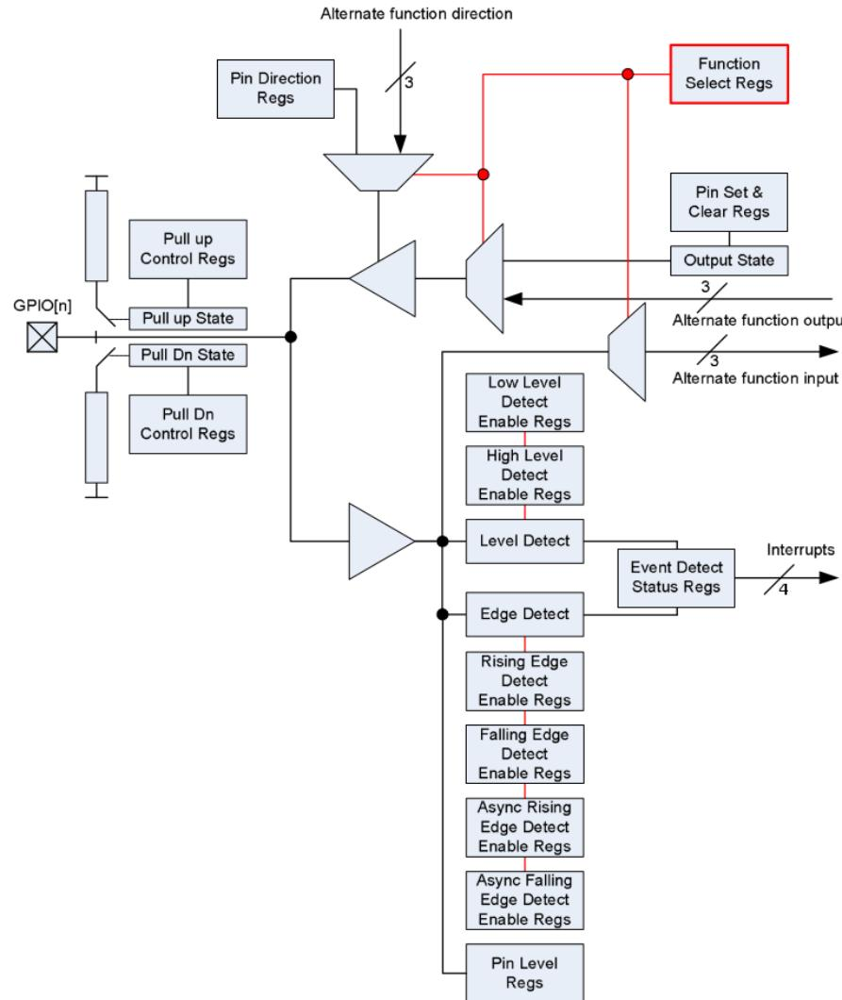


The GPIO peripheral has four dedicated interrupt lines. These lines are triggered by the setting of bits in the event detect status register. Each bank has its own interrupt line with the fourth line shared between all bits


The Alternate function table (Table 94) also has the pull state (pull-up/pull-down) which is applied after a power down.

## 5.2. Register View

The GPIO has the following registers. All accesses are assumed to be 32-bit. The GPIO register base address is 0x7e200000

<table><tr><td>Offset</td><td>Name</td><td>Description</td></tr><tr><td>0x00</td><td>GPFSEL0</td><td>GPIO Function Select 0</td></tr><tr><td>0x04</td><td>GPFSEL1</td><td>GPIO Function Select 1</td></tr><tr><td>0x08</td><td>GPFSEL2</td><td>GPIO Function Select 2</td></tr><tr><td>0x0c</td><td>GPFSEL3</td><td>GPIO Function Select 3</td></tr><tr><td>0x10</td><td>GPFSEL4</td><td>GPIO Function Select 4</td></tr><tr><td>0x14</td><td>GPFSEL5</td><td>GPIO Function Select 5</td></tr><tr><td>0x1c</td><td>GPSET0</td><td>GPIO Pin Output Set 0</td></tr><tr><td>0x20</td><td>GPSET1</td><td>GPIO Pin Output Set 1</td></tr><tr><td>0x28</td><td>GPCLR0</td><td>GPIO Pin Output Clear 0</td></tr><tr><td>0x2c</td><td>GPCLR1</td><td>GPIO Pin Output Clear 1</td></tr><tr><td>0x34</td><td>GPLEV0</td><td>GPIO Pin Level 0</td></tr><tr><td>0x38</td><td>GPLEV1</td><td>GPIO Pin Level 1</td></tr><tr><td>0x40</td><td>GPEDS0</td><td>GPIO Pin Event Detect Status 0</td></tr><tr><td>0x44</td><td>GPEDS1</td><td>GPIO Pin Event Detect Status 1</td></tr><tr><td>0x4c</td><td>GPREN0</td><td>GPIO Pin Rising Edge Detect Enable 0</td></tr><tr><td>0x50</td><td>GPREN1</td><td>GPIO Pin Rising Edge Detect Enable 1</td></tr><tr><td>0x58</td><td>GPFEN0</td><td>GPIO Pin Falling Edge Detect Enable 0</td></tr><tr><td>0x5c</td><td>GPFEN1</td><td>GPIO Pin Falling Edge Detect Enable 1</td></tr><tr><td>0x64</td><td>GPHEN0</td><td>GPIO Pin High Detect Enable 0</td></tr><tr><td>0x68</td><td>GPHEN1</td><td>GPIO Pin High Detect Enable 1</td></tr><tr><td>0x70</td><td>GPLEN0</td><td>GPIO Pin Low Detect Enable 0</td></tr><tr><td>0x74</td><td>GPLEN1</td><td>GPIO Pin Low Detect Enable 1</td></tr><tr><td>0x7c</td><td>GPAREN0</td><td>GPIO Pin Async. Rising Edge Detect 0</td></tr><tr><td>0x80</td><td>GPAREN1</td><td>GPIO Pin Async. Rising Edge Detect 1</td></tr><tr><td>0x88</td><td>GPAFEN0</td><td>GPIO Pin Async. Falling Edge Detect 0</td></tr><tr><td>0x8c</td><td>GPAFEN1</td><td>GPIO Pin Async. Falling Edge Detect 1</td></tr><tr><td>0xe4</td><td>GPIO_PUP_PDN_CNTRL_REG0</td><td>GPIO Pull-up / Pull-down Register 0</td></tr><tr><td>0xe8</td><td>GPIO_PUP_PDN_CNTRL_REG1</td><td>GPIO Pull-up / Pull-down Register 1</td></tr><tr><td>0xec</td><td>GPIO_PUP_PDN_CNTRL_REG2</td><td>GPIO Pull-up / Pull-down Register 2</td></tr><tr><td>0xf0</td><td>GPIO_PUP_PDN_CNTRL_REG3</td><td>GPIO Pull-up / Pull-down Register 3</td></tr></table>

## GPFSEL0 Register

Table 65. GPIO Alternate function select register 1

## Description

The function select registers are used to define the operation of the general-purpose I/O pins. Each of the 58 GPIO pins has at least two alternative functions as defined in Section 5.3. The FSELn field determines the functionality of the nth GPIO pin. All unused alternative function lines are tied to ground and will output a “0” if selected. All pins reset to normal GPIO input operation.

<table><tr><td>Bits</td><td>Name</td><td>Description</td><td>Type</td><td>Reset</td></tr><tr><td>31:30</td><td>Reserved.</td><td>-</td><td>-</td><td>-</td></tr><tr><td>29:27</td><td>FSEL9</td><td>FSEL9 - Function Select 9000 = GPIO Pin 9 is an input001 = GPIO Pin 9 is an output100 = GPIO Pin 9 takes alternate function 0101 = GPIO Pin 9 takes alternate function 1110 = GPIO Pin 9 takes alternate function 2111 = GPIO Pin 9 takes alternate function 3011 = GPIO Pin 9 takes alternate function 4010 = GPIO Pin 9 takes alternate function 5</td><td>RW</td><td>0x0</td></tr><tr><td>26:24</td><td>FSEL8</td><td>FSEL8 - Function Select 8</td><td>RW</td><td>0x0</td></tr><tr><td>23:21</td><td>FSEL7</td><td>FSEL7 - Function Select 7</td><td>RW</td><td>0x0</td></tr><tr><td>20:18</td><td>FSEL6</td><td>FSEL6 - Function Select 6</td><td>RW</td><td>0x0</td></tr><tr><td>17:15</td><td>FSEL5</td><td>FSEL5 - Function Select 5</td><td>RW</td><td>0x0</td></tr><tr><td>14:12</td><td>FSEL4</td><td>FSEL4 - Function Select 4</td><td>RW</td><td>0x0</td></tr><tr><td>11:9</td><td>FSEL3</td><td>FSEL3 - Function Select 3</td><td>RW</td><td>0x0</td></tr><tr><td>8:6</td><td>FSEL2</td><td>FSEL2 - Function Select 2</td><td>RW</td><td>0x0</td></tr><tr><td>5:3</td><td>FSEL1</td><td>FSEL1 - Function Select 1</td><td>RW</td><td>0x0</td></tr><tr><td>2:0</td><td>FSEL0</td><td>FSEL0 - Function Select 0</td><td>RW</td><td>0x0</td></tr></table>


GPFSEL1 Register


<table><tr><td>Bits</td><td>Name</td><td>Description</td><td>Type</td><td>Reset</td></tr><tr><td>31:30</td><td>Reserved.</td><td>-</td><td>-</td><td>-</td></tr><tr><td>29:27</td><td>FSEL19</td><td>FSEL19 - Function Select 19000 = GPIO Pin 19 is an input001 = GPIO Pin 19 is an output100 = GPIO Pin 19 takes alternate function 0101 = GPIO Pin 19 takes alternate function 1110 = GPIO Pin 19 takes alternate function 2111 = GPIO Pin 19 takes alternate function 3011 = GPIO Pin 19 takes alternate function 4010 = GPIO Pin 19 takes alternate function 5</td><td>RW</td><td>0x0</td></tr><tr><td>26:24</td><td>FSEL18</td><td>FSEL18 - Function Select 18</td><td>RW</td><td>0x0</td></tr><tr><td>23:21</td><td>FSEL17</td><td>FSEL17 - Function Select 17</td><td>RW</td><td>0x0</td></tr><tr><td>20:18</td><td>FSEL16</td><td>FSEL16 - Function Select 16</td><td>RW</td><td>0x0</td></tr><tr><td>17:15</td><td>FSEL15</td><td>FSEL15 - Function Select 15</td><td>RW</td><td>0x0</td></tr><tr><td>14:12</td><td>FSEL14</td><td>FSEL14 - Function Select 14</td><td>RW</td><td>0x0</td></tr><tr><td>11:9</td><td>FSEL13</td><td>FSEL13 - Function Select 13</td><td>RW</td><td>0x0</td></tr><tr><td>8:6</td><td>FSEL12</td><td>FSEL12 - Function Select 12</td><td>RW</td><td>0x0</td></tr><tr><td>5:3</td><td>FSEL11</td><td>FSEL11 - Function Select 11</td><td>RW</td><td>0x0</td></tr><tr><td>2:0</td><td>FSEL10</td><td>FSEL10 - Function Select 10</td><td>RW</td><td>0x0</td></tr></table>

## GPFSEL2 Register

<table><tr><td>Bits</td><td>Name</td><td>Description</td><td>Type</td><td>Reset</td></tr><tr><td>31:30</td><td>Reserved.</td><td>-</td><td>-</td><td>-</td></tr><tr><td>29:27</td><td>FSEL29</td><td>FSEL29 - Function Select 29000 = GPIO Pin 29 is an input001 = GPIO Pin 29 is an output100 = GPIO Pin 29 takes alternate function 0101 = GPIO Pin 29 takes alternate function 1110 = GPIO Pin 29 takes alternate function 2111 = GPIO Pin 29 takes alternate function 3011 = GPIO Pin 29 takes alternate function 4010 = GPIO Pin 29 takes alternate function 5</td><td>RW</td><td>0x0</td></tr><tr><td>26:24</td><td>FSEL28</td><td>FSEL28 - Function Select 28</td><td>RW</td><td>0x0</td></tr><tr><td>23:21</td><td>FSEL27</td><td>FSEL27 - Function Select 27</td><td>RW</td><td>0x0</td></tr><tr><td>20:18</td><td>FSEL26</td><td>FSEL26 - Function Select 26</td><td>RW</td><td>0x0</td></tr><tr><td>17:15</td><td>FSEL25</td><td>FSEL25 - Function Select 25</td><td>RW</td><td>0x0</td></tr><tr><td>14:12</td><td>FSEL24</td><td>FSEL24 - Function Select 24</td><td>RW</td><td>0x0</td></tr><tr><td>11:9</td><td>FSEL23</td><td>FSEL23 - Function Select 23</td><td>RW</td><td>0x0</td></tr><tr><td>8:6</td><td>FSEL22</td><td>FSEL22 - Function Select 22</td><td>RW</td><td>0x0</td></tr><tr><td>5:3</td><td>FSEL21</td><td>FSEL21 - Function Select 21</td><td>RW</td><td>0x0</td></tr><tr><td>2:0</td><td>FSEL20</td><td>FSEL20 - Function Select 20</td><td>RW</td><td>0x0</td></tr></table>


GPFSEL3 Register


Table 67. GPIO Alternate function select register 3


<table><tr><td>Bits</td><td>Name</td><td>Description</td><td>Type</td><td>Reset</td></tr><tr><td>31:30</td><td>Reserved.</td><td>-</td><td>-</td><td>-</td></tr><tr><td>29:27</td><td>FSEL39</td><td>FSEL39 - Function Select 39000 = GPIO Pin 39 is an input001 = GPIO Pin 39 is an output100 = GPIO Pin 39 takes alternate function 0101 = GPIO Pin 39 takes alternate function 1110 = GPIO Pin 39 takes alternate function 2111 = GPIO Pin 39 takes alternate function 3011 = GPIO Pin 39 takes alternate function 4010 = GPIO Pin 39 takes alternate function 5</td><td>RW</td><td>0x0</td></tr><tr><td>26:24</td><td>FSEL38</td><td>FSEL38 - Function Select 38</td><td>RW</td><td>0x0</td></tr><tr><td>23:21</td><td>FSEL37</td><td>FSEL37 - Function Select 37</td><td>RW</td><td>0x0</td></tr><tr><td>20:18</td><td>FSEL36</td><td>FSEL36 - Function Select 36</td><td>RW</td><td>0x0</td></tr><tr><td>17:15</td><td>FSEL35</td><td>FSEL35 - Function Select 35</td><td>RW</td><td>0x0</td></tr><tr><td>14:12</td><td>FSEL34</td><td>FSEL34 - Function Select 34</td><td>RW</td><td>0x0</td></tr><tr><td>11:9</td><td>FSEL33</td><td>FSEL33 - Function Select 33</td><td>RW</td><td>0x0</td></tr><tr><td>8:6</td><td>FSEL32</td><td>FSEL32 - Function Select 32</td><td>RW</td><td>0x0</td></tr><tr><td>5:3</td><td>FSEL31</td><td>FSEL31 - Function Select 31</td><td>RW</td><td>0x0</td></tr><tr><td>2:0</td><td>FSEL30</td><td>FSEL30 - Function Select 30</td><td>RW</td><td>0x0</td></tr></table>

## GPFSEL4 Register

<table><tr><td>Bits</td><td>Name</td><td>Description</td><td>Type</td><td>Reset</td></tr><tr><td>31:30</td><td>Reserved.</td><td>-</td><td>-</td><td>-</td></tr><tr><td>29:27</td><td>FSEL49</td><td>FSEL49 - Function Select 49000 = GPIO Pin 49 is an input001 = GPIO Pin 49 is an output100 = GPIO Pin 49 takes alternate function 0101 = GPIO Pin 49 takes alternate function 1110 = GPIO Pin 49 takes alternate function 2111 = GPIO Pin 49 takes alternate function 3011 = GPIO Pin 49 takes alternate function 4010 = GPIO Pin 49 takes alternate function 5</td><td>RW</td><td>0x0</td></tr><tr><td>26:24</td><td>FSEL48</td><td>FSEL48 - Function Select 48</td><td>RW</td><td>0x0</td></tr><tr><td>23:21</td><td>FSEL47</td><td>FSEL47 - Function Select 47</td><td>RW</td><td>0x0</td></tr><tr><td>20:18</td><td>FSEL46</td><td>FSEL46 - Function Select 46</td><td>RW</td><td>0x0</td></tr><tr><td>17:15</td><td>FSEL45</td><td>FSEL45 - Function Select 45</td><td>RW</td><td>0x0</td></tr><tr><td>14:12</td><td>FSEL44</td><td>FSEL44 - Function Select 44</td><td>RW</td><td>0x0</td></tr><tr><td>11:9</td><td>FSEL43</td><td>FSEL43 - Function Select 43</td><td>RW</td><td>0x0</td></tr><tr><td>8:6</td><td>FSEL42</td><td>FSEL42 - Function Select 42</td><td>RW</td><td>0x0</td></tr><tr><td>5:3</td><td>FSEL41</td><td>FSEL41 - Function Select 41</td><td>RW</td><td>0x0</td></tr><tr><td>2:0</td><td>FSEL40</td><td>FSEL40 - Function Select 40</td><td>RW</td><td>0x0</td></tr></table>

## GPFSEL5 Register

Table 69. GPIO Alternate function select register 5

<table><tr><td>Bits</td><td>Name</td><td>Description</td><td>Type</td><td>Reset</td></tr><tr><td>31:24</td><td>Reserved.</td><td>-</td><td>-</td><td>-</td></tr><tr><td>23:21</td><td>FSEL57</td><td>FSEL57 - Function Select 57000 = GPIO Pin 57 is an input001 = GPIO Pin 57 is an output100 = GPIO Pin 57 takes alternate function 0101 = GPIO Pin 57 takes alternate function 1110 = GPIO Pin 57 takes alternate function 2111 = GPIO Pin 57 takes alternate function 3011 = GPIO Pin 57 takes alternate function 4010 = GPIO Pin 57 takes alternate function 5</td><td>RW</td><td>0x0</td></tr><tr><td>20:18</td><td>FSEL56</td><td>FSEL56 - Function Select 56</td><td>RW</td><td>0x0</td></tr><tr><td>17:15</td><td>FSEL55</td><td>FSEL55 - Function Select 55</td><td>RW</td><td>0x0</td></tr><tr><td>14:12</td><td>FSEL54</td><td>FSEL54 - Function Select 54</td><td>RW</td><td>0x0</td></tr><tr><td>11:9</td><td>FSEL53</td><td>FSEL53 - Function Select 53</td><td>RW</td><td>0x0</td></tr><tr><td>8:6</td><td>FSEL52</td><td>FSEL52 - Function Select 52</td><td>RW</td><td>0x0</td></tr><tr><td>5:3</td><td>FSEL51</td><td>FSEL51 - Function Select 51</td><td>RW</td><td>0x0</td></tr><tr><td>2:0</td><td>FSEL50</td><td>FSEL50 - Function Select 50</td><td>RW</td><td>0x0</td></tr></table>

## GPSET0 Register

## Description

The output set registers are used to set a GPIO pin. The SETn field defines the respective GPIO pin to set, writing a “0” to the field has no effect. If the GPIO pin is being used as an input (by default) then the value in the SETn field is ignored. However, if the pin is subsequently defined as an output then the bit will be set according to the last set/clear operation. Separating the set and clear functions removes the need for read-modify-write operations

<table><tr><td>Bits</td><td>Name</td><td>Description</td><td>Type</td><td>Reset</td></tr><tr><td>31:0</td><td>SETn (n=0..31)</td><td>0 = No effect1 = Set GPIO pin n</td><td>WO</td><td>0x00000000</td></tr></table>

## GPSET1 Register

<table><tr><td>Bits</td><td>Name</td><td>Description</td><td>Type</td><td>Reset</td></tr><tr><td>31:26</td><td>Reserved.</td><td>-</td><td>-</td><td>-</td></tr><tr><td>25:0</td><td>SETn (n=32..57)</td><td>0 = No effect1 = Set GPIO pin n.</td><td>WO</td><td>0x0000000</td></tr></table>

## GPCLR0 Register

## Description

The output clear registers are used to clear a GPIO pin. The CLRn field defines the respective GPIO pin to clear, writing a “0” to the field has no effect. If the GPIO pin is being used as an input (by default) then the value in the CLRn field is ignored. However, if the pin is subsequently defined as an output then the bit will be set according to the last set/clear operation. Separating the set and clear functions removes the need for read-modify-write operations

<table><tr><td>Bits</td><td>Name</td><td>Description</td><td>Type</td><td>Reset</td></tr><tr><td>31:0</td><td>CLRn (n=0..31)</td><td>0 = No effect1 = Clear GPIO pin n</td><td>WO</td><td>0x00000000</td></tr></table>


GPCLR1 Register


<table><tr><td>Bits</td><td>Name</td><td>Description</td><td>Type</td><td>Reset</td></tr><tr><td>31:26</td><td>Reserved.</td><td>-</td><td>-</td><td>-</td></tr><tr><td>25:0</td><td>CLRn (n=32..57)</td><td>0 = No effect1 = Clear GPIO pin n</td><td>WO</td><td>0x0000000</td></tr></table>

## GPLEV0 Register

## Description

The pin level registers return the actual value of the pin. The LEVn field gives the value of the respective GPIO pin.

<table><tr><td>Bits</td><td>Name</td><td>Description</td><td>Type</td><td>Reset</td></tr><tr><td>31:0</td><td>LEVn (n=0..31)</td><td>0 = GPIO pin n is low1 = GPIO pin n is high</td><td>RO</td><td>0x00000000</td></tr></table>

## GPLEV1 Register

<table><tr><td>Bits</td><td>Name</td><td>Description</td><td>Type</td><td>Reset</td></tr><tr><td>31:26</td><td>Reserved.</td><td>-</td><td>-</td><td>-</td></tr><tr><td>25:0</td><td>LEVn (n=32..57)</td><td>0 = GPIO pin n is low1 = GPIO pin n is high</td><td>RO</td><td>0x0000000</td></tr></table>

## GPEDS0 Register

## Description

The event detect status registers are used to record level and edge events on the GPIO pins. The relevant bit in the event detect status registers is set whenever: 1) an edge is detected that matches the type of edge programmed in the rising/falling edge detect enable registers, or 2) a level is detected that matches the type of level programmed i the high/low level detect enable registers. The bit is cleared by writing a “1” to the relevant bit.

The interrupt controller can be programmed to interrupt the processor when any of the status bits are set. The GPIO peripheral has four dedicated interrupt lines.

Each GPIO bank can generate an independent interrupt. The fourth line generates a single interrupt whenever any bit is set.

<table><tr><td>Bits</td><td>Name</td><td>Description</td><td>Type</td><td>Reset</td></tr><tr><td>31:0</td><td>EDSn (n=0..31)</td><td>0 = Event not detected on GPIO pin n1 = Event detected on GPIO pin n</td><td>W1C</td><td>0x00000000</td></tr></table>

## GPEDS1 Register

<table><tr><td>Bits</td><td>Name</td><td>Description</td><td>Type</td><td>Reset</td></tr><tr><td>31:26</td><td>Reserved.</td><td>-</td><td>-</td><td>-</td></tr><tr><td>25:0</td><td>EDSn (n=32..57)</td><td>0 = Event not detected on GPIO pin n1 = Event detected on GPIO pin n</td><td>W1C</td><td>0x0000000</td></tr></table>

## GPREN0 Register

## Description

The rising edge detect enable registers define the pins for which a rising edge transition sets a bit in the event detect status registers (GPEDSn). When the relevant bits are set in both the GPRENn and GPFENn registers, any transition ( to 0 and 0 to 1) will set a bit in the GPEDSn registers. The GPRENn registers use synchronous edge detection. This means the input signal is sampled using the system clock and then it is looking for a “011” pattern on the sampled signal. This has the effect of suppressing glitches.

<table><tr><td>Bits</td><td>Name</td><td>Description</td><td>Type</td><td>Reset</td></tr><tr><td>31:0</td><td>RENn (n=0..31)</td><td>0 = Rising edge detect disabled on GPIO pin n1 = Rising edge on GPIO pin n sets corresponding bit in GPEDS0</td><td>RW</td><td>0x00000000</td></tr></table>

## GPREN1 Register

<table><tr><td>Bits</td><td>Name</td><td>Description</td><td>Type</td><td>Reset</td></tr><tr><td>31:26</td><td>Reserved.</td><td>-</td><td>-</td><td>-</td></tr><tr><td>25:0</td><td>RENn (n=32..57)</td><td>0 = Rising edge detect disabled on GPIO pin n1 = Rising edge on GPIO pin n sets corresponding bit in GPEDS1</td><td>RW</td><td>0x0000000</td></tr></table>

## GPFEN0 Register

## Description

The falling edge detect enable registers define the pins for which a falling edge transition sets a bit in the event detect status registers (GPEDSn). When the relevant bits are set in both the GPRENn and GPFENn registers, any transition ( to 0 and 0 to 1) will set a bit in the GPEDSn registers. The GPFENn registers use synchronous edge detection. Thi means the input signal is sampled using the system clock and then it is looking for a “100” pattern on the sampled signal. This has the effect of suppressing glitches.

<table><tr><td>Bits</td><td>Name</td><td>Description</td><td>Type</td><td>Reset</td></tr><tr><td>31:0</td><td>FENn (n=0..31)</td><td>0 = Falling edge detect disabled on GPIO pin n1 = Falling edge on GPIO pin n sets corresponding bit in GPEDS0</td><td>RW</td><td>0x00000000</td></tr></table>

## GPFEN1 Register

<table><tr><td>Bits</td><td>Name</td><td>Description</td><td>Type</td><td>Reset</td></tr><tr><td>31:26</td><td>Reserved.</td><td>-</td><td>-</td><td>-</td></tr><tr><td>25:0</td><td>FENn (n=32..57)</td><td>0 = Falling edge detect disabled on GPIO pin n1 = Falling edge on GPIO pin n sets corresponding bit in GPEDS1</td><td>RW</td><td>0x0000000</td></tr></table>

## GPHEN0 Register

## Description

The high level detect enable registers define the pins for which a high level sets a bit in the event detect status register (GPEDSn). If the pin is still high when an attempt is made to clear the status bit in GPEDSn then the status bit will remain set.

<table><tr><td>Bits</td><td>Name</td><td>Description</td><td>Type</td><td>Reset</td></tr><tr><td>31:0</td><td>HENn (n=0..31)</td><td>0 = High detect disabled on GPIO pin n1 = High on GPIO pin n sets corresponding bit in GPEDS0</td><td>RW</td><td>0x00000000</td></tr></table>

## GPHEN1 Register

Table 83. GPIO High Detect Status Register 1

<table><tr><td>Bits</td><td>Name</td><td>Description</td><td>Type</td><td>Reset</td></tr><tr><td>31:26</td><td>Reserved.</td><td>-</td><td>-</td><td>-</td></tr><tr><td>25:0</td><td>HENn (n=32..57)</td><td>0 = High detect disabled on GPIO pin n1 = High on GPIO pin n sets corresponding bit in GPEDS1</td><td>RW</td><td>0x0000000</td></tr></table>

## GPLEN0 Register

## Description

The low level detect enable registers define the pins for which a low level sets a bit in the event detect status register (GPEDSn). If the pin is still low when an attempt is made to clear the status bit in GPEDSn then the status bit wil remain set.

<table><tr><td>Bits</td><td>Name</td><td>Description</td><td>Type</td><td>Reset</td></tr><tr><td>31:0</td><td>LENn (n=0..31)</td><td>0 = Low detect disabled on GPIO pin n1 = Low on GPIO pin n sets corresponding bit in GPEDS0</td><td>RW</td><td>0x00000000</td></tr></table>

## GPLEN1 Register

<table><tr><td>Bits</td><td>Name</td><td>Description</td><td>Type</td><td>Reset</td></tr><tr><td>31:26</td><td>Reserved.</td><td>-</td><td>-</td><td>-</td></tr><tr><td>25:0</td><td>LENn (n=32..57)</td><td>0 = Low detect disabled on GPIO pin n1 = Low on GPIO pin n sets corresponding bit in GPEDS1</td><td>RW</td><td>0x0000000</td></tr></table>

## GPAREN0 Register

## Description

The asynchronous rising edge detect enable registers define the pins for which an asynchronous rising edge transition sets a bit in the event detect status registers (GPEDSn)

Asynchronous means the incoming signal is not sampled by the system clock. As such rising edges of very short duration can be detected.

<table><tr><td>Bits</td><td>Name</td><td>Description</td><td>Type</td><td>Reset</td></tr><tr><td>31:0</td><td>ARENn (n=0..31)</td><td>0 = Asynchronous rising edge detect disabled on GPIO pin n1 = Asynchronous rising edge on GPIO pin n sets corresponding bit in GPEDS0</td><td>RW</td><td>0x00000000</td></tr></table>

## GPAREN1 Register

<table><tr><td>Bits</td><td>Name</td><td>Description</td><td>Type</td><td>Reset</td></tr><tr><td>31:26</td><td>Reserved.</td><td>-</td><td>-</td><td>-</td></tr><tr><td>25:0</td><td>ARENn (n=32..57)</td><td>0 = Asynchronous rising edge detect disabled on GPIO pin n1 = Asynchronous rising edge on GPIO pin n sets corresponding bit in GPEDS1</td><td>RW</td><td>0x0000000</td></tr></table>

## GPAFEN0 Register

## Description

The asynchronous falling edge detect enable registers define the pins for which an asynchronous falling edge transition sets a bit in the event detect status registers (GPEDSn). Asynchronous means the incoming signal is not sampled by the system clock. As such falling edges of very short duration can be detected.

<table><tr><td>Bits</td><td>Name</td><td>Description</td><td>Type</td><td>Reset</td></tr><tr><td>31:0</td><td>AFENn (n=0..31)</td><td>0 = Asynchronous falling edge detect disabled on GPIO pin n1 = Asynchronous falling edge on GPIO pin n sets corresponding bit in GPEDS0</td><td>RW</td><td>0x00000000</td></tr></table>

## GPAFEN1 Register

<table><tr><td>Bits</td><td>Name</td><td>Description</td><td>Type</td><td>Reset</td></tr><tr><td>31:26</td><td>Reserved.</td><td>-</td><td>-</td><td>-</td></tr><tr><td>25:0</td><td>AFENn (n=32..57)</td><td>0 = Asynchronous falling edge detect disabled on GPIO pin n1 = Asynchronous falling edge on GPIO pin n sets corresponding bit in GPEDS1</td><td>RW</td><td>0x0000000</td></tr></table>

## GPIO_PUP_PDN_CNTRL_REG0 Register

## Description

The GPIO Pull-up / Pull-down Registers control the actuation of the internal pull-up/down resistors. Reading these registers gives the current pull-state.

The Alternate function table also has the pull state which is applied after a power down.

<table><tr><td>Bits</td><td>Name</td><td>Description</td><td>Type</td><td>Reset</td></tr><tr><td>31:30</td><td>GPIO_PUP_PDN_CNTRL15</td><td>Resistor Select for GPIO1500 = No resistor is selected01 = Pull up resistor is selected10 = Pull down resistor is selected11 = Reserved</td><td>RW</td><td>0x2</td></tr><tr><td>29:28</td><td>GPIO_PUP_PDN_CNTRL14</td><td>Resistor Select for GPIO14</td><td>RW</td><td>0x2</td></tr><tr><td>27:26</td><td>GPIO_PUP_PDN_CNTRL13</td><td>Resistor Select for GPIO13</td><td>RW</td><td>0x2</td></tr><tr><td>25:24</td><td>GPIO_PUP_PDN_CNTRL12</td><td>Resistor Select for GPIO12</td><td>RW</td><td>0x2</td></tr><tr><td>23:22</td><td>GPIO_PUP_PDN_CNTRL11</td><td>Resistor Select for GPIO11</td><td>RW</td><td>0x2</td></tr><tr><td>21:20</td><td>GPIO_PUP_PDN_CNTRL10</td><td>Resistor Select for GPIO10</td><td>RW</td><td>0x2</td></tr><tr><td>19:18</td><td>GPIO_PUP_PDN_CNTRL09</td><td>Resistor Select for GPIO09</td><td>RW</td><td>0x2</td></tr><tr><td>17:16</td><td>GPIO_PUP_PDN_CNTRL08</td><td>Resistor Select for GPIO08</td><td>RW</td><td>0x1</td></tr><tr><td>15:14</td><td>GPIO_PUP_PDN_CNTRL07</td><td>Resistor Select for GPIO07</td><td>RW</td><td>0x1</td></tr><tr><td>13:12</td><td>GPIO_PUP_PDN_CNTRL06</td><td>Resistor Select for GPIO06</td><td>RW</td><td>0x1</td></tr><tr><td>11:10</td><td>GPIO_PUP_PDN_CNTRL05</td><td>Resistor Select for GPIO05</td><td>RW</td><td>0x1</td></tr><tr><td>09:08</td><td>GPIO_PUP_PDN_CNTRL04</td><td>Resistor Select for GPIO04</td><td>RW</td><td>0x1</td></tr><tr><td>07:06</td><td>GPIO_PUP_PDN_CNTRL03</td><td>Resistor Select for GPIO03</td><td>RW</td><td>0x1</td></tr><tr><td>05:04</td><td>GPIO_PUP_PDN_CNTRL02</td><td>Resistor Select for GPIO02</td><td>RW</td><td>0x1</td></tr><tr><td>03:02</td><td>GPIO_PUP_PDN_CNTRL01</td><td>Resistor Select for GPIO01</td><td>RW</td><td>0x1</td></tr><tr><td>01:00</td><td>GPIO_PUP_PDN_CNTRL00</td><td>Resistor Select for GPIO00</td><td>RW</td><td>0x1</td></tr></table>

GPIO_PUP_PDN_CNTRL_REG1 Register


Table 91. GPIO Pull-up / Pull-down Register 1


<table><tr><td>Bits</td><td>Name</td><td>Description</td><td>Type</td><td>Reset</td></tr><tr><td>31:30</td><td>GPIO_PUP_PDN_CNTRL31</td><td>Resistor Select for GPIO3100 = No resistor is selected01 = Pull up resistor is selected10 = Pull down resistor is selected11 = Reserved</td><td>RW</td><td>0x2</td></tr><tr><td>29:28</td><td>GPIO_PUP_PDN_CNTRL30</td><td>Resistor Select for GPIO30</td><td>RW</td><td>0x2</td></tr><tr><td>27:26</td><td>GPIO_PUP_PDN_CNTRL29</td><td>Resistor Select for GPIO29</td><td>RW</td><td>0x0</td></tr><tr><td>25:24</td><td>GPIO_PUP_PDN_CNTRL28</td><td>Resistor Select for GPIO28</td><td>RW</td><td>0x0</td></tr><tr><td>23:22</td><td>GPIO_PUP_PDN_CNTRL27</td><td>Resistor Select for GPIO27</td><td>RW</td><td>0x2</td></tr><tr><td>21:20</td><td>GPIO_PUP_PDN_CNTRL26</td><td>Resistor Select for GPIO26</td><td>RW</td><td>0x2</td></tr><tr><td>19:18</td><td>GPIO_PUP_PDN_CNTRL25</td><td>Resistor Select for GPIO25</td><td>RW</td><td>0x2</td></tr><tr><td>17:16</td><td>GPIO_PUP_PDN_CNTRL24</td><td>Resistor Select for GPIO24</td><td>RW</td><td>0x2</td></tr><tr><td>15:14</td><td>GPIO_PUP_PDN_CNTRL23</td><td>Resistor Select for GPIO23</td><td>RW</td><td>0x2</td></tr><tr><td>13:12</td><td>GPIO_PUP_PDN_CNTRL22</td><td>Resistor Select for GPIO22</td><td>RW</td><td>0x2</td></tr><tr><td>11:10</td><td>GPIO_PUP_PDN_CNTRL21</td><td>Resistor Select for GPIO21</td><td>RW</td><td>0x2</td></tr><tr><td>09:08</td><td>GPIO_PUP_PDN_CNTRL20</td><td>Resistor Select for GPIO20</td><td>RW</td><td>0x2</td></tr><tr><td>07:06</td><td>GPIO_PUP_PDN_CNTRL19</td><td>Resistor Select for GPIO19</td><td>RW</td><td>0x2</td></tr><tr><td>05:04</td><td>GPIO_PUP_PDN_CNTRL18</td><td>Resistor Select for GPIO18</td><td>RW</td><td>0x2</td></tr><tr><td>03:02</td><td>GPIO_PUP_PDN_CNTRL17</td><td>Resistor Select for GPIO17</td><td>RW</td><td>0x2</td></tr><tr><td>01:00</td><td>GPIO_PUP_PDN_CNTRL16</td><td>Resistor Select for GPIO16</td><td>RW</td><td>0x2</td></tr></table>

## GPIO_PUP_PDN_CNTRL_REG2 Register

Table 92. GPIO Pull-up / Pull-down Register 2

<table><tr><td>Bits</td><td>Name</td><td>Description</td><td>Type</td><td>Reset</td></tr><tr><td>31:30</td><td>GPIO_PUP_PDN_CNTRL47</td><td>Resistor Select for GPIO4700 = No resistor is selected01 = Pull up resistor is selected10 = Pull down resistor is selected11 = Reserved</td><td>RW</td><td>0x1</td></tr><tr><td>29:28</td><td>GPIO_PUP_PDN_CNTRL46</td><td>Resistor Select for GPIO46</td><td>RW</td><td>0x1</td></tr><tr><td>27:26</td><td>GPIO_PUP_PDN_CNTRL45</td><td>Resistor Select for GPIO45</td><td>RW</td><td>0x0</td></tr><tr><td>25:24</td><td>GPIO_PUP_PDN_CNTRL44</td><td>Resistor Select for GPIO44</td><td>RW</td><td>0x0</td></tr><tr><td>23:22</td><td>GPIO_PUP_PDN_CNTRL43</td><td>Resistor Select for GPIO43</td><td>RW</td><td>0x2</td></tr><tr><td>21:20</td><td>GPIO_PUP_PDN_CNTRL42</td><td>Resistor Select for GPIO42</td><td>RW</td><td>0x2</td></tr><tr><td>19:18</td><td>GPIO_PUP_PDN_CNTRL41</td><td>Resistor Select for GPIO41</td><td>RW</td><td>0x2</td></tr><tr><td>17:16</td><td>GPIO_PUP_PDN_CNTRL40</td><td>Resistor Select for GPIO40</td><td>RW</td><td>0x2</td></tr><tr><td>15:14</td><td>GPIO_PUP_PDN_CNTRL39</td><td>Resistor Select for GPIO39</td><td>RW</td><td>0x2</td></tr><tr><td>13:12</td><td>GPIO_PUP_PDN_CNTRL38</td><td>Resistor Select for GPIO38</td><td>RW</td><td>0x2</td></tr><tr><td>11:10</td><td>GPIO_PUP_PDN_CNTRL37</td><td>Resistor Select for GPIO37</td><td>RW</td><td>0x2</td></tr><tr><td>09:08</td><td>GPIO_PUP_PDN_CNTRL36</td><td>Resistor Select for GPIO36</td><td>RW</td><td>0x1</td></tr><tr><td>07:06</td><td>GPIO_PUP_PDN_CNTRL35</td><td>Resistor Select for GPIO35</td><td>RW</td><td>0x1</td></tr><tr><td>05:04</td><td>GPIO_PUP_PDN_CNTRL34</td><td>Resistor Select for GPIO34</td><td>RW</td><td>0x1</td></tr><tr><td>03:02</td><td>GPIO_PUP_PDN_CNTRL33</td><td>Resistor Select for GPIO33</td><td>RW</td><td>0x2</td></tr><tr><td>01:00</td><td>GPIO_PUP_PDN_CNTRL32</td><td>Resistor Select for GPIO32</td><td>RW</td><td>0x2</td></tr></table>

## GPIO_PUP_PDN_CNTRL_REG3 Register

Table 93. GPIO Pull-up / Pull-down Register 3

<table><tr><td>Bits</td><td>Name</td><td>Description</td><td>Type</td><td>Reset</td></tr><tr><td>31:20</td><td>Reserved.</td><td>-</td><td>-</td><td>-</td></tr><tr><td>19:18</td><td>GPIO_PUP_PDN_CNTRL57</td><td>Resistor Select for GPIO5700 = No resistor is selected01 = Pull up resistor is selected10 = Pull down resistor is selected11 = Reserved</td><td>RW</td><td>0x1</td></tr><tr><td>17:16</td><td>GPIO_PUP_PDN_CNTRL56</td><td>Resistor Select for GPIO56</td><td>RW</td><td>0x1</td></tr><tr><td>15:14</td><td>GPIO_PUP_PDN_CNTRL55</td><td>Resistor Select for GPIO55</td><td>RW</td><td>0x1</td></tr><tr><td>13:12</td><td>GPIO_PUP_PDN_CNTRL54</td><td>Resistor Select for GPIO54</td><td>RW</td><td>0x1</td></tr><tr><td>11:10</td><td>GPIO_PUP_PDN_CNTRL53</td><td>Resistor Select for GPIO53</td><td>RW</td><td>0x1</td></tr><tr><td>09:08</td><td>GPIO_PUP_PDN_CNTRL52</td><td>Resistor Select for GPIO52</td><td>RW</td><td>0x1</td></tr><tr><td>07:06</td><td>GPIO_PUP_PDN_CNTRL51</td><td>Resistor Select for GPIO51</td><td>RW</td><td>0x1</td></tr><tr><td>05:04</td><td>GPIO_PUP_PDN_CNTRL50</td><td>Resistor Select for GPIO50</td><td>RW</td><td>0x1</td></tr><tr><td>03:02</td><td>GPIO_PUP_PDN_CNTRL49</td><td>Resistor Select for GPIO49</td><td>RW</td><td>0x1</td></tr><tr><td>01:00</td><td>GPIO_PUP_PDN_CNTRL48</td><td>Resistor Select for GPIO48</td><td>RW</td><td>0x1</td></tr></table>

## 5.3. Alternative Function Assignments

Every GPIO pin can carry an alternate function. Up to 6 alternate functions are available but not every pin has that many alternate functions. The table below gives a quick overview.

<table><tr><td>GPIO</td><td>Pull</td><td>ALT0</td><td>ALT1</td><td>ALT2</td><td>ALT3</td><td>ALT4</td><td>ALT5</td></tr><tr><td>GPIO0</td><td>High</td><td>SDA0</td><td>SA5</td><td>PCLK</td><td>SPI3_CE0_N</td><td>TXD2</td><td>SDA6</td></tr><tr><td>GPIO1</td><td>High</td><td>SCL0</td><td>SA4</td><td>DE</td><td>SPI3_MISO</td><td>RXD2</td><td>SCL6</td></tr><tr><td>GPIO2</td><td>High</td><td>SDA1</td><td>SA3</td><td>LCD_VSYNC</td><td>SPI3_MOSI</td><td>CTS2</td><td>SDA3</td></tr><tr><td>GPIO3</td><td>High</td><td>SCL1</td><td>SA2</td><td>LCD_HSYNC</td><td>SPI3_SCLK</td><td>RTS2</td><td>SCL3</td></tr><tr><td>GPIO4</td><td>High</td><td>GPCLK0</td><td>SA1</td><td>DPI_D0</td><td>SPI4_CE0_N</td><td>TXD3</td><td>SDA3</td></tr><tr><td>GPIO5</td><td>High</td><td>GPCLK1</td><td>SA0</td><td>DPI_D1</td><td>SPI4_MISO</td><td>RXD3</td><td>SCL3</td></tr><tr><td>GPIO6</td><td>High</td><td>GPCLK2</td><td>SOE_N / SE</td><td>DPI_D2</td><td>SPI4_MOSI</td><td>CTS3</td><td>SDA4</td></tr><tr><td>GPIO7</td><td>High</td><td>SPI0_CE1_N</td><td>SWE_N / SRW_N</td><td>DPI_D3</td><td>SPI4_SCLK</td><td>RTS3</td><td>SCL4</td></tr><tr><td>GPIO8</td><td>High</td><td>SPI0_CE0_N</td><td>SD0</td><td>DPI_D4</td><td>BSCSL / CE_N</td><td>TXD4</td><td>SDA4</td></tr><tr><td>GPIO9</td><td>Low</td><td>SPI0_MISO</td><td>SD1</td><td>DPI_D5</td><td>BSCSL / MISO</td><td>RXD4</td><td>SCL4</td></tr><tr><td>GPIO10</td><td>Low</td><td>SPI0_MOSI</td><td>SD2</td><td>DPI_D6</td><td>BSCSL SDA / MOSI</td><td>CTS4</td><td>SDA5</td></tr><tr><td>GPIO11</td><td>Low</td><td>SPI0_SCLK</td><td>SD3</td><td>DPI_D7</td><td>BSCSL SCL / SCLK</td><td>RTS4</td><td>SCL5</td></tr><tr><td>GPIO12</td><td>Low</td><td>PWM0_0</td><td>SD4</td><td>DPI_D8</td><td>SPI5_CE0_N</td><td>TXD5</td><td>SDA5</td></tr><tr><td>GPIO13</td><td>Low</td><td>PWM0_1</td><td>SD5</td><td>DPI_D9</td><td>SPI5_MISO</td><td>RXD5</td><td>SCL5</td></tr><tr><td>GPIO14</td><td>Low</td><td>TXD0</td><td>SD6</td><td>DPI_D10</td><td>SPI5_MOSI</td><td>CTS5</td><td>TXD1</td></tr><tr><td>GPIO15</td><td>Low</td><td>RXD0</td><td>SD7</td><td>DPI_D11</td><td>SPI5_SCLK</td><td>RTS5</td><td>RXD1</td></tr><tr><td>GPIO16</td><td>Low</td><td></td><td>SD8</td><td>DPI_D12</td><td>CTS0</td><td>SPI1_CE2_N</td><td>CTS1</td></tr><tr><td>GPIO17</td><td>Low</td><td></td><td>SD9</td><td>DPI_D13</td><td>RTS0</td><td>SPI1_CE1_N</td><td>RTS1</td></tr><tr><td>GPIO18</td><td>Low</td><td>PCM_CLK</td><td>SD10</td><td>DPI_D14</td><td>SPI6_CE0_N</td><td>SPI1_CE0_N</td><td>PWM0_0</td></tr><tr><td>GPIO19</td><td>Low</td><td>PCM_FS</td><td>SD11</td><td>DPI_D15</td><td>SPI6_MISO</td><td>SPI1_MISO</td><td>PWM0_1</td></tr><tr><td>GPIO20</td><td>Low</td><td>PCM_DIN</td><td>SD12</td><td>DPI_D16</td><td>SPI6_MOSI</td><td>SPI1_MOSI</td><td>GPCLK0</td></tr><tr><td>GPIO21</td><td>Low</td><td>PCM_DOUT</td><td>SD13</td><td>DPI_D17</td><td>SPI6_SCLK</td><td>SPI1_SCLK</td><td>GPCLK1</td></tr><tr><td>GPIO22</td><td>Low</td><td>SD0_CLK</td><td>SD14</td><td>DPI_D18</td><td>SD1_CLK</td><td>ARM_TRST</td><td>SDA6</td></tr><tr><td>GPIO23</td><td>Low</td><td>SD0_CMD</td><td>SD15</td><td>DPI_D19</td><td>SD1_CMD</td><td>ARM_RTCK</td><td>SCL6</td></tr><tr><td>GPIO24</td><td>Low</td><td>SD0_DAT0</td><td>SD16</td><td>DPI_D20</td><td>SD1_DAT0</td><td>ARM_TDO</td><td>SPI3_CE1_N</td></tr><tr><td>GPIO25</td><td>Low</td><td>SD0_DAT1</td><td>SD17</td><td>DPI_D21</td><td>SD1_DAT1</td><td>ARM_TCK</td><td>SPI4_CE1_N</td></tr><tr><td>GPIO26</td><td>Low</td><td>SD0_DAT2</td><td></td><td>DPI_D22</td><td>SD1_DAT2</td><td>ARM_TDI</td><td>SPI5_CE1_N</td></tr><tr><td>GPIO27</td><td>Low</td><td>SD0_DAT3</td><td></td><td>DPI_D23</td><td>SD1_DAT3</td><td>ARM_TMS</td><td>SPI6_CE1_N</td></tr><tr><td>GPIO28</td><td>-</td><td>SDA0</td><td>SA5</td><td>PCM_CLK</td><td></td><td>MIL_A_RX_ERR</td><td>RGMII_MDIO</td></tr><tr><td>GPIO29</td><td>-</td><td>SCL0</td><td>SA4</td><td>PCM_FS</td><td></td><td>MIL_A_TX_ERR</td><td>RGMII_MDC</td></tr><tr><td>GPIO30</td><td>Low</td><td></td><td>SA3</td><td>PCM_DIN</td><td>CTS0</td><td>MIL_A_CRS</td><td>CTS1</td></tr><tr><td>GPIO31</td><td>Low</td><td></td><td>SA2</td><td>PCM_DOUT</td><td>RTS0</td><td>MIL_A_COL</td><td>RTS1</td></tr><tr><td>GPIO32</td><td>Low</td><td>GPCLK0</td><td>SA1</td><td></td><td>TXD0</td><td>SD_CARD_PRE S</td><td>TXD1</td></tr><tr><td>GPIO33</td><td>Low</td><td></td><td>SA0</td><td></td><td>RXD0</td><td>SD_CARD_WR PROT</td><td>RXD1</td></tr><tr><td>GPIO34</td><td>High</td><td>GPCLK0</td><td>SOE_N / SE</td><td></td><td>SD1_CLK</td><td>SD_CARD_LED</td><td>RGMII_IRQ</td></tr><tr><td>GPIO35</td><td>High</td><td>SPI0_CE1_N</td><td>SWE_N / SRW_N</td><td></td><td>SD1_CMD</td><td>RGMII_START_STOP</td><td></td></tr><tr><td>GPIO36</td><td>High</td><td>SPI0_CE0_N</td><td>SD0</td><td>TXD0</td><td>SD1_DAT0</td><td>RGMII_RX_OK</td><td>MIL_A_RX_ERR</td></tr><tr><td>GPIO37</td><td>Low</td><td>SPI0_MISO</td><td>SD1</td><td>RXD0</td><td>SD1_DAT1</td><td>RGMII_MDIO</td><td>MII_A_TX_ERR</td></tr><tr><td>GPIO38</td><td>Low</td><td>SPI0_MOSI</td><td>SD2</td><td>RTS0</td><td>SD1_DAT2</td><td>RGMII_MDC</td><td>MII_A_CRS</td></tr><tr><td>GPIO39</td><td>Low</td><td>SPI0_SCLK</td><td>SD3</td><td>CTS0</td><td>SD1_DAT3</td><td>RGMII_IRQ</td><td>MII_A_COL</td></tr><tr><td>GPIO40</td><td>Low</td><td>PWM1_0</td><td>SD4</td><td></td><td>SD1_DAT4</td><td>SPI0_MISO</td><td>TXD1</td></tr><tr><td>GPIO41</td><td>Low</td><td>PWM1_1</td><td>SD5</td><td></td><td>SD1_DAT5</td><td>SPI0_MOSI</td><td>RXD1</td></tr><tr><td>GPIO42</td><td>Low</td><td>GPCLK1</td><td>SD6</td><td></td><td>SD1_DAT6</td><td>SPI0_SCLK</td><td>RTS1</td></tr><tr><td>GPIO43</td><td>Low</td><td>GPCLK2</td><td>SD7</td><td></td><td>SD1_DAT7</td><td>SPI0_CE0_N</td><td>CTS1</td></tr><tr><td>GPIO44</td><td>-</td><td>GPCLK1</td><td>SDA0</td><td>SDA1</td><td></td><td>SPI0_CE1_N</td><td>SD_CARD_VOL T</td></tr><tr><td>GPIO45</td><td>-</td><td>PWM0_1</td><td>SCL0</td><td>SCL1</td><td></td><td>SPI0_CE2_N</td><td>SD_CARD_PW R0</td></tr><tr><td>GPIO46</td><td>High</td><td></td><td></td><td></td><td></td><td></td><td></td></tr><tr><td>GPIO47</td><td>High</td><td></td><td></td><td></td><td></td><td></td><td></td></tr><tr><td>GPIO48</td><td>High</td><td></td><td></td><td></td><td></td><td></td><td></td></tr><tr><td>GPIO49</td><td>High</td><td></td><td></td><td></td><td></td><td></td><td></td></tr><tr><td>GPIO50</td><td>High</td><td></td><td></td><td></td><td></td><td></td><td></td></tr><tr><td>GPIO51</td><td>High</td><td></td><td></td><td></td><td></td><td></td><td></td></tr><tr><td>GPIO52</td><td>High</td><td></td><td></td><td></td><td></td><td></td><td></td></tr><tr><td>GPIO53</td><td>High</td><td></td><td></td><td></td><td></td><td></td><td></td></tr><tr><td>GPIO54</td><td>High</td><td></td><td></td><td></td><td></td><td></td><td></td></tr><tr><td>GPIO55</td><td>High</td><td></td><td></td><td></td><td></td><td></td><td></td></tr><tr><td>GPIO56</td><td>High</td><td></td><td></td><td></td><td></td><td></td><td></td></tr><tr><td>GPIO57</td><td>High</td><td></td><td></td><td></td><td></td><td></td><td></td></tr></table>

Entries which are white should not be used. These may have unexpected results as some of these have special functions used in test mode e.g. they may drive the output with high frequency signals.


Special function legend


<table><tr><td>Name</td><td>Function</td><td>See section</td></tr><tr><td>SDA0</td><td>BSCamaster 0 data line</td><td>BSC</td></tr><tr><td>SCL0</td><td>BSC master 0 clock line</td><td>BSC</td></tr><tr><td>SDAx</td><td>BSC master 1,3,4,5,6bdata line</td><td>BSC</td></tr><tr><td>SCLx</td><td>BSC master 1,3,4,5,6 clock line</td><td>BSC</td></tr><tr><td>GPCLKx</td><td>General purpose Clock 0,1,2</td><td>General Purpose GPIO Clocks</td></tr><tr><td>SPIx_CE2_N</td><td>SPI 0,3,4,5,6 Chip select 2</td><td>SPI</td></tr><tr><td>SPIx_CE1_N</td><td>SPI 0,3,4,5,6 Chip select 1</td><td>SPI</td></tr><tr><td>SPIx_CE0_N</td><td>SPI 0,3,4,5,6 Chip select 0</td><td>SPI</td></tr><tr><td>SPIx_MISO</td><td>SPI 0,3,4,5,6 MISO</td><td>SPI</td></tr><tr><td>SPIx_MOSI</td><td>SPI 0,3,4,5,6 MOSI</td><td>SPI</td></tr><tr><td>SPIx_SCLK</td><td>SPI 0,3,4,5,6 Serial clock</td><td>SPI</td></tr><tr><td>PWMx_0</td><td>PWM 0,1 channel 0</td><td>Pulse Width Modulator</td></tr><tr><td>PWMx_1</td><td>PWM 0,1 channel 1</td><td>Pulse Width Modulator</td></tr><tr><td>TXDx</td><td>UART 0,2,3,4,5 Transmit Data</td><td>UART</td></tr><tr><td>RXDx</td><td>UART 0,2,3,4,5 Receive Data</td><td>UART</td></tr><tr><td>CTSx</td><td>UART 0,2,3,4,5 Clear To Send</td><td>UART</td></tr><tr><td>RTSx</td><td>UART 0,2,3,4,5 Request To Send</td><td>UART</td></tr><tr><td>PCM_CLK</td><td>PCM clock</td><td>PCM Audio</td></tr><tr><td>PCM_FS</td><td>PCM Frame Sync</td><td>PCM Audio</td></tr><tr><td>PCM_DIN</td><td>PCM Data in</td><td>PCM Audio</td></tr><tr><td>PCM_DOUT</td><td>PCM data out</td><td>PCM Audio</td></tr><tr><td>SAx</td><td>Secondary mem Address bus</td><td>Secondary Memory Interface</td></tr><tr><td>SOE_N / SE</td><td>Secondary mem. Controls</td><td>Secondary Memory Interface</td></tr><tr><td>SWE_N / SRW_N</td><td>Secondary mem. Controls</td><td>Secondary Memory Interface</td></tr><tr><td>SDx</td><td>Secondary mem. data bus</td><td>Secondary Memory Interface</td></tr><tr><td>BSCSL_SDA / MOSI</td><td>BSC slave Data, SPI slave MOSI</td><td>BSC/SPI slave</td></tr><tr><td>BSCSL_SCL / SCLK</td><td>BSC slave Clock, SPI slave clock</td><td>BSC/SPI slave</td></tr><tr><td>BSCSL / MISO</td><td>BSC, SPI MISO</td><td>BSC/SPI slave</td></tr><tr><td>BSCSL / CE_N</td><td>BSC, SPI CSn</td><td>BSC/SPI slave</td></tr><tr><td>SPI1_CE2_N</td><td>SPI 1<eq>^c</eq> Chip select 2</td><td>Auxiliary I/O</td></tr><tr><td>SPI1_CE1_N</td><td>SPI 1 Chip select 1</td><td>Auxiliary I/O</td></tr><tr><td>SPI1_CE0_N</td><td>SPI 1 Chip select 0</td><td>Auxiliary I/O</td></tr><tr><td>SPI1_MISO</td><td>SPI 1 MISO</td><td>Auxiliary I/O</td></tr><tr><td>SPI1_MOSI</td><td>SPI 1 MOSI</td><td>Auxiliary I/O</td></tr><tr><td>SPI1_SCLK</td><td>SPI 1 Serial clock</td><td>Auxiliary I/O</td></tr><tr><td>TXD1</td><td>UART 1 Transmit Data</td><td>Auxiliary I/O</td></tr><tr><td>RXD1</td><td>UART 1 Receive Data</td><td>Auxiliary I/O</td></tr><tr><td>CTS1</td><td>UART 1 Clear To Send</td><td>Auxiliary I/O</td></tr><tr><td>RTS1</td><td>UART 1 Request To Send</td><td>Auxiliary I/O</td></tr><tr><td>ARM_TRST</td><td>ARM JTAG reset</td><td></td></tr><tr><td>ARM_RTCK</td><td>ARM JTAG return clock</td><td></td></tr><tr><td>ARM_TDO</td><td>ARM JTAG Data out</td><td></td></tr><tr><td>ARM_TCK</td><td>ARM JTAG Clock</td><td></td></tr><tr><td>ARM_TDI</td><td>ARM JTAG Data in</td><td></td></tr><tr><td>ARM_TMS</td><td>ARM JTAG Mode select</td><td></td></tr><tr><td>PCLK</td><td>Display Parallel Interface</td><td></td></tr><tr><td>DE</td><td>Display Parallel Interface</td><td></td></tr><tr><td>LCD_VSYNC</td><td>Display Parallel Interface</td><td></td></tr><tr><td>LCD_HSYNC</td><td>Display Parallel Interface</td><td></td></tr><tr><td>DPI_Dx</td><td>Display Parallel Interface</td><td></td></tr></table>


<sup>a</sup> The Broadcom Serial Control bus is a proprietary bus compliant with the Philips® I2C bus/interface


<sup>b</sup> BSC master 2 & 7 are not user-accessible


<sup>c</sup> SPI 2 is not user-accessible

## 5.4. General Purpose GPIO Clocks

The General Purpose clocks can be output to GPIO pins. They run from the peripherals clock sources and use clock generators with noise-shaping MASH dividers. These allow the GPIO clocks to be used to drive audio devices. The fractional divider operates by periodically dropping source clock pulses, therefore the output frequency will periodically switch between:

## source_frequency DIVI

and

## source_frequency DIVI+1

Jitter is therefore reduced by increasing the source clock frequency. In applications where jitter is a concern, the fastest available clock source should be used.

The General Purpose clocks have MASH noise-shaping dividers which push this fractional divider jitter out of the audio band.

MASH noise-shaping is incorporated to push the fractional divider jitter out of the audio band if required. The MASH can be programmed for 1, 2 or 3-stage filtering. When using the MASH filter, the frequency is spread around the requested frequency and the user must ensure that the module is not exposed to frequencies higher than 25MHz. Also, the MASH filter imposes a low limit on the range of DIVI.

<table><tr><td>MASH</td><td>min DIVI</td><td>min output freq</td><td>average output freq</td><td>max output freq</td></tr><tr><td>0 (int divide)</td><td>1</td><td>source / (DIVI)</td><td>source / (DIVI)</td><td>source / (DIVI)</td></tr><tr><td>1</td><td>2</td><td>source / (DIVI + 1)</td><td>source / (DIVI + DIVF / 1024)</td><td>source / (DIVI)</td></tr><tr><td>2</td><td>3</td><td>source / (DIVI + 2)</td><td>source / (DIVI + DIVF / 1024)</td><td>source / (DIVI - 1)</td></tr><tr><td>3</td><td>5</td><td>source / (DIVI + 4)</td><td>source / (DIVI + DIVF / 1024)</td><td>source / (DIVI - 3)</td></tr></table>

The following example illustrates the spreading of output clock frequency resulting from the use of the MASH filter. Note that the spread is greater for lower divisors

<table><tr><td>PLL freq (MHz)</td><td>target freq (MHz)</td><td>MASH</td><td>divisor</td><td>DIVI</td><td>DIVF</td><td>min freq (MHz)</td><td>ave freq (MHz)</td><td>max freq (MHz)</td><td>error</td></tr><tr><td>650</td><td>18.32</td><td>0</td><td>35.480</td><td>35</td><td>492</td><td>18.57</td><td>18.57</td><td>18.57</td><td>ok</td></tr><tr><td>650</td><td>18.32</td><td>1</td><td>35.480</td><td>35</td><td>492</td><td>18.06</td><td>18.32</td><td>18.57</td><td>ok</td></tr><tr><td>650</td><td>18.32</td><td>2</td><td>35.480</td><td>35</td><td>492</td><td>17.57</td><td>18.32</td><td>19.12</td><td>ok</td></tr><tr><td>650</td><td>18.32</td><td>3</td><td>35.480</td><td>35</td><td>492</td><td>16.67</td><td>18.32</td><td>20.31</td><td>ok</td></tr><tr><td></td><td></td><td></td><td></td><td></td><td></td><td></td><td></td><td></td><td></td></tr><tr><td>400</td><td>18.32</td><td>0</td><td>21.834</td><td>21</td><td>854</td><td>19.05</td><td>19.05</td><td>19.05</td><td>ok</td></tr><tr><td>400</td><td>18.32</td><td>1</td><td>21.834</td><td>21</td><td>854</td><td>18.18</td><td>18.32</td><td>19.05</td><td>ok</td></tr><tr><td>400</td><td>18.32</td><td>2</td><td>21.834</td><td>21</td><td>854</td><td>17.39</td><td>18.32</td><td>20.00</td><td>ok</td></tr><tr><td>400</td><td>18.32</td><td>3</td><td>21.834</td><td>21</td><td>854</td><td>16.00</td><td>18.32</td><td>22.22</td><td>ok</td></tr><tr><td></td><td></td><td></td><td></td><td></td><td></td><td></td><td></td><td></td><td></td></tr><tr><td>200</td><td>18.32</td><td>0</td><td>10.917</td><td>10</td><td>939</td><td>20.00</td><td>20.00</td><td>20.00</td><td>ok</td></tr><tr><td>200</td><td>18.32</td><td>1</td><td>10.917</td><td>10</td><td>939</td><td>18.18</td><td>18.32</td><td>20.00</td><td>ok</td></tr><tr><td>200</td><td>18.32</td><td>2</td><td>10.917</td><td>10</td><td>939</td><td>16.67</td><td>18.32</td><td>22.22</td><td>ok</td></tr><tr><td>200</td><td>18.32</td><td>3</td><td>10.917</td><td>10</td><td>939</td><td>14.29</td><td>18.32</td><td>28.57</td><td>error</td></tr></table>

It is beyond the scope of this specification to describe the operation of a MASH filter or to determine under what conditions the available levels of filtering are beneficial.

## 5.4.1. Operating Frequency

The maximum operating frequency of the General Purpose clocks is ~125MHz at 1.2V but this will be reduced if the GPIO pins are heavily loaded or have a capacitive load

## 5.4.2. Register Definitions


The General Purpose clocks register base address is 0x7e101000.


<table><tr><td>Offset</td><td>Name</td><td>Description</td></tr><tr><td>0x70</td><td>CM_GP0CTL</td><td>Clock Manager General Purpose Clocks Control</td></tr><tr><td>0x74</td><td>CM_GP0DIV</td><td>Clock Manager General Purpose Clock Divisors</td></tr><tr><td>0x78</td><td>CM_GP1CTL</td><td>Clock Manager General Purpose Clocks Control</td></tr><tr><td>0x7c</td><td>CM_GP1DIV</td><td>Clock Manager General Purpose Clock Divisors</td></tr><tr><td>0x80</td><td>CM_GP2CTL</td><td>Clock Manager General Purpose Clocks Control</td></tr><tr><td>0x84</td><td>CM_GP2DIV</td><td>Clock Manager General Purpose Clock Divisors</td></tr></table>

## CM_GP0CTL, CM_GP1CTL, CM_GP2CTL Registers

<table><tr><td>Bits</td><td>Name</td><td>Description</td><td>Type</td><td>Reset</td></tr><tr><td>31:24</td><td>PASSWD</td><td>Clock Manager password "5a"</td><td>WO</td><td>0x00</td></tr><tr><td>23:11</td><td>Reserved.</td><td>-</td><td>-</td><td>-</td></tr><tr><td>10:9</td><td>MASH</td><td>MASH control0 = integer division1 = 1-stage MASH (equivalent to non-MASH dividers)2 = 2-stage MASH3 = 3-stage MASHTo avoid lock-ups and glitches do not change this control while BUSY=1 and do not change this control at the same time as asserting ENAB.</td><td>RW</td><td>0x0</td></tr><tr><td>8</td><td>FLIP</td><td>Invert the clock generator outputThis is intended for use in test/debug only. Switching this control will generate an edge on the clock generator output.To avoid output glitches do not switch this control while BUSY=1.</td><td>RW</td><td>0x0</td></tr><tr><td>7</td><td>BUSY</td><td>Clock generator is runningIndicates the clock generator is running. To avoid glitches and lock-ups, clock sources and setups must not be changed while this flag is set.</td><td>RO</td><td>0x0</td></tr><tr><td>6</td><td>Reserved.</td><td>-</td><td>-</td><td>-</td></tr><tr><td>5</td><td>KILL</td><td>Kill the clock generator0 = no action1 = stop and reset the clock generatorThis is intended for test/debug only. Using this control may cause a glitch on the clock generator output.</td><td>RW</td><td>0x0</td></tr><tr><td>4</td><td>ENAB</td><td>Enable the clock generatorThis requests the clock to start or stop without glitches.The output clock will not stop immediately because the cycle must be allowed to complete to avoid glitches. The BUSY flag will go low when the final cycle is completed.</td><td>RW</td><td>0x0</td></tr><tr><td>3:0</td><td>SRC</td><td>Clock source0 = GND1 = oscillator2 = testdebug03 = testdebug14 = PLLA per5 = PLLC per6 = PLLD per7 = HDMI auxiliary8-15 = GNDTo avoid lock-ups and glitches do not change this control while BUSY=1 and do not change this control at the same time as asserting ENAB.</td><td>RW</td><td>0x0</td></tr></table>


CM_GP0DIV, CM_GP1DIV, CM_GP2DIV Registers


<table><tr><td>Bits</td><td>Name</td><td>Description</td><td>Type</td><td>Reset</td></tr><tr><td>31:24</td><td>PASSWD</td><td>Clock Manager password "5a"</td><td>WO</td><td>0x00</td></tr><tr><td>23:12</td><td>DIVI</td><td>Integer part of divisorThis value has a minimum limit determined by the MASH setting. See text for details. To avoid lock-ups and glitches do not change this control while BUSY=1.</td><td>RW</td><td>0x000</td></tr><tr><td>11:0</td><td>DIVF</td><td>Fractional part of divisorTo avoid lock-ups and glitches do not change this control while BUSY=1.</td><td>RW</td><td>0x000</td></tr></table>

## Chapter 6. Interrupts

## 6.1. Overview

The BCM2711 has a large number of interrupts from various sources, and a choice of two interrupt controllers. The GIC 400 interrupt controller is selected by default, but the legacy interrupt controller can be selected with a setting in config.txt - refer to raspberrypi.com documentation for further details.

In Figure 5 the orange boxes illustrate the various interrupt source blocks, the blue box covers the interrupt controller routing (explained later), and the green box shows the final interrupt destinations. The number underneath each slash through the thick arrows indicates how many signals that arrow contains (thin arrows without a number only contain one signal). The "ARM Core n" blocks in orange are actually the same as the "ARM Core n" blocks in green, they’re just drawn as separate source and destination blocks for clarity. ARM_LOCAL and ARMC are different hardware blocks within the chip, each with their own set of registers; ARMC is visible to both the VPU and CPU, but ARM_LOCAL is only visible to the CPU (and corresponds to the "ARM Local peripherals" in Chapter 1).

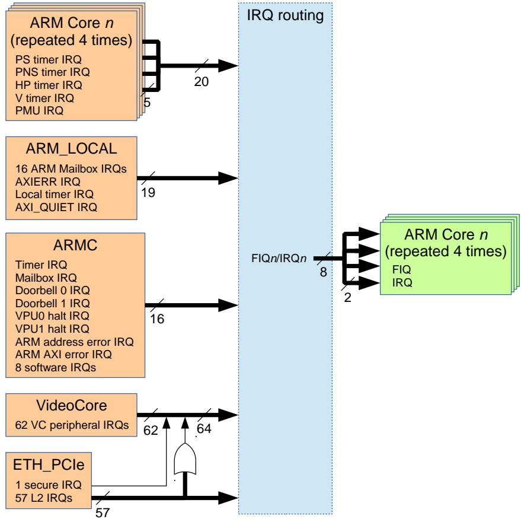


The final output from each interrupt controller is 8 separate signals - a FIQ (Fast Interrupt reQuest) and an IRQ (Interrupt ReQuest) for each of the 4 ARM cores, i.e. FIQ0 and IRQ0 connected to ARM core 0, FIQ1 and IRQ1 connected to ARM core 1, FIQ2 and IRQ2 connected to ARM core 2, and FIQ3 and IRQ3 connected to ARM core 3. For convenience, this document will refer to those 8 signals as FIQn/IRQn.

To avoid confusion, note that the "ARM Mailbox IROs" in the ARM LOCAL block are different from the "Mailbox IRO" in the ARMC block, Similarly, the "Local timer IRO" in the ARM LOCAL block is different to the "Timer IRO" in the ARMC block which are both different from the 4 timer IRQs in the "ARM Core n" block. The "AXIERR IRQ" in the ARM_LOCAL block is also different from the "ARM AXI error IRQ" in the ARMC block.

## 6.2. Interrupt sources

## 6.2.1. ARM Core n interrupts

Each of the ARM Cores can raise a Secure Physical (PS) timer interrupt, a Non-Secure Physical (PNS) timer interrupt, a Hypervisor (HP) timer interrupt, a Virtual (V) timer interrupt and a Performance Monitoring Unit (PMU) interrupt. For more information, please refer to the ARM Cortex-A72 documentation on the ARM Developer website.

## 6.2.2. ARM_LOCAL interrupts

Further information about the ARM Mailboxes can be found in Chapter 13. The AXIERR output is asserted by the ARM’s L2 cache if an error response is received. Further information about the Local Timer and AXI_QUIET can be found in the Registers section of this chapter.

## 6.2.3. ARMC interrupts

<table><tr><td>#</td><td>IRQ</td></tr><tr><td>0</td><td>Timer</td></tr><tr><td>1</td><td>Mailbox</td></tr><tr><td>2</td><td>Doorbell 0</td></tr><tr><td>3</td><td>Doorbell 1</td></tr><tr><td>4</td><td>VPU0 halted</td></tr><tr><td>5</td><td>VPU1 halted</td></tr><tr><td>6</td><td>ARM address error</td></tr><tr><td>7</td><td>ARM AXI error</td></tr><tr><td>8</td><td>Software Interrupt 0</td></tr><tr><td>9</td><td>Software Interrupt 1</td></tr><tr><td>10</td><td>Software Interrupt 2</td></tr><tr><td>11</td><td>Software Interrupt 3</td></tr><tr><td>12</td><td>Software Interrupt 4</td></tr><tr><td>13</td><td>Software Interrupt 5</td></tr><tr><td>14</td><td>Software Interrupt 6</td></tr><tr><td>15</td><td>Software Interrupt 7</td></tr></table>


The Timer interrupt in Table 101 comes from the "Timer (ARM side)" described in Chapter 12.


The eight general-purpose software interrupts can be set by writing to the SWIRQ_SET register and cleared by writing to the SWIRQ_CLEAR register.

## 6.2.4. VideoCore interrupts

<table><tr><td>#</td><td>IRQ 0-15</td><td>#</td><td>IRQ 16-31</td><td>#</td><td>IRQ 32-47</td><td>#</td><td>IRQ 48-63</td></tr><tr><td>0</td><td>Timer 0</td><td>16</td><td>DMA 0</td><td>32</td><td>HDMI CEC</td><td>48</td><td>SMI</td></tr><tr><td>1</td><td>Timer 1</td><td>17</td><td>DMA 1</td><td>33</td><td>HVS</td><td>49</td><td>GPIO 0</td></tr><tr><td>2</td><td>Timer 2</td><td>18</td><td>DMA 2</td><td>34</td><td>RPIVID</td><td>50</td><td>GPIO 1</td></tr><tr><td>3</td><td>Timer 3</td><td>19</td><td>DMA 3</td><td>35</td><td>SDC</td><td>51</td><td>GPIO 2</td></tr><tr><td>4</td><td>H264 0</td><td>20</td><td>DMA 4</td><td>36</td><td>DSI 0</td><td>52</td><td>GPIO 3</td></tr><tr><td>5</td><td>H264 1</td><td>21</td><td>DMA 5</td><td>37</td><td>Pixel Valve 2</td><td>53</td><td>OR of all I2C</td></tr><tr><td>6</td><td>H264 2</td><td>22</td><td>DMA 6</td><td>38</td><td>Camera 0</td><td>54</td><td>OR of all SPI</td></tr><tr><td>7</td><td>JPEG</td><td>23</td><td>DMA 7 &amp; 8</td><td>39</td><td>Camera 1</td><td>55</td><td>PCM/I2S</td></tr><tr><td>8</td><td>ISP</td><td>24</td><td>DMA 9 &amp; 10</td><td>40</td><td>HDMI 0</td><td>56</td><td>SDHOST</td></tr><tr><td>9</td><td>USB</td><td>25</td><td>DMA 11</td><td>41</td><td>HDMI 1</td><td>57</td><td>OR of all PL011 UART</td></tr><tr><td>10</td><td>V3D</td><td>26</td><td>DMA 12</td><td>42</td><td>Pixel Valve 3</td><td>58</td><td>OR of all ETH_PCIe L2</td></tr><tr><td>11</td><td>Transposer</td><td>27</td><td>DMA 13</td><td>43</td><td>SPI/BSC Slave</td><td>59</td><td>VEC</td></tr><tr><td>12</td><td>Multicore Sync 0</td><td>28</td><td>DMA 14</td><td>44</td><td>DSI 1</td><td>60</td><td>CPG</td></tr><tr><td>13</td><td>MultiCore Sync 1</td><td>29</td><td>AUX</td><td>45</td><td>Pixel Valve 0</td><td>61</td><td>RNG</td></tr><tr><td>14</td><td>MultiCore Sync 2</td><td>30</td><td>ARM</td><td>46</td><td>Pixel Valve 1 &amp; 4</td><td>62</td><td>EMMC &amp; EMMC2</td></tr><tr><td>15</td><td>MultiCore Sync 3</td><td>31</td><td>DMA 15</td><td>47</td><td>CPR</td><td>63</td><td>ETH_PCIe secure</td></tr></table>


The 4 timer interrupts in Table 102 come from the "System Timer" described in Chapter 10.


Because there are more peripherals than available VC peripheral IRQs, some of the VC peripheral interrupts (highlighted in bold in Table 102) are the OR-ed version of multiple peripheral interrupts.

The per-peripheral interrupt statuses for VC peripheral IRQs 29, 53, 54 & 57 can in turn be read from the AUX_IRQ (documented in Chapter 2) and PACTL_CS (at address 0x7E20 4E00) registers. Figure 6 shows how this is logically connected, with the vertically-aligned numbers inside the grey boxes indicating bit-positions within the registers.

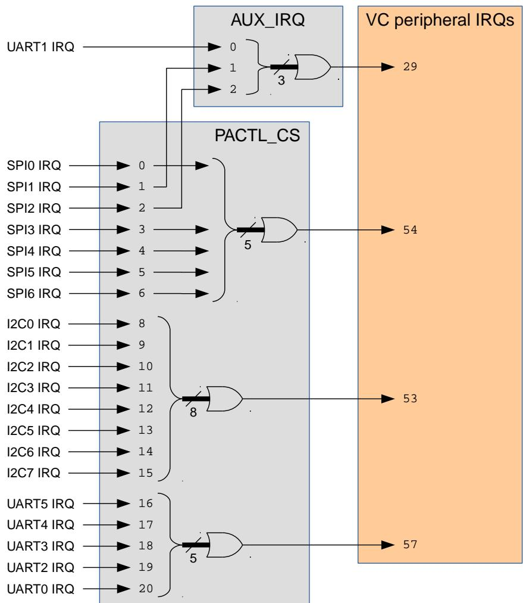


For example if VC peripheral IRQ 53 is triggered, then you know at least one of the I2C peripherals has caused an interrupt. To find out exactly which I2C peripherals have interrupts pending, you can read bits 8 to 15 inclusive of PACTL_CS (alternatively, you could simply read the Status register for each of the I2C peripherals).


There are also some VC peripheral interrupts (23, 24, 46 and 62) that are an OR-ed version of two peripheral interrupt signals - if these interrupts are received the only option is to read the status register for each of the peripherals concerned.

## 6.2.5. ETH_PCIe interrupts

<table><tr><td>#</td><td>IRQ</td></tr><tr><td>9</td><td>AVS</td></tr><tr><td>15</td><td>PCIE_0_INTA</td></tr><tr><td>16</td><td>PCIE_0_INTB</td></tr><tr><td>17</td><td>PCIE_0_INTC</td></tr><tr><td>18</td><td>PCIE_0_INTD</td></tr><tr><td>20</td><td>PCIE_0_MSI</td></tr><tr><td>29</td><td>GENET_0_A</td></tr><tr><td>30</td><td>GENET_0_B</td></tr><tr><td>48</td><td>USB0_XHCI_0</td></tr></table>


Any IRQ numbers not listed in the table above are reserved.


The secure IRQ output (which is only useful for the VPU and not the CPU) from the ETH_PCIe block is routed to VC peripheral IRQ 63, and all 57 ETH_PCIe L2 IRQs are OR-ed together and routed to VC peripheral IRQ 58 - see Figure 5 and Table 102.

Note that the 57 individual ETH_PCIe interrupts aren’t routed to the legacy interrupt controller, only VC peripheral IRQ 58 (the OR-ed version) is available.

## 6.3. GIC-400 interrupt controller

The BCM2711 contains an ARM GIC-400 interrupt controller, which is enabled by default. For more information, please refer to the ARM GIC-400 documentation on the ARM Developer website

Figure 7 shows how the interrupt sources described earlier are connected to the GIC When the GIC-400 is selected as the interrupt controller, the eight "GIC FIQn/IRQn" outputs are routed to the FIQn/IRQn inputs of the ARM cores

Note that even when the GIC-400 is selected as the interrupt controller, the outputs of the legacy interrupt controller (described later) are available as PPIs within the GIC

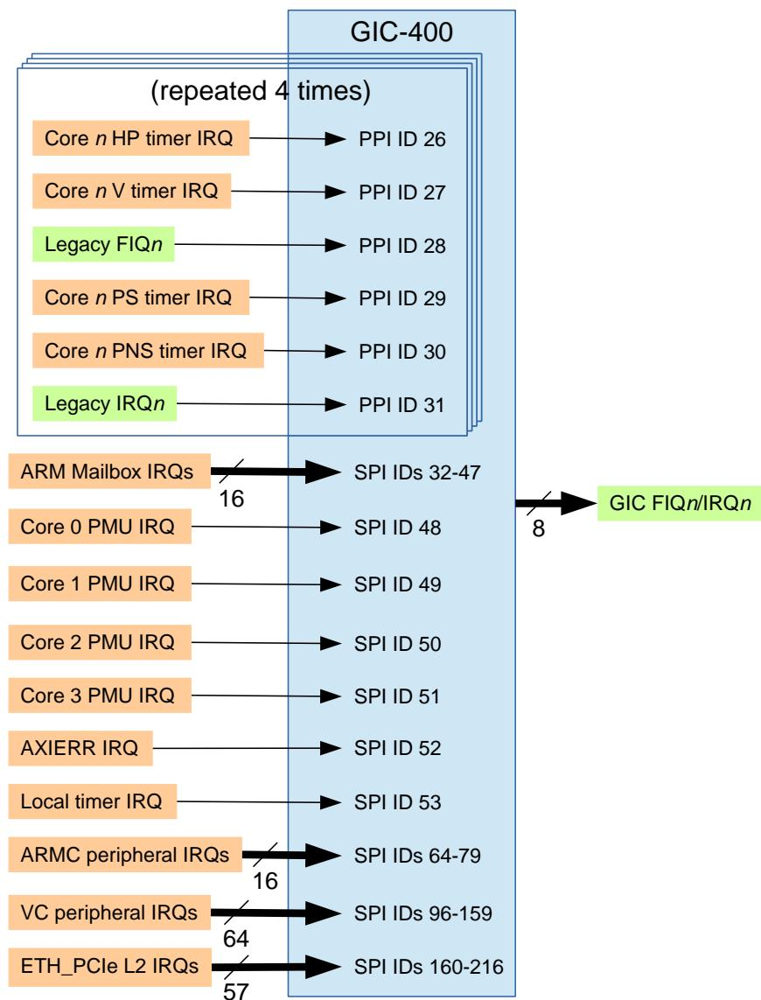


The GIC-400 also connects to the VFIQ (Virtual FIQ) and VIRQ (Virtual IRQ) input of each ARM core, but for brevity these signals are not shown here.


## 6.4. Legacy interrupt controller

The legacy interrupt controller in the BCM2711 has some similarities with the interrupt controllers used in earlie BCM283x chips, but also several differences. When the legacy interrupt controller is selected, the eight "Legacy FIQn/IRQ n" outputs (shown in Figure 9) are routed to the FIQn/IRQn inputs of the ARM cores

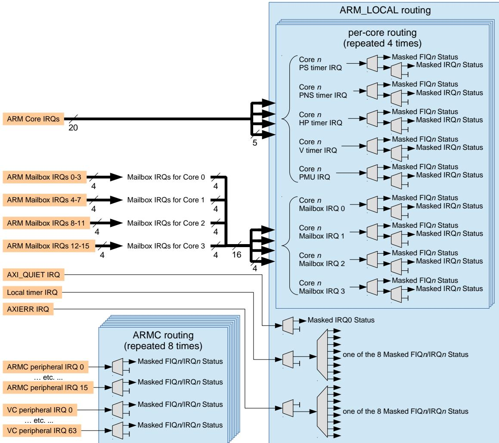


The interrupts coming directly from each of the ARM cores (PS timer, PNS timer, HP timer, V timer and PMU) can only be routed to either the FIO or IRO of the core from which they originate, For example the PS timer and PMU IROs from core 3 could be routed to FIQ3 and the PNS timer IRQ from core 2 could be routed to IRQ2. The masking of the ARM timer IRQs is controlled by the 4 TIMER_CNTRL registers (one for each core) and the masking of the PMU IRQs is controlled by the PMU_CONTROL_SET and PMU_CONTROL_CLR registers.

The sixteen ARM Mailbox interrupts are allocated so that four go to each core - ARM Mailbox IRQs 0 to 3 are routed to the four Mailbox IROs on ARM core 0, and ARM Mailbox IROs 12 to 15 are routed to the four Mailbox IROs on ARM core 3. i e ARM Mailbox IRQ 13 appears to ARM Core 3 as Mailbox IRQ 1. Like the ARM Core interrupts, the ARM Mailbox IRQs can only be routed to the FIQ or IRQ of the core for which they are intended, for example the Mailbox 4 and 5 IRQs could be routed to EIO1 and the Mailbox 10 IRO could be routed to IRO2 The masking of the ARM Mailbox IROs is controlled by the four MAILBOX_CNTRL registers (one for each core).

The AXI_QUIET IRQ is only available to the IRQ input on ARM core 0, and its masking is controlled by the AXI_QUIET_TIME register.

The Local timer and AXIERR IRQs can be routed to any one of the 8 FIQn/IRQn signals.

The masking of the Local timer IRQ is controlled by the LOCAL_TIMER_CONTROL and PERI_IRQ_ROUTE0 registers.

The masking of the AXIERR IRQ is controlled by the ARM_CONTROL and CORE_IRQ_CONTROL registers.

The unmasked inputs to the "ARMC routing" block are readable from the IRQ_STATUS0, IRQ_STATUS1 and IRQ_STATUS2

registers.

The masking within the "ARMC routing" block is controlled by the SET_EN_0, SET_EN_1, SET_EN_2, CLR_EN_0, CLR_EN_ and CLR_EN_2 registers. Each of these registers is repeated for each of the eight FIQn/IRQn signals (48 registers in total)

Once the interrupts have been masked and routed, their statuses can be read from the 3 PENDING and 1 SOURCE registers (repeated 8 times for each of the FIQn/IRQn signals, for a total of 32 registers).

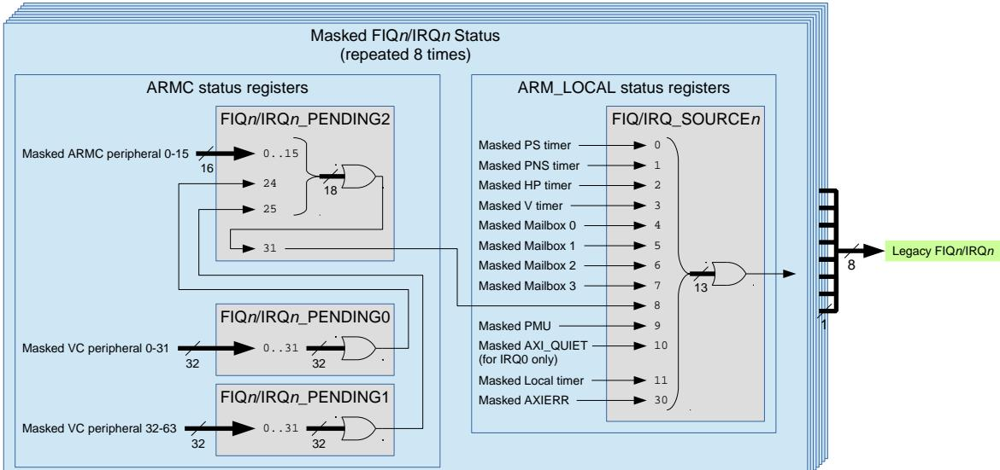


These are "nested" status registers, which means if bit 8 in the SOURCE register is set, you also need to read PENDING2 to see which bits are set there. If bit 24 in the PENDING2 register is set, then you also need to read PENDING0 to see which bits there are set.

As a more complete example, if the interrupt routing and masking is set up so that an interrupt from UART4 triggers a FIQ interrupt to ARM Core 3, the sequence (on ARM Core 3) would be:

1. Enter FIQ handler

2. Read FIQ_SOURCE3

3. Find that FIQ_SOURCE3[8] is set, so read FIQ3_PENDING2

4. Find that FIQ3_PENDING2[25] is set, so read FIQ3_PENDING1

5. Find that FIQ3_PENDING1[25] (i.e. VC peripheral IRQ 57) is set, so read PACTL_CS[20:16] (see Figure 6) to see which UART triggered it

6. Find that PACTL_CS[17] is set, so read UART4_MIS to (finally) determine what caused the interrupt

## 6.5. Registers

To allow atomic operations (where only particular bits are modified, without modifying any of the other bits in the register), some registers are split into a write-set register and a write-clear register

A write-set register allows you to set particular bits high (change them to 1). You set a bit high by writing a '1' to its bit position - bits that were low get changed to high, and bits that were already high remain high. Any bit-positions written with a '0' retain their previous value

<table><tr><td>Old bit value</td><td>Write bit value</td><td>Result bit value</td></tr><tr><td>0</td><td>0</td><td>0</td></tr><tr><td>0</td><td>1</td><td>1</td></tr><tr><td>1</td><td>0</td><td>1</td></tr><tr><td>1</td><td>1</td><td>1</td></tr></table>

Thus writing 0xFC060014 to a write-set register containing 0x30840008 changes it to 0xFC86001C

A write-clear register allows you to set particular bits low (change them to 0). You set a bit low by writing a '1' to its bit position - bits that were low remain low, and bits that were high get changed to low. Any bit-positions written with a '0' retain their previous value. Note that you write a one to change a bit to zero!

<table><tr><td>Old bit value</td><td>Write bit value</td><td>Result bit value</td></tr><tr><td>0</td><td>0</td><td>0</td></tr><tr><td>0</td><td>1</td><td>0</td></tr><tr><td>1</td><td>0</td><td>1</td></tr><tr><td>1</td><td>1</td><td>0</td></tr></table>


Thus writing 0xFC060014 to a write-clear register containing 0x30840008 changes it to 0x00800008.


## 6.5.1. GIC-400

The base address of the GIC-400 is 0x4c0040000. Note that, unlike other peripheral addresses in this document, this is an ARM-only address and not a legacy master address. If Low Peripheral mode is enabled this base address becomes 0xff840000

The GIC-400 is configured with "NUM_CPUS=4" and "NUM_SPIS=192". For full register details, please refer to the ARM GIC-400 documentation on the ARM Developer website

## 6.5.2. ARM_LOCAL

The ARM_LOCAL register base address is 0x4c0000000. Note that, unlike other peripheral addresses in this document, this is an ARM-only address and not a legacy master address. If Low Peripheral mode is enabled this base address becomes 0xff800000

The PMU_CONTROL_SET / PMU_CONTROL_CLR registers are write-set / write-clear registers as described earlier.

<table><tr><td>Offset</td><td>Name</td><td>Description</td></tr><tr><td>0x00</td><td>ARM_CONTROL</td><td>ARM Timer and AXI Error IRQ control</td></tr><tr><td>0x0c</td><td>CORE_IRQ_CONTROL</td><td>VideoCore Interrupt Control</td></tr><tr><td>0x10</td><td>PMU_CONTROL_SET</td><td>PMU Bit Set</td></tr><tr><td>0x14</td><td>PMU_CONTROL_CLR</td><td>PMU Bit Clear</td></tr><tr><td>0x24</td><td>PERI_IRQ_ROUTE0</td><td>Peripheral Interrupt Routing (Bank 0)</td></tr><tr><td>0x30</td><td>AXI_QUIET_TIME</td><td>AXI Outstanding Transaction Time and IRQ Control</td></tr><tr><td>0x34</td><td>LOCAL_TIMER_CONTROL</td><td>Local Timer Control</td></tr><tr><td>0x38</td><td>LOCAL_TIMER_IRQ</td><td>Local Timer Reload and Interrupt</td></tr><tr><td>0x40</td><td>TIMER_CNTRL0</td><td>Timer Interrupt Control for ARM Core 0</td></tr><tr><td>0x44</td><td>TIMER_CNTRL1</td><td>Timer Interrupt Control for ARM Core 1</td></tr><tr><td>0x48</td><td>TIMER_CNTRL2</td><td>Timer Interrupt Control for ARM Core 2</td></tr><tr><td>0x4c</td><td>TIMER_CNTRL3</td><td>Timer Interrupt Control for ARM Core 3</td></tr><tr><td>0x50</td><td>MAILBOX_CNTRL0</td><td>Mailbox Interrupt Control for ARM Core 0</td></tr><tr><td>0x54</td><td>MAILBOX_CNTRL1</td><td>Mailbox Interrupt Control for ARM Core 1</td></tr><tr><td>0x58</td><td>MAILBOX_CNTRL2</td><td>Mailbox Interrupt Control for ARM Core 2</td></tr></table>

Table 105. ARM_CONTROL Register

<table><tr><td>Offset</td><td>Name</td><td>Description</td></tr><tr><td>0x5c</td><td>MAILBOX_CNTRL3</td><td>Mailbox Interrupt Control for ARM Core 3</td></tr><tr><td>0x60</td><td>IRQ_SOURCE0</td><td>IRQ Source flags for ARM Core 0</td></tr><tr><td>0x64</td><td>IRQ_SOURCE1</td><td>IRQ Source flags for ARM Core 1</td></tr><tr><td>0x68</td><td>IRQ_SOURCE2</td><td>IRQ Source flags for ARM Core 2</td></tr><tr><td>0x6c</td><td>IRQ_SOURCE3</td><td>IRQ Source flags for ARM Core 3</td></tr><tr><td>0x70</td><td>FIQ_SOURCE0</td><td>FIQ Source flags for ARM Core 0</td></tr><tr><td>0x74</td><td>FIQ_SOURCE1</td><td>FIQ Source flags for ARM Core 1</td></tr><tr><td>0x78</td><td>FIQ_SOURCE2</td><td>FIQ Source flags for ARM Core 2</td></tr><tr><td>0x7c</td><td>FIQ_SOURCE3</td><td>FIQ Source flags for ARM Core 3</td></tr></table>

## ARM_CONTROL Register

## Description


Main Timer and AXI Error Control.


<table><tr><td>Bits</td><td>Name</td><td>Description</td><td>Type</td><td>Reset</td></tr><tr><td>31:9</td><td>Reserved.</td><td>-</td><td>-</td><td>-</td></tr><tr><td>08</td><td>TIMER_INCREMENT</td><td>Main timer increment value selectionThe main timer (driving the ARM core &#x27;global system counter&#x27;) is incremented by this amount each time the prescaler output is asserted. The ability to set the increment value to two allows the main timer to count ARM core clock cycles in the case where the AXI/APB clock frequency is half of the ARM core clock frequency and the prescaler ratio is unity.1 = increment count by two.0 = increment count by one.</td><td>RW</td><td>0x0</td></tr><tr><td>07</td><td>PROC_CLK_TIMER</td><td>Main timer clock selectionThe main timer (driving the ARM core &#x27;global system counter&#x27;) may be driven either from the fast but variable AXI/APB bus clock or from the fixed-frequency but slower crystal reference clock.1 = select AXI/APB clock.0 = select crystal clock.</td><td>RW</td><td>0x0</td></tr><tr><td>06</td><td>AXIERRIRQ_EN</td><td>When set to &#x27;1&#x27;, this bit masks the AXI Error interrupt. An AXI error output is asserted by the ARM&#x27;s L2 cache if an error response is received. If not masked, this causes an interrupt to be raised. If this bit is set, the interrupt is not raised.Interrupt routing for this is controlled by the AXI_ERR_CORE field in the CORE_IRQ_CONTROL register.</td><td>RW</td><td>0x0</td></tr><tr><td>5:0</td><td>Reserved.</td><td>-</td><td>-</td><td>-</td></tr></table>

## CORE_IRQ_CONTROL Register

## Description

VideoCore Interrupt Routing Control

<table><tr><td>Bits</td><td>Name</td><td>Description</td><td>Type</td><td>Reset</td></tr><tr><td>31:7</td><td>Reserved.</td><td>-</td><td>-</td><td>-</td></tr><tr><td>06:04</td><td>AXI_ERR_CORE</td><td>Controls to which ARM core interrupt request pin the external error interrupt request signal from the ARM L2 cache is routed.This interrupt is enabled in the AXIERRIRQ_EN field in the ARM_CONTROL register.0 = CORE0_IRQ1 = CORE1_IRQ2 = CORE2_IRQ3 = CORE3_IRQ4 = CORE0_FIQ5 = CORE1_FIQ6 = CORE2_FIQ7 = CORE3_FIQ</td><td>RW</td><td>0x0</td></tr><tr><td>3:0</td><td>Reserved.</td><td>-</td><td>-</td><td>-</td></tr></table>

## PMU_CONTROL_SET Register

## Description

Performance Monitoring Unit (PMU) control word. Each ARM core provides a PMUIRQ output; this control word specifies to which interrupt pins they are routed

Writing a '1' to a bit position in this register causes the corresponding bit in the PMU control word to be set to 1.

<table><tr><td>Bits</td><td>Name</td><td>Description</td><td>Type</td><td>Reset</td></tr><tr><td>31:8</td><td>Reserved.</td><td>-</td><td>-</td><td>-</td></tr><tr><td>07:04</td><td>PMU_FIQ</td><td>PMU to FIQ routing mask.Setting bit N within this four bit field routes the PMUIRQ output from ARM core N to the FIQ interrupt request on that ARM core.</td><td>RW</td><td>0x0</td></tr><tr><td>03:00</td><td>PMU_IRQ</td><td>PMU to IRQ routing maskSetting bit N within this four bit field routes the PMUIRQ output from ARM core N to the IRQ interrupt request on that ARM core. Note that it is not possible to route the PMU interrupt to both the FIQ and IRQ request pins: setting a bit in the PMU_FIQ field causes the request to go to the core&#x27;s FIQ pin only, irrespective of this field.</td><td>RW</td><td>0x0</td></tr></table>

## PMU_CONTROL_CLR Register

## Description

Performance Monitoring Unit (PMU) control word. Each ARM core provides a PMUIRQ output; this control word specifies to which interrupt pins they are routed.

Writing a '1' to a bit position in this register causes the corresponding bit in the PMU control word to be cleared to 0.

<table><tr><td>Bits</td><td>Name</td><td>Description</td><td>Type</td><td>Reset</td></tr><tr><td>31:8</td><td>Reserved.</td><td>-</td><td>-</td><td>-</td></tr><tr><td>07:04</td><td>PMU_FIQ</td><td>PMU to FIQ routing mask.Setting bit N within this four bit field routes the PMUIRQ output from ARM core N to the FIQ interrupt request on that ARM core.</td><td>W1C</td><td>0x0</td></tr><tr><td>03:00</td><td>PMU_IRQ</td><td>PMU to IRQ routing maskSetting bit N within this four bit field routes the PMUIRQ output from ARM core N to the IRQ interrupt request on that ARM core. Note that it is not possible to route the PMU interrupt to both the FIQ and IRQ request pins: setting a bit in the PMU_FIQ field causes the request to go to the core's FIQ pin only, irrespective of this field.</td><td>W1C</td><td>0x0</td></tr></table>

## PERI_IRQ_ROUTE0 Register

## Description

This register controls the routing of the Local timer interrupts.

<table><tr><td>Bits</td><td>Name</td><td>Description</td><td>Type</td><td>Reset</td></tr><tr><td>31:24</td><td>WRITE_MASKS</td><td>Interrupt routing field write mask bits.This field must be written with 0x01, otherwise changes to LOCAL_TIMER_IRQ will be ignored.</td><td>RW</td><td>0x00</td></tr><tr><td>23:3</td><td>Reserved.</td><td>-</td><td>-</td><td>-</td></tr><tr><td>02:00</td><td>LOCAL_TIMER_IRQ</td><td>Local timer Routing0 = CORE0_IRQ1 = CORE1_IRQ2 = CORE2_IRQ3 = CORE3_IRQ4 = CORE0_FIQ5 = CORE1_FIQ6 = CORE2_FIQ7 = CORE3_FIQ</td><td>RW</td><td>0x0</td></tr></table>

## AXI_QUIET_TIME Register

## Description

No outstanding AXI transactions for a while.

This register controls logic that is able to generate an interrupt to the IRQ interrupt pin of ARM core 0 if there has been no AXI bus traffic for a programmable time. The intention is that software can use this to have reasonable confidence that the bus traffic from the ARM cluster to VideoCore has ceased.

A 24-bit timer is loaded with a value equal to

16 x AXI_QUIET_TIME.AXI_QUIET_TIME + 15

whenever one or more AXI transactions are outstanding. The counter decrements on each AXI/APB clock rising edg when no transactions are outstanding. When the counter reaches zero, the interrupt request is generated if enabled.

<table><tr><td>Bits</td><td>Name</td><td>Description</td><td>Type</td><td>Reset</td></tr><tr><td>31:21</td><td>Reserved.</td><td>-</td><td>-</td><td>-</td></tr><tr><td>20</td><td>AXI_QUIET_IRQ_ENB</td><td>1: Enable Core 0 IRQ on AXI quiet timer expiry0: Disable Core 0 IRQ on AXI quiet timer expiry</td><td>RW</td><td>0x0</td></tr><tr><td>19:00</td><td>AXI_QUIET_TIME</td><td>Timer load value, in units of 16 AXI/APB clock cycles.</td><td>RW</td><td>0x00000</td></tr></table>

## LOCAL_TIMER_CONTROL Register

## Description

Local Timer Configuration.

A free-running secondary timer is provided that can generate an interrupt each time it crosses zero. When it is enabled, the timer is decremented on each edge (positive or negative) of the crystal reference clock. It is automatically reloaded with the TIMER_TIMEOUT value when it reaches zero and then continues to decrement. Routing of the timer interrupt is controlled by the PERI_IRQ_ROUTE0 register.

<table><tr><td>Bits</td><td>Name</td><td>Description</td><td>Type</td><td>Reset</td></tr><tr><td>31</td><td>TIMER_IRQ_FLAG</td><td>This read-only field allows software to see the current state of the timer interrupt request. A &#x27;1&#x27; indicates a valid interrupt request.</td><td>RO</td><td>0x0</td></tr><tr><td>30</td><td>Reserved.</td><td>-</td><td>-</td><td>-</td></tr><tr><td>29</td><td>TIMER_IRQ_EN</td><td>Interrupt request enable.When set to &#x27;1&#x27;, this bit causes the timer to request an interrupt as the timer crosses zero.</td><td>RW</td><td>0x0</td></tr><tr><td>28</td><td>TIMER_EN</td><td>Timer EnableWhen set to &#x27;1&#x27;, this bit enables to the timer. When cleared to &#x27;0&#x27;, timer operation is completely disabled: the timer does not decrement or raise interrupt requests.</td><td>RW</td><td>0x0</td></tr><tr><td>27:00</td><td>TIMER_TIMEOUT</td><td>Timer load value.</td><td>RW</td><td>0x0000000</td></tr></table>

## LOCAL_TIMER_IRQ Register

## Description

Local Timer Interrupt Control

<table><tr><td>Bits</td><td>Name</td><td>Description</td><td>Type</td><td>Reset</td></tr><tr><td>31</td><td>IRQ_CLEAR</td><td>Write a &#x27;1&#x27; to this field to clear a timer interrupt request. If the timer crosses zero at the same time as the write, the clear operation will fail; interrupt request will remain asserted. This bit self-clears.</td><td>W1SC</td><td>0x0</td></tr><tr><td>30</td><td>RELOAD</td><td>Write a &#x27;1&#x27; to this field to (re)load the timer with the timeout value. This bit self-clears.</td><td>W1SC</td><td>0x0</td></tr><tr><td>29:0</td><td>Reserved.</td><td>-</td><td>-</td><td>-</td></tr></table>

## TIMER_CNTRL0, TIMER_CNTRL1, TIMER_CNTRL2, TIMER_CNTRL3 Registers

## Description

This register allows software to determine the cause of a FIQ interrupt request received by an ARM core.

<table><tr><td>Bits</td><td>Name</td><td>Description</td><td>Type</td><td>Reset</td></tr><tr><td>31:8</td><td>Reserved.</td><td>-</td><td>-</td><td>-</td></tr><tr><td>07</td><td>CNT_V_IRQ_FIQ</td><td>When set to '1', this bit causes the 'Virtual Timer Event' output to be routed to the FIQ interrupt request.</td><td>RW</td><td>0x0</td></tr><tr><td>06</td><td>CNT_HP_IRQ_FIQ</td><td>When set to '1', this bit causes the 'Hypervisor Physical Timer Event' output to be routed to the FIQ interrupt request.</td><td>RW</td><td>0x0</td></tr><tr><td>05</td><td>CNT_PNS_IRQ_FIQ</td><td>When set to '1', this bit causes the 'Nonsecure Physical Timer Event' output to be routed to the FIQ interrupt request.</td><td>RW</td><td>0x0</td></tr><tr><td>04</td><td>CNT_PS_IRQ_FIQ</td><td>When set to '1', this bit causes the 'Secure Physical Timer Event' output to be routed to the FIQ interrupt request.</td><td>RW</td><td>0x0</td></tr><tr><td>03</td><td>CNT_V_IRQ</td><td>When set to '1', this bit causes the 'Virtual Timer Event' output to be routed to the IRQ interrupt request. Note that this is overridden by the corresponding FIQ bit: a particular event may be routed either to the FIQ or IRQ request pin, not both. If the FIQ bit is set, then the event will be routed to the FIQ request pin only, irrespective of the state of this bit.</td><td>RW</td><td>0x0</td></tr><tr><td>02</td><td>CNT_HP_IRQ</td><td>When set to '1', this bit causes the 'Hypervisor Physical Timer Event' output to be routed to the IRQ interrupt request. Note that this is overridden by the corresponding FIQ bit: a particular event may be routed either to the FIQ or IRQ request pin, not both. If the FIQ bit is set, then the event will be routed to the FIQ request pin only, irrespective of the state of this bit.</td><td>RW</td><td>0x0</td></tr><tr><td>01</td><td>CNT_PNS_IRQ</td><td>When set to '1', this bit causes the 'Nonsecure Physical Timer Event' output to be routed to the IRQ interrupt request. Note that this is overridden by the corresponding FIQ bit: a particular event may be routed either to the FIQ or IRQ request pin, not both. If the FIQ bit is set, then the event will be routed to the FIQ request pin only, irrespective of the state of this bit.</td><td>RW</td><td>0x0</td></tr><tr><td>00</td><td>CNT_PS_IRQ</td><td>When set to '1', this bit causes the 'Secure Physical Timer Event' output to be routed to the IRQ interrupt request. Note that this is overridden by the corresponding FIQ bit: a particular event may be routed either to the FIQ or IRQ request pin, not both. If the FIQ bit is set, then the event will be routed to the FIQ request pin only, irrespective of the state of this bit.</td><td>RW</td><td>0x0</td></tr></table>

## MAILBOX_CNTRL0,

## MAILBOX_CNTRL1,

## MAILBOX_CNTRL2,

## MAILBOX_CNTRL3 Registers

## Description

This register controls the routing of the mailbox interrupts to an ARM core’s IRQ or FIQ interrupt request pins. Each ARM can receive interrupts from four of the sixteen mailbox registers. For ARM core 0, these are mailboxes 0-3; for ARM core 1, mailboxes 4-7 and so on.

Table 114. MAILBOX_CNTRL0, MAILBOX CNTRL1 MAILBOX_CNTRL2, MAILBOX CNTRL3 Registers

<table><tr><td>Bits</td><td>Name</td><td>Description</td><td>Type</td><td>Reset</td></tr><tr><td>31:8</td><td>Reserved.</td><td>-</td><td>-</td><td>-</td></tr><tr><td>07</td><td>MBOX3_FIQ</td><td>When set to '1', this bit causes the fourth mailbox, i.e.mailbox 4C+3 for ARM core number C, (so mailbox 3 for ARM core 0, 7 for ARM core 1, etc.) to trigger a FIQ interrupt when any bit is set in the mailbox.</td><td>RW</td><td>0x0</td></tr><tr><td>06</td><td>MBOX2_FIQ</td><td>When set to '1', this bit causes the third mailbox, i.e.mailbox 4C+2 for ARM core number C, (so mailbox 2 for ARM core 0, 6 for ARM core 1, etc.) to trigger a FIQ interrupt when any bit is set in the mailbox.</td><td>RW</td><td>0x0</td></tr><tr><td>05</td><td>MBOX1_FIQ</td><td>When set to '1', this bit causes the second mailbox, i.e.mailbox 4C+1 for ARM core number C, (so mailbox 1 for ARM core 0, 5 for ARM core 1, etc.) to trigger a FIQ interrupt when any bit is set in the mailbox.</td><td>RW</td><td>0x0</td></tr><tr><td>04</td><td>MBOX0_FIQ</td><td>When set to '1', this bit causes the first mailbox, i.e.mailbox 4C for ARM core number C, (so mailbox 0 for ARM core 0, 4 for ARM core 1, etc.) to trigger a FIQ interrupt when any bit is set in the mailbox.</td><td>RW</td><td>0x0</td></tr><tr><td>03</td><td>MBOX3_IRQ</td><td>When set to '1', this bit causes the fourth mailbox, i.e.mailbox 4C+3 for ARM core number C, (so mailbox 3 for ARM core 0, 7 for ARM core 1, etc.) to trigger an IRQ interrupt when any bit is set in the mailbox. Note that this is overridden by the corresponding FIQ bit: a particular event may be routed either to the FIQ or IRQ request pin, not both. If the FIQ bit is set, then the event will be routed to the FIQ request pin only, irrespective of the state of this bit.</td><td>RW</td><td>0x0</td></tr><tr><td>02</td><td>MBOX2_IRQ</td><td>When set to '1', this bit causes the third mailbox, i.e.mailbox 4C+2 for ARM core number C, (so mailbox 2 for ARM core 0, 6 for ARM core 1, etc.) to trigger an IRQ interrupt when any bit is set in the mailbox. Note that this is overridden by the corresponding FIQ bit: a particular event may be routed either to the FIQ or IRQ request pin, not both. If the FIQ bit is set, then the event will be routed to the FIQ request pin only, irrespective of the state of this bit.</td><td>RW</td><td>0x0</td></tr><tr><td>01</td><td>MBOX1_IRQ</td><td>When set to '1', this bit causes the second mailbox, i.e.mailbox 4C+1 for ARM core number C, (so mailbox 1 for ARM core 0, 5 for ARM core 1, etc.) to trigger an IRQ interrupt when any bit is set in the mailbox. Note that this is overridden by the corresponding FIQ bit: a particular event may be routed either to the FIQ or IRQ request pin, not both. If the FIQ bit is set, then the event will be routed to the FIQ request pin only, irrespective of the state of this bit.</td><td>RW</td><td>0x0</td></tr><tr><td>00</td><td>MBOX0_IRQ</td><td>When set to '1', this bit causes the first mailbox, i.e.mailbox 4C for ARM core number C, (so mailbox 0 for ARM core 0, 4 for ARM core 1, etc.) to trigger an IRQ interrupt when any bit is set in the mailbox. Note that this is overridden by the corresponding FIQ bit: a particular event may be routed either to the FIQ or IRQ request pin, not both. If the FIQ bit is set, then the event will be routed to the FIQ request pin only, irrespective of the state of this bit.</td><td>RW</td><td>0x0</td></tr></table>

## IRQ_SOURCE0, IRQ_SOURCE1, IRQ_SOURCE2, IRQ_SOURCE3 Registers Description

This register allows software to determine the cause of an IRQ interrupt request received by an ARM core.

Table 115. IRQ_SOURCE0, IRQ_SOURCE1, IRQ_SOURCE2, IRQ_SOURCE3 Registers

Table 116. FIQ_SOURCE0, FIQ_SOURCE1, FIQ_SOURCE2, FIQ_SOURCE3 Registers

<table><tr><td>Bits</td><td>Name</td><td>Description</td><td>Type</td><td>Reset</td></tr><tr><td>31</td><td>Reserved.</td><td>-</td><td>-</td><td>-</td></tr><tr><td>30</td><td>AXI_IRQ</td><td>AXI error, as reported by the ARM L2 cache.</td><td>RO</td><td>0x0</td></tr><tr><td>29:12</td><td>Reserved.</td><td>-</td><td>-</td><td>-</td></tr><tr><td>11</td><td>TIMER_IRQ</td><td>Local timer interrupt.</td><td>RO</td><td>0x0</td></tr><tr><td>10</td><td>AXI_QUIET</td><td>No AXI outstanding requests have been seen for the time-out period.Present for Core 0 only. Reserved for others.</td><td>RO</td><td>0x0</td></tr><tr><td>09</td><td>PMU_IRQ</td><td>Performance measurement unit interrupt.</td><td>RO</td><td>0x0</td></tr><tr><td>08</td><td>CORE_IRQ</td><td>VideoCore interrupt request.</td><td>RO</td><td>0x0</td></tr><tr><td>07:04</td><td>MAILBOX_IRQ</td><td>Mailbox interrupts: bit 4 is the first of the core&#x27;s mailboxes, bit 7 is the fourth.</td><td>RO</td><td>0x0</td></tr><tr><td>03</td><td>CNT_V_IRQ</td><td>Virtual Timer Event interrupt.</td><td>RO</td><td>0x0</td></tr><tr><td>02</td><td>CNT_HP_IRQ</td><td>Hypervisor Physical Timer Event interrupt.</td><td>RO</td><td>0x0</td></tr><tr><td>01</td><td>CNT_PNS_IRQ</td><td>Nonsecure Physical Timer Event interrupt.</td><td>RO</td><td>0x0</td></tr><tr><td>00</td><td>CNT_PS_IRQ</td><td>Secure Physical Timer Event interrupt.</td><td>RO</td><td>0x0</td></tr></table>

## FIQ_SOURCE0, FIQ_SOURCE1, FIQ_SOURCE2, FIQ_SOURCE3 Registers

## Description

This register allows software to determine the cause of a FIQ interrupt request received by an ARM core.

<table><tr><td>Bits</td><td>Name</td><td>Description</td><td>Type</td><td>Reset</td></tr><tr><td>31</td><td>Reserved.</td><td>-</td><td>-</td><td>-</td></tr><tr><td>30</td><td>AXI_FIQ</td><td>AXI error, as reported by the ARM L2 cache.</td><td>RO</td><td>0x0</td></tr><tr><td>29:12</td><td>Reserved.</td><td>-</td><td>-</td><td>-</td></tr><tr><td>11</td><td>LOCAL_TIMER_FIQ</td><td>Local timer interrupt.</td><td>RO</td><td>0x0</td></tr><tr><td>10</td><td>Reserved.</td><td>-</td><td>-</td><td>-</td></tr><tr><td>09</td><td>PMU_FIQ</td><td>Performance measurement unit interrupt.</td><td>RO</td><td>0x0</td></tr><tr><td>08</td><td>CORE_FIQ</td><td>VideoCore interrupt request.</td><td>RO</td><td>0x0</td></tr><tr><td>07:04</td><td>MAILBOX_FIQ</td><td>Mailbox interrupts: bit 4 is the first of the core&#x27;s mailboxes, bit 7 is the fourth.</td><td>RO</td><td>0x0</td></tr><tr><td>03</td><td>CNT_V_FIQ</td><td>Virtual Timer Event interrupt.</td><td>RO</td><td>0x0</td></tr><tr><td>02</td><td>CNT_HP_FIQ</td><td>Hypervisor Physical Timer Event interrupt.</td><td>RO</td><td>0x0</td></tr><tr><td>01</td><td>CNT_PNS_FIQ</td><td>Nonsecure Physical Timer Event interrupt.</td><td>RO</td><td>0x0</td></tr><tr><td>00</td><td>CNT_PS_FIQ</td><td>Secure Physical Timer Event interrupt.</td><td>RO</td><td>0x0</td></tr></table>

## 6.5.3. ARMC

The IRQn_SET_EN_x / IRQn_CLR_EN_x, FIQn_SET_EN_x / FIQn_CLR_EN_x and SWIRQ_SET / SWIRQ_CLEAR registers are write-set / write-clear registers as described earlier.

Table 117. ARMC Interrupt Registers


The ARMC register base address is 0x7e00b000.


<table><tr><td>Offset</td><td>Name</td><td>Description</td></tr><tr><td>0x200</td><td>IRQ0_PENDING0</td><td>ARM Core 0 IRQ Enabled Interrupt Pending bits [31:0]</td></tr><tr><td>0x204</td><td>IRQ0_PENDING1</td><td>ARM Core 0 IRQ Enabled Interrupt pending bits [63:32]</td></tr><tr><td>0x208</td><td>IRQ0_PENDING2</td><td>ARM Core 0 IRQ Enabled Interrupt pending bits [79:64]</td></tr><tr><td>0x210</td><td>IRQ0_SET_EN_0</td><td>Write to Set ARM Core 0 IRQ enable bits [31:0]</td></tr><tr><td>0x214</td><td>IRQ0_SET_EN_1</td><td>Write to Set ARM Core 0 IRQ enable bits [63:32]</td></tr><tr><td>0x218</td><td>IRQ0_SET_EN_2</td><td>Write to Set ARM Core 0 IRQ enable bits[79:64]</td></tr><tr><td>0x220</td><td>IRQ0_CLR_EN_0</td><td>Write to Clear ARM Core 0 IRQ enable bits [31:0]</td></tr><tr><td>0x224</td><td>IRQ0_CLR_EN_1</td><td>Write to Clear ARM Core 0 IRQ enable bits [63:32]</td></tr><tr><td>0x228</td><td>IRQ0_CLR_EN_2</td><td>Write to Clear ARM Core 0 IRQ enable bits [79:64]</td></tr><tr><td>0x230</td><td>IRQ_STATUS0</td><td>Interrupt Line bits [31:0]</td></tr><tr><td>0x234</td><td>IRQ_STATUS1</td><td>Interrupt Line bits [63:32]</td></tr><tr><td>0x238</td><td>IRQ_STATUS2</td><td>Interrupt Line bits [79:64]</td></tr><tr><td>0x240</td><td>IRQ1_PENDING0</td><td>ARM Core 1 IRQ Enabled Interrupt pending bits [31:0]</td></tr><tr><td>0x244</td><td>IRQ1_PENDING1</td><td>ARM Core 1 IRQ Enabled Interrupt pending bits [63:32]</td></tr><tr><td>0x248</td><td>IRQ1_PENDING2</td><td>ARM Core 1 IRQ Enabled Interrupt pending bits [79:64]</td></tr><tr><td>0x250</td><td>IRQ1_SET_EN_0</td><td>Write to Set ARM Core 1 IRQ enable bits [31:0]</td></tr><tr><td>0x254</td><td>IRQ1_SET_EN_1</td><td>Write to Set ARM Core 1 IRQ enable bits [63:32]</td></tr><tr><td>0x258</td><td>IRQ1_SET_EN_2</td><td>Write to Set ARM Core 1 IRQ enable bits[79:64]</td></tr><tr><td>0x260</td><td>IRQ1_CLR_EN_0</td><td>Write to Clear ARM Core 1 IRQ enable bits [31:0]</td></tr><tr><td>0x264</td><td>IRQ1_CLR_EN_1</td><td>Write to Clear ARM Core 1 IRQ enable bits [63:32]</td></tr><tr><td>0x268</td><td>IRQ1_CLR_EN_2</td><td>Write to Clear ARM Core 1 IRQ enable bits [79:64]</td></tr><tr><td>0x280</td><td>IRQ2_PENDING0</td><td>ARM Core 2 IRQ Enabled Interrupt pending bits [31:0]</td></tr><tr><td>0x284</td><td>IRQ2_PENDING1</td><td>ARM Core 2 IRQ Enabled Interrupt pending bits [63:32]</td></tr><tr><td>0x288</td><td>IRQ2_PENDING2</td><td>ARM Core 2 IRQ Enabled Interrupt pending bits [79:64]</td></tr><tr><td>0x290</td><td>IRQ2_SET_EN_0</td><td>Write to Set ARM Core 2 IRQ enable bits [31:0]</td></tr><tr><td>0x294</td><td>IRQ2_SET_EN_1</td><td>Write to Set ARM Core 2 IRQ enable bits [63:32]</td></tr><tr><td>0x298</td><td>IRQ2_SET_EN_2</td><td>Write to Set ARM Core 2 IRQ enable bits[79:64]</td></tr><tr><td>0x2a0</td><td>IRQ2_CLR_EN_0</td><td>Write to Clear ARM Core 2 IRQ enable bits [31:0]</td></tr><tr><td>0x2a4</td><td>IRQ2_CLR_EN_1</td><td>Write to Clear ARM Core 2 IRQ enable bits [63:32]</td></tr><tr><td>0x2a8</td><td>IRQ2_CLR_EN_2</td><td>Write to Clear ARM Core 2 IRQ enable bits [79:64]</td></tr><tr><td>0x2c0</td><td>IRQ3_PENDING0</td><td>ARM Core 3 IRQ Enabled Interrupt pending bits [31:0]</td></tr><tr><td>0x2c4</td><td>IRQ3_PENDING1</td><td>ARM Core 3 IRQ Enabled Interrupt pending bits [63:32]</td></tr><tr><td>0x2c8</td><td>IRQ3_PENDING2</td><td>ARM Core 3 IRQ Enabled Interrupt pending bits [79:64]</td></tr><tr><td>0x2d0</td><td>IRQ3_SET_EN_0</td><td>Write to Set ARM Core 3 IRQ enable bits [31:0]</td></tr><tr><td>0x2d4</td><td>IRQ3_SET_EN_1</td><td>Write to Set ARM Core 3 IRQ enable bits [63:32]</td></tr><tr><td>0x2d8</td><td>IRQ3_SET_EN_2</td><td>Write to Set ARM Core 3 IRQ enable bits[79:64]</td></tr><tr><td>0x2e0</td><td>IRQ3_CLR_EN_0</td><td>Write to Clear ARM Core 3 IRQ enable bits [31:0]</td></tr><tr><td>0x2e4</td><td>IRQ3_CLR_EN_1</td><td>Write to Clear ARM Core 3 IRQ enable bits [63:32]</td></tr><tr><td>0x2e8</td><td>IRQ3_CLR_EN_2</td><td>Write to Clear ARM Core 3 IRQ enable bits [79:64]</td></tr><tr><td>0x300</td><td>FIQ0_PENDING0</td><td>ARM Core 0 FIQ Enabled Interrupt pending bits [31:0]</td></tr><tr><td>0x304</td><td>FIQ0_PENDING1</td><td>ARM Core 0 FIQ Enabled Interrupt pending bits [63:32]</td></tr><tr><td>0x308</td><td>FIQ0_PENDING2</td><td>ARM Core 0 FIQ Enabled Interrupt pending bits [79:64]</td></tr><tr><td>0x310</td><td>FIQ0_SET_EN_0</td><td>Write to Set ARM Core 0 FIQ enable bits [31:0]</td></tr><tr><td>0x314</td><td>FIQ0_SET_EN_1</td><td>Write to Set ARM Core 0 FIQ enable bits [63:32]</td></tr><tr><td>0x318</td><td>FIQ0_SET_EN_2</td><td>Write to Set ARM Core 0 FIQ enable bits[79:64]</td></tr><tr><td>0x320</td><td>FIQ0_CLR_EN_0</td><td>Write to Clear ARM Core 0 FIQ enable bits [31:0]</td></tr><tr><td>0x324</td><td>FIQ0_CLR_EN_1</td><td>Write to Clear ARM Core 0 FIQ enable bits [63:32]</td></tr><tr><td>0x328</td><td>FIQ0_CLR_EN_2</td><td>Write to Clear ARM Core 0 FIQ enable bits [79:64]</td></tr><tr><td>0x340</td><td>FIQ1_PENDING0</td><td>ARM Core 1 FIQ Enabled Interrupt pending bits [31:0]</td></tr><tr><td>0x344</td><td>FIQ1_PENDING1</td><td>ARM Core 1 FIQ Enabled Interrupt pending bits [63:32]</td></tr><tr><td>0x348</td><td>FIQ1_PENDING2</td><td>ARM Core 1 FIQ Enabled Interrupt pending bits [79:64]</td></tr><tr><td>0x350</td><td>FIQ1_SET_EN_0</td><td>Write to Set ARM Core 1 FIQ enable bits [31:0]</td></tr><tr><td>0x354</td><td>FIQ1_SET_EN_1</td><td>Write to Set ARM Core 1 FIQ enable bits [63:32]</td></tr><tr><td>0x358</td><td>FIQ1_SET_EN_2</td><td>Write to Set ARM Core 1 FIQ enable bits[79:64]</td></tr><tr><td>0x360</td><td>FIQ1_CLR_EN_0</td><td>Write to Clear ARM Core 1 FIQ enable bits [31:0]</td></tr><tr><td>0x364</td><td>FIQ1_CLR_EN_1</td><td>Write to Clear ARM Core 1 FIQ enable bits [63:32]</td></tr><tr><td>0x368</td><td>FIQ1_CLR_EN_2</td><td>Write to Clear ARM Core 1 FIQ enable bits [79:64]</td></tr><tr><td>0x380</td><td>FIQ2_PENDING0</td><td>ARM Core 2 FIQ Enabled Interrupt pending bits [31:0]</td></tr><tr><td>0x384</td><td>FIQ2_PENDING1</td><td>ARM Core 2 FIQ Enabled Interrupt pending bits [63:32]</td></tr><tr><td>0x388</td><td>FIQ2_PENDING2</td><td>ARM Core 2 FIQ Enabled Interrupt pending bits [79:64]</td></tr><tr><td>0x390</td><td>FIQ2_SET_EN_0</td><td>Write to Set ARM Core 2 FIQ enable bits [31:0]</td></tr><tr><td>0x394</td><td>FIQ2_SET_EN_1</td><td>Write to Set ARM Core 2 FIQ enable bits [63:32]</td></tr><tr><td>0x398</td><td>FIQ2_SET_EN_2</td><td>Write to Set ARM Core 2 FIQ enable bits[79:64]</td></tr><tr><td>0x3a0</td><td>FIQ2_CLR_EN_0</td><td>Write to Clear ARM Core 2 FIQ enable bits [31:0]</td></tr><tr><td>0x3a4</td><td>FIQ2_CLR_EN_1</td><td>Write to Clear ARM Core 2 FIQ enable bits [63:32]</td></tr><tr><td>0x3a8</td><td>FIQ2_CLR_EN_2</td><td>Write to Clear ARM Core 2 FIQ enable bits [79:64]</td></tr><tr><td>0x3c0</td><td>FIQ3_PENDING0</td><td>ARM Core 3 FIQ Enabled Interrupt pending bits [31:0]</td></tr><tr><td>0x3c4</td><td>FIQ3_PENDING1</td><td>ARM Core 3 FIQ Enabled Interrupt pending bits [63:32]</td></tr><tr><td>0x3c8</td><td>FIQ3_PENDING2</td><td>ARM Core 3 FIQ Enabled Interrupt pending bits [79:64]</td></tr><tr><td>0x3d0</td><td>FIQ3_SET_EN_0</td><td>Write to Set ARM Core 3 FIQ enable bits [31:0]</td></tr><tr><td>0x3d4</td><td>FIQ3_SET_EN_1</td><td>Write to Set ARM Core 3 FIQ enable bits [63:32]</td></tr></table>

Table 120. IRQ0_PENDING2 IRQ1_PENDING2, IRQ2_PENDING2 IRQ3_PENDING2 Registers

<table><tr><td>Offset</td><td>Name</td><td>Description</td></tr><tr><td>0x3d8</td><td>FIQ3_SET_EN_2</td><td>Write to Set ARM Core 3 FIQ enable bits[79:64]</td></tr><tr><td>0x3e0</td><td>FIQ3_CLR_EN_0</td><td>Write to Clear ARM Core 3 FIQ enable bits [31:0]</td></tr><tr><td>0x3e4</td><td>FIQ3_CLR_EN_1</td><td>Write to Clear ARM Core 3 FIQ enable bits [63:32]</td></tr><tr><td>0x3e8</td><td>FIQ3_CLR_EN_2</td><td>Write to Clear ARM Core 3 FIQ enable bits [79:64]</td></tr><tr><td>0x3f0</td><td>SWIRQ_SET</td><td>Write to Set Software Interrupt sources</td></tr><tr><td>0x3f4</td><td>SWIRQ_CLEAR</td><td>Write to Clear Software Interrupt sources</td></tr></table>

## IRQ0_PENDING0, IRQ1_PENDING0, IRQ2_PENDING0, IRQ3_PENDING0 Registers

## Description

Shows the status of the Enabled interrupts [31:0] (that will be OR-ed into the Core’s interrupt line) Only Interrupts that are enabled will show up here

<table><tr><td>Bits</td><td>Name</td><td>Description</td><td>Type</td><td>Reset</td></tr><tr><td>31:00</td><td>VC_IRQ_31_0</td><td>VideoCore interrupts 31 to 0.</td><td>RO</td><td>0x00000000</td></tr></table>

## IRQ0_PENDING1, IRQ1_PENDING1, IRQ2_PENDING1, IRQ3_PENDING1 Registers

## Description

Shows the status of the Enabled interrupts [63:32] (that will be OR-ed into the Core’s interrupt line) Only Interrupts that are enabled will show up here

<table><tr><td>Bits</td><td>Name</td><td>Description</td><td>Type</td><td>Reset</td></tr><tr><td>31:00</td><td>VC_IRQ_63_32</td><td>VideoCore interrupts 63 to 32.</td><td>RO</td><td>0x00000000</td></tr></table>

## IRQ0_PENDING2, IRQ1_PENDING2, IRQ2_PENDING2, IRQ3_PENDING2 Registers

## Description

Shows the status of the Enabled interrupts [79:64] (that will be OR-ed into the Core’s interrupt line) Only Interrupts that are enabled will show up here

<table><tr><td>Bits</td><td>Name</td><td>Description</td><td>Type</td><td>Reset</td></tr><tr><td>31</td><td>IRQ</td><td>This is the value of the ARM interrupt input</td><td>RO</td><td>0x0</td></tr><tr><td>30:26</td><td>Reserved.</td><td>-</td><td>-</td><td>-</td></tr><tr><td>25</td><td>INT63_32</td><td>This bit is the logical OR of all the interrupt pending bits for interrupts 63 to 32. If set, read the PENDING1 register to determine which interrupts are pending from this set.</td><td>RO</td><td>0x0</td></tr><tr><td>24</td><td>INT31_0</td><td>This bit is the logical OR of all the interrupt pending bits for interrupts 31 to 0. If set, read the PENDING0 register to determine which interrupts are pending from this set.</td><td>RO</td><td>0x0</td></tr><tr><td>23:16</td><td>Reserved.</td><td>-</td><td>-</td><td>-</td></tr><tr><td>15:08</td><td>SW_TRIG_INT</td><td>These eight bits are software-triggered interrupts. By writing to the SWIRQ_SET register, software may set interrupt trigger bits. These interrupts can only be cleared by clearing the trigger bit by writing to the SWIRQ_CLEAR register.</td><td>RO</td><td>0x00</td></tr><tr><td>07</td><td>ARM_AXI_ERROR</td><td>ARM AXI error interrupt. This is set if the logic in the ARM block detects that an AXI error has occurred. This interrupt cannot be cleared other than by resetting the ARM complex.</td><td>RO</td><td>0x0</td></tr><tr><td>06</td><td>ARM_ADDR_ERROR</td><td>ARM address range error. This interrupt is set if the ARM attempts an AXI burst (ALEN &gt; 0) access to VideoCore peripheral space.</td><td>RO</td><td>0x0</td></tr><tr><td>05</td><td>VPU_C1_HALT</td><td>VPU Core 1 halted in debug mode.</td><td>RO</td><td>0x0</td></tr><tr><td>04</td><td>VPU_C0_C1_HALT</td><td>VPU Core 0 halted in debug mode, or (if enabled by bit 10 of the config register) VPU Core 1 halted in debug mode.</td><td>RO</td><td>0x0</td></tr><tr><td>03</td><td>BELL_IRQ1</td><td>Doorbell 1 interrupt. This interrupt can be cleared by reading the relevant doorbell register.</td><td>RO</td><td>0x0</td></tr><tr><td>02</td><td>BELL_IRQ0</td><td>Doorbell 0 interrupt. This interrupt can be cleared by reading the relevant doorbell register.</td><td>RO</td><td>0x0</td></tr><tr><td>01</td><td>MAILBOX_IRQ0</td><td>Mailbox 0 interrupt.</td><td>RO</td><td>0x0</td></tr><tr><td>00</td><td>TIMER_IRQ</td><td>Timer interrupt. This interrupt can be cleared by writing to the IRQCNTL register.</td><td>RO</td><td>0x0</td></tr></table>

## IRQ0_SET_EN_0, IRQ1_SET_EN_0, IRQ2_SET_EN_0, IRQ3_SET_EN_0 Registers

## Description

Writing a '1' to a bit position in this register enables the corresponding interrupt. A read returns the current state of this enable register.

<table><tr><td>Bits</td><td>Name</td><td>Description</td><td>Type</td><td>Reset</td></tr><tr><td>31:00</td><td>VC_IRQ_31_0</td><td>VideoCore interrupts 31 to 0.</td><td>RW</td><td>0x00000000</td></tr></table>

## IRQ0_SET_EN_1, IRQ1_SET_EN_1, IRQ2_SET_EN_1, IRQ3_SET_EN_1 Registers

## Description

Writing a '1' to a bit position in this register enables the corresponding interrupt. A read returns the current state of this enable register.

<table><tr><td>Bits</td><td>Name</td><td>Description</td><td>Type</td><td>Reset</td></tr><tr><td>31:00</td><td>VC_IRQ_63_32</td><td>VideoCore interrupts 63 to 32.</td><td>RW</td><td>0x00000000</td></tr></table>

## IRQ0_SET_EN_2, IRQ1_SET_EN_2, IRQ2_SET_EN_2, IRQ3_SET_EN_2 Registers

## Description

Writing a '1' to a bit position in this register enables the corresponding interrupt.

A read returns the current state of this enable register.

Table 126. IRQ0_CLR_EN_2, IRQ1_CLR_EN_2, IRQ2_CLR_EN_2, IRQ3_CLR_EN_2 Registers

<table><tr><td>Bits</td><td>Name</td><td>Description</td><td>Type</td><td>Reset</td></tr><tr><td>31</td><td>IRQ</td><td>This is the value of the ARM interrupt input</td><td>RW</td><td>0x0</td></tr><tr><td>30:16</td><td>Reserved.</td><td>-</td><td>-</td><td>-</td></tr><tr><td>15:08</td><td>SW_TRIG_INT</td><td>These eight bits are software-triggered interrupts. By writing to the SWIRQ_SET register, software may set interrupt trigger bits.</td><td>RW</td><td>0x00</td></tr><tr><td>07</td><td>ARM_AXI_ERROR</td><td>ARM AXI error interrupt. This is set if the logic in the ARM block detects that an AXI error has occurred.</td><td>RW</td><td>0x0</td></tr><tr><td>06</td><td>ARM_ADDR_ERROR</td><td>ARM address range error. This interrupt is set if the ARM attempts an AXI burst (ALEN &gt; 0) access to VideoCore peripheral space.</td><td>RW</td><td>0x0</td></tr><tr><td>05</td><td>VPU_C1_HALT</td><td>VPU Core 1 halted in debug mode.</td><td>RW</td><td>0x0</td></tr><tr><td>04</td><td>VPU_C0_C1_HALT</td><td>VPU Core 0 halted in debug mode, or (if enabled by bit 10 of the config register) VPU Core 1 halted in debug mode.</td><td>RW</td><td>0x0</td></tr><tr><td>03</td><td>BELL_IRQ1</td><td>Doorbell 1 interrupt.</td><td>RW</td><td>0x0</td></tr><tr><td>02</td><td>BELL_IRQ0</td><td>Doorbell 0 interrupt.</td><td>RW</td><td>0x0</td></tr><tr><td>01</td><td>MAILBOX_IRQ0</td><td>Mailbox 0 interrupt.</td><td>RW</td><td>0x0</td></tr><tr><td>00</td><td>TIMER_IRQ</td><td>Timer interrupt.</td><td>RW</td><td>0x0</td></tr></table>

## IRQ0_CLR_EN_0, IRQ1_CLR_EN_0, IRQ2_CLR_EN_0, IRQ3_CLR_EN_0 Registers

## Description

Writing a '1' to a bit position in this register disables the corresponding interrupt. A read returns the current state of the IRQ enable register.

<table><tr><td>Bits</td><td>Name</td><td>Description</td><td>Type</td><td>Reset</td></tr><tr><td>31:00</td><td>VC_IRQ_31_0</td><td>VideoCore interrupts 31 to 0.</td><td>W1C</td><td>0x00000000</td></tr></table>

## IRQ0_CLR_EN_1, IRQ1_CLR_EN_1, IRQ2_CLR_EN_1, IRQ3_CLR_EN_1 Registers

## Description

Writing a '1' to a bit position in this register disables the corresponding interrupt. A read returns the current state of the IRQ enable register.

<table><tr><td>Bits</td><td>Name</td><td>Description</td><td>Type</td><td>Reset</td></tr><tr><td>31:00</td><td>VC_IRQ_63_32</td><td>VideoCore interrupts 63 to 32.</td><td>W1C</td><td>0x00000000</td></tr></table>

## IRQ0_CLR_EN_2, IRQ1_CLR_EN_2, IRQ2_CLR_EN_2, IRQ3_CLR_EN_2 Registers

## Description

Writing a '1' to a bit position in this register disables the corresponding interrupt. A read returns the current state of the IRQ enable register.

<table><tr><td>Bits</td><td>Name</td><td>Description</td><td>Type</td><td>Reset</td></tr><tr><td>31</td><td>IRQ</td><td>This is the value of the ARM interrupt input</td><td>W1C</td><td>0x0</td></tr><tr><td>30:16</td><td>Reserved.</td><td>-</td><td>-</td><td>-</td></tr><tr><td>15:08</td><td>SW_TRIG_INT</td><td>These eight bits are software-triggered interrupts. By writing to the SWIRQ_SET register, software may set interrupt trigger bits.</td><td>W1C</td><td>0x00</td></tr><tr><td>07</td><td>ARM_AXI_ERROR</td><td>ARM AXI error interrupt. This is set if the logic in the ARM block detects that an AXI error has occurred.</td><td>W1C</td><td>0x0</td></tr><tr><td>06</td><td>ARM_ADDR_ERROR</td><td>ARM address range error. This interrupt is set if the ARM attempts an AXI burst (ALEN &gt; 0) access to VideoCore peripheral space.</td><td>W1C</td><td>0x0</td></tr><tr><td>05</td><td>VPU_C1_HALT</td><td>VPU Core 1 halted in debug mode.</td><td>W1C</td><td>0x0</td></tr><tr><td>04</td><td>VPU_C0_C1_HALT</td><td>VPU Core 0 halted in debug mode, or (if enabled by bit 10 of the config register) VPU Core 1 halted in debug mode.</td><td>W1C</td><td>0x0</td></tr><tr><td>03</td><td>BELL_IRQ1</td><td>Doorbell 1 interrupt.</td><td>W1C</td><td>0x0</td></tr><tr><td>02</td><td>BELL_IRQ0</td><td>Doorbell 0 interrupt.</td><td>W1C</td><td>0x0</td></tr><tr><td>01</td><td>MAILBOX_IRQ0</td><td>Mailbox 0 interrupt.</td><td>W1C</td><td>0x0</td></tr><tr><td>00</td><td>TIMER_IRQ</td><td>Timer interrupt.</td><td>W1C</td><td>0x0</td></tr></table>

## IRQ_STATUS0 Register

## Description

Shows the status of the actual Interrupts [31:0] before they are masked

<table><tr><td>Bits</td><td>Name</td><td>Description</td><td>Type</td><td>Reset</td></tr><tr><td>31:00</td><td>VC_IRQ_31_0</td><td>VideoCore interrupts 31 to 0.</td><td>RO</td><td>0x00000000</td></tr></table>

## IRQ_STATUS1 Register

## Description

Shows the status of the actual Interrupts [63:32] before they are masked

Table 128. IRQ_STATUS1 Register

<table><tr><td>Bits</td><td>Name</td><td>Description</td><td>Type</td><td>Reset</td></tr><tr><td>31:00</td><td>VC_IRQ_63_32</td><td>VideoCore interrupts 63 to 32.</td><td>RO</td><td>0x00000000</td></tr></table>

## IRQ_STATUS2 Register

## Description

Shows the status of the actual Interrupts [79:64] before they are masked

Table 129. IRQ_STATUS2 Register

<table><tr><td>Bits</td><td>Name</td><td>Description</td><td>Type</td><td>Reset</td></tr><tr><td>31</td><td>IRQ</td><td>This is the value of the ARM interrupt input</td><td>RO</td><td>0x0</td></tr><tr><td>30:16</td><td>Reserved.</td><td>-</td><td>-</td><td>-</td></tr><tr><td>15:08</td><td>SW_TRIG_INT</td><td>These eight bits are software-triggered interrupts. By writing to the SWIRQ_SET register, software may set interrupt trigger bits. These interrupts can only be cleared by clearing the trigger bit by writing to the SWIRQ_CLEAR register.</td><td>RO</td><td>0x00</td></tr><tr><td>07</td><td>ARM_AXI_ERROR</td><td>ARM AXI error interrupt. This is set if the logic in the ARM block detects that an AXI error has occurred. This interrupt cannot be cleared other than by resetting the ARM complex.</td><td>RO</td><td>0x0</td></tr><tr><td>06</td><td>ARM_ADDR_ERROR</td><td>ARM address range error. This interrupt is set if the ARM attempts an AXI burst (ALEN &gt; 0) access to VideoCore peripheral space.</td><td>RO</td><td>0x0</td></tr><tr><td>05</td><td>VPU_C1_HALT</td><td>VPU Core 1 halted in debug mode.</td><td>RO</td><td>0x0</td></tr><tr><td>04</td><td>VPU_C0_C1_HALT</td><td>VPU Core 0 halted in debug mode, or (if enabled by bit 10 of the config register) VPU Core 1 halted in debug mode.</td><td>RO</td><td>0x0</td></tr><tr><td>03</td><td>BELL_IRQ1</td><td>Doorbell 1 interrupt. This interrupt can be cleared by reading the relevant doorbell register.</td><td>RO</td><td>0x0</td></tr><tr><td>02</td><td>BELL_IRQ0</td><td>Doorbell 0 interrupt. This interrupt can be cleared by reading the relevant doorbell register.</td><td>RO</td><td>0x0</td></tr><tr><td>01</td><td>MAILBOX_IRQ0</td><td>Mailbox 0 interrupt.</td><td>RO</td><td>0x0</td></tr><tr><td>00</td><td>TIMER_IRQ</td><td>Timer interrupt. This interrupt can be cleared by writing to the IRQCNTL register.</td><td>RO</td><td>0x0</td></tr></table>

## FIQ0_PENDING0, FIQ1_PENDING0, FIQ2_PENDING0, FIQ3_PENDING0 Registers

## Description

Shows the status of the Enabled interrupts [31:0] (that will be OR-ed into the Core’s interrupt line) Only Interrupts that are enabled will show up here

<table><tr><td>Bits</td><td>Name</td><td>Description</td><td>Type</td><td>Reset</td></tr><tr><td>31:00</td><td>VC_IRQ_31_0</td><td>VideoCore interrupts 31 to 0.</td><td>RO</td><td>0x00000000</td></tr></table>

## FIQ0_PENDING1, FIQ1_PENDING1, FIQ2_PENDING1, FIQ3_PENDING1 Registers

## Description

Shows the status of the Enabled interrupts [63:32] (that will be OR-ed into the Core’s interrupt line) Only Interrupts that are enabled will show up here

<table><tr><td>Bits</td><td>Name</td><td>Description</td><td>Type</td><td>Reset</td></tr><tr><td>31:00</td><td>VC_IRQ_63_32</td><td>VideoCore interrupts 63 to 32.</td><td>RO</td><td>0x00000000</td></tr></table>

## FIQ0_PENDING2, FIQ1_PENDING2, FIQ2_PENDING2, FIQ3_PENDING2 Registers

## Description

Shows the status of the Enabled interrupts [79:64] (that will be OR-ed into the Core’s interrupt line) Only Interrupts that are enabled will show up here

<table><tr><td>Bits</td><td>Name</td><td>Description</td><td>Type</td><td>Reset</td></tr><tr><td>31</td><td>IRQ</td><td>This is the value of the ARM interrupt input</td><td>RO</td><td>0x0</td></tr><tr><td>30:26</td><td>Reserved.</td><td>-</td><td>-</td><td>-</td></tr><tr><td>25</td><td>INT63_32</td><td>This bit is the logical OR of all the interrupt pending bits for interrupts 63 to 32. If set, read the PENDING1 register to determine which interrupts are pending from this set.</td><td>RO</td><td>0x0</td></tr><tr><td>24</td><td>INT31_0</td><td>This bit is the logical OR of all the interrupt pending bits for interrupts 31 to 0. If set, read the PENDING0 register to determine which interrupts are pending from this set.</td><td>RO</td><td>0x0</td></tr><tr><td>23:16</td><td>Reserved.</td><td>-</td><td>-</td><td>-</td></tr><tr><td>15:08</td><td>SW_TRIG_INT</td><td>These eight bits are software-triggered interrupts. By writing to the SWIRQ_SET register, software may set interrupt trigger bits. These interrupts can only be cleared by clearing the trigger bit by writing to the SWIRQ_CLEAR register.</td><td>RO</td><td>0x00</td></tr><tr><td>07</td><td>ARM_AXI_ERROR</td><td>ARM AXI error interrupt. This is set if the logic in the ARM block detects that an AXI error has occurred. This interrupt cannot be cleared other than by resetting the ARM complex.</td><td>RO</td><td>0x0</td></tr><tr><td>06</td><td>ARM_ADDR_ERROR</td><td>ARM address range error. This interrupt is set if the ARM attempts an AXI burst (ALEN &gt; 0) access to VideoCore peripheral space.</td><td>RO</td><td>0x0</td></tr><tr><td>05</td><td>VPU_C1_HALT</td><td>VPU Core 1 halted in debug mode.</td><td>RO</td><td>0x0</td></tr><tr><td>04</td><td>VPU_C0_C1_HALT</td><td>VPU Core 0 halted in debug mode, or (if enabled by bit 10 of the config register) VPU Core 1 halted in debug mode.</td><td>RO</td><td>0x0</td></tr><tr><td>03</td><td>BELL_IRQ1</td><td>Doorbell 1 interrupt. This interrupt can be cleared by reading the relevant doorbell register.</td><td>RO</td><td>0x0</td></tr><tr><td>02</td><td>BELL_IRQ0</td><td>Doorbell 0 interrupt. This interrupt can be cleared by reading the relevant doorbell register.</td><td>RO</td><td>0x0</td></tr><tr><td>01</td><td>MAILBOX_IRQ0</td><td>Mailbox 0 interrupt.</td><td>RO</td><td>0x0</td></tr><tr><td>00</td><td>TIMER_IRQ</td><td>Timer interrupt. This interrupt can be cleared by writing to the IRQCNTL register.</td><td>RO</td><td>0x0</td></tr></table>

## FIQ0_SET_EN_0, FIQ1_SET_EN_0, FIQ2_SET_EN_0, FIQ3_SET_EN_0 Registers

## Description

Writing a '1' to a bit position in this register enables the corresponding interrupt.

A read returns the current state of the FIQ enable register.

<table><tr><td>Bits</td><td>Name</td><td>Description</td><td>Type</td><td>Reset</td></tr><tr><td>31:00</td><td>VC_IRQ_31_0</td><td>VideoCore interrupts 31 to 0.</td><td>RW</td><td>0x00000000</td></tr></table>

## FIQ0_SET_EN_1, FIQ1_SET_EN_1, FIQ2_SET_EN_1, FIQ3_SET_EN_1 Registers

## Description

Writing a '1' to a bit position in this register enables the corresponding interrupt.

A read returns the current state of the FIQ enable register.

<table><tr><td>Bits</td><td>Name</td><td>Description</td><td>Type</td><td>Reset</td></tr><tr><td>31:00</td><td>VC_IRQ_63_32</td><td>VideoCore interrupts 63 to 32.</td><td>RW</td><td>0x00000000</td></tr></table>

## FIQ0_SET_EN_2, FIQ1_SET_EN_2, FIQ2_SET_EN_2, FIQ3_SET_EN_2 Registers

## Description

Writing a '1' to a bit position in this register enables the corresponding interrupt. A read returns the current state of the FIQ enable register.

<table><tr><td>Bits</td><td>Name</td><td>Description</td><td>Type</td><td>Reset</td></tr><tr><td>31</td><td>IRQ</td><td>This is the value of the ARM interrupt input</td><td>RW</td><td>0x0</td></tr><tr><td>30:16</td><td>Reserved.</td><td>-</td><td>-</td><td>-</td></tr><tr><td>15:08</td><td>SW_TRIG_INT</td><td>These eight bits are software-triggered interrupts. By writing to the SWIRQ_SET register, software may set interrupt trigger bits.</td><td>RW</td><td>0x00</td></tr><tr><td>07</td><td>ARM_AXI_ERROR</td><td>ARM AXI error interrupt. This is set if the logic in the ARM block detects that an AXI error has occurred.</td><td>RW</td><td>0x0</td></tr><tr><td>06</td><td>ARM_ADDR_ERROR</td><td>ARM address range error. This interrupt is set if the ARM attempts an AXI burst (ALEN &gt; 0) access to VideoCore peripheral space.</td><td>RW</td><td>0x0</td></tr><tr><td>05</td><td>VPU_C1_HALT</td><td>VPU Core 1 halted in debug mode.</td><td>RW</td><td>0x0</td></tr><tr><td>04</td><td>VPU_C0_C1_HALT</td><td>VPU Core 0 halted in debug mode, or (if enabled by bit 10 of the config register) VPU Core 1 halted in debug mode.</td><td>RW</td><td>0x0</td></tr><tr><td>03</td><td>BELL_IRQ1</td><td>Doorbell 1 interrupt.</td><td>RW</td><td>0x0</td></tr><tr><td>02</td><td>BELL_IRQ0</td><td>Doorbell 0 interrupt.</td><td>RW</td><td>0x0</td></tr><tr><td>01</td><td>MAILBOX_IRQ0</td><td>Mailbox 0 interrupt.</td><td>RW</td><td>0x0</td></tr><tr><td>00</td><td>TIMER_IRQ</td><td>Timer interrupt.</td><td>RW</td><td>0x0</td></tr></table>

## FIQ0_CLR_EN_0, FIQ1_CLR_EN_0, FIQ2_CLR_EN_0, FIQ3_CLR_EN_0 Registers

## Description

Writing a '1' to a bit position in this register disables the corresponding interrupt. A read returns the current state of the FIQ enable register.

<table><tr><td>Bits</td><td>Name</td><td>Description</td><td>Type</td><td>Reset</td></tr><tr><td>31:00</td><td>VC_IRQ_31_0</td><td>VideoCore interrupts 31 to 0.</td><td>W1C</td><td>0x00000000</td></tr></table>

## FIQ0_CLR_EN_1, FIQ1_CLR_EN_1, FIQ2_CLR_EN_1, FIQ3_CLR_EN_1 Registers

## Description

Writing a '1' to a bit position in this register disables the corresponding interrupt. A read returns the current state of the FIQ enable register.

<table><tr><td>Bits</td><td>Name</td><td>Description</td><td>Type</td><td>Reset</td></tr><tr><td>31:00</td><td>VC_IRQ_63_32</td><td>VideoCore interrupts 63 to 32.</td><td>W1C</td><td>0x00000000</td></tr></table>

## FIQ0_CLR_EN_2, FIQ1_CLR_EN_2, FIQ2_CLR_EN_2, FIQ3_CLR_EN_2 Registers

## Description

Writing a '1' to a bit position in this register disables the corresponding interrupt. A read returns the current state of the FIQ enable register.

<table><tr><td>Bits</td><td>Name</td><td>Description</td><td>Type</td><td>Reset</td></tr><tr><td>31</td><td>IRQ</td><td>This is the value of the ARM interrupt input</td><td>W1C</td><td>0x0</td></tr><tr><td>30:16</td><td>Reserved.</td><td>-</td><td>-</td><td>-</td></tr><tr><td>15:08</td><td>SW_TRIG_INT</td><td>These eight bits are software-triggered interrupts. By writing to the SWIRQ_SET register, software may set interrupt trigger bits.</td><td>W1C</td><td>0x00</td></tr><tr><td>07</td><td>ARM_AXI_ERROR</td><td>ARM AXI error interrupt. This is set if the logic in the ARM block detects that an AXI error has occurred.</td><td>W1C</td><td>0x0</td></tr><tr><td>06</td><td>ARM_ADDR_ERROR</td><td>ARM address range error. This interrupt is set if the ARM attempts an AXI burst (ALEN &gt; 0) access to VideoCore peripheral space.</td><td>W1C</td><td>0x0</td></tr><tr><td>05</td><td>VPU_C1_HALT</td><td>VPU Core 1 halted in debug mode.</td><td>W1C</td><td>0x0</td></tr><tr><td>04</td><td>VPU_C0_C1_HALT</td><td>VPU Core 0 halted in debug mode, or (if enabled by bit 10 of the config register) VPU Core 1 halted in debug mode.</td><td>W1C</td><td>0x0</td></tr><tr><td>03</td><td>BELL_IRQ1</td><td>Doorbell 1 interrupt.</td><td>W1C</td><td>0x0</td></tr><tr><td>02</td><td>BELL_IRQ0</td><td>Doorbell 0 interrupt.</td><td>W1C</td><td>0x0</td></tr><tr><td>01</td><td>MAILBOX_IRQ0</td><td>Mailbox 0 interrupt.</td><td>W1C</td><td>0x0</td></tr><tr><td>00</td><td>TIMER_IRQ</td><td>Timer interrupt.</td><td>W1C</td><td>0x0</td></tr></table>

## SWIRQ_SET Register

## Description

Software-triggered interrupts.

Writing a '1' to a bit position in this register sets the corresponding software interrupt source bit. A read returns the current state of the software interrupt bits.

<table><tr><td>Bits</td><td>Name</td><td>Description</td><td>Type</td><td>Reset</td></tr><tr><td>31:8</td><td>Reserved.</td><td>-</td><td>-</td><td>-</td></tr><tr><td>07:00</td><td>SW_INT</td><td>Eight software-triggered interrupt bits.</td><td>RW</td><td>0x00</td></tr></table>

## SWIRQ_CLEAR Register

## Description

Software-triggered interrupts.

Writing a '1' to a bit position in this register clears the corresponding software interrupt source bit. A read returns the current state of the software interrupt bits.

<table><tr><td>Bits</td><td>Name</td><td>Description</td><td>Type</td><td>Reset</td></tr><tr><td>31:8</td><td>Reserved.</td><td>-</td><td>-</td><td>-</td></tr><tr><td>07:00</td><td>SW_INT</td><td>Eight software-triggered interrupt bits.</td><td>W1C</td><td>0x00</td></tr></table>

# Chapter 7. PCM / I2S Audio

## 7.1. Overview

The PCM (Pulse Code Modulation) audio interface is an APB peripheral providing input and output of telephony or hig quality serial audio streams. It supports many classic PCM formats including I2S.

The PCM audio interface has 4 interface signals:

• PCM_CLK - bit clock

PCM_FS - frame sync signal

• PCM_DIN - serial data input

• PCM_DOUT - serial data output

PCM is a serial format with a single-bit data_in and single-bit data_out. Data is always serialised MS-bit first.

The frame sync signal (PCM_FS) is used to delimit the serial data into individual frames. The length of the frame, and th size and polarity of the frame sync, are fully programmable.

Frames can contain 1 or 2 audio/data channels in each direction. Each channel can be between 8 and 32 bits wide and can be positioned anywhere within the frame as long as the two channels don’t overlap. The channel format is separately programmable for transmit and receive directions

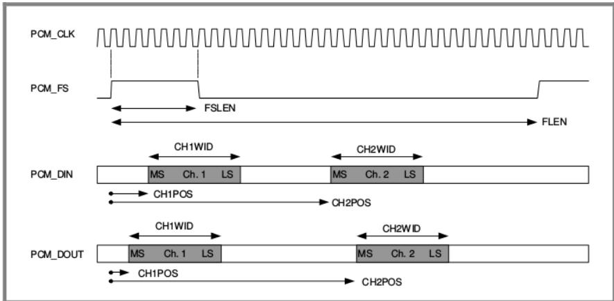


The PCM_CLK can be asynchronous to the bus APB clock and can be logically inverted if required


The direction of the PCM_CLK and PCM_FS signals can be individually selected, allowing the interface to act as a master or slave device.

The input interface is also capable of supporting up to 2 PDM (Pulse Density Modulation) microphones, as an alternativ to the classic PCM input format, in conjunction with a PCM output.

## 7.2. Block Diagram

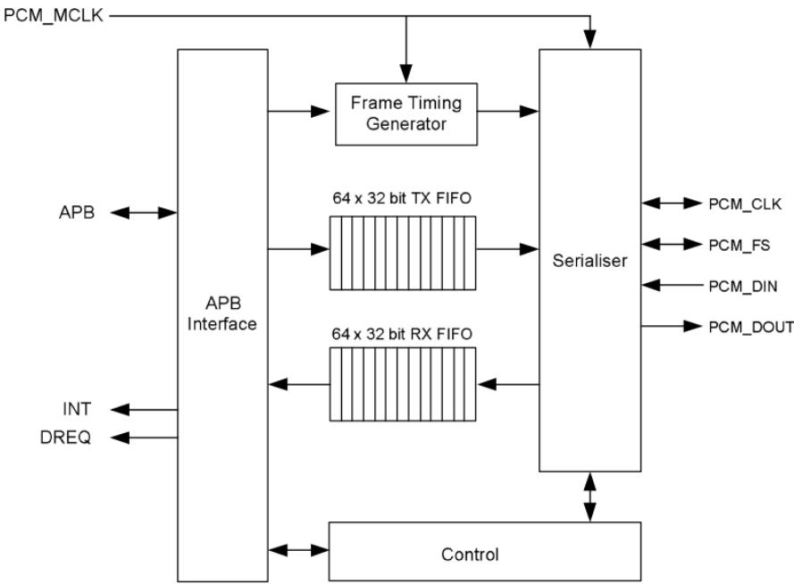


The PCM audio interface contains separate transmit and receive FIFOs. Note that if the frame contains two data channels, they must share the same FIFO and so the channel data will be interleaved. The block can be driven using simple polling, an interrupt based method or direct DMA control.


## 7.3. Typical Timing

Figure 10 shows typical interface timing and indicates the flexibility that the peripheral offers.

Normally PCM output signals change on the rising edge of PCM_CLK and input signals are sampled on its falling edge The frame sync is considered as a data signal and sampled in the same way.

The front end of the PCM audio interface is run off the PCM_CLK and the PCM signals are timed against this clock However, the polarity of the PCM_CLK can be physically inverted, in which case the edges are reversed.

In clock master mode $( C L K M = 0 ) ,$ the PCM_CLK is an output and is driven from the PCM_MCLK clock input.

In clock slave mode (CLKM=1), the PCM_CLK is an input, supplied by some external clock source.

In frame sync master mode (FSM=0), the PCM_FS is internally generated and is treated as a data output that changes on the positive edge of the clock. The length and polarity of the frame sync is fully programmable and it can be used as a standard frame sync signal, or as an L-R signal for I2S.

In frame sync slave mode (FSM=1), the PCM_FS is treated as a data input and is sampled on the negative edge of PCM_CLK. The first clock of a frame is taken as the first clock period where PCM_FS is sampled as a 1 following a period or periods where it was previously a 0. The PCM audio interface locks onto the incoming frame sync and uses this to indicate where the data channels are positioned. The precise timing at the start of frame is shown in Figure 12.

Note that in frame sync slave mode there are two synchronising methods. The legacy method is used when the frame length = 0. In this case the internal frame logic has to detect the incoming PCM_FS signal and reset the internal frame counter at the start of every frame. The logic relies on the PCM_FS to indicate the length of the frame and so can cope with adjacent frames of different lengths. However, this creates a short timing path that will corrupt the PCM_DOUT for one specific frame/channel setting

The preferred method is to set the frame length to the expected length. Here the incoming PCM_FS is used to resynchronise the internal frame counter and this eliminates the short timing path

## 7.4. Operation

The PCM interface runs asynchronously at the PCM_CLK rate and automatically transfers transmit and receive data across to the internal APB clock domain. The control registers (with the exception of INTSTC_A and GRAY) are NOT synchronised and should be programmed before the device is enabled and should NOT be changed whilst the interface is running.

Only the EN, RXON and TXON bits of the PCMCS register are synchronised across the PCM - APB clock domain and are allowed to be changed whilst the interface is running.

The EN bit is a global power-saving enable. The TXON and RXON bits enable transmit and receive, and the interface is running whenever either TXON or RXON is enabled.

In operation, the PCM format is programmed by setting the appropriate frame length, frame sync, channel position values and signal polarity controls. The transmit FIFO should be preloaded with data and the interface can then be enabled and started, and will run continuously until stopped. If the receive FIFO becomes full or the transmit FIFO becomes empty, th RXERR or TXERR error flags will be set, but the interface will just continue. If the RX FIFO overflows, new samples are discarded and if the TX FIFO underflows, zeros are transmitted.

Normally channel data is read or written into the appropriate FIFO as a single word. If the channel is less than 32 bits, the data is right justified and should be padded with zeros. If the RXSEX bit is set then the received data is sign extended up to the full 32 bits. When a frame is programmed to have two data channels, then each channel is written/read as a separate word in the FIFO, producing an interleaved data stream. When initialising the interface, the first word read out of the TX FIFO will be used for the first channel, and the data from the first channel on the first frame to be received will be the first word written into the RX FIFO.

If a FIFO error occurs in a two channel frame, then channel synchronisation may be lost which may result in a left-right audio channel swap. RXSYNC and TXSYNC status bits are provided to help determine if channel slip has occurred. They indicate if the number of words in the FIFO is a multiple of a full frame (taking into account where we are in the current frame being transferred). This assumes that an integer number of frames data has been sent/read from the FIFOs.

If a frame is programmed to have two data channels and the packed mode bits are set (FRXP / FTXP) then the FIFOs are configured so that each word contains the data for both channels (2 x 16-bit samples). In this mode each word written to the TX FIFO contains two 16-bit samples, and the Least Significant sample is transmitted first, Fach word read from the RX FIFO will contain the data received from two channels, the first channel received will be in the Least Significant half of the word. If the channel’s size is less than 16 bits, the TX data will be truncated and RX data will be padded to 16 bits with zeros.

Note that data is always serialised MS-bit first. This is well-established behaviour in both PCM and I2S

If the PDM input mode is enabled then channel 1 is sampled on the negative edge of PCM_CLK whilst channel 2 is sampled on the positive edge of PCM_CLK

Figure 12. Timing at Start of Frame

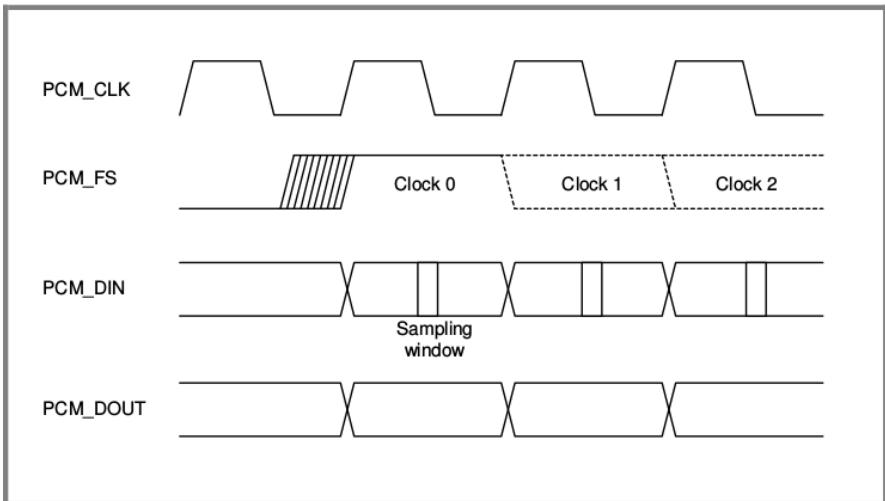


Note that the precise timing of PCM_FS (when it is an input) is not clearly defined and it may change state before or after the positive edge of the clock. Here the first clock of the frame is defined as the clock period where the PCM FS is sampled (on a negative edge of PCM_CLK) as a 1 where it was previously sampled as a 0

## 7.5. Software Operation

## 7.5.1. Operating in Polled mode

1. Set the EN bit to enable the PCM block. Set all operational values to define the frame and channel settings. Assert RXCLR and/or TXCLR and wait for 2 PCM clocks to ensure the FIFOs are reset. The SYNC bit can be used t determine when 2 clocks have passed. Set RXTHR/TXTHR to determine the FIFO thresholds

2. If transmitting, ensure that sufficient sample words have been written to PCM FIFO before transmission is started Set TXON and/or RXON to begin operation.

3. Poll TXW writing sample words to PCM FIFO and poll RXR reading sample words from PCM FIFO, until all data is transferred.

## 7.5.2. Operating in Interrupt mode

1. Set the EN bit to enable the PCM block. Set all operational values to define the frame and channel settings. Assert RXCL R and/or TXCL R and wait for 2 PCM clocks to ensure the EIFOs are reset The SYNC bit can be used to determine when 2 clocks have passed. Set RXTHR/TXTHR to determine the FIFO thresholds

2. Set INTR and/or INTT to enable interrupts.

3. If transmitting, ensure that sufficient sample words have been written to PCM FIFO before transmission is started. Set TXON and/or RXON to begin operation.

4. When an interrupt occurs, check RXR. If this is set then one or more sample words are available in PCM FIFO. If TXW is set then one or more sample words can be sent to PCM FIFO.

## 7.5.3. DMA

1. Set the EN bit to enable the PCM block. Set all operational values to define the frame and channel settings. Assert RXCLR and/or TXCLR and wait for 2 PCM clocks to ensure the FIFOs are reset. The SYNC bit can be used to determine when 2 clocks have passed.

2. Set DMAEN to enable DMA DREQ generation and set RX_REQ/TX_REQ to determine the FIFO thresholds for the DREQs. If required, set TX_PANIC and RX_PANIC to determine the level at which the DMA should increase its AXI priority,

3. In the DMA controllers set the correct DREQ channels, one for RX and one for TX. Start the DMA which should fill the TX FIFO.

4. Set TXON and/or RXON to begin operation.

## 7.6. Error Handling

In all software operational modes, the possibility of FIFO over- or under-run exists. Should this happen when using 2 channels per frame, there is a risk of losing sync with the channel data stored in the FIFO. If this happens and is not detected and corrected, then the data channels may become swapped

The FIFOs will automatically detect an error condition caused by a FIFO over- or under-run and this will set the appropriate latching error bit in the control/status register. Writing a ‘1’ back to this error bit will clear the latched flag

In a system using a polled operation, the error bits can be checked manually. For an interrupt or DMA based system, setting the RXERR and/or TXERR bits in INTEN_A will cause the PCM interface to generate an interrupt when an error is detected.

If a FIFO error occurs during operation in which 2 data channels are being used then the synchronisation of the data may be lost. This can be recovered by either of these two methods:

Disable transmit and receive (set TXON and RXON to 0). Clear the FIFOs (set RXCLR and TXCLR to 1). Note that it may take up to 2 PCM clocks for the FIFOs to be physically cleared after initiating a clear. Then preload the transmit FIFO and restart transmission. This of course loses the data in the FIFO and further interrupts the data flow to the external device.

• Examine the TXSYNC and RXSYNC flags. These flags indicate if the amount of data in the FIFO is a whole number of frames, automatically taking into account where we are in the current frame being transmitted or received. Thus, providing an even number of samples was read or written to the FIFOs, then if the flags are set then this indicates that a single word needs to be written or read to adjust the data. Normal exchange of data can then proceed (where the first word in a data pair is for channel 1) This method should cause less disruption to the data stream

## 7.7. PDM Input Mode Operation

The PDM input mode is capable of interfacing with two digital half-cycle PDM microphones and implements a 4<sup>th</sup> order CIC decimation filter with a selectable decimation factor. The clock input of the microphones is shared with the PCM output codec and it should be configured to provide the correct clock rate for the microphones. As a result it may b necessary to add a number of padding bits into the PCM output and configure the output codec to allow for this.

When using the PDM input mode the bit width and the rate of the data received will depend on the decimation factor used Once the data has been read from the peripheral a further decimation and filtering stage will be required and can b implemented in software. The software filter should also correct the droop introduced by the CIC filter stage. Similarly DC correction stage should also be employed.

<table><tr><td>PDMN</td><td>PCM_CLK (MHz)</td><td>Peripheral Output Format</td><td>OSR</td><td>Fs</td></tr><tr><td>0 (N=16)</td><td>3.072</td><td>16 bits unsigned</td><td>4</td><td>48kHz</td></tr><tr><td>1 (N=32)</td><td>3.072</td><td>20 bits unsigned</td><td>2</td><td>48kHz</td></tr></table>

## 7.8. GRAY Code Input Mode Operation

GRAY mode is used for an incoming data stream only. GRAY mode is selected by setting the enable bit (EN) in the PCM_GRAY register.

In this mode data is received on the PCM_DIN (data) and the PCM_FS (strobe) pins. The data is expected to be in data/strobe format. In this mode data is detected when either the data or the strobe change state. As each bit is received it is written into the RX buffer and when 32 bits are received they are written out to the RX FIFO as a 32-bit word. In order for this mode to work the user must program a PCM clock rate which is 4 times faster then the gray data rate. Also the gray coded data input signals should be clean

The normal RX_REQ and RXTHR FIFO levels will apply as for normal PCM received data.

If a message is received that is not a multiple of 32 bits, any data in the RX buffer can be flushed out by setting the flush bit (FLUSH). Once set, this bit will read back as zero until the flush operation has completed. This may take several cycles as the APB clock may be many times faster than the PCM clock. Once the flush has occurred, the bits are packed up to 32 bits with zeros and written out to the RX FIFO. The flushed field (FLUSHED) will indicate how many of bits of this word ar valid.

Note that to get an accurate indication of the number of bits currently in the RX shift register (RXLEVEL) the APB clock must be at least twice the PCM_CLK.

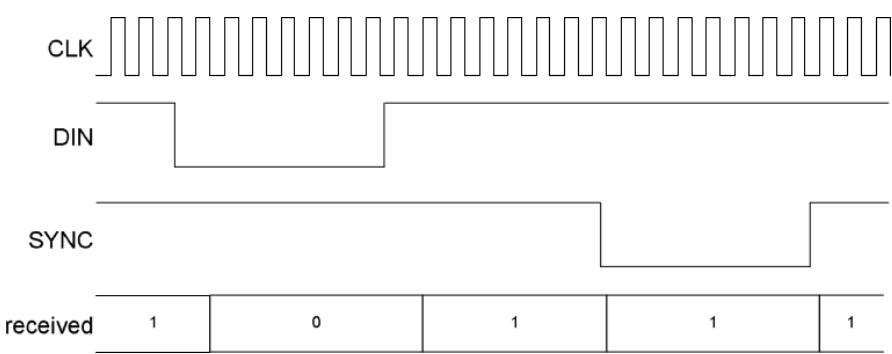


## 7.9. PCM Register Map

There is only one PCM module in the BCM2711. The PCM base address for the registers is 0x7e203000.

<table><tr><td>Offset</td><td>Name</td><td>Description</td></tr><tr><td>0x00</td><td>CS_A</td><td>PCM Control and Status</td></tr><tr><td>0x04</td><td>FIFO_A</td><td>PCM FIFO Data</td></tr><tr><td>0x08</td><td>MODE_A</td><td>PCM Mode</td></tr><tr><td>0x0c</td><td>RXC_A</td><td>PCM Receive Configuration</td></tr><tr><td>0x10</td><td>TXC_A</td><td>PCM Transmit Configuration</td></tr><tr><td>0x14</td><td>DREQ_A</td><td>PCM DMA Request Level</td></tr><tr><td>0x18</td><td>INTEN_A</td><td>PCM Interrupt Enables</td></tr><tr><td>0x1c</td><td>INTSTC_A</td><td>PCM Interrupt Status &amp; Clear</td></tr><tr><td>0x20</td><td>GRAY</td><td>PCM Gray Mode Control</td></tr></table>

## CS_A Register

## Description

This register contains the main control and status bits for the PCM. The bottom 3 bits of this register can be written to whilst the PCM is running. The remaining bits cannot.

<table><tr><td>Bits</td><td>Name</td><td>Description</td><td>Type</td><td>Reset</td></tr><tr><td>31:25</td><td>Reserved.</td><td>-</td><td>-</td><td>-</td></tr><tr><td>24</td><td>SYNC</td><td>PCM Clock sync helper.This bit provides a software synchronisation mechanism to allow the software to detect when 2 PCM clocks have occurred. It takes 2 PCM clocks before the value written to this bit will be echoed back in the read value.</td><td>RW</td><td>0x0</td></tr><tr><td>23</td><td>RXSEX</td><td>RX Sign Extend0 = No sign extension.1 = Sign extend the RX data. When set, the MSB of the received data channel (as set by the CHxWID parameter) is repeated in all the higher data bits up to the full 32-bit data width.</td><td>RW</td><td>0x0</td></tr><tr><td>22</td><td>RXF</td><td>RX FIFO is Full0 = RX FIFO can accept more data.1 = RX FIFO is full and will overflow if more data is received.</td><td>RO</td><td>0x0</td></tr><tr><td>21</td><td>TXE</td><td>TX FIFO is Empty0 = TX FIFO is not empty.1 = TX FIFO is empty and underflow will take place if no more data is written.</td><td>RO</td><td>0x1</td></tr><tr><td>20</td><td>RXD</td><td>Indicates that the RX FIFO contains Data0 = RX FIFO is empty.1 = RX FIFO contains at least 1 sample.</td><td>RO</td><td>0x0</td></tr><tr><td>19</td><td>TXD</td><td>Indicates that the TX FIFO can accept Data0 = TX FIFO is full and so cannot accept more data.1 = TX FIFO has space for at least 1 sample.</td><td>RO</td><td>0x1</td></tr><tr><td>18</td><td>RXR</td><td>Indicates that the RX FIFO needs Reading0 = RX FIFO is less than RXTHR full.1 = RX FIFO is RXTHR or more full.This is cleared by reading sufficient data from the RX FIFO.</td><td>RO</td><td>0x0</td></tr><tr><td>17</td><td>TXW</td><td>Indicates that the TX FIFO needs Writing0 = TX FIFO is at least TXTHR full.1 = TX FIFO is less than TXTHR full.This is cleared by writing sufficient data to the TX FIFO.</td><td>RO</td><td>0x1</td></tr><tr><td>16</td><td>RXERR</td><td>RX FIFO Error0 = FIFO has had no errors.1 = FIFO has had an under or overflow error.This flag is cleared by writing a 1.</td><td>W1C</td><td>0x0</td></tr><tr><td>15</td><td>TXERR</td><td>TX FIFO Error0 = FIFO has had no errors.1 = FIFO has had an under or overflow error.This flag is cleared by writing a 1.</td><td>W1C</td><td>0x0</td></tr><tr><td>14</td><td>RXSYNC</td><td>RX FIFO Sync0 = FIFO is out of sync. The amount of data left in the FIFO is not a multiple of that required for a frame. This takes into account if we are halfway through the frame.1 = FIFO is in sync.</td><td>RO</td><td>0x0</td></tr><tr><td>13</td><td>TXSYNC</td><td>TX FIFO Sync0 = FIFO is out of sync. The amount of data left in the FIFO is not a multiple of that required for a frame. This takes into account if we are halfway through the frame.1 = FIFO is in sync.</td><td>RO</td><td>0x0</td></tr><tr><td>12:10</td><td>Reserved.</td><td>-</td><td>-</td><td>-</td></tr><tr><td>9</td><td>DMAEN</td><td>DMA DREQ Enable0 = Don't generate DMA DREQ requests.1 = Generates a TX DMA DREQ request whenever the TX FIFO level is lower than TX_REQ or generates a RX DMA DREQ when the RX FIFO level is higher than RX_REQ.</td><td>RW</td><td>0x0</td></tr><tr><td>8:7</td><td>RXTHR</td><td>Sets the RX FIFO threshold at which point the RXR flag is set00 = set when we have a single sample in the RX FIFO01 = set when the RX FIFO is at least <eq>\frac{1}{4}</eq> full10 = set when the RX FIFO is at least <eq>\frac{3}{4}</eq> full11 = set when the RX FIFO is full</td><td>RW</td><td>0x0</td></tr><tr><td>6:5</td><td>TXTHR</td><td>Sets the TX FIFO threshold at which point the TXW flag is set00 = set when the TX FIFO is empty01 = set when the TX FIFO is less than 1/4 full10 = set when the TX FIFO is less than 3/4 full11 = set when the TX FIFO is full but for one sample</td><td>RW</td><td>0x0</td></tr><tr><td>4</td><td>RXCLR</td><td>Clear the RX FIFO.Assert to clear RX FIFO. This bit is self clearing and is always read as clearNote that it will take 2 PCM clocks for the FIFO to be physically cleared.</td><td>W1SC</td><td>0x0</td></tr><tr><td>3</td><td>TXCLR</td><td>Clear the TX FIFOAssert to clear TX FIFO. This bit is self clearing and is always read as clear.Note that it will take 2 PCM clocks for the FIFO to be physically cleared.</td><td>W1SC</td><td>0x0</td></tr><tr><td>2</td><td>TXON</td><td>Enable transmission0 = Stop transmission. This will stop immediately if possible or else at the end of the next frame. The TX FIFO can still be written to, to preload data.1 = Start transmission. This will start transmitting at the start of the next frame. Once enabled, the first data read from the TX FIFO will be placed in the first channel of the frame, thus ensuring proper channel synchronisation.The frame counter will be started whenever TXON or RXON are set.This bit can be written whilst the interface is running.</td><td>RW</td><td>0x0</td></tr><tr><td>1</td><td>RXON</td><td>Enable reception.0 = Disable reception. This will stop on the next available frame end. RX FIFO data can still be read.1 = Enable reception. This will start receiving at the start of the next frame. The first channel to be received will be the first word written to the RX FIFO.This bit can be written whilst the interface is running.</td><td>RW</td><td>0x0</td></tr><tr><td>0</td><td>EN</td><td>Enable the PCM Audio Interface0 = The PCM interface is disabled and most logic is gated off to save power.1 = The PCM Interface is enabled.This bit can be written whilst the interface is running.</td><td>RW</td><td>0x0</td></tr></table>

## FIFO_A Register

## Description

This is the FIFO port of the PCM. Data written here is transmitted, and received data is read from here

<table><tr><td>Bits</td><td>Name</td><td>Description</td><td>Type</td><td>Reset</td></tr><tr><td>31:0</td><td>FIFO</td><td>Data written here is transmitted, and received data is read from here.</td><td>RW</td><td>0x00000000</td></tr></table>

## MODE_A Register

## Description

This register defines the basic PCM Operating Mode. It is used to configure the frame size and format and whether the PCM is in master or slave modes for its frame sync or clock. This register cannot be changed whilst the PCM is running.

<table><tr><td>Bits</td><td>Name</td><td>Description</td><td>Type</td><td>Reset</td></tr><tr><td>31:29</td><td>Reserved.</td><td>-</td><td>-</td><td>-</td></tr><tr><td>28</td><td>CLK_DIS</td><td>PCM Clock Disable1 = Disable the PCM Clock.This cleanly disables the PCM clock. This enables glitch free clock switching between an internal and an uncontrollable external clock. The PCM clock can be disabled, and then the clock source switched, and then the clock re-enabled.0 = Enable the PCM clock.</td><td>RW</td><td>0x0</td></tr><tr><td>27</td><td>PDMN</td><td>PDM Decimation Factor (N)0 = Decimation factor 16.1 = Decimation factor 32.Sets the decimation factor of the CIC decimation filter.</td><td>RW</td><td>0x0</td></tr><tr><td>26</td><td>PDME</td><td>PDM Input Mode Enable0 = Disable PDM (classic PCM input).1 = Enable PDM input filter.Enable CIC filter on input pin for PDM inputs. In order to receive data RXON must also be set.</td><td>RW</td><td>0x0</td></tr><tr><td>25</td><td>FRXP</td><td>Receive Frame Packed Mode0 = The data from each channel is written into the RX FIFO.1 = The data from both RX channels is merged (1st channel is in the LS half) and then written to the RX FIFO as a single 2x16-bit packed mode word.First received channel in the frame goes into the LS half word. If the received data is larger than 16 bits, the upper bits are truncated. The maximum channel size is 16 bits.</td><td>RW</td><td>0x0</td></tr><tr><td>24</td><td>FTXP</td><td>Transmit Frame Packed Mode0 = Each TX FIFO word is written into a single channel.1 = Each TX FIFO word is split into 2 16-bit words and used to fill both data channels in the same frame. The maximum channel size is 16 bits.The LS half of the word is used in the first channel of the frame.</td><td>RW</td><td>0x0</td></tr><tr><td>23</td><td>CLKM</td><td>PCM Clock Mode0 = Master mode. The PCM CLK is an output and drives at the MCLK rate.1 = Slave mode. The PCM CLK is an input.</td><td>RW</td><td>0x0</td></tr><tr><td>22</td><td>CLKI</td><td>Clock InvertThis logically inverts the PCM_CLK signal.0 = Outputs change on rising edge of clock, inputs are sampled on falling edge.1 = Outputs change on falling edge of clock, inputs are sampled on rising edge.</td><td>RW</td><td>0x0</td></tr><tr><td>21</td><td>FSM</td><td>Frame Sync Mode0 = Master mode. The PCM_FS is an output and we generate the frame sync.1 = Slave mode. The PCM_FS is an input and we lock onto the incoming frame sync signal.</td><td>RW</td><td>0x0</td></tr><tr><td>20</td><td>FSI</td><td>Frame Sync InvertThis logically inverts the frame sync signal.0 = In master mode, FS is normally low and goes high to indicate frame sync. In slave mode, the frame starts with the clock where FS is a 1 after being a 0.1 = In master mode, FS is normally high and goes low to indicate frame sync. In slave mode, the frame starts with the clock where FS is a 0 after being a 1.</td><td>RW</td><td>0x0</td></tr><tr><td>19:10</td><td>FLEN</td><td>Frame LengthSets the frame length to (FLEN+1) clocks.1 = frame length of 2 clocks.2 = frame length of 3 clocks.etc.</td><td>RW</td><td>0x000</td></tr><tr><td>9:0</td><td>FSLEN</td><td>Frame Sync LengthSets the frame sync length to (FSLEN) clocks. This is only used when FSM = 0.PCM_FS will remain permanently active if FSLEN &gt;= FLEN.0 = frame sync pulse is off.1 = frame sync pulse is 1 clock wide.etc.</td><td>RW</td><td>0x000</td></tr></table>

## RXC_A Register

## Description

Sets the Channel configurations for Receiving. This sets the position and width of the 2 receive channels within the frame. The two channels cannot overlap, however channel 2 can come after channel 1, although the first data will always be from the first channel in the frame. Channels can also straddle the frame begin-end boundary (as set b the frame sync position). This register cannot be changed whilst the PCM is running.

<table><tr><td>Bits</td><td>Name</td><td>Description</td><td>Type</td><td>Reset</td></tr><tr><td>31</td><td>CH1WEX</td><td>Channel 1 Width Extension BitThis is the MSB of the channel 1 width (CH1WID). It allows widths greater than 24 bits to be programmed and is added here to keep backwards compatibility with older versions of the PCM</td><td>RW</td><td>0x0</td></tr><tr><td>30</td><td>CH1EN</td><td>Channel 1 Enable0 = Channel 1 disabled and no data is received from channel 1 and written to the RX FIFO.1 = Channel 1 enabled.</td><td>RW</td><td>0x0</td></tr><tr><td>29:20</td><td>CH1POS</td><td>Channel 1 PositionThis sets the bit clock at which the first bit (MS bit) of channel 1 data occurs in the frame.0 indicates the first clock of frame.</td><td>RW</td><td>0x000</td></tr><tr><td>19:16</td><td>CH1WID</td><td>Channel 1 WidthThis sets the width of channel 1 in bit clocks. This field has been extended with the CH1WEX bit giving a total width of (CH1WEX * 16) + CH1WID + 8. The maximum supported width is 32 bits.0 = 8 bits wide1 = 9 bits wideetc.</td><td>RW</td><td>0x0</td></tr><tr><td>15</td><td>CH2WEX</td><td>Channel 2 Width Extension BitThis is the MSB of the channel 2 width (CH2WID). It allows widths greater than 24 bits to be programmed and is added here to keep backwards compatibility with older versions of the PCM</td><td>RW</td><td>0x0</td></tr><tr><td>14</td><td>CH2EN</td><td>Channel 2 Enable0 = Channel 2 disabled and no data is received from channel 2 and written to the RX FIFO.1 = Channel 2 enabled.</td><td>RW</td><td>0x0</td></tr><tr><td>13:4</td><td>CH2POS</td><td>Channel 2 PositionThis sets the bit clock at which the first bit (MS bit) of channel 2 data occurs in the frame.0 indicates the first clock of frame.</td><td>RW</td><td>0x000</td></tr><tr><td>3:0</td><td>CH2WID</td><td>Channel 2 WidthThis sets the width of channel 2 in bit clocks. This field has been extended with the CH2WEX bit giving a total width of (CH2WEX * 16) + CH2WID + 8. The maximum supported width is 32 bits.0 = 8 bits wide1 = 9 bits wideetc.</td><td>RW</td><td>0x0</td></tr></table>

## TXC_A Register

## Description

Sets the Channel configurations for Transmitting. This sets the position and width of the 2 transmit channels within the frame. The two channels cannot overlap, however channel 2 can come after channel 1, although the first data will always be used in the first channel in the frame. Channels can also straddle the frame begin-end boundary (as set by the frame sync position). This register cannot be changed whilst the PCM is running.

<table><tr><td>Bits</td><td>Name</td><td>Description</td><td>Type</td><td>Reset</td></tr><tr><td>31</td><td>CH1WEX</td><td>Channel 1 Width Extension BitThis is the MSB of the channel 1 width (CH1WID). It allows widths greater than 24 bits to be programmed and is added here to keep backwards compatibility with older versions of the PCM</td><td>RW</td><td>0x0</td></tr><tr><td>30</td><td>CH1EN</td><td>Channel 1 Enable0 = Channel 1 disabled and no data is taken from the TX FIFO and transmitted on channel 1.1 = Channel 1 enabled.</td><td>RW</td><td>0x0</td></tr><tr><td>29:20</td><td>CH1POS</td><td>Channel 1 PositionThis sets the bit clock at which the first bit (MS bit) of channel 1 data occurs in the frame.0 indicates the first clock of frame.</td><td>RW</td><td>0x000</td></tr><tr><td>19:16</td><td>CH1WID</td><td>Channel 1 WidthThis sets the width of channel 1 in bit clocks. This field has been extended with the CH1WEX bit giving a total width of (CH1WEX * 16) + CH1WID + 8. The maximum supported width is 32 bits.0 = 8 bits wide1 = 9 bits wideetc.</td><td>RW</td><td>0x0</td></tr><tr><td>15</td><td>CH2WEX</td><td>Channel 2 Width Extension BitThis is the MSB of the channel 2 width (CH2WID). It allows widths greater than 24 bits to be programmed and is added here to keep backwards compatibility with older versions of the PCM</td><td>RW</td><td>0x0</td></tr><tr><td>14</td><td>CH2EN</td><td>Channel 2 Enable0 = Channel 2 disabled and no data is taken from the TX FIFO and transmitted on channel 2.1 = Channel 2 enabled.</td><td>RW</td><td>0x0</td></tr><tr><td>13:4</td><td>CH2POS</td><td>Channel 2 PositionThis sets the bit clock at which the first bit (MS bit) of channel 2 data occurs in the frame.0 indicates the first clock of frame.</td><td>RW</td><td>0x000</td></tr><tr><td>3:0</td><td>CH2WID</td><td>Channel 2 WidthThis sets the width of channel 2 in bit clocks. This field has been extended with the CH2WEX bit giving a total width of (CH2WEX * 16) + CH2WID + 8. The maximum supported width is 32 bits.0 = 8 bits wide1 = 9 bits wideetc.</td><td>RW</td><td>0x0</td></tr></table>

## DREQ_A Register

## Description

Set the DMA DREQ and Panic thresholds. The PCM drives 2 DMA controls back to the DMA, one for the TX channel and one for the RX channel. DMA DREQ is used to request the DMA to perform another transfer, and DMA Panic is used to tell the DMA to use its panic level of priority when requesting things on the AXI bus. This register cannot be changed whilst the PCM is running.

<table><tr><td>Bits</td><td>Name</td><td>Description</td><td>Type</td><td>Reset</td></tr><tr><td>31</td><td>Reserved.</td><td>-</td><td>-</td><td>-</td></tr></table>

Table 149. INTEN_A Register

<table><tr><td>Bits</td><td>Name</td><td>Description</td><td>Type</td><td>Reset</td></tr><tr><td>30:24</td><td>TX_PANIC</td><td>TX Panic LevelThis sets the TX FIFO Panic level. When the level is below this the PCM will assert its TX DMA Panic signal.</td><td>RW</td><td>0x10</td></tr><tr><td>23</td><td>Reserved.</td><td>-</td><td>-</td><td>-</td></tr><tr><td>22:16</td><td>RX_PANIC</td><td>RX Panic LevelThis sets the RX FIFO Panic level. When the level is above this the PCM will assert its RX DMA Panic signal.</td><td>RW</td><td>0x30</td></tr><tr><td>15</td><td>Reserved.</td><td>-</td><td>-</td><td>-</td></tr><tr><td>14:8</td><td>TX_REQ</td><td>TX Request LevelThis sets the TX FIFO DREQ level. When the level is below this the PCM will assert its DMA DREQ signal to request that more data is written to the TX FIFO.</td><td>RW</td><td>0x30</td></tr><tr><td>7</td><td>Reserved.</td><td>-</td><td>-</td><td>-</td></tr><tr><td>6:0</td><td>RX_REQ</td><td>RX Request LevelThis sets the RX FIFO DREQ level. When the level is above this the PCM will assert its DMA DREQ signal to request that some more data is read out of the RX FIFO.</td><td>RW</td><td>0x20</td></tr></table>

## INTEN_A Register

## Description

Set the reasons for generating an Interrupt. This register cannot be changed whilst the PCM is running.

<table><tr><td>Bits</td><td>Name</td><td>Description</td><td>Type</td><td>Reset</td></tr><tr><td>31:4</td><td>Reserved.</td><td>-</td><td>-</td><td>-</td></tr><tr><td>3</td><td>RXERR</td><td>RX Error InterruptSetting this bit enables interrupts from PCM block when RX FIFO error occurs.</td><td>RW</td><td>0x0</td></tr><tr><td>2</td><td>TXERR</td><td>TX Error InterruptSetting this bit enables interrupts from PCM block when TX FIFO error occurs.</td><td>RW</td><td>0x0</td></tr><tr><td>1</td><td>RXR</td><td>RX Read Interrupt EnableSetting this bit enables interrupts from PCM block when RX FIFO level is greater than or equal to the specified RXTHR level.</td><td>RW</td><td>0x0</td></tr><tr><td>0</td><td>TXW</td><td>TX Write Interrupt EnableSetting this bit enables interrupts from PCM block when TX FIFO level is less than the specified TXTHR level.</td><td>RW</td><td>0x0</td></tr></table>

## INTSTC_A Register

## Description

This register is used to read and clear the PCM interrupt status. Writing a 1 to the asserted bit clears the bit. Writing a 0 has no effect

<table><tr><td>Bits</td><td>Name</td><td>Description</td><td>Type</td><td>Reset</td></tr><tr><td>31:4</td><td>Reserved.</td><td>-</td><td>-</td><td>-</td></tr></table>

Table 151. GRAY Register

<table><tr><td>Bits</td><td>Name</td><td>Description</td><td>Type</td><td>Reset</td></tr><tr><td>3</td><td>RXERR</td><td>RX Error Interrupt Status / ClearThis bit indicates an interrupt occurred on RX FIFO Error.Writing 1 to this bit clears it. Writing 0 has no effect.</td><td>W1C</td><td>0x0</td></tr><tr><td>2</td><td>TXERR</td><td>TX Error Interrupt Status / ClearThis bit indicates an interrupt occurred on TX FIFO Error.Writing 1 to this bit clears it. Writing 0 has no effect.</td><td>W1C</td><td>0x0</td></tr><tr><td>1</td><td>RXR</td><td>RX Read Interrupt Status / ClearThis bit indicates an interrupt occurred on RX Read.Writing 1 to this bit clears it. Writing 0 has no effect.</td><td>W1C</td><td>0x0</td></tr><tr><td>0</td><td>TXW</td><td>TX Write Interrupt Status / ClearThis bit indicates an interrupt occurred on TX Write.Writing 1 to this bit clears it. Writing 0 has no effect.</td><td>W1C</td><td>0x0</td></tr></table>

## GRAY Register

## Description

This register is used to control the gray mode generation. This is used to put the PCM into a special data/strobe mode. This mode is under 'best effort' contract.

<table><tr><td>Bits</td><td>Name</td><td>Description</td><td>Type</td><td>Reset</td></tr><tr><td>31:22</td><td>Reserved.</td><td>-</td><td>-</td><td>-</td></tr><tr><td>21:16</td><td>RXFIFOLEVEL</td><td>The current level of the RX FIFOThis indicates how many words are currently in the RX FIFO.</td><td>RO</td><td>0x00</td></tr><tr><td>15:10</td><td>FLUSHED</td><td>The number of bits that were flushed into the RX FIFOThis indicates how many bits were valid when the flush operation was performed. The valid bits are from bit 0 upwards. Non-valid bits are set to zero.</td><td>RO</td><td>0x00</td></tr><tr><td>9:4</td><td>RXLEVEL</td><td>The current fill level of the RX BufferThis indicates how many GRAY coded bits have been received. When 32 bits are received, they are written out into the RX FIFO.</td><td>RO</td><td>0x00</td></tr><tr><td>3</td><td>Reserved.</td><td>-</td><td>-</td><td>-</td></tr><tr><td>2</td><td>FLUSH</td><td>Flush the RX Buffer into the RX FIFOThis forces the RX Buffer to do an early write. This is necessary if we have reached the end of the message and we have bits left in the RX Buffer. Flushing will write these bits as a single 32-bit word, starting at bit zero. Empty bits will be packed with zeros. The number of bits written will be recorded in the FLUSHED field.This bit is written as a 1 to initiate a flush. It will read back as a zero until the flush operation has completed (as the PCM Clock may be very slow).</td><td>RW</td><td>0x0</td></tr><tr><td>1</td><td>CLR</td><td>Clear the GRAY Mode LogicThis bit will reset all the GRAY mode logic, and flush the RX buffer. It is not self clearing.</td><td>RW</td><td>0x0</td></tr><tr><td>0</td><td>EN</td><td>Enable GRAY ModeSetting this bit will put the PCM into GRAY mode. In gray mode the data is received on the data in and the frame sync pins. The data is expected to be in data/strobe format.</td><td>RW</td><td>0x0</td></tr></table>

# Chapter 8. Pulse Width Modulator

## 8.1. Overview

This section specifies in detail the functionality provided by the device Pulse Width Modulator (PWM) peripherals. Each PWM controller incorporates the following features:

• Two independent output bit-streams, clocked at a fixed frequency

• Bit-streams configured individually to output either PWM or a serialised version of a 32-bit word

• PWM outputs have variable output resolutions

• Serialise mode configured to read data from a FIFO storage block, which can store up to sixty-four 32-bit words

• Both modes clocked by clk_pwm which is nominally 100MHz, but can be varied by the clock manager

## 8.2. Block Diagram

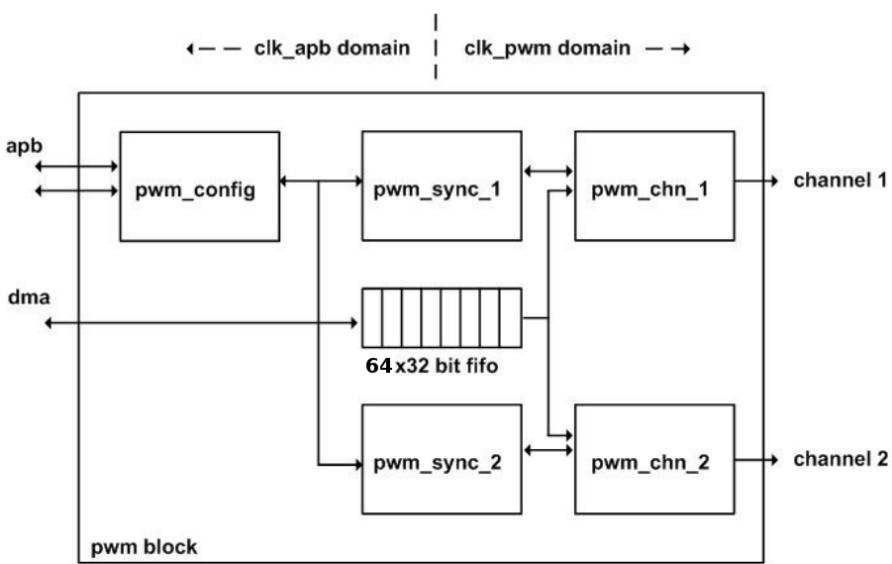


The BCM2711 device has two instances of this block, named PWM0 and PWM1 (each with two output channels).


## 8.3. PWM Implementation

A value represented as a ratio of N/M can be transmitted along a serial channel with pulse width modulation, in which the value is represented by the duty cycle of the output signal. To send value N/M within a periodic sequence of M cycles, output should be 1 for N cycles and 0 for (M-N) cycles. The desired sequence should have 1s and 0s spread out as evenly as possible, so that during any arbitrary period of time the duty cycle achieves the closest approximation of the value. This can be shown in the following table where 4/8 is modulated $( N = 4 , M = 8 )$ .

<table><tr><td>Bad</td><td>0</td><td>0</td><td>0</td><td>0</td><td>1</td><td>1</td><td>1</td><td>1</td><td>0</td><td>0</td><td>0</td><td>0</td></tr><tr><td>Fair</td><td>0</td><td>0</td><td>1</td><td>1</td><td>0</td><td>0</td><td>1</td><td>1</td><td>0</td><td>0</td><td>1</td><td>1</td></tr><tr><td>Good</td><td>0</td><td>1</td><td>0</td><td>1</td><td>0</td><td>1</td><td>0</td><td>1</td><td>0</td><td>1</td><td>0</td><td>1</td></tr></table>

Sequence which gives the ‘good’ approximation from the table above can be achieved by the following algorithm

```txt
1. Set context = 0
2. context = context + N
3. if (context >= M)
    context = context - M
    send 1
    else
    send 0
4. Repeat from step 2
```

where context is a register which stores the result of the additions/subtractions.

## 8.4. Modes of Operation

The PWM controller consists of two independent channels (pwm_chn_i in Figure 14) which implement the PWM algorithm explained in the previous section. Each channel can operate in either PWM mode or serialiser mode

PWM mode: There are two sub-modes in PWM mode: MSEN=0 and MSEN=1.

When MSEN=0 (which is the default mode), data to be sent is interpreted as the value N of the algorithm explained above The number of clock cycles (range) used to send data is the value M of the algorithm. Pulses are sent within this range so that the resulting duty cycle is N/M. The channel sends its output continuously as long as the data register is used (USE i=0), or the FIFO is used and it is not empty.

When MSEN=1, the PWM channel does not use the algorithm explained above, instead it sends serial data with the M/S ratio as in Figure 15. M is the data to be sent, and S is the range. This mode may be preferred if high frequency modulation is not required or has negative effects. The channel sends its output continuously as long as the data register is used (USEFi=0), or the FIFO is used and it is not empty.


Serialiser mode: Each channel is also capable of working as a serialiser. In this mode data written in the FIFO or the data register is sent serially.

## 8.5. Quick Reference

PWM0 DMA is mapped to DMA channel 5.

PWM1 DMA is mapped to DMA channel 1 (muxed with DSI0).

GPIOs are assigned to PWM channels as below. Please refer to the GPIO chapter for further details:

<table><tr><td>GPIO</td><td>ALT0</td><td>ALT1</td><td>ALT2</td><td>ALT3</td><td>ALT4</td><td>ALT5</td></tr><tr><td>GPIO12</td><td>PWM0_0</td><td></td><td></td><td></td><td></td><td></td></tr><tr><td>GPIO13</td><td>PWM0_1</td><td></td><td></td><td></td><td></td><td></td></tr><tr><td>GPIO18</td><td></td><td></td><td></td><td></td><td></td><td>PWM0_0</td></tr><tr><td>GPIO19</td><td></td><td></td><td></td><td></td><td></td><td>PWM0_1</td></tr><tr><td>GPIO40</td><td>PWM1_0</td><td></td><td></td><td></td><td></td><td></td></tr><tr><td>GPIO41</td><td>PWM1_1</td><td></td><td></td><td></td><td></td><td></td></tr><tr><td>GPIO45</td><td>PWM0_1</td><td></td><td></td><td></td><td></td><td></td></tr></table>

• PWM clock source and frequency is controlled in CPRMAN.

## 8.6. Control and Status Registers

The PWM0 register base address is 0x7e20c000 and the PWM1 register base address is 0x7e20c800

<table><tr><td>Offset</td><td>Name</td><td>Description</td></tr><tr><td>0x00</td><td>CTL</td><td>PWM Control</td></tr><tr><td>0x04</td><td>STA</td><td>PWM Status</td></tr><tr><td>0x08</td><td>DMAC</td><td>PWM DMA Configuration</td></tr><tr><td>0x10</td><td>RNG1</td><td>PWM Channel 1 Range</td></tr><tr><td>0x14</td><td>DAT1</td><td>PWM Channel 1 Data</td></tr><tr><td>0x18</td><td>FIF1</td><td>PWM FIFO Input</td></tr><tr><td>0x20</td><td>RNG2</td><td>PWM Channel 2 Range</td></tr><tr><td>0x24</td><td>DAT2</td><td>PWM Channel 2 Data</td></tr></table>

## CTL Register

## Description

PWENi is used to enable/disable the corresponding channel. Setting this bit to 1 enables the channel and transmitter state machine. All registers and FIFOs are writeable without setting this bit.

MODEi bit is used to determine mode of operation. Setting this bit to 0 (the default) enables PWM mode. In this mod data stored in either PWM_DATi or FIFO is transmitted by pulse width modulation within the range defined by PWM_RNGi. When this mode is used, MSENi defines whether to use PWM algorithm or M/S transmission. Setting MODEi to 1 enables serial mode, in which data stored in either PWM_DATi or FIFO is transmitted serially within the range defined by PWM_RNGi. Data is transmitted MSB first and truncated or zero-padded depending on PWM_RNGi

RPTLi is used to enable/disable repeating of the last data available in the FIFO just before it empties. When this bit is 1 and FIFO is used, the last available data in the FIFO is repeatedly sent. This may be useful in PWM mode to avoid duty cycle gaps. If the FIFO is not used this bit does not have any effect. Default operation is do-not-repeat.

SBITi defines the state of the output when no transmission takes place. It also defines the zero polarity for the zero padding in serialiser mode. This bit is padded between two consecutive transfers as well as tail of the data when PWM_RNGi is larger than bit depth of data being transferred. This bit is zero by default.

POLAi is used to configure the polarity of the output bit. When set to high the final output is inverted. Default operation is no inversion.

USEFi bit is used to enable/disable FIFO transfer. When this bit is high data stored in the FIFO is used for transmission. When it is low, data written to PWM_DATi is transferred. This bit is 0 by default.

CLRF is used to clear the FIFO. Writing a 1 to this bit clears the FIFO. Writing 0 has no effect. This is a one-shot operation and reading the bit always returns 0

MSENi is used to determine whether to use PWM algorithm or simple M/S ratio transmission. When this bit is high M/S transmission is used. This bit is zero by default. When MODEi is 1, this configuration bit has no effect.

<table><tr><td>Bits</td><td>Name</td><td>Description</td><td>Type</td><td>Reset</td></tr><tr><td>31:16</td><td>Reserved.</td><td>-</td><td>-</td><td>-</td></tr><tr><td>15</td><td>MSEN2</td><td>Channel 2 M/S Enable0: PWM algorithm is used1: M/S transmission is used.</td><td>RW</td><td>0x0</td></tr><tr><td>14</td><td>Reserved.</td><td>-</td><td>-</td><td>-</td></tr><tr><td>13</td><td>USEF2</td><td>Channel 2 Use FIFO0: Data register is transmitted1: FIFO is used for transmission</td><td>RW</td><td>0x0</td></tr><tr><td>12</td><td>POLA2</td><td>Channel 2 Polarity0: 0=low 1=high1: 1=low 0=high</td><td>RW</td><td>0x0</td></tr><tr><td>11</td><td>SBIT2</td><td>Channel 2 Silence BitDefines the state of the output when no transmission takes place</td><td>RW</td><td>0x0</td></tr><tr><td>10</td><td>RPTL2</td><td>Channel 2 Repeat Last Data0: Transmission interrupts when FIFO is empty1: Last data in FIFO is transmitted repeatedly until FIFO is not empty</td><td>RW</td><td>0x0</td></tr><tr><td>9</td><td>MODE2</td><td>Channel 2 Mode0: PWM mode1: Serialiser mode</td><td>RW</td><td>0x0</td></tr><tr><td>8</td><td>PWEN2</td><td>Channel 2 Enable0: Channel is disabled1: Channel is enabled</td><td>RW</td><td>0x0</td></tr><tr><td>7</td><td>MSEN1</td><td>Channel 1 M/S Enable0: PWM algorithm is used1: M/S transmission is used.</td><td>RW</td><td>0x0</td></tr><tr><td>6</td><td>CLRF</td><td>Clear FIFO1: Clears FIFO0: Has no effectThis is a one-shot operation. This bit always reads 0</td><td>W1SC</td><td>0x0</td></tr><tr><td>5</td><td>USEF1</td><td>Channel 1 Use FIFO0: Data register is transmitted1: FIFO is used for transmission</td><td>RW</td><td>0x0</td></tr><tr><td>4</td><td>POLA1</td><td>Channel 1 Polarity0: 0=low 1=high1: 1=low 0=high</td><td>RW</td><td>0x0</td></tr><tr><td>3</td><td>SBIT1</td><td>Channel 1 Silence BitDefines the state of the output when no transmission takes place</td><td>RW</td><td>0x0</td></tr><tr><td>2</td><td>RPTL1</td><td>Channel 1 Repeat Last Data0: Transmission interrupts when FIFO is empty1: Last data in FIFO is transmitted repeatedly until FIFO is not empty</td><td>RW</td><td>0x0</td></tr><tr><td>1</td><td>MODE1</td><td>Channel 1 Mode0: PWM mode1: Serialiser mode</td><td>RW</td><td>0x0</td></tr><tr><td>0</td><td>PWEN1</td><td>Channel 1 Enable0: Channel is disabled1: Channel is enabled</td><td>RW</td><td>0x0</td></tr></table>

## STA Register

## Description

FULL1 bit indicates the full status of the FIFO. If this bit is high the FIFO is full.

EMPT1 bit indicates the empty status of the FIFO. If this bit is high the FIFO is empty.

WERR1 bit is set to high when a write-when-full error occurs. Software must clear this bit by writing 1. Writing 0 to thi bit has no effect.

RERR1 bit is set to high when a read-when-empty error occurs. Software must clear this bit by writing 1. Writing 0 to this bit has no effect.

GAPOi bit indicates that there has been a gap between transmission of two consecutive data from FIFO. This may happen when the FIFO becomes empty after the state machine has sent a word and is waiting for the next word. If control bit RPTLi is set to high this event will not occur. Software must clear this bit by writing 1. Writing 0 to this bit has no effect.

BERR is set to high when an error has occurred while writing to registers via APB. This may happen if the bus tries to write successively to same set of registers faster than the synchroniser block can cope with. Multiple switching may occur and contaminate the data during synchronisation. Software should clear this bit by writing 1. Writing 0 to this bit has no effect.

STAi bit indicates the current state of the channel, which is useful for debugging purposes. 0 means the channel i not currently transmitting, 1 means channel is transmitting data.

<table><tr><td>Bits</td><td>Name</td><td>Description</td><td>Type</td><td>Reset</td></tr><tr><td>31:11</td><td>Reserved.</td><td>-</td><td>-</td><td>-</td></tr><tr><td>10</td><td>STA2</td><td>Channel 2 State</td><td>RO</td><td>0x0</td></tr><tr><td>9</td><td>STA1</td><td>Channel 1 State</td><td>RO</td><td>0x0</td></tr><tr><td>8</td><td>BERR</td><td>Bus Error Flag</td><td>W1C</td><td>0x0</td></tr><tr><td>7:6</td><td>Reserved.</td><td>-</td><td>-</td><td>-</td></tr><tr><td>5</td><td>GAPO2</td><td>Channel 2 Gap Occurred Flag</td><td>W1C</td><td>0x0</td></tr><tr><td>4</td><td>GAPO1</td><td>Channel 1 Gap Occurred Flag</td><td>W1C</td><td>0x0</td></tr><tr><td>3</td><td>RERR1</td><td>FIFO Read Error Flag</td><td>W1C</td><td>0x0</td></tr><tr><td>2</td><td>WERR1</td><td>FIFO Write Error Flag</td><td>W1C</td><td>0x0</td></tr><tr><td>1</td><td>EMPT1</td><td>FIFO Empty Flag</td><td>RO</td><td>0x1</td></tr><tr><td>0</td><td>FULL1</td><td>FIFO Full Flag</td><td>RO</td><td>0x0</td></tr></table>

## DMAC Register

## Description

ENAB bit is used to start DMA.

PANIC bits are used to determine the threshold level for PANIC signal going active. Default value is 7. DREQ bits are used to determine the threshold level for DREQ signal going active. Default value is 7.

<table><tr><td>Bits</td><td>Name</td><td>Description</td><td>Type</td><td>Reset</td></tr><tr><td>31</td><td>ENAB</td><td>DMA Enable0: DMA disabled1: DMA enabled</td><td>RW</td><td>0x0</td></tr><tr><td>30:16</td><td>Reserved.</td><td>-</td><td>-</td><td>-</td></tr><tr><td>15:8</td><td>PANIC</td><td>DMA Threshold for PANIC signal</td><td>RW</td><td>0x07</td></tr><tr><td>7:0</td><td>DREQ</td><td>DMA Threshold for DREQ signal</td><td>RW</td><td>0x07</td></tr></table>

## RNG1, RNG2 Registers

## Description

This register is used to define the range for the corresponding channel. In PWM mode, evenly distributed pulses are sent within a period of length defined by this register. In serial mode, serialised data is transmitted within the same period. If the value in PWM_RNGi is less than 32, only the first PWM_RNGi bits are sent resulting in a truncation. If it is larger than 32, excess zero bits are padded at the end of data. Default value for this register is 32.

<table><tr><td>Bits</td><td>Name</td><td>Description</td><td>Type</td><td>Reset</td></tr><tr><td>31:0</td><td>PWM_RNGi</td><td>Channel i Range</td><td>RW</td><td>0x00000020</td></tr></table>

## DAT1, DAT2 Registers

## Description

This register stores the 32-bit data to be sent by the PWM Controller when USEFi is 0. In PWM mode, data is sent by pulse width modulation: the value of this register defines the number of pulses which are sent within the period defined by PWM_RNGi. In serialiser mode, data stored in this register is serialised and transmitted.

<table><tr><td>Bits</td><td>Name</td><td>Description</td><td>Type</td><td>Reset</td></tr><tr><td>31:0</td><td>PWM_DATi</td><td>Channel i Data</td><td>RW</td><td>0x00000000</td></tr></table>

## FIF1 Register

## Description

This register is the FIFO input for both the channels. Data written to this address is stored in the FIFO and if USEFi is enabled for channel i it is used as data to be sent. This register is write-only, and reading this register will always return bus default return value, pwm0

When more than one channel is enabled for FIFO usage, the data written into the FIFO is shared between these channels in turn. For example if the word series A B C D E F G H I .. is written to the FIFO and both channels are active and configured to use FIFO, then channel 1 will transmit words A C E G I .. and channel 2 will transmit words B D F H ..

Note that requesting data from the FIFO is in locked-step manner and therefore requires tight coupling of state machines of the channels. If the channel range (period) value of one channel is different to the other, this will cause the channel with the smaller range value to wait between words, hence resulting in gaps between words. To avoid that, each channel sharing the FIFO should be configured to use the same range value

Also note that the RPTLi bits are not meaningful when the FIFO is shared between channels as there is no defined channel to own the last data in the FIFO. Therefore sharing channels must have their RPTLi bit set to zero.

If the set of channels sharing the FIFO has been modified after a configuration change, the FIFO should be cleared before writing new data

<table><tr><td>Bits</td><td>Name</td><td>Description</td><td>Type</td><td>Reset</td></tr><tr><td>31:0</td><td>PWM_FIFO</td><td>Channel FIFO Input</td><td>WO</td><td>0x00000000</td></tr></table>

# Chapter 9. SPI

## 9.1. Overview

This serial interface peripheral supports the following features:

• Implements a 3 wire serial protocol, variously called Serial Peripheral Interface (SPI) or Synchronous Serial Protocol (SSP).

Implements a 2 wire version of SPI that uses a single wire as a bidirectional data wire instead of one for eac direction as in standard SPI.

• Implements a LoSSI Master (Low Speed Serial Interface).

• Provides support for polled, interrupt or DMA operation.

## 9.2. SPI Master Mode

## 9.2.1. Standard mode

In standard SPI master mode the peripheral implements the standard 3 wire serial protocol described below.

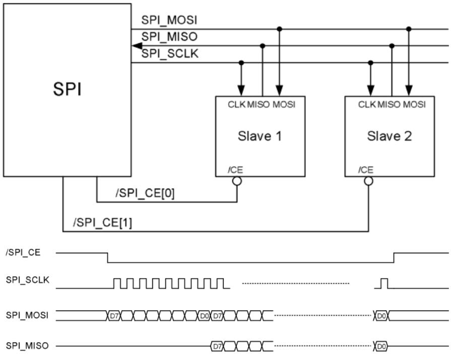


4. Transactions can be from a single byte to hundreds of bytes.

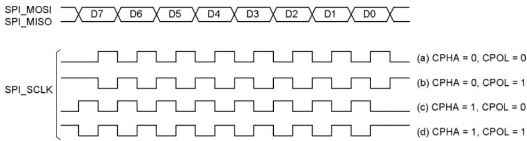


## 9.2.2. Bidirectional mode

In bidirectional SPI master mode the same SPI standard is implemented except that a single wire is used for the data (MIMO) instead of two as in standard mode (MISO and MOSI). Bidirectional mode is used in a similar way to standard mode, the only difference is that before attempting to read data from the slave, you must set the read enable (SPI_REN) bit in the SPI control and status register (SPI_CS). This will turn the bus around, and when you write to the SPI_FIFO register (with junk) a read transaction will take place on the bus, and the read data will appear in the FIFO

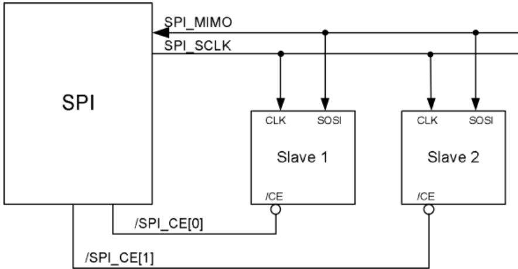


## 9.3. LoSSI mode

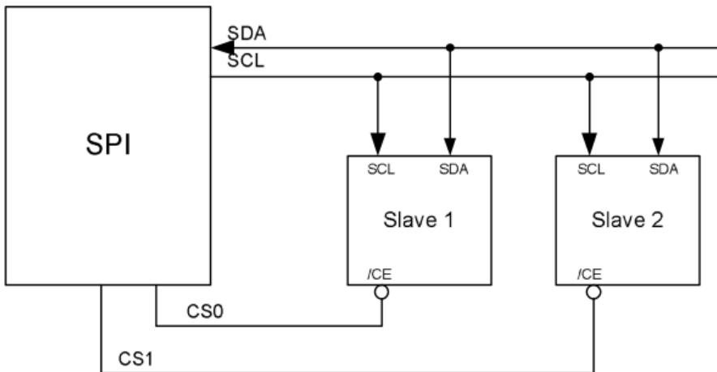


The LoSSI standard allows us to issue commands to peripherals and to transfer data to and from them. LoSSI commands and parameters are 8 bits long, but an extra bit is used to indicate whether the byte is a command or data. This extra bit is set high for a parameter and low for a command. The resulting 9-bit value is serialized to the output. When reading from a LoSSI peripheral the standard allows us to read bytes of data, as well as 24- and 32-bit words

Commands and parameters are issued to a LoSSI peripheral by writing the 9-bit value of the command or data into the SPI_FIFO register as you would for SPI mode. Reads are automated in that if the serial interface peripheral detects a read command being issued, it will issue the command and complete the read transaction, putting the received data into the FIFO.

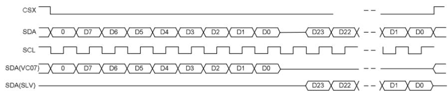


## 9.3.1. Command write


## 9.3.2. Parameter write


## 9.3.3. Byte read commands

Byte read commands are 0x0a, 0x0b, 0x0c, 0x0d, 0x0e, 0x0f, 0xda, 0xdb, 0xdc.

$$
\text { SDA } \quad \boxed {0} \boxed {D 7} \boxed {D 6} \boxed {D 5} \boxed {D 4} \boxed {D 3} \boxed {D 2} \boxed {D 1} \boxed {D 0} \boxed {D 7} \boxed {D 6} \quad - - \quad \boxed {D 1} \boxed {D 0}
$$

$$
\text { SCL } \quad -- \quad
$$

$$
\text { SDA(VC07) } \quad \boxed {0} \quad \boxed {D 7} \quad \boxed {D 6} \quad \boxed {D 5} \quad \boxed {D 4} \quad \boxed {D 3} \quad \boxed {D 2} \quad \boxed {D 1} \quad \boxed {D 0}
$$

$$
\boxed {D 7} \boxed {D 6} \times - - \boxed {D 1} \boxed {D 0}
$$

## 9.3.4. 24-bit read command

A 24-bit read can be achieved by using the command 0x04.

## 9.3.5. 32-bit read command

A 32-bit read can be achieved by using the command 0x09.

$$
\text { SDA } \quad \boxed {0} \quad \boxed {D 7} \quad \boxed {D 6} \quad \boxed {D 5} \quad \boxed {D 4} \quad \boxed {D 3} \quad \boxed {D 2} \quad \boxed {D 1} \quad \boxed {D 0} \quad \boxed {D 3 1} \quad \boxed {D 3 0} \quad \boxed {- - } \quad \boxed {D 1} \quad \boxed {D 0}
$$

$$
\mathrm{SCL} \quad - - \quad \text {   - - -   }
$$

$$
\text { SDA(VC07) } \quad \boxed {0} \quad \boxed {D 7} \quad \boxed {D 6} \quad \boxed {D 5} \quad \boxed {D 4} \quad \boxed {D 3} \quad \boxed {D 2} \quad \boxed {D 1} \quad \boxed {D 0}
$$

$$
\boxed {D 3 1} \boxed {D 3 0} \times - - \times \boxed {D 1} \boxed {D 0}
$$

## 9.4. Block Diagram

Figure 21. Serial interface Block Diagram

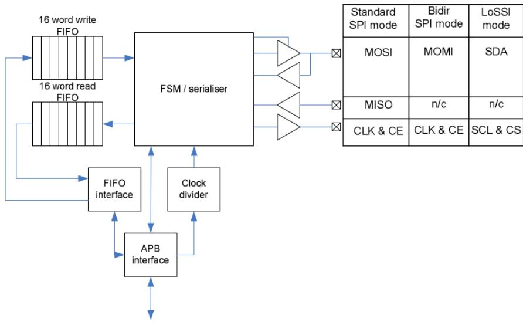


## 9.5. SPI Register Map

The BCM2711 device has five SPI interfaces of this type: SPI0, SPI3, SPI4, SPI5 & SPI6. It has two additional mini SP interfaces (SPI1 and SPI2). The specification of those can be found under Section 2.3

The base addresses of these SPI interfaces are

• SPI0: 0x7e204000

SPI3: 0x7e204600

SPI4: 0x7e204800

• SPI5: 0x7e204a00

• SPI6: 0x7e204c00

<table><tr><td>Offset</td><td>Name</td><td>Description</td></tr><tr><td>0x00</td><td>CS</td><td>SPI Master Control and Status</td></tr><tr><td>0x04</td><td>FIFO</td><td>SPI Master TX and RX FIFOs</td></tr><tr><td>0x08</td><td>CLK</td><td>SPI Master Clock Divider</td></tr><tr><td>0x0c</td><td>DLEN</td><td>SPI Master Data Length</td></tr><tr><td>0x10</td><td>LTOH</td><td>SPI LoSSI mode TOH</td></tr><tr><td>0x14</td><td>DC</td><td>SPI DMA DREQ Controls</td></tr></table>

## CS Register

## Description

This register contains the main control and status bits for the SPI.

Table 160. CS Register

<table><tr><td>Bits</td><td>Name</td><td>Description</td><td>Type</td><td>Reset</td></tr><tr><td>31:26</td><td>Reserved.</td><td>-</td><td>-</td><td>-</td></tr><tr><td>25</td><td>LEN_LONG</td><td>Enable Long data word in LoSSI mode if DMA_LEN is set0= writing to the FIFO will write a single byte1= writing to the FIFO will write a 32-bit word</td><td>RW</td><td>0x0</td></tr><tr><td>24</td><td>DMA_LEN</td><td>Enable DMA mode in LoSSI mode</td><td>RW</td><td>0x0</td></tr><tr><td>23</td><td>CSPOL2</td><td>Chip Select 2 Polarity0= Chip select is active low.1= Chip select is active high.</td><td>RW</td><td>0x0</td></tr><tr><td>22</td><td>CSPOL1</td><td>Chip Select 1 Polarity0= Chip select is active low.1= Chip select is active high.</td><td>RW</td><td>0x0</td></tr><tr><td>21</td><td>CSPOL0</td><td>Chip Select 0 Polarity0= Chip select is active low.1= Chip select is active high.</td><td>RW</td><td>0x0</td></tr><tr><td>20</td><td>RXF</td><td>RX FIFO Full0 = RX FIFO is not full.1 = RX FIFO is full. No further serial data will be sent / received until data is read from FIFO.</td><td>RO</td><td>0x0</td></tr><tr><td>19</td><td>RXR</td><td>RX FIFO needs Reading (<eq>\frac{3}{4}</eq> full)0 = RX FIFO is less than <eq>\frac{3}{4}</eq> full (or not active TA = 0).1 = RX FIFO is <eq>\frac{3}{4}</eq> or more full. Cleared by reading sufficient data from the RX FIFO or setting TA to 0.</td><td>RO</td><td>0x0</td></tr><tr><td>18</td><td>TXD</td><td>TX FIFO can accept Data0 = TX FIFO is full and so cannot accept more data.1 = TX FIFO has space for at least 1 byte.</td><td>RO</td><td>0x1</td></tr><tr><td>17</td><td>RXD</td><td>RX FIFO contains Data0 = RX FIFO is empty.1 = RX FIFO contains at least 1 byte.</td><td>RO</td><td>0x0</td></tr><tr><td>16</td><td>DONE</td><td>Transfer Done0 = Transfer is in progress (or not active TA = 0).1 = Transfer is complete. Cleared by writing more data to the TX FIFO or setting TA to 0.</td><td>RO</td><td>0x0</td></tr><tr><td>15</td><td>TE_EN</td><td>Unused</td><td>RW</td><td>0x0</td></tr><tr><td>14</td><td>LMONO</td><td>Unused</td><td>RW</td><td>0x0</td></tr><tr><td>13</td><td>LEN</td><td>LoSSI enableThe serial interface is configured as a LoSSI master.0 = The serial interface will behave as an SPI master.1 = The serial interface will behave as a LoSSI master.</td><td>RW</td><td>0x0</td></tr><tr><td>12</td><td>REN</td><td>Read EnableRead enable if you are using bidirectional mode. If this bit is set, the SPI peripheral will be able to send data to this device.0 = We intend to write to the SPI peripheral.1 = We intend to read from the SPI peripheral.</td><td>RW</td><td>0x1</td></tr><tr><td>11</td><td>ADCS</td><td>Automatically De-assert Chip Select0 = Don't automatically de-assert chip select at the end of a DMA transfer; chip select is manually controlled by software.1 = Automatically de-assert chip select at the end of a DMA transfer (as determined by SPIDLEN)</td><td>RW</td><td>0x0</td></tr><tr><td>10</td><td>INTR</td><td>Interrupt on RXR0 = Don't generate interrupts on RX FIFO condition.1 = Generate interrupt while RXR = 1.</td><td>RW</td><td>0x0</td></tr><tr><td>9</td><td>INTD</td><td>Interrupt on Done0 = Don't generate interrupt on transfer complete.1 = Generate interrupt when DONE = 1.</td><td>RW</td><td>0x0</td></tr><tr><td>8</td><td>DMAEN</td><td>DMA Enable0 = No DMA requests will be issued.1 = Enable DMA operation.Peripheral generates data requests. These will be taken in four-byte words until the SPIDLEN has been reached.</td><td>RW</td><td>0x0</td></tr><tr><td>7</td><td>TA</td><td>Transfer Active0 = Transfer not active. /CS lines are all high (assuming CSPOL = 0). RXR and DONE are 0. Writes to SPI_FIFO write data into bits 15:0 of SPIDLEN and bits 7:0 of SPICS allowing DMA data blocks to set mode before sending data.1 = Transfer active. /CS lines are set according to CS bits and CSPOL. Writes to SPI_FIFO write data to TX FIFO. TA is cleared by a dma_frame_end pulse from the DMA controller.</td><td>RW</td><td>0x0</td></tr><tr><td>6</td><td>CSPOL</td><td>Chip Select Polarity0 = Chip select lines are active low1 = Chip select lines are active high</td><td>RW</td><td>0x0</td></tr><tr><td>5:4</td><td>CLEAR</td><td>FIFO Clear00 = No action.x1 = Clear TX FIFO. One-shot operation.1x = Clear RX FIFO. One-shot operation.If CLEAR and TA are both set in the same operation, the FIFOs are cleared before the new frame is started. Read back as 0.</td><td>W1SC</td><td>0x0</td></tr><tr><td>3</td><td>CPOL</td><td>Clock Polarity0 = Rest state of clock = low.1 = Rest state of clock = high.</td><td>RW</td><td>0x0</td></tr><tr><td>2</td><td>CPHA</td><td>Clock Phase0 = First SCLK transition at middle of data bit.1 = First SCLK transition at beginning of data bit.</td><td>RW</td><td>0x0</td></tr><tr><td>1:0</td><td>CS</td><td>Chip Select00 = Chip select 001 = Chip select 110 = Chip select 211 = Reserved</td><td>RW</td><td>0x0</td></tr></table>

## FIFO Register

## Description

This register allows TX data to be written to the TX FIFO and RX data to be read from the RX FIFO

<table><tr><td>Bits</td><td>Name</td><td>Description</td><td>Type</td><td>Reset</td></tr><tr><td>31:0</td><td>DATA</td><td>DMA Mode (DMAEN set)If TA is clear, the first 32-bit write to this register will control SPIDLEN and SPICS. Subsequent reads and writes will be taken as four-byte data words to be read/written to the FIFOsPoll/Interrupt Mode (DMAEN clear, TA set)Writes to the register write bytes to TX FIFO. Reads from register read bytes from the RX FIFO</td><td>RW</td><td>0x00000000</td></tr></table>

## CLK Register

## Description

This register allows the SPI clock rate to be set.

<table><tr><td>Bits</td><td>Name</td><td>Description</td><td>Type</td><td>Reset</td></tr><tr><td>31:16</td><td>Reserved.</td><td>-</td><td>-</td><td>-</td></tr><tr><td>15:0</td><td>CDIV</td><td>Clock DividerSCLK = Core Clock / CDIVIf CDIV is set to 0, the divisor is 65536. The divisor must be a multiple of 2. Odd numbers rounded down. The maximum SPI clock rate is of the APB clock.</td><td>RW</td><td>0x0000</td></tr></table>

## DLEN Register

## Description

This register allows the SPI data length rate to be set.

<table><tr><td>Bits</td><td>Name</td><td>Description</td><td>Type</td><td>Reset</td></tr><tr><td>31:16</td><td>Reserved.</td><td>-</td><td>-</td><td>-</td></tr><tr><td>15:0</td><td>LEN</td><td>Data LengthThe number of bytes to transfer.This field is only valid for DMA mode (DMAEN set) and controls how many bytes to transmit (and therefore receive).</td><td>RW</td><td>0x0000</td></tr></table>

## LTOH Register

## Description

This register allows the LoSSI output hold delay to be set.

<table><tr><td>Bits</td><td>Name</td><td>Description</td><td>Type</td><td>Reset</td></tr><tr><td>31:4</td><td>Reserved.</td><td>-</td><td>-</td><td>-</td></tr><tr><td>3:0</td><td>TOH</td><td>This sets the Output Hold delay in APB clocks. A value of 0 causes a 1 clock delay.</td><td>RW</td><td>0x1</td></tr></table>

## DC Register

## Description

This register controls the generation of the DREQ and Panic signals to an external DMA engine. The DREQ signals are generated when the FIFOs reach their defined levels and need servicing. The Panic signals instruct the external DMA engine to raise the priority of its AXI requests

<table><tr><td>Bits</td><td>Name</td><td>Description</td><td>Type</td><td>Reset</td></tr><tr><td>31:24</td><td>RPANIC</td><td>DMA Read Panic Threshold.Generate the Panic signal to the RX DMA engine whenever the RX FIFO level is greater than this amount.</td><td>RW</td><td>0x30</td></tr><tr><td>23:16</td><td>RDREQ</td><td>DMA Read Request Threshold.Generate a DREQ to the RX DMA engine whenever the RX FIFO level is greater than this amount (RX DREQ is also generated if the transfer has finished but the RX FIFO isn&#x27;t empty).</td><td>RW</td><td>0x20</td></tr><tr><td>15:8</td><td>TPANIC</td><td>DMA Write Panic Threshold.Generate the Panic signal to the TX DMA engine whenever the TX FIFO level is less than or equal to this amount.</td><td>RW</td><td>0x10</td></tr><tr><td>7:0</td><td>TDREQ</td><td>DMA Write Request Threshold.Generate a DREQ signal to the TX DMA engine whenever the TX FIFO level is less than or equal to this amount.</td><td>RW</td><td>0x20</td></tr></table>

## 9.6. Software Operation

## 9.6.1. Polled

1. Set CS, CPOL, CPHA as required and set TA = 1

2. Poll TXD writing bytes to SPI_FIFO, RXD reading bytes from SPI_FIFO until all data written

3. Poll DONE until it goes to 1

4. Set TA = 0

## 9.6.2. Interrupt

1. Set INTR and INTD. These can be left set over multiple operations.

2. Set CS, CPOL, CPHA as required and set TA = 1. This will immediately trigger a first interrupt with DONE = 1.

3. On interrupt:

◦ If DONE is set and data to write (this means it is the first interrupt), write up to 64 bytes to SPI_FIFO. If DONE is set and no more data, set TA = 0. Read trailing data from SPI_FIFO until RXD is 0.

◦ If RXR is set read 48 bytes data from SPI_FIFO and if more data to write, write up to 48 bytes to SPI_FIFO.

## 9.6.3. DMA

Note: In order to function correctly, each DMA channel must be set to perform 32-bit transfers when communicating with the SPI. Either the Source or the Destination Transfer Width field in the DMA TI register must be set to 0 (i.e. 32-bit words depending upon whether the channel is reading or writing to the SPI. Two DMA channels are required, one to read from and one to write to the SPI.

1. Enable DMA DREQs by setting the DMAEN bit and ADCS if required.

2. Program two DMA Control Blocks, one for each DMA controller.

3. DMA channel 1 Control Block should have its PERMAP set to SPIn TX and should be set to write ‘transfer length’ + 1 words to SPI_FIFO. The data should comprise

a. A word with the transfer length in bytes in the top sixteen bits, and the control register settings [7:0] in the bottom eight bits (i.e. TA = 1, CS, CPOL, CPHA as required.).

b. ‘Transfer length’ number in words of data to send.

4. DMA channel 2 Control Block should have its PERMAP set to SPIn RX and should be set to read ‘transfer length’ words from SPI_FIFO

5. Point each DMA channel at its CB and set its ACTIVE bit to 1.

6. On receipt of an interrupt from DMA channel 2, the transfer is complete

## 9.6.4. Notes

1. The SPI Master knows nothing of the peripherals it is connected to. It always both sends and receives bytes for every byte of the transaction.

2. SCLK is only generated during byte serial transfer. It pauses in the rest state if the next byte to send is not ready or RXF is set.

3. Setup and Hold times related to the automatic assertion and de-assertion of the CS lines when operating in DMA mode (DMAEN and ADCS set) are as follows:

◦ The CS line will be asserted at least 3 core clock cycles before the MSB of the first byte of the transfer.

◦ The CS line will be de-asserted no earlier than 1 core clock cycle after the trailing edge of the final clock pulse.

◦ If these parameters are insufficient, software control should alleviate the problem. ADCS should be 0 allowing software to manually control the assertion and de-assertion of the CS lines.

# Chapter 10. System Timer

## 10.1. Overview

The System Timer peripheral provides four 32-bit timer channels and a single 64-bit free running counter. Each channel has an output compare register, which is compared against the 32 least significant bits of the free running counter values. When the two values match, the system timer peripheral generates a signal to indicate a match for the appropriate channel. The match signal is then fed into the interrupt controller. The interrupt service routine then reads the output compare register and adds the appropriate offset for the next timer tick. The free running counter is driven by the timer clock and stopped whenever the processor is stopped in debug mode.

The physical (hardware) base address for the system timers is 0x7e003000.

## 10.2. System Timer Registers

<table><tr><td>Offset</td><td>Name</td><td>Description</td></tr><tr><td>0x00</td><td>CS</td><td>System Timer Control/Status</td></tr><tr><td>0x04</td><td>CLO</td><td>System Timer Counter Lower 32 bits</td></tr><tr><td>0x08</td><td>CHI</td><td>System Timer Counter Higher 32 bits</td></tr><tr><td>0x0c</td><td>C0</td><td>System Timer Compare 0</td></tr><tr><td>0x10</td><td>C1</td><td>System Timer Compare 1</td></tr><tr><td>0x14</td><td>C2</td><td>System Timer Compare 2</td></tr><tr><td>0x18</td><td>C3</td><td>System Timer Compare 3</td></tr></table>

## CS Register

## Description

System Timer Control / Status.

This register is used to record and clear timer channel comparator matches. The system timer match bits are routed to the interrupt controller where they can generate an interrupt

The M0-3 fields contain the free-running counter match status. Write a one to the relevant bit to clear the match detect status bit and the corresponding interrupt request line

<table><tr><td>Bits</td><td>Name</td><td>Description</td><td>Type</td><td>Reset</td></tr><tr><td>31:4</td><td>Reserved.</td><td>-</td><td>-</td><td>-</td></tr><tr><td>3</td><td>M3</td><td>System Timer Match 30 = No Timer 3 match since last cleared.1 = Timer 3 match detected.</td><td>W1C</td><td>0x0</td></tr><tr><td>2</td><td>M2</td><td>System Timer Match 20 = No Timer 2 match since last cleared.1 = Timer 2 match detected.</td><td>W1C</td><td>0x0</td></tr><tr><td>1</td><td>M1</td><td>System Timer Match 10 = No Timer 1 match since last cleared.1 = Timer 1 match detected.</td><td>W1C</td><td>0x0</td></tr><tr><td>0</td><td>M0</td><td>System Timer Match 00 = No Timer 0 match since last cleared.1 = Timer 0 match detected.</td><td>W1C</td><td>0x0</td></tr></table>

## CLO Register

## Description

System Timer Counter Lower bits.

The system timer free-running counter lower register is a read-only register that returns the current value of the lower 32-bits of the free running counter.

<table><tr><td>Bits</td><td>Name</td><td>Description</td><td>Type</td><td>Reset</td></tr><tr><td>31:0</td><td>CNT</td><td>Lower 32-bits of the free running counter value.</td><td>RO</td><td>0x00000000</td></tr></table>

## CHI Register

## Description

System Timer Counter Higher bits.

The system timer free-running counter higher register is a read-only register that returns the current value of the higher 32-bits of the free running counter.

<table><tr><td>Bits</td><td>Name</td><td>Description</td><td>Type</td><td>Reset</td></tr><tr><td>31:0</td><td>CNT</td><td>Higher 32-bits of the free running counter value.</td><td>RO</td><td>0x00000000</td></tr></table>

## C0, C1, C2, C3 Registers

## Description

System Timer Compare.

The system timer compare registers hold the compare value for each of the four timer channels. Whenever the lower 32-bits of the free-running counter matches one of the compare values the corresponding bit in the system timer control/status register is set.

<table><tr><td>Bits</td><td>Name</td><td>Description</td><td>Type</td><td>Reset</td></tr><tr><td>31:0</td><td>CMP</td><td>Compare value for match channel n.</td><td>RW</td><td>0x00000000</td></tr></table>

## Chapter 11. UART

## 11.1. Overview

The BCM2711 device has six UARTs. One mini UART (UART1) and five PL011 UARTs (UART0, UART2, UART3, UART4 & UART5). This section describes the PL011 UARTs. For details of the mini UART see Section 2.2.

The PL011 UART is a Universal Asynchronous Receiver/Transmitter. This is the ARM UART (PL011) implementation. Th UART performs serial-to-parallel conversion on data characters received from an external peripheral device or modem, and parallel-to-serial conversion on data characters received from the Advanced Peripheral Bus (APB).

The ARM PL011 UART has some optional functionality which can be included or left out.

The following functionality is not supported :

Infrared Data Association (IrDA)

• Serial InfraRed (SIR) protocol Encoder/Decoder (ENDEC)

The UARTs provide:

• Separate 32x8 transmit and 32x12 receive FIFO memory.

• Programmable baud rate generator.

Standard asynchronous communication bits (start, stop and parity). These are added prior to transmission an removed on reception

False start bit detection

• Line break generation and detection.

• Support of the modem control functions CTS and RTS. However DCD, DSR, DTR, and RI are not supported.

• Programmable hardware flow control.

• Fully-programmable serial interface characteristics:

◦ data can be 5, 6, 7, or 8 bits.

◦ even, odd, stick, or no-parity bit generation and detection.

◦ 1 or 2 stop bit generation.

◦ baud rate generation, up to UARTCLK/16.

The UART clock source and associated dividers are controlled by the Clock Manager.

For the in-depth UART overview, please refer to the ARM PrimeCell UART (PL011) Revision: r1p5 Technical Reference Manual.

## 11.2. Variations from the 16C650 UART

The UART varies from the industry-standard 16C650 UART device as follows:

• Receive FIFO trigger levels are 1/8, 1/4, 1/2, 3/4, and 7/8

Transmit FIFO trigger levels are 1/8, 1/4, 1/2, 3/4, and 7/8

• The internal register map address space, and the bit function of each register differ

The deltas of the modem status signals are not available

The following 16C650 UART features are not supported:

• 1.5 stop bits (1 or 2 stop bits only are supported)

• Independent receive clock

## 11.3. Primary UART Inputs and Outputs

The UARTs have two primary inputs (RXD, nCTS) and two primary outputs (TXD, nRTS). The remaining signals (like SRIN, SROUT, OUT1, OUT2, DSR, DTR, and RI) are not supported in this implementation. The following table shows how the various UART signals (including the mini UART) map on the General Purpose I/O (GPIO). For more details on how t select alternate functions refer to Chapter 5.

<table><tr><td></td><td>Pull</td><td>ALT0</td><td>ALT1</td><td>ALT2</td><td>ALT3</td><td>ALT4</td><td>ALT5</td></tr><tr><td>GPIO0</td><td>High</td><td></td><td></td><td></td><td></td><td>TXD2</td><td></td></tr><tr><td>GPIO1</td><td>High</td><td></td><td></td><td></td><td></td><td>RXD2</td><td></td></tr><tr><td>GPIO2</td><td>High</td><td></td><td></td><td></td><td></td><td>CTS2</td><td></td></tr><tr><td>GPIO3</td><td>High</td><td></td><td></td><td></td><td></td><td>RTS2</td><td></td></tr><tr><td>GPIO4</td><td>High</td><td></td><td></td><td></td><td></td><td>TXD3</td><td></td></tr><tr><td>GPIO5</td><td>High</td><td></td><td></td><td></td><td></td><td>RXD3</td><td></td></tr><tr><td>GPIO6</td><td>High</td><td></td><td></td><td></td><td></td><td>CTS3</td><td></td></tr><tr><td>GPIO7</td><td>High</td><td></td><td></td><td></td><td></td><td>RTS3</td><td></td></tr><tr><td>GPIO8</td><td>High</td><td></td><td></td><td></td><td></td><td>TXD4</td><td></td></tr><tr><td>GPIO9</td><td>High</td><td></td><td></td><td></td><td></td><td>RXD4</td><td></td></tr><tr><td>GPIO10</td><td>High</td><td></td><td></td><td></td><td></td><td>CTS4</td><td></td></tr><tr><td>GPIO11</td><td>High</td><td></td><td></td><td></td><td></td><td>RTS4</td><td></td></tr><tr><td>GPIO12</td><td>High</td><td></td><td></td><td></td><td></td><td>TXD5</td><td></td></tr><tr><td>GPIO13</td><td>High</td><td></td><td></td><td></td><td></td><td>RXD5</td><td></td></tr><tr><td>GPIO14</td><td>Low</td><td>TXD0</td><td></td><td></td><td></td><td>CTS5</td><td>TXD1</td></tr><tr><td>GPIO15</td><td>Low</td><td>RXD0</td><td></td><td></td><td></td><td>RTS5</td><td>RXD1</td></tr><tr><td>GPIO16</td><td>Low</td><td></td><td></td><td></td><td>CTS0</td><td></td><td>CTS1</td></tr><tr><td>GPIO17</td><td>Low</td><td></td><td></td><td></td><td>RTS0</td><td></td><td>RTS1</td></tr><tr><td>GPIO30</td><td>Low</td><td></td><td></td><td></td><td>CTS0</td><td></td><td>CTS1</td></tr><tr><td>GPIO31</td><td>Low</td><td></td><td></td><td></td><td>RTS0</td><td></td><td>RTS1</td></tr><tr><td>GPIO32</td><td>Low</td><td></td><td></td><td></td><td>TXD0</td><td></td><td>TXD1</td></tr><tr><td>GPIO33</td><td>Low</td><td></td><td></td><td></td><td>RXD0</td><td></td><td>RXD1</td></tr><tr><td>GPIO36</td><td>High</td><td></td><td></td><td>TXD0</td><td></td><td></td><td></td></tr><tr><td>GPIO37</td><td>Low</td><td></td><td></td><td>RXD0</td><td></td><td></td><td></td></tr><tr><td>GPIO38</td><td>Low</td><td></td><td></td><td>RTS0</td><td></td><td></td><td></td></tr><tr><td>GPIO39</td><td>Low</td><td></td><td></td><td>CTS0</td><td></td><td></td><td></td></tr><tr><td>GPIO40</td><td>Low</td><td></td><td></td><td></td><td></td><td></td><td>TXD1</td></tr><tr><td>GPIO41</td><td>Low</td><td></td><td></td><td></td><td></td><td></td><td>RXD1</td></tr><tr><td>GPIO42</td><td>Low</td><td></td><td></td><td></td><td></td><td></td><td>RTS1</td></tr><tr><td>GPIO43</td><td>Low</td><td></td><td></td><td></td><td></td><td></td><td>CTS1</td></tr></table>

## 11.4. UART Interrupts

Each UART has one intra-chip interrupt UARTINTR generated as the OR-ed function of its five individual interrupts.

UARTINTR, this is an OR function of the five individual masked outputs:

UARTRXINTR

• UARTTXINTR

• UARTRTINTR

• UARTMSINTR, that can be caused by:

◦ UARTCTSINTR, because of a change in the nUARTCTS modem status

◦ UARTDSRINTR, because of a change in the nUARTDSR modem status

• UARTEINTR, that can be caused by an error in the reception:

◦ UARTOEINTR, because of an overrun error

◦ UARTBEINTR, because of a break in the reception

◦ UARTPEINTR, because of a parity error in the received character

◦ UARTFEINTR, because of a framing error in the received character

One can enable or disable the individual interrupts by changing the mask bits in the Interrupt Mask Set/Clear Register, UART_IMSC. Setting the appropriate mask bit HIGH enables the interrupt.

## UARTTXINTR

The transmit interrupt changes state when one of the following events occurs:

If the FIFOs are enabled and the transmit FIFO is equal to or lower than the programmed trigger level then the transmit interrupt is asserted HIGH. The transmit interrupt is cleared by writing data to the transmit FIFO until it becomes greater than the trigger level, or by clearing the interrupt.

If the FIFOs are disabled (have a depth of one location) and there is no data present in the transmitter’s single location, the transmit interrupt is asserted HIGH. It is cleared by performing a single write to the transmit FIFO, or by clearing the interrupt.

## UARTRXINTR

The receive interrupt changes state when one of the following events occurs:

If the FIFOs are enabled and the receive FIFO reaches the programmed trigger level. When this happens, the receive interrupt is asserted HIGH. The receive interrupt is cleared by reading data from the receive FIFO until it becomes less than the trigger level, or by clearing the interrupt

• If the FIFOs are disabled (have a depth of one location) and data is received thereby filling the location, the receive interrupt is asserted HIGH. The receive interrupt is cleared by performing a single read of the receive FIFO, or by clearing the interrupt.

## 11.5. Register View

The PL011 UARTs are mapped onto the following base addresses:

• UART0: 0x7e201000

• UART2: 0x7e201400

• UART3: 0x7e201600

• UART4: 0x7e201800

• UART5: 0x7e201a00

They have the following memory-mapped registers.

<table><tr><td>Offset</td><td>Name</td><td>Description</td></tr><tr><td>0x00</td><td>DR</td><td>Data Register</td></tr><tr><td>0x04</td><td>RSRECR</td><td></td></tr><tr><td>0x18</td><td>FR</td><td>Flag register</td></tr><tr><td>0x20</td><td>ILPR</td><td>not in use</td></tr><tr><td>0x24</td><td>IBRD</td><td>Integer Baud rate divisor</td></tr><tr><td>0x28</td><td>FBRD</td><td>Fractional Baud rate divisor</td></tr><tr><td>0x2c</td><td>LCRH</td><td>Line Control register</td></tr><tr><td>0x30</td><td>CR</td><td>Control register</td></tr><tr><td>0x34</td><td>IFLS</td><td>Interrupt FIFO Level Select Register</td></tr><tr><td>0x38</td><td>IMSC</td><td>Interrupt Mask Set Clear Register</td></tr><tr><td>0x3c</td><td>RIS</td><td>Raw Interrupt Status Register</td></tr><tr><td>0x40</td><td>MIS</td><td>Masked Interrupt Status Register</td></tr><tr><td>0x44</td><td>ICR</td><td>Interrupt Clear Register</td></tr><tr><td>0x48</td><td>DMACR</td><td>DMA Control Register</td></tr><tr><td>0x80</td><td>ITCR</td><td>Test Control register</td></tr><tr><td>0x84</td><td>ITIP</td><td>Integration test input reg</td></tr><tr><td>0x88</td><td>ITOP</td><td>Integration test output reg</td></tr><tr><td>0x8c</td><td>TDR</td><td>Test Data reg</td></tr></table>

## DR Register

## Description

The UART_DR Register is the data register.

For words to be transmitted:

if the FIFOs are enabled, data written to this location is pushed onto the transmit FIFO.

if the FIFOs are not enabled, data is stored in the transmitter holding register (the bottom word of the transmit FIFO). The write operation initiates transmission from the UART. The data is prefixed with a start bit, appended with the appropriate parity bit (if parity is enabled), and a stop bit. The resultant word is then transmitted

For received words:

if the FIFOs are enabled, the data byte and the 4-bit status (break, frame, parity, and overrun) is pushed onto the 12-bit wide receive FIFO

if the FIFOs are not enabled, the data byte and status are stored in the receiving holding register (the bottom word of the receive FIFO)

<table><tr><td>Bits</td><td>Name</td><td>Description</td><td>Type</td><td>Reset</td></tr><tr><td>31:12</td><td>Reserved.</td><td>-</td><td>-</td><td>-</td></tr><tr><td>11</td><td>OE</td><td>Overrun error. This bit is set to 1 if data is received and the receive FIFO is already full.This is cleared to 0 once there is an empty space in the FIFO and a new character can be written to it.</td><td>RO</td><td>0x0</td></tr><tr><td>10</td><td>BE</td><td>Break error. This bit is set to 1 if a break condition was detected, indicating that the received data input was held LOW for longer than a full-word transmission time (defined as start, data, parity and stop bits).In FIFO mode, this error is associated with the character at the top of the FIFO. When a break occurs, only one 0 character is loaded into the FIFO. The next character is only enabled after the receive data input goes to a 1 (marking state), and the next valid start bit is received.</td><td>RO</td><td>0x0</td></tr><tr><td>9</td><td>PE</td><td>Parity error. When set to 1, it indicates that the parity of the received data character does not match the parity that the EPS and SPS bits in the Line Control Register, UART_LCRH select.In FIFO mode, this error is associated with the character at the top of the FIFO.</td><td>RO</td><td>0x0</td></tr><tr><td>8</td><td>FE</td><td>Framing error. When set to 1, it indicates that the received character did not have a valid stop bit (a valid stop bit is 1). In FIFO mode, this error is associated with the character at the top of the FIFO.</td><td>RO</td><td>0x0</td></tr><tr><td>7:0</td><td>DATA</td><td>Receive (read) data character.Transmit (write) data character.</td><td>RW</td><td>0x00</td></tr></table>

## RSRECR Register

## Description

The UART_RSRECR Register is the receive status register/error clear register. If the status is read from this register, then the status information for break, framing and parity corresponds to the data character read from the Data Register, UART_DR. The status information for overrun is set immediately when an overrun condition occurs. NOTE: The received data character must be read first from the Data Register UART_DR, before reading the error status associated with that data character from this register.

<table><tr><td>Bits</td><td>Name</td><td>Description</td><td>Type</td><td>Reset</td></tr><tr><td>31:4</td><td>Reserved.</td><td>-</td><td>-</td><td>-</td></tr><tr><td>3</td><td>OE</td><td>Overrun error. This bit is set to 1 if data is received and the receive FIFO is already full.This is cleared to 0 once there is an empty space in the FIFO and a new character can be written to it.</td><td>RW</td><td>0x0</td></tr><tr><td>2</td><td>BE</td><td>Break error. This bit is set to 1 if a break condition was detected, indicating that the received data input was held LOW for longer than a full-word transmission time (defined as start, data, parity and stop bits).In FIFO mode, this error is associated with the character at the top of the FIFO. When a break occurs, only one 0 character is loaded into the FIFO. The next character is only enabled after the receive data input goes to a 1 (marking state), and the next valid start bit is received.</td><td>RW</td><td>0x0</td></tr><tr><td>1</td><td>PE</td><td>Parity error. When set to 1, it indicates that the parity of the received data character does not match the parity that the EPS and SPS bits in the Line Control Register, UART_LCRH select.In FIFO mode, this error is associated with the character at the top of the FIFO.</td><td>RW</td><td>0x0</td></tr><tr><td>0</td><td>FE</td><td>Framing error. When set to 1, it indicates that the received character did not have a valid stop bit (a valid stop bit is 1). In FIFO mode, this error is associated with the character at the top of the FIFO.</td><td>RW</td><td>0x0</td></tr></table>

## FR Register

## Description

The UART_FR Register is the flag register.

Table 175. FR Register

<table><tr><td>Bits</td><td>Name</td><td>Description</td><td>Type</td><td>Reset</td></tr><tr><td>31:9</td><td>Reserved.</td><td>-</td><td>-</td><td>-</td></tr><tr><td>8</td><td>RI</td><td>Unsupported, write zero, read as don't care</td><td>RO</td><td>0x0</td></tr><tr><td>7</td><td>TXFE</td><td>Transmit FIFO empty. The meaning of this bit depends on the state of the FEN bit in the Line Control Register, UART_LCRH.If the FIFO is disabled, this bit is set when the transmit holding register is empty.If the FIFO is enabled, the TXFE bit is set when the transmit FIFO is empty. This bit does not indicate if there is data in the transmit shift register.</td><td>RO</td><td>0x1</td></tr><tr><td>6</td><td>RXFF</td><td>Receive FIFO full. The meaning of this bit depends on the state of the FEN bit in the UART_LCRH Register.If the FIFO is disabled, this bit is set when the receive holding register is full.If the FIFO is enabled, the RXFF bit is set when the receive FIFO is full.</td><td>RO</td><td>0x0</td></tr><tr><td>5</td><td>TXFF</td><td>Transmit FIFO full. The meaning of this bit depends on the state of the FEN bit in the UART_LCRH Register.If the FIFO is disabled, this bit is set when the transmit holding register is full.If the FIFO is enabled, the TXFF bit is set when the transmit FIFO is full.</td><td>RO</td><td>0x0</td></tr><tr><td>4</td><td>RXFE</td><td>Receive FIFO empty. The meaning of this bit depends on the state of the FEN bit in the UART_LCRH Register.If the FIFO is disabled, this bit is set when the receive holding register is empty.If the FIFO is enabled, the RXFE bit is set when the receive FIFO is empty.</td><td>RO</td><td>0x0</td></tr><tr><td>3</td><td>BUSY</td><td>UART busy. If this bit is set to 1, the UART is busy transmitting data. This bit remains set until the complete byte, including all the stop bits, has been sent from the shift register.This bit is set as soon as the transmit FIFO becomes non-empty, regardless of whether the UART is enabled or not.</td><td>RO</td><td>0x0</td></tr><tr><td>2</td><td>DCD</td><td>Unsupported, write zero, read as don't care</td><td>RO</td><td>0x0</td></tr><tr><td>1</td><td>DSR</td><td>Unsupported, write zero, read as don't care</td><td>RO</td><td>0x0</td></tr><tr><td>0</td><td>CTS</td><td>Clear to send. This bit is the complement of the UART clear to send, nUARTCTS, modem status input. That is, the bit is 1 when nUARTCTS is LOW.</td><td>RO</td><td>0x0</td></tr></table>

## ILPR Register

## Description

This is the disabled IrDA register, writing to it has no effect and reading returns 0.

<table><tr><td>Bits</td><td>Name</td><td>Description</td><td>Type</td><td>Reset</td></tr><tr><td>31:0</td><td>Reserved.</td><td>-</td><td>-</td><td>-</td></tr></table>

## IBRD Register

## Description

The UART_IBRD Register is the integer part of the baud rate divisor value.

<table><tr><td>Bits</td><td>Name</td><td>Description</td><td>Type</td><td>Reset</td></tr><tr><td>31:16</td><td>Reserved.</td><td>-</td><td>-</td><td>-</td></tr><tr><td>15:0</td><td>IBRD</td><td>The integer baud rate divisor.</td><td>RW</td><td>0x0000</td></tr></table>

## FBRD Register

## Description

The UART_FBRD Register is the fractional part of the baud rate divisor value.

The baud rate divisor is calculated as follows:

Baud rate divisor BAUDDIV = (FUARTCLK/(16 * Baud rate))

where FUARTCLK is the UART reference clock frequency. The BAUDDIV is comprised of the integer value IBRD and the fractional value FBRD

NOTE: The contents of the IBRD and FBRD registers are not updated until transmission or reception of the current character is complete.

<table><tr><td>Bits</td><td>Name</td><td>Description</td><td>Type</td><td>Reset</td></tr><tr><td>31:6</td><td>Reserved.</td><td>-</td><td>-</td><td>-</td></tr><tr><td>5:0</td><td>FBRD</td><td>The fractional baud rate divisor.</td><td>RW</td><td>0x00</td></tr></table>

## LCRH Register

## Description

The UART_LCRH Register is the line control register.

NOTE: The UART_LCRH, UART_IBRD, and UART_FBRD registers must not be changed:

when the UART is enabled

when completing a transmission or a reception when it has been programmed to become disabled.

<table><tr><td>Bits</td><td>Name</td><td>Description</td><td>Type</td><td>Reset</td></tr><tr><td>31:8</td><td>Reserved.</td><td>-</td><td>-</td><td>-</td></tr><tr><td>7</td><td>SPS</td><td>Stick parity select.0 = stick parity is disabled1 = either:if the EPS bit is 0 then the parity bit is transmitted and checked as a 1if the EPS bit is 1 then the parity bit is transmitted and checked as a 0. See Table 180.</td><td>RO</td><td>0x0</td></tr><tr><td>6:5</td><td>WLEN</td><td>Word length. These bits indicate the number of data bits transmitted or received in a frame as follows:b11 = 8 bitsb10 = 7 bitsb01 = 6 bitsb00 = 5 bits.</td><td>RW</td><td>0x0</td></tr><tr><td>4</td><td>FEN</td><td>Enable FIFOs:0 = FIFOs are disabled (character mode) that is, the FIFOs become 1-byte-deep holding registers1 = transmit and receive FIFO buffers are enabled (FIFO mode).</td><td>RW</td><td>0x0</td></tr><tr><td>3</td><td>STP2</td><td>Two stop bits select. If this bit is set to 1, two stop bits are transmitted at the end of the frame. The receive logic does not check for two stop bits being received.</td><td>RW</td><td>0x0</td></tr><tr><td>2</td><td>EPS</td><td>Even parity select. Controls the type of parity the UART uses during transmission and reception:0 = odd parity. The UART generates or checks for an odd number of 1s in the data and parity bits.1 = even parity. The UART generates or checks for an even number of 1s in the data and parity bits.This bit has no effect when the PEN bit disables parity checking and generation. See Table 180.</td><td>RW</td><td>0x0</td></tr><tr><td>1</td><td>PEN</td><td>Parity enable:0 = parity is disabled and no parity bit added to the data frame1 = parity checking and generation is enabled. See Table 180.</td><td>RW</td><td>0x0</td></tr></table>

Table 181. CR Register

<table><tr><td>Bits</td><td>Name</td><td>Description</td><td>Type</td><td>Reset</td></tr><tr><td>0</td><td>BRK</td><td>Send break. If this bit is set to 1, a low-level is continually output on the TXD output, after completing transmission of the current character.</td><td>RW</td><td>0x0</td></tr></table>

<table><tr><td>PEN</td><td>EPS</td><td>SPS</td><td>Parity bit (transmitted or checked)</td></tr><tr><td>0</td><td>x</td><td>x</td><td>Not transmitted or checked</td></tr><tr><td>1</td><td>1</td><td>0</td><td>Even parity</td></tr><tr><td>1</td><td>0</td><td>0</td><td>Odd parity</td></tr><tr><td>1</td><td>0</td><td>1</td><td>1</td></tr><tr><td>1</td><td>1</td><td>1</td><td>0</td></tr></table>

## CR Register

## Description

The UART_CR Register is the control register.

NOTE: To enable transmission, the TXE bit and UARTEN bit must be set to 1. Similarly, to enable reception, the RXE bit and UARTEN bit, must be set to 1.

NOTE: Program the control registers as follows:

1. Disable the UART.

2. Wait for the end of transmission or reception of the current character.

3. Flush the transmit FIFO by setting the FEN bit to 0 in the Line Control Register, UART_LCRH.

4. Reprogram the Control Register, UART_CR.

5. Enable the UART.

<table><tr><td>Bits</td><td>Name</td><td>Description</td><td>Type</td><td>Reset</td></tr><tr><td>31:16</td><td>Reserved.</td><td>-</td><td>-</td><td>-</td></tr><tr><td>15</td><td>CTSEN</td><td>CTS hardware flow control enable. If this bit is set to 1, CTS hardware flow control is enabled. Data is only transmitted when the nUARTCTS signal is asserted.</td><td>RW</td><td>0x0</td></tr><tr><td>14</td><td>RTSEN</td><td>RTS hardware flow control enable. If this bit is set to 1, RTS hardware flow control is enabled. Data is only requested when there is space in the receive FIFO for it to be received.</td><td>RW</td><td>0x0</td></tr><tr><td>13</td><td>OUT2</td><td>Unsupported, write zero, read as don't care</td><td>RO</td><td>0x0</td></tr><tr><td>12</td><td>OUT1</td><td>Unsupported, write zero, read as don't care</td><td>RO</td><td>0x0</td></tr><tr><td>11</td><td>RTS</td><td>Request to send. This bit is the complement of the UART request to send, nUARTRTS, modem status output. That is, when the bit is programmed to a 1 then nUARTRTS is LOW.</td><td>RW</td><td>0x0</td></tr><tr><td>10</td><td>DTR</td><td>Unsupported, write zero, read as don't care</td><td>RO</td><td>0x0</td></tr><tr><td>9</td><td>RXE</td><td>Receive enable. If this bit is set to 1, the receive section of the UART is enabled. Data reception occurs for UART signals. When the UART is disabled in the middle of reception, it completes the current character before stopping.</td><td>RW</td><td>0x1</td></tr><tr><td>8</td><td>TXE</td><td>Transmit enable. If this bit is set to 1, the transmit section of the UART is enabled. Data transmission occurs for UART signals. When the UART is disabled in the middle of transmission, it completes the current character before stopping.</td><td>RW</td><td>0x1</td></tr><tr><td>7</td><td>LBE</td><td>Loopback enable. If this bit is set to 1, the UARTTXD path is fed through to the UARTRXD path. In UART mode, when this bit is set, the modem outputs are also fed through to the modem inputs. This bit is cleared to 0 on reset, to disable loopback.</td><td>RW</td><td>0x0</td></tr><tr><td>6:3</td><td>Reserved.</td><td>-</td><td>-</td><td>-</td></tr><tr><td>2</td><td>SIRLP</td><td>Unsupported, write zero, read as don't care</td><td>RO</td><td>0x0</td></tr><tr><td>1</td><td>SIREN</td><td>Unsupported, write zero, read as don't care</td><td>RO</td><td>0x0</td></tr><tr><td>0</td><td>UARTEN</td><td>UART enable:0 = UART is disabled. If the UART is disabled in the middle of transmission or reception, it completes the current character before stopping.1 = the UART is enabled.</td><td>RW</td><td>0x0</td></tr></table>

## IFLS Register

## Description

The UART_IFLS Register is the interrupt FIFO level select register. You can use this register to define the FIFO level that triggers the assertion of the combined interrupt signal.

The interrupts are generated based on a transition through a level rather than being based on the level. That is, the interrupts are generated when the fill level progresses through the trigger level. The bits are reset so that the trigger level is when the FIFOs are at the half-way mark.

<table><tr><td>Bits</td><td>Name</td><td>Description</td><td>Type</td><td>Reset</td></tr><tr><td>31:12</td><td>Reserved.</td><td>-</td><td>-</td><td>-</td></tr><tr><td>11:9</td><td>RXIFPSEL</td><td>Unsupported, write zero, read as don&#x27;t care</td><td>RO</td><td>0x0</td></tr><tr><td>8:6</td><td>TXIFPSEL</td><td>Unsupported, write zero, read as don&#x27;t care</td><td>RO</td><td>0x0</td></tr><tr><td>5:3</td><td>RXIFLSEL</td><td>Receive interrupt FIFO level select. The trigger points for the receive interrupt are as follows:b000 = Receive FIFO becomes 1/8 fullb001 = Receive FIFO becomes 1/4 fullb010 = Receive FIFO becomes 1/2 fullb011 = Receive FIFO becomes 3/4 fullb100 = Receive FIFO becomes 7/8 fullb101-b111 = reserved.</td><td>RW</td><td>0x2</td></tr><tr><td>2:0</td><td>TXIFLSEL</td><td>Transmit interrupt FIFO level select. The trigger points for the transmit interrupt are as follows:b000 = Transmit FIFO becomes 1/8 fullb001 = Transmit FIFO becomes 1/4 fullb010 = Transmit FIFO becomes 1/2 fullb011 = Transmit FIFO becomes 3/4 fullb100 = Transmit FIFO becomes 7/8 fullb101-b111 = reserved.</td><td>RW</td><td>0x2</td></tr></table>

## IMSC Register

## Description

The UART_IMSC Register is the interrupt mask set/clear register. It is a read/write register. On a read this register returns the current value of the mask on the relevant interrupt. On a write of 1 to the particular bit, it sets th corresponding mask of that interrupt. A write of 0 clears the corresponding mask.

<table><tr><td>Bits</td><td>Name</td><td>Description</td><td>Type</td><td>Reset</td></tr><tr><td>31:11</td><td>Reserved.</td><td>-</td><td>-</td><td>-</td></tr><tr><td>10</td><td>OEIM</td><td>Overrun error interrupt mask. A read returns the current mask for the interrupt. On a write of 1, the mask of the UARTOEINTR interrupt is set. A write of 0 clears the mask.</td><td>RW</td><td>0x0</td></tr><tr><td>9</td><td>BEIM</td><td>Break error interrupt mask. A read returns the current mask for the UARTBEINTR interrupt. On a write of 1, the mask of the interrupt is set. A write of 0 clears the mask.</td><td>RW</td><td>0x0</td></tr><tr><td>8</td><td>PEIM</td><td>Parity error interrupt mask. A read returns the current mask for the UARTPEINTR interrupt. On a write of 1, the mask of the interrupt is set. A write of 0 clears the mask.</td><td>RW</td><td>0x0</td></tr><tr><td>7</td><td>FEIM</td><td>Framing error interrupt mask. A read returns the current mask for the UARTFEINTR interrupt. On a write of 1, the mask of the interrupt is set. A write of 0 clears the mask.</td><td>RW</td><td>0x0</td></tr><tr><td>6</td><td>RTIM</td><td>Receive timeout interrupt mask. A read returns the current mask for the UARTRTINTR interrupt. On a write of 1, the mask of the interrupt is set. A write of 0 clears the mask.</td><td>RW</td><td>0x0</td></tr><tr><td>5</td><td>TXIM</td><td>Transmit interrupt mask. A read returns the current mask for the UARTTXINTR interrupt. On a write of 1, the mask of the interrupt is set. A write of 0 clears the mask.</td><td>RW</td><td>0x0</td></tr><tr><td>4</td><td>RXIM</td><td>Receive interrupt mask. A read returns the current mask for the UARTRXINTR interrupt. On a write of 1, the mask of the interrupt is set. A write of 0 clears the mask.</td><td>RW</td><td>0x0</td></tr><tr><td>3</td><td>DSRMIM</td><td>Unsupported, write zero, read as don&#x27;t care</td><td>RO</td><td>0x0</td></tr><tr><td>2</td><td>DCDMIM</td><td>Unsupported, write zero, read as don&#x27;t care</td><td>RO</td><td>0x0</td></tr><tr><td>1</td><td>CTSMIM</td><td>nUARTCTS modem interrupt mask. A read returns the current mask for the UARTCTSINTR interrupt. On a write of 1, the mask of the interrupt is set. A write of 0 clears the mask.</td><td>RW</td><td>0x0</td></tr><tr><td>0</td><td>RIMIM</td><td>Unsupported, write zero, read as don&#x27;t care</td><td>RO</td><td>0x0</td></tr></table>

## RIS Register

## Description

The UART_RIS Register is the raw interrupt status register. It is a read-only register. This register returns the current raw status value, prior to masking, of the corresponding interrupt.

NOTE: All the bits, except for the modem status interrupt bits (bits 3 to 0), are cleared to 0 when reset. The modem status interrupt bits are undefined after reset.

<table><tr><td>Bits</td><td>Name</td><td>Description</td><td>Type</td><td>Reset</td></tr><tr><td>31:11</td><td>Reserved.</td><td>-</td><td>-</td><td>-</td></tr><tr><td>10</td><td>OERIS</td><td>Overrun error interrupt status. Returns the raw interrupt state of the UARTOEINTR interrupt.</td><td>RO</td><td>0x0</td></tr><tr><td>9</td><td>BERIS</td><td>Break error interrupt status. Returns the raw interrupt state of the UARTBEINTR interrupt.</td><td>RO</td><td>0x0</td></tr><tr><td>8</td><td>PERIS</td><td>Parity error interrupt status. Returns the raw interrupt state of the UARTPEINTR interrupt.</td><td>RO</td><td>0x0</td></tr><tr><td>7</td><td>FERIS</td><td>Framing error interrupt status. Returns the raw interrupt state of the UARTFEINTR interrupt.</td><td>RO</td><td>0x0</td></tr><tr><td>6</td><td>RTRIS</td><td>Receive timeout interrupt status. Returns the raw interrupt state of the UARTRTINTR interrupt.</td><td>RO</td><td>0x0</td></tr><tr><td>5</td><td>TXRIS</td><td>Transmit interrupt status. Returns the raw interrupt state of the UARTTXINTR interrupt.</td><td>RO</td><td>0x0</td></tr><tr><td>4</td><td>RXRIS</td><td>Receive interrupt status. Returns the raw interrupt state of the UARTRXINTR interrupt.</td><td>RO</td><td>0x0</td></tr><tr><td>3</td><td>DSRRMIS</td><td>Unsupported, write zero, read as don't care</td><td>RO</td><td>0x0</td></tr><tr><td>2</td><td>DCDRMIS</td><td>Unsupported, write zero, read as don't care</td><td>RO</td><td>0x0</td></tr><tr><td>1</td><td>CTSRMIS</td><td>nUARTCTS modem interrupt status. Returns the raw interrupt state of the UARTCTSINTR interrupt.</td><td>RO</td><td>0x0</td></tr><tr><td>0</td><td>RIRMIS</td><td>Unsupported, write zero, read as don't care</td><td>RO</td><td>0x0</td></tr></table>

## MIS Register

## Description

The UART_MIS Register is the masked interrupt status register. This register returns the current masked status value of the corresponding interrupt

NOTE: All the bits, except for the modem status interrupt bits (bits 3 to 0), are cleared to 0 when reset. The modem status interrupt bits are undefined after reset.

<table><tr><td>Bits</td><td>Name</td><td>Description</td><td>Type</td><td>Reset</td></tr><tr><td>31:11</td><td>Reserved.</td><td>-</td><td>-</td><td>-</td></tr><tr><td>10</td><td>OEMIS</td><td>Overrun error masked interrupt status. Returns the masked interrupt state of the UARTOEINTR interrupt.</td><td>RO</td><td>0x0</td></tr><tr><td>9</td><td>BEMIS</td><td>Break error masked interrupt status. Returns the masked interrupt state of the UARTBEINTR interrupt.</td><td>RO</td><td>0x0</td></tr><tr><td>8</td><td>PEMIS</td><td>Parity error masked interrupt status. Returns the masked interrupt state of the UARTPEINTR interrupt.</td><td>RO</td><td>0x0</td></tr><tr><td>7</td><td>FEMIS</td><td>Framing error masked interrupt status. Returns the masked interrupt state of the UARTFEINTR interrupt.</td><td>RO</td><td>0x0</td></tr><tr><td>6</td><td>RTMIS</td><td>Receive timeout masked interrupt status. Returns the masked interrupt state of the UARTRTINTR interrupt.</td><td>RO</td><td>0x0</td></tr><tr><td>5</td><td>TXMIS</td><td>Transmit masked interrupt status. Returns the masked interrupt state of the UARTTXINTR interrupt.</td><td>RO</td><td>0x0</td></tr><tr><td>4</td><td>RXMIS</td><td>Receive masked interrupt status. Returns the masked interrupt state of the UARTRXINTR interrupt.</td><td>RO</td><td>0x0</td></tr></table>

Table 186. ICR Register

<table><tr><td>Bits</td><td>Name</td><td>Description</td><td>Type</td><td>Reset</td></tr><tr><td>3</td><td>DSRMMIS</td><td>Unsupported, write zero, read as don’t care</td><td>RO</td><td>0x0</td></tr><tr><td>2</td><td>DCDMMIS</td><td>Unsupported, write zero, read as don’t care</td><td>RO</td><td>0x0</td></tr><tr><td>1</td><td>CTSMMIS</td><td>nUARTCTS modem masked interrupt status. Returns the masked interrupt state of the UARTCTSINTR interrupt.</td><td>RO</td><td>0x0</td></tr><tr><td>0</td><td>RIMMIS</td><td>Unsupported, write zero, read as don’t care</td><td>RO</td><td>0x0</td></tr></table>

## ICR Register

## Description


The UART_ICR Register is the interrupt clear register.


<table><tr><td>Bits</td><td>Name</td><td>Description</td><td>Type</td><td>Reset</td></tr><tr><td>31:11</td><td>Reserved.</td><td>-</td><td>-</td><td>-</td></tr><tr><td>10</td><td>OEIC</td><td>Overrun error interrupt clear. Clears the UARTOEINTR interrupt.</td><td>WO</td><td>0x0</td></tr><tr><td>9</td><td>BEIC</td><td>Break error interrupt clear. Clears the UARTBEINTR interrupt.</td><td>WO</td><td>0x0</td></tr><tr><td>8</td><td>PEIC</td><td>Parity error interrupt clear. Clears the UARTPEINTR interrupt.</td><td>WO</td><td>0x0</td></tr><tr><td>7</td><td>FEIC</td><td>Framing error interrupt clear. Clears the UARTFEINTR interrupt.</td><td>WO</td><td>0x0</td></tr><tr><td>6</td><td>RTIC</td><td>Receive timeout interrupt clear. Clears the UARTRTINTR interrupt.</td><td>WO</td><td>0x0</td></tr><tr><td>5</td><td>TXIC</td><td>Transmit interrupt clear. Clears the UARTTXINTR interrupt.</td><td>WO</td><td>0x0</td></tr><tr><td>4</td><td>RXIC</td><td>Receive interrupt clear. Clears the UARTRXINTR interrupt.</td><td>WO</td><td>0x0</td></tr><tr><td>3</td><td>DSRMIC</td><td>Unsupported, write zero, read as don&#x27;t care</td><td>WO</td><td>0x0</td></tr><tr><td>2</td><td>DCDMIC</td><td>Unsupported, write zero, read as don&#x27;t care</td><td>WO</td><td>0x0</td></tr><tr><td>1</td><td>CTSMIC</td><td>nUARTCTS modem interrupt clear. Clears the UARTCTSINTR interrupt.</td><td>WO</td><td>0x0</td></tr><tr><td>0</td><td>RIMIC</td><td>Unsupported, write zero, read as don&#x27;t care</td><td>WO</td><td>0x0</td></tr></table>

## DMACR Register

## Description


The UART_DMACR Register is the DMA control register.


<table><tr><td>Bits</td><td>Name</td><td>Description</td><td>Type</td><td>Reset</td></tr><tr><td>31:3</td><td>Reserved.</td><td>-</td><td>-</td><td>-</td></tr><tr><td>2</td><td>DMAONERR</td><td>DMA on error. If this bit is set to 1, the DMA receive request outputs are disabled when the UART error interrupt is asserted.</td><td>RW</td><td>0x0</td></tr><tr><td>1</td><td>TXDMAE</td><td>Transmit DMA enable. If this bit is set to 1, DMA for the transmit FIFO is enabled.</td><td>RW</td><td>0x0</td></tr><tr><td>0</td><td>RXDMAE</td><td>Receive DMA enable. If this bit is set to 1, DMA for the receive FIFO is enabled.</td><td>RW</td><td>0x0</td></tr></table>

## ITCR Register

## Description

This is the Test Control Register UART_ITCR.

<table><tr><td>Bits</td><td>Name</td><td>Description</td><td>Type</td><td>Reset</td></tr><tr><td>31:2</td><td>Reserved.</td><td>-</td><td>-</td><td>-</td></tr><tr><td>1</td><td>ITCR1</td><td>Test FIFO enable. When this bit it 1, a write to the Test Data Register, UART_TDR writes data into the receive FIFO, and reading from the UART_TDR register reads data out of the transmit FIFO.When this bit is 0, data cannot be read directly from the transmit FIFO or written directly to the receive FIFO (normal operation).</td><td>RW</td><td>0x0</td></tr><tr><td>0</td><td>ITCR0</td><td>Integration test enable. When this bit is 1, the UART is placed in integration test mode, otherwise it is in normal operation.</td><td>RW</td><td>0x0</td></tr></table>

## ITIP Register

## Description

This is the Test Control Register UART_ITIP.

<table><tr><td>Bits</td><td>Name</td><td>Description</td><td>Type</td><td>Reset</td></tr><tr><td>31:4</td><td>Reserved.</td><td>-</td><td>-</td><td>-</td></tr><tr><td>3</td><td>ITIP3</td><td>Reads return the value of the nUARTCTS primary input.</td><td>RW</td><td>0x0</td></tr><tr><td>2:1</td><td>Reserved.</td><td>-</td><td>-</td><td>-</td></tr><tr><td>0</td><td>ITIPO</td><td>Reads return the value of the UARTRXD primary input.</td><td>RW</td><td>0x0</td></tr></table>

## ITOP Register

## Description

This is the Test Control Register UART_ITOP.

<table><tr><td>Bits</td><td>Name</td><td>Description</td><td>Type</td><td>Reset</td></tr><tr><td>31:12</td><td>Reserved.</td><td>-</td><td>-</td><td>-</td></tr><tr><td>11</td><td>ITOP11</td><td>Intra-chip output. Writes specify the value to be driven on UARTMSINTR.Reads return the value of UARTMSINTR at the output of the test multiplexor.</td><td>RW</td><td>0x0</td></tr><tr><td>10</td><td>ITOP10</td><td>Intra-chip output. Writes specify the value to be driven on UARTRXINTR.Reads return the value of UARTRXINTR at the output of the test multiplexor.</td><td>RW</td><td>0x0</td></tr><tr><td>9</td><td>ITOP9</td><td>Intra-chip output. Writes specify the value to be driven on UARTTXINTR. Reads return the value of UARTTXINTR at the output of the test multiplexor.</td><td>RW</td><td>0x0</td></tr><tr><td>8</td><td>ITOP8</td><td>Intra-chip output. Writes specify the value to be driven on UARTRTINTR. Reads return the value of UARTRTINTR at the output of the test multiplexor.</td><td>RW</td><td>0x0</td></tr><tr><td>7</td><td>ITOP7</td><td>Intra-chip output. Writes specify the value to be driven on UARTEINTR. Reads return the value of UARTEINTR at the output of the test multiplexor.</td><td>RW</td><td>0x0</td></tr><tr><td>6</td><td>ITOP6</td><td>Intra-chip output. Writes specify the value to be driven on UARTINTR. Reads return the value of UARTINTR at the output of the test multiplexor.</td><td>RW</td><td>0x0</td></tr><tr><td>5:4</td><td>Reserved.</td><td>-</td><td>-</td><td>-</td></tr><tr><td>3</td><td>ITOP3</td><td>Primary output. Writes specify the value to be driven on nUARTRTS.</td><td>RW</td><td>0x0</td></tr><tr><td>2:1</td><td>Reserved.</td><td>-</td><td>-</td><td>-</td></tr><tr><td>0</td><td>ITOP0</td><td>Primary output. Writes specify the value to be driven on UARTTXD.</td><td>RW</td><td>0x0</td></tr></table>

## TDR Register

## Description

UART_TDR is the test data register. It enables data to be written into the receive FIFO and read out from the transmit FIFO for test purposes. This test function is enabled by the ITCR1 bit in the Test Control Register, UART_ITCR.

<table><tr><td>Bits</td><td>Name</td><td>Description</td><td>Type</td><td>Reset</td></tr><tr><td>31:11</td><td>Reserved.</td><td>-</td><td>-</td><td>-</td></tr><tr><td>10:0</td><td>TDR10_0</td><td>When the ITCR1 bit is set to 1, data is written into the receive FIFO and read out of the transmit FIFO.</td><td>RW</td><td>0x000</td></tr></table>

# Chapter 12. Timer (ARM side)

## 12.1. Overview

The ARM Timer is based on a ARM SP804, but it has a number of differences with the standard SP804:

• There is only one timer

• It only runs in continuous mode

• It has a extra clock pre-divider register

• It has a extra stop-in-debug-mode control bit

• It also has a 32-bit free running counter

The clock from the ARM timer is derived from the system clock. This clock can change dynamically e.g. if the system goes into reduced power or in low power mode. Thus the clock speed adapts to the overall system performance capabilities. For accurate timing it is recommended to use the system timers.

## 12.2. Timer Registers


The base address for the ARM timer register is 0x7e00b000.


<table><tr><td>Offset</td><td>Name</td><td>Description</td></tr><tr><td>0x400</td><td>LOAD</td><td>Load</td></tr><tr><td>0x404</td><td>VALUE</td><td>Value (Read-Only)</td></tr><tr><td>0x408</td><td>CONTROL</td><td>Control</td></tr><tr><td>0x40c</td><td>IRQCNTL</td><td>IRQ Clear/Ack (Write-Only)</td></tr><tr><td>0x410</td><td>RAWIRQ</td><td>RAW IRQ (Read-Only)</td></tr><tr><td>0x414</td><td>MSKIRQ</td><td>Masked IRQ (Read-Only)</td></tr><tr><td>0x418</td><td>RELOAD</td><td>Reload</td></tr><tr><td>0x41c</td><td>PREDIV</td><td>Pre-divider (Not in real 804!)</td></tr><tr><td>0x420</td><td>FREECNT</td><td>Free running counter (Not in real 804!)</td></tr></table>

## LOAD Register

## Description

The timer load register sets the time for the timer to count down. This value is loaded into the timer value register after the load register has been written or if the timer-value register has counted down to 0.

<table><tr><td>Bits</td><td>Name</td><td>Description</td><td>Type</td><td>Reset</td></tr><tr><td>31:0</td><td>LOAD</td><td>Timer load value.</td><td>RW</td><td>0x00000000</td></tr></table>

## VALUE Register

## Description

This register holds the current timer value and is counted down when the counter is running. It is counted down each timer clock until the value 0 is reached. Then the value register is re-loaded from the timer load register and the interrupt pending bit is set. The timer count down speed is set by the timer pre-divide register.

<table><tr><td>Bits</td><td>Name</td><td>Description</td><td>Type</td><td>Reset</td></tr><tr><td>31:0</td><td>VALUE</td><td>Current timer value.</td><td>RO</td><td>0x00000000</td></tr></table>

## CONTROL Register

## Description

The standard SP804 timer control register consists of 8 bits but in the BCM2711 implementation there are more control bits for the extra features. Control bits 0-7 are identical to the SP804 bits, albeit some functionality of the SP804 is not implemented. All new control bits start from bit 8 upwards.

Differences between a real 804 and the BCM2711 implementation are shown in italics.

<table><tr><td>Bits</td><td>Name</td><td>Description</td><td>Type</td><td>Reset</td></tr><tr><td>31:24</td><td>Reserved.</td><td>-</td><td>-</td><td>-</td></tr><tr><td>23:16</td><td>FREEDIV</td><td>Free running counter pre-scaler. Freq is sys_clk/(prescale+1) These bits do not exist in a standard 804 timer!</td><td>RW</td><td>0x3e</td></tr><tr><td>15:10</td><td>Reserved.</td><td>-</td><td>-</td><td>-</td></tr><tr><td>9</td><td>ENAFREE</td><td>0 : Free running counter Disabled1 : Free running counter EnabledThis bit does not exist in a standard 804 timer!</td><td>RW</td><td>0x0</td></tr><tr><td>8</td><td>DBGHALT</td><td>0 : Timers keeps running if ARM is in debug halted mode1 : Timers halted if ARM is in debug halted modeThis bit does not exist in a standard 804 timer!</td><td>RW</td><td>0x0</td></tr><tr><td>7</td><td>ENABLE</td><td>0 : Timer disabled1 : Timer enabled</td><td>RW</td><td>0x0</td></tr><tr><td>6</td><td>Reserved.</td><td>-</td><td>-</td><td>-</td></tr><tr><td>5</td><td>IE</td><td>0 : Timer interrupt disabled1 : Timer interrupt enabled</td><td>RW</td><td>0x1</td></tr><tr><td>4</td><td>Reserved.</td><td>-</td><td>-</td><td>-</td></tr><tr><td>3:2</td><td>DIV</td><td>Pre-scale bits:00 : pre-scale is clock / 1 (No pre-scale)01 : pre-scale is clock / 1610 : pre-scale is clock / 25611 : pre-scale is clock / 1 (Undefined in 804)</td><td>RW</td><td>0x0</td></tr><tr><td>1</td><td>32BIT</td><td>0 : 16-bit counters1 : 32-bit counter</td><td>RW</td><td>0x0</td></tr><tr><td>0</td><td>Reserved.</td><td>-</td><td>-</td><td>-</td></tr></table>

## IRQCNTL Register

## Description

The timer IRQ clear register is write-only. When writing this register the interrupt-pending bit is cleared. When reading this register it returns 0x544D5241 which is the ASCII reversed value for "ARMT".

<table><tr><td>Bits</td><td>Name</td><td>Description</td><td>Type</td><td>Reset</td></tr><tr><td>31:1</td><td>Reserved.</td><td>-</td><td>-</td><td>-</td></tr><tr><td>0</td><td>INT</td><td>Write a 1 to clear the interrupt</td><td>WO</td><td>0x0</td></tr></table>

## RAWIRQ Register

## Description

The raw IRQ register is a read-only register. It shows the status of the interrupt pending bit.

<table><tr><td>Bits</td><td>Name</td><td>Description</td><td>Type</td><td>Reset</td></tr><tr><td>31:1</td><td>Reserved.</td><td>-</td><td>-</td><td>-</td></tr><tr><td>0</td><td>INT</td><td>0 : The interrupt pending bit is clear1 : The interrupt pending bit is set.</td><td>RO</td><td>0x0</td></tr></table>

The interrupt pending bit is set each time the value register is counted down to zero. The interrupt pending bit can not b itself generate interrupts. Interrupts can only be generated if the interrupt enable bit is set

## MSKIRQ Register

## Description

The masked IRQ register is a read-only register. It shows the status of the interrupt signal. It is simply a logical AND of the interrupt pending bit and the interrupt enable bit.

<table><tr><td>Bits</td><td>Name</td><td>Description</td><td>Type</td><td>Reset</td></tr><tr><td>31:1</td><td>Reserved.</td><td>-</td><td>-</td><td>-</td></tr><tr><td>0</td><td>INT</td><td>0 : Interrupt line not asserted.1 :Interrupt line is asserted, (the interrupt pending and the interrupt enable bit are set.)</td><td>RO</td><td>0x0</td></tr></table>

## RELOAD Register

## Description

This register is a copy of the timer load register. The difference is that a write to this register does not trigger an immediate reload of the timer value register. Instead the timer load register value is only accessed if the value register has finished counting down to zero

<table><tr><td>Bits</td><td>Name</td><td>Description</td><td>Type</td><td>Reset</td></tr><tr><td>31:0</td><td>LOAD</td><td>Timer load value.</td><td>RW</td><td>0x00000000</td></tr></table>

## PREDIV Register

<table><tr><td>Bits</td><td>Name</td><td>Description</td><td>Type</td><td>Reset</td></tr><tr><td>31:10</td><td>Reserved.</td><td>-</td><td>-</td><td>-</td></tr><tr><td>9:0</td><td>PREDIV</td><td>Pre-divider value.</td><td>RW</td><td>0x07d</td></tr></table>

The Pre-divider register is not present in the SP804.

The pre-divider register is 10 bits wide and can be written or read from. This register has been added as the SP804 expects a 1MHz clock which we do not have. Instead the pre-divider takes the APB clock and divides it down according to:

$$
t i m e r \_ c l o c k = \frac {a p b \_ c l o c k}{p r e \_ d i v i d e r + 1}
$$

The reset value of this register is 0x7D so gives a divide by 126.

## FREECNT Register

<table><tr><td>Bits</td><td>Name</td><td>Description</td><td>Type</td><td>Reset</td></tr><tr><td>31:0</td><td>FREECNT</td><td>Counter value</td><td>RO</td><td>0x00000000</td></tr></table>

The free running counter is not present in the SP804.

The free running counter is a 32-bit wide read-only register. The register is enabled by setting bit 9 of the Timer control register. The free running counter is incremented immediately after it is enabled. The timer can not be reset but when enabled, will always increment and roll-over. The free running counter is also running from the APB clock and has its own clock pre-divider controlled by bits 16-23 of the timer control register.

This register will be halted too if bit 8 of the control register is set and the ARM is in Debug Halt mode

# Chapter 13. ARM Mailboxes

## 13.1. Overview

There are 16 ARM Mailboxes which can be used to send messages or signals between the ARM cores. Each mailbox is a 32-bit wide value with separate write-set and write-clear registers (see Section 6.5 for more information about write-set / write-clear registers), for a total of 32 registers

## <sup></sup> NOTE

The ARM Mailboxes described here (in the ARM_LOCAL block) are distinct from the VPU Mailboxes (in the ARMC block).

There are no differences between any of the ARM mailboxes, so it is left to the programmer to decide how to use them. Mailbox bits can be set by writing to the appropriate MBOX_SET register. Each mailbox generates an interrupt whenever any of its bits are non-zero - refer to Chapter 6 for details on how these interrupts are routed. The mailbox’s value can be read from the appropriate MBOX_CLR register, and mailbox bits can be cleared by writing to the appropriate MBOX_CLR register (these last two steps would typically be performed inside the relevant ARM core’s interrupt handler).

## 13.2. Registers

The ARM_LOCAL register base address is 0x4c0000000. Note that, unlike other peripheral addresses in this document, this is an ARM-only address and not a legacy master address. If Low Peripheral mode is enabled this base address becomes 0xff800000

The write-set registers (MBOX_SET) are write-only, but the write-clear registers (MBOX_CLR) are read-write.

<table><tr><td>Offset</td><td>Name</td><td>Description</td></tr><tr><td>0x80</td><td>MBOX_SET00</td><td>Mailbox 00 Set Bit Register</td></tr><tr><td>0x84</td><td>MBOX_SET01</td><td>Mailbox 01 Set Bit Register</td></tr><tr><td>0x88</td><td>MBOX_SET02</td><td>Mailbox 02 Set Bit Register</td></tr><tr><td>0x8c</td><td>MBOX_SET03</td><td>Mailbox 03 Set Bit Register</td></tr><tr><td>0x90</td><td>MBOX_SET04</td><td>Mailbox 04 Set Bit Register</td></tr><tr><td>0x94</td><td>MBOX_SET05</td><td>Mailbox 05 Set Bit Register</td></tr><tr><td>0x98</td><td>MBOX_SET06</td><td>Mailbox 06 Set Bit Register</td></tr><tr><td>0x9c</td><td>MBOX_SET07</td><td>Mailbox 07 Set Bit Register</td></tr><tr><td>0xa0</td><td>MBOX_SET08</td><td>Mailbox 08 Set Bit Register</td></tr><tr><td>0xa4</td><td>MBOX_SET09</td><td>Mailbox 09 Set Bit Register</td></tr><tr><td>0xa8</td><td>MBOX_SET10</td><td>Mailbox 10 Set Bit Register</td></tr><tr><td>0xac</td><td>MBOX_SET11</td><td>Mailbox 11 Set Bit Register</td></tr><tr><td>0xb0</td><td>MBOX_SET12</td><td>Mailbox 12 Set Bit Register</td></tr><tr><td>0xb4</td><td>MBOX_SET13</td><td>Mailbox 13 Set Bit Register</td></tr><tr><td>0xb8</td><td>MBOX_SET14</td><td>Mailbox 14 Set Bit Register</td></tr><tr><td>0xbc</td><td>MBOX_SET15</td><td>Mailbox 15 Set Bit Register</td></tr><tr><td>0xc0</td><td>MBOX_CLR00</td><td>Mailbox 00 Clear Bit Register</td></tr><tr><td>0xc4</td><td>MBOX_CLR01</td><td>Mailbox 01 Clear Bit Register</td></tr><tr><td>0xc8</td><td>MBOX_CLR02</td><td>Mailbox 02 Clear Bit Register</td></tr><tr><td>0xcc</td><td>MBOX_CLR03</td><td>Mailbox 03 Clear Bit Register</td></tr><tr><td>0xd0</td><td>MBOX_CLR04</td><td>Mailbox 04 Clear Bit Register</td></tr><tr><td>0xd4</td><td>MBOX_CLR05</td><td>Mailbox 05 Clear Bit Register</td></tr><tr><td>0xd8</td><td>MBOX_CLR06</td><td>Mailbox 06 Clear Bit Register</td></tr><tr><td>0xdc</td><td>MBOX_CLR07</td><td>Mailbox 07 Clear Bit Register</td></tr><tr><td>0xe0</td><td>MBOX_CLR08</td><td>Mailbox 08 Clear Bit Register</td></tr><tr><td>0xe4</td><td>MBOX_CLR09</td><td>Mailbox 09 Clear Bit Register</td></tr><tr><td>0xe8</td><td>MBOX_CLR10</td><td>Mailbox 10 Clear Bit Register</td></tr><tr><td>0xec</td><td>MBOX_CLR11</td><td>Mailbox 11 Clear Bit Register</td></tr><tr><td>0xf0</td><td>MBOX_CLR12</td><td>Mailbox 12 Clear Bit Register</td></tr><tr><td>0xf4</td><td>MBOX_CLR13</td><td>Mailbox 13 Clear Bit Register</td></tr><tr><td>0xf8</td><td>MBOX_CLR14</td><td>Mailbox 14 Clear Bit Register</td></tr><tr><td>0xfc</td><td>MBOX_CLR15</td><td>Mailbox 15 Clear Bit Register</td></tr></table>

## MBOX_SET00, MBOX_SET01, …, MBOX_SET14, MBOX_SET15 Registers

## Description

Writing a '1' to a bit position in this register causes the corresponding bit in the mailbox word to be set to 1. There are 16 mailboxes in total, four per ARM core. Mailboxes 4C to 4C+3 'belong' to core number C. Each mailbox may raise an interrupt to its core when any bits in the 32-bit word are set to '1'.

<table><tr><td>Bits</td><td>Name</td><td>Description</td><td>Type</td><td>Reset</td></tr><tr><td>31:00</td><td>MBOX_DATA</td><td>32-bit mailbox word</td><td>WO</td><td>0x00000000</td></tr></table>

## MBOX_CLR00, MBOX_CLR01, …, MBOX_CLR14, MBOX_CLR15 Registers

## Description

Writing a '1' to a bit position in this register causes the corresponding bit in the mailbox word to be cleared to 0. A read returns the current state of the mailbox word

There are 16 mailboxes in total, four per ARM core. Mailboxes 4C to 4C+3 'belong' to core number C. Each mailbox may raise an interrupt to its core when any bits in the 32-bit word are set to '1'.

<table><tr><td>Bits</td><td>Name</td><td>Description</td><td>Type</td><td>Reset</td></tr><tr><td>31:00</td><td>MBOX_DATA</td><td>32-bit mailbox word</td><td>W1C</td><td>0x00000000</td></tr></table>
